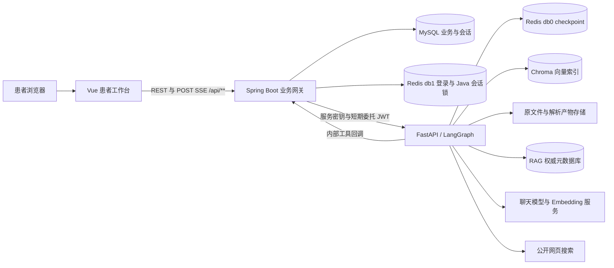
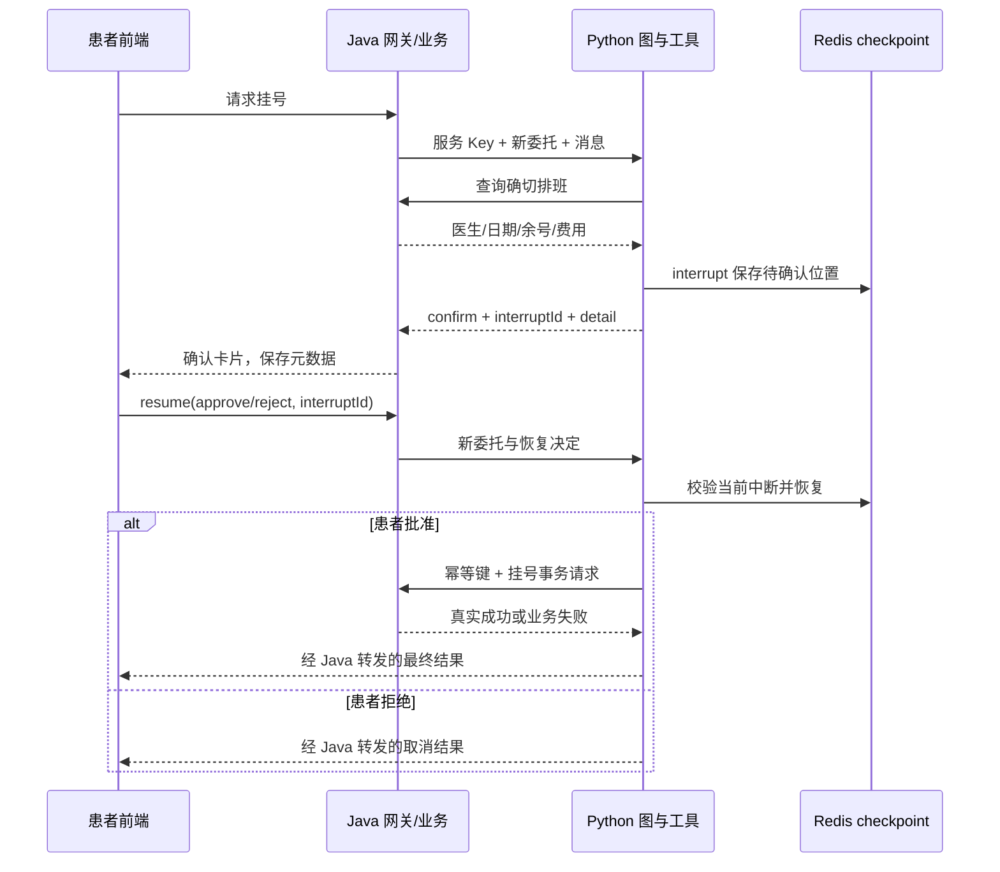

# 温润在线医院 · 技术版 README

> 文档基准：2026-10-02 当前工作区。主要参考 [项目流程图](../docs/流程图.md)，并对照 Vue、Spring Boot、FastAPI/LangGraph、数据库脚本和测试代码编写。
>
> 本文面向开发、联调、代码审查和维护，技术篇幅按前端约 10%、Java 后端约 40%、AI 模块约 50% 组织。配置值均为代码默认值或示例值，不代表生产参数；“已实现”表示能在当前源码中定位到实现，不代表本次完成了运行验收。待补齐内容单独说明。

## 阅读导航

- [1. 系统定位与总体架构](#overview)
- [2. 前端技术实现（约 10%）](#frontend)
- [3. Java 后端、数据与运行维护（约 40%）](#backend)
- [4. AI 编排、RAG、工具与上下文（约 50%）](#ai)
- [5. 代码阅读索引与当前边界](#boundaries)

<a id="overview"></a>
## 1. 系统定位与总体架构

温润在线医院将患者工作台、挂号业务、个人健康档案和 AI 健康助手组合在同一应用中。患者通过浏览器登录，选择有权限访问的患者主体，再进行业务操作或对话。

系统采用三个应用模块，分别承担界面、业务权威和 AI 推理职责：

| 模块 | 目录 | 核心责任 | 默认端口 |
| --- | --- | --- | --- |
| 前端 | `frontend/` | 患者交互、档案编辑、挂号操作、SSE 消费、引用和确认卡片 | 5173 |
| Java 后端 | `backend-java/` | 登录、患者授权、事务、号源一致性、会话落库、AI 网关、内部工具接口 | 8080 |
| Python AI | `ai-python/` | 意图识别、任务规划、LangGraph、RAG、公开搜索、工具编排、摘要与 checkpoint | 8000 |



### 1.1 主要架构原则

1. **浏览器以 Java 为统一业务入口。** 患者页面访问 `/api/**`，不持有 Python 内部服务密钥，也不直接选择内部工具权限。
2. **Java 决定“谁能对哪位患者做什么”。** Python 依据 Java 签发的短期委托身份执行编排，真实挂号、退号和患者数据读取仍回到 Java。
3. **模型负责理解和生成，业务服务负责确定性执行。** 模型说“挂号成功”不能改变数据库；成功必须来自 Java 事务返回。
4. **历史、偏好、执行状态和知识索引分开存储。** MySQL 聊天记录与患者资料是事实源，Redis checkpoint 是可丢失的执行状态，Chroma 是可重建索引。
5. **会话同时关联账号与患者。** 账号用于鉴权和审计，患者用于数据归属。一个会话建立后不能切换成另一患者的会话。

### 1.2 技术栈基准

| 层次 | 当前声明 | 用途 |
| --- | --- | --- |
| 浏览器应用 | Vue `^3.5.13`、Vue Router `^4.5.0`、Pinia `^3.0.3` | 组件、路由与共享登录状态 |
| 前端工程 | Vite `^8.0.12`、ESLint 10、Node 测试运行器 | 开发代理、构建、静态检查、纯逻辑测试 |
| 前端数据与呈现 | Axios、ECharts、marked、DOMPurify、Lucide | REST、趋势、Markdown、HTML 清洗、图标 |
| Java | Java 21、Spring Boot 3.5.6 | MVC、校验、事务、异步 SSE |
| Java 持久化 | MyBatis 3.0.5、MySQL Connector、Spring Data Redis | SQL、登录 Session、执行锁 |
| Java 安全组件 | BCrypt、JJWT 0.13.0 | 密码散列、短期委托 JWT |
| Python | Python ≥3.11、FastAPI、Uvicorn、Pydantic Settings | 内部 HTTP 服务与配置校验 |
| AI 编排 | LangChain、LangGraph、`langgraph-checkpoint-redis >=0.5.2,<0.6` | 模型、工具、状态图、恢复 |
| 检索与解析 | Chroma、OpenAIEmbeddings、pypdf、python-docx、可选 Docling/transformers | 向量检索与结构化解析 |
| 数据服务 | Compose 声明 MySQL 8.4.11、Redis 8.8.2 | 业务数据库、带 RedisJSON/RediSearch 的 checkpoint 环境 |

前端版本中的 `^` 是依赖范围，不是“实际安装版本”。Python 大多数依赖未固定精确版本，部署复现还需环境锁定，不能仅凭这张表断言相同环境。

<a id="frontend"></a>
## 2. 前端技术实现（约 10%）

### 2.1 工程结构与职责划分

入口为 `src/main.js → App.vue → Vue Router`，患者端主要由工作台和个人档案两类页面构成。

```text
frontend/src/
├── api/
│   ├── request.js             Axios、Token、统一响应与登录过期
│   └── modules/               ai、user、patient、schedule、registration 等
├── stores/auth.js             登录信息、可访问患者、当前患者
├── router/index.js            路由与患者端访问检查
├── composables/useAssistant.js 助手会话、请求、流式状态、确认恢复
├── features/assistant/        历史、进度、引用、Markdown 等纯逻辑
├── features/archive/          档案页签与趋势逻辑
├── components/workspace/      挂号和预约记录
├── components/archive/        基本资料、健康档案、趋势、运动睡眠
└── views/                     登录、患者工作台、个人档案、助手视图
```

页面组件主要负责呈现，API 模块负责传输，组合式函数负责有状态的交互，`features/` 负责可独立验证的转换逻辑。这使 SSE 终态、会话归属、引用格式等逻辑可以通过 Node 测试运行器验证，而不必全部依赖浏览器端到端测试。

### 2.2 路由、登录与患者切换

| 路由 | 当前行为 |
| --- | --- |
| `/login` | 登录或注册；已登录时重定向到首页 |
| `/home` | `PatientWorkspace.vue` 患者工作台 |
| `/archive` | `PatientArchive.vue` 个人档案 |
| `/registration` | 工作台中的挂号入口 |
| `/registration/:id` | 工作台中的预约详情入口 |
| `/assistant` | 重定向到统一工作台相关入口 |
| `/mode-select`、`/user` | 兼容入口，重定向至当前页面体系 |

路由守卫根据登录状态和患者端身份检查访问。开发环境存在 `/home?preview=1` 预览分支，其作用是方便页面预览；真实 API 权限仍由 Java 决定。

`auth.js` 保存用户、关联患者列表和当前患者。登录响应中的 `patients` 可包含多位已授权患者；切换时先检查目标 ID 是否属于该列表，再更新当前患者。浏览器的选择只是请求参数，服务端会再次验证，不能靠修改本地存储获得患者数据权限。

当前 Token 保存于 `localStorage` 的 `wenrun_token`，用户资料保存于 `wenrun_user`。这不是 HttpOnly Cookie 方案，浏览器脚本可以访问 Token，因此页面输出清洗和依赖安全直接影响登录凭据保护。

### 2.3 普通 REST 请求

`api/request.js` 创建 Axios 实例，默认超时 15 秒。开发时 API 基址留空，通过 Vite 的 `/api` 代理访问 Java；分域部署可以配置 `VITE_API_BASE_URL`。

受保护请求携带：

```http
Authorization: Bearer <登录 Token>
X-Token: <登录 Token>
Content-Type: application/json
```

响应拦截器判断 `{code,message,data}`：`code=200` 返回 `data`，`code=401` 清理登录状态并跳转登录，其他业务错误拒绝 Promise。必须同时理解 HTTP 状态和业务 `code`，因为 Java 全局业务异常处理当前经常仍返回 HTTP 200。

### 2.4 POST SSE 与事件消费

聊天使用 Fetch，而非普通 Axios 请求，也没有使用原生 `EventSource`。原因是对话需要 POST JSON 请求体、登录头和主动取消。

传输步骤为：发送 POST → 检查 `text/event-stream` → `ReadableStream.getReader()` → `TextDecoder` 解码 → 缓冲区按空行拆事件 → 解析 `data:` JSON → 分发回调。

| 事件 | 前端行为 | 是否结束本轮 |
| --- | --- | --- |
| `status` | 更新 `AgentProgress` | 否 |
| `token` | 累加正文 | 否 |
| `citation` | 收集来源，交给 `CitationList` | 否 |
| `confirm` | 显示确认卡片，保存 `interruptId` | 是，等待下一次请求 |
| `done` | 使用最终 `reply` 完成本轮 | 是 |
| `error` | 记录错误码并提示失败 | 是 |

前端只把 `done` 或 `confirm` 当作正常终态。连接关闭但未收到终态会报“流式响应意外结束”，避免把半段回答误认为完整成功。

当前解析器面向本项目单行 JSON 的 `data:` 格式，并非通用 SSE 协议解析库；若以后引入多行 `data:`、事件 ID 或断点重放，需要扩展解析和测试。

### 2.5 助手运行态隔离

`useAssistant.js` 使用 `用户 ID:当前患者 ID` 作为运行态键，维护会话列表、当前会话、请求 Map、回复状态、快速模式和确认信息。快速模式和当前会话的本地存储键也按此范围隔离。

每轮请求生成 `clientRequestId`，服务端用它识别重放；停止生成使用 `AbortController`。切换会话或接收异步事件时，更新对应会话和请求，避免一个请求的正文写进另一会话。

长期历史通过 Java 会话与消息接口读取。浏览器缓存是交互状态和兼容迁移来源，不能作为服务端历史事实源。

### 2.6 输出清洗与引用呈现

助手正文经 marked 解析后，通过 DOMPurify 清洗。`features/assistant/markdown.js` 还处理内部排班/挂号单 ID、日期和号源列表展示、数字区间的波浪线，以及参考来源折叠。

内部 ID 的隐藏属于呈现优化；权限控制仍依赖后端患者归属检查。引用数据独立于正文，包含文档、版本、页码、章节和资产 ID，便于用户追溯资料。

公开搜索来源和院内引用有不同来源链路。网页来源通常是回答中的标题与 URL，院内 RAG 来源可通过结构化 `citation` 事件展示；不能将二者都理解为已认证的院内资料。

### 2.7 工作台、档案与响应式布局

PC 工作台以抽屉呈现挂号与预约记录，移动端通过相应页面入口呈现。档案由基本资料、健康档案、指标趋势、运动睡眠、挂号记录等组件组成；ECharts 用于指标趋势。

`ArchiveDocuments.vue` 当前仍是占位入口。数据库中存在就医资料目录表、AI 可以读取目录，并不代表前端已经实现报告上传、正文查看和完整资料管理。

### 2.8 前端构建与验证

```powershell
# 从仓库根目录进入
Set-Location frontend
npm ci
npm test
npm run lint
npm run build
npm run dev
```

Docker 使用 Node 22 系列镜像，实际 Node 小版本需满足当前 Vite/ESLint 的引擎要求。`npm run build` 证明可构建，不证明完整业务可用；挂号和 AI 功能还依赖 Java、Python、数据库、Redis 和外部模型配置。

关键阅读入口：[请求层](../frontend/src/api/request.js)、[SSE 客户端](../frontend/src/api/modules/ai.js)、[助手运行态](../frontend/src/composables/useAssistant.js)、[路由](../frontend/src/router/index.js)。

### 2.9 对话状态、历史加载与停止生成

界面状态区分 pending、streaming、completed、confirming、error 和 stopped。pending 表示请求已经发起但未形成正文；streaming 表示正文正在增长；confirming 表示等待操作决定，不能等同于业务已完成。

历史加载先读取会话摘要，再并行读取各会话消息并转换为前端结构。当前列表默认读取 30 个会话，每个会话最多读取 100 条消息；这不是无限滚动加载完整历史的实现。加载失败会保存 `sessionError`，提示历史未加载，但允许尝试新的聊天请求。

运行态销毁会中断已有 AbortController、清理请求 Map 和回复状态。停止生成把当前请求标为 stopped，再终止流读取；它停止浏览器消费，不构成已经提交的挂号事务回滚。前端提示停止后仍要以预约列表核对业务结果。

会话更新按会话 ID 与请求 ID 定位消息。缓存键按用户/患者区分，但 Java 当前会话列表查询主要按账号返回，历史归一化也不等同于服务端患者过滤；展示层若要求严格只列当前患者会话，还需核对列表过滤和患者切换生命周期。真正禁止跨患者恢复由 Java 会话绑定负责。

### 2.10 进度与引用的数据转换

进度步骤包含 id、label、status、parentId、elapsedMs。状态只接受 running、completed、failed、waiting、skipped；同 ID 更新原步骤，最多保留 80 条，兼容旧字符串状态。

收到确认事件时，将仍在执行的步骤转换为 waiting；错误或停止则转换为失败/中断呈现。最终回答可以完成，同时保留“部分查询未完成”的状态，避免一个成功正文掩盖某个分支失败。

步骤时长根据收到时间和服务端 elapsedMs 计算，用于解释等待过程，不能等同于后端性能采样或模型计费时长。

引用转换函数提供标题、页码/章节/查询时间、摘录摘要。引用和正文独立，使正文流式增长时仍能保留来源定位；没有页码时使用章节等可用信息，不补造精确页号。

### 2.11 趋势图工程与组件生命周期

`ArchiveHealthTrend.vue` 使用 ECharts 模块入口，注册 LineChart、Grid、Legend、Tooltip 和 CanvasRenderer，减少无关图表类型进入工程。`features/archive/trend.js` 将指标定义、时间格式、最新值摘要和图表 option 生成分离。

血压使用主/次值形成两条曲线，其他指标按定义呈现单线。没有记录时显示空态，数值不可解析时使用占位文本；指标 fallback 只提供代码、名称和单位，不生成虚构历史测量。

图表在有效容器和数据条件下初始化，通过 ResizeObserver 与窗口 resize 调整尺寸；组件卸载时移除监听、断开 observer 并 dispose 实例。PC/移动端布局变化或抽屉变化时，需要关注容器尺寸变化，避免只根据窗口宽度初始化一次。

趋势区还提供图表 aria-label。折线图展示的是录入数据变化，图表颜色和变化文案不能作为临床诊断；最新时间来自测量记录，不应改成页面加载时间。

### 2.12 开发代理、静态部署与前端测试范围

Vite `server.proxy` 只控制开发服务器。构建产物部署到静态服务后，需在反向代理配置 `/api` 转发，或构建时设置 API 基址；仅把 dist 上传到任意服务器不会自动获得开发代理。

Vue Router 使用 History 模式，静态服务需将应用页面路径回退到 `index.html`，否则刷新 `/archive` 或预约详情可能返回 404。AI 代理链还需允许长响应和即时刷新 SSE，代理缓冲/读取超时可能造成有请求却看不到逐字输出。

当前测试文件覆盖 AI 事件终态、Markdown、进度、页面模式、档案、趋势、健康表单、活动和排班日期等。Node 单元测试适合验证转换规则，完整验收还应在浏览器观察患者切换、确认恢复、终止请求、响应式抽屉和历史加载。本文未将这些交互列为本次已执行结果。

<a id="backend"></a>
## 3. Java 后端、数据与运行维护（约 40%）

### 3.1 后端的职责与分层

Java 是医院业务和患者权限的权威层，同时是浏览器与 Python 之间的网关。AI 服务无法绕过它直接修改挂号记录。

常规请求调用链：

```text
HTTP 请求
  → RequestTraceFilter
  → AuthInterceptor / DelegatedToolAuthInterceptor
  → Controller：绑定参数、校验 DTO、选择服务
  → Service：患者授权、领域规则、事务与并发控制
  → Repository 接口 + MyBatis XML
  → MySQL
  → VO / Result / SSE
```

| 包 | 作用 | 典型实现 |
| --- | --- | --- |
| `controller` | 患者业务 HTTP 接口 | `AuthController`、`RegistrationController` |
| `service`、`service/impl` | 业务规则与事务 | `RegistrationServiceImpl`、`PatientAccessServiceImpl` |
| `repository` | SQL 操作契约 | `ScheduleRepository`、`ChatMessageRepository` |
| `resources/mapper` | SQL、联表查询和条件更新 | `ScheduleRepository.xml` |
| `entity` | 数据表映射 | `Patient`、`Registration`、`AiConversation` |
| `dto`、`vo` | 输入与输出边界 | `HealthProfileDTO`、`RegistrationVO` |
| `config` | Redis、鉴权、追踪、MyBatis、门诊时间 | `WebMvcConfig`、`ClinicProperties` |
| `ai/controller` | 会话、工具、知识库、记忆 HTTP 入口 | `aiController`、`AiToolController` |
| `ai/service` | Python 转发、会话归属、临床摘录和偏好 | `aiService`、`PatientClinicalContextService` |
| `ai/security` | 委托签发、Scope、来源读取权限 | `DelegationTokenService`、`KnowledgeAccessService` |
| `ai/concurrency` | 会话执行锁 | `RedisConversationExecutionLock` |

后端使用 Spring MVC 和独立异步线程池转发 SSE；当前不是全链路 WebFlux 架构。模型请求较慢时，Java 仍需要为长连接安排工作线程。

### 3.2 普通 API 协议与异常处理

常规 JSON 响应封装为：

```json
{
  "code": 200,
  "message": "success",
  "data": {}
}
```

`Result<T>` 将成功、业务失败和数据结构统一。`GlobalExceptionHandler` 处理业务异常、DTO 参数错误、请求体解析错误、缺失参数、类型转换、上传超限和兜底异常。

| 场景 | 当前处理 |
| --- | --- |
| `@Valid` DTO 不合法 | 汇总字段错误，返回业务失败响应 |
| JSON 不可解析 | 返回请求体格式错误 |
| 未登录或 Token 过期 | 业务 `code=401` |
| 无患者或知识资料权限 | 业务禁止访问或隐藏资源存在性 |
| 上传超限 | 返回上传大小错误 |
| 未预期异常 | 记录服务端错误，返回通用失败文案 |

普通接口的业务 `code` 不等于 HTTP 状态码。外部系统、网关、监控和测试若只看 HTTP 200，将漏掉应用失败。Python FastAPI 则使用 HTTPException 表达 401/403/409/503 等；Java 转发时需要结合上游响应与最终业务封装理解错误。

SSE 进入流式阶段后不能再靠改变 HTTP 状态描述每个错误，因此采用 `type=error`、`code`、`message` 事件。联调时先判断是否建立了流，再看事件终态。

### 3.3 登录认证：Session Token 与密码散列

登录入口为 `/api/auth/login`，注册入口为 `/api/auth/register`。`AuthServiceImpl` 负责账号查询、密码校验、账号状态和业务身份组装。密码通过 Spring Security Crypto 的 BCrypt 编码与验证，不按明文比较。

当前浏览器登录 Token 是随机生成的会话凭据，不是委托 JWT：

1. 校验用户名、密码和有效账号。
2. 生成不含连字符的随机 UUID Token。
3. 将 `{userId,accountType,issuedAt}` 存入 Session Store。
4. Redis 键使用 Token 的 SHA-256：`wenrun:session:v1:<sha256(token)>`。
5. 返回 Token 和登录身份，后续浏览器携带 Bearer Token。

Redis Session 默认 TTL 为 8 小时，实际值来自 `wenrun.auth.token-ttl`，示例配置可通过 `AUTH_TOKEN_TTL` 设置。读取 Session 当前未实现滑动续期，不能将默认 8 小时理解为“每次访问后再延长 8 小时”。

`AuthInterceptor` 优先读取 `Authorization: Bearer ...`，兼容 `X-Token`。成功后在 `UserContext` 设置账号 ID 和账号类型，请求结束清理上下文，避免线程复用串号。

当前 Redis Session 读取失败会返回无有效会话；写入或删除失败则可返回服务不可用。排查“登录突然失效”时，除 Token 到期外也要检查 Redis 连通性。

### 3.4 注册与账号—患者关系

账号和患者分为不同实体：

- `sys_user.id`：登录账号，回答“谁在操作”。
- `patient.id`：患者主体，回答“数据属于谁”。
- `user_patient_relation`：账号访问患者的授权关系。
- `created_by_user_id`、`registrant_user_id`：录入人或挂号人，服务于审计。

注册过程由事务创建账号、患者信息及相应关联，密码先编码，再持久化。登录响应可带患者列表和默认患者，前端据此确定当前患者。

关系类型支持 `SELF`、`SPOUSE`、`CHILD`、`PARENT`、`OTHER`。这些类型是数据库与权限模型能力，不能据此推断当前前端已经具备完整家属绑定、解绑和授权管理流程。

数据库对有效关系设置生成列与唯一索引：

| 约束 | 解决的问题 |
| --- | --- |
| `(user_id,patient_id)` 唯一 | 避免重复关联 |
| 有效默认患者对应的用户生成列唯一 | 每个账号至多一个有效默认患者 |
| 有效 SELF 关系对应的用户生成列唯一 | 每个账号至多一个有效 SELF 患者 |
| 关系类型 CHECK | 排除不支持的类型 |
| `is_default/status` CHECK | 限制状态取值 |
| 无效关系不能保持默认 | 避免默认患者指向已撤销关系 |

这些约束由数据库仲裁并发，不能只用“插入前查询是否存在”替代。

### 3.5 患者权限模型

`PatientAccessServiceImpl` 集中提供 `hasAccess`、`assertAccess`、`requireAccessible`、`resolvePatientId` 和默认患者解析。

当患者端请求传入 `patientId`：

1. 读取当前登录账号。
2. 验证患者记录和账号—患者关系。
3. 确保目标关系有效。
4. 将通过校验的患者 ID 用于业务查询或写入。

省略 `patientId` 时，可以按服务的规则解析默认患者；没有可用默认患者会失败。客户端不能用另一用户的 ID 覆盖当前登录人。

医护/内部身份在部分服务具有不同访问分支，当前并非所有接口都采用统一精细 RBAC。新增管理接口时必须逐项审查角色和数据范围，不能把“登录成功”自动解释为“拥有所有业务管理权”。

### 3.6 请求拦截路径

`WebMvcConfig` 为 `/api/**` 注册普通鉴权，排除健康检查、登录、注册和内部工具路径。内部工具路径由独立委托鉴权处理：

| 路径 | 身份来源 |
| --- | --- |
| `/api/auth/login`、`/api/auth/register` | 公开入口，通过业务字段校验 |
| `/api/health` | Java 存活入口 |
| 其他 `/api/**` | 登录 Session Token |
| `/api/internal/ai-tools/**` | Java 签发的短期委托 JWT |

CORS 使用配置的 Origin 列表，允许 GET/POST/PUT/DELETE/OPTIONS，并允许凭据。跨域部署需检查 `wenrun.cors.allowed-origins`；Vite 同源代理则主要由开发代理转发。

### 3.7 业务目录、医生与排班

`DeptService`、`StaffService`、`ScheduleService` 负责科室、医生和排班数据。排班包含科室、医生、工作日期、时段、总号源、剩余号源和挂号费。

`ScheduleRepository.xml` 通过排班、科室和医生联表生成 `ScheduleVO`。AI 查询也复用这些业务服务，因而浏览器挂号与 AI 查询共享同一数据来源。

浏览器主要使用 `/api/schedules`，科室和医生的 AI 查询入口在内部工具路径。当前常规 Controller 目录没有可直接等同于 `/api/departments`、`/api/staff` 的完整公开控制器，不能把 Service 名称当成已存在的 HTTP 路由。

查询到的剩余号源是当时快照。查询与确认之间可能有其他患者占用号源，因此任何前端或 AI 展示均不能替代最终事务中的号源检查。

### 3.8 挂号事务：锁、扣减与幂等

`RegistrationServiceImpl.register()` 通过 `@Transactional` 将号源扣减和挂号单创建放在一个数据库事务中。

详细执行顺序：

1. 解析并验证患者主体。
2. 确认患者记录存在。
3. `SELECT ... FOR UPDATE` 锁定目标排班行。
4. 归一化 `idempotencyKey`：空白值转 `null`。
5. 在锁内查找已使用的幂等键；同患者重放返回原挂号单 ID。
6. 检查排班是否过期。
7. 检查剩余号源是否大于 0。
8. 检查该患者是否已预约同医生、同日期、同时段。
9. 条件扣减剩余号源，检查影响行数。
10. 创建挂号单，记录业务号、患者、排班、费用和当前操作人。
11. 提交事务；异常则回滚扣减和插入。

关键 SQL：

```sql
SELECT * FROM schedule WHERE id = ? FOR UPDATE;

UPDATE schedule
SET remaining_count = remaining_count - 1
WHERE id = ? AND remaining_count > 0;
```

行锁串行化同一排班竞争，条件更新防止余号扣成负数，幂等唯一索引进一步防止重复请求生成多张单。跨排班使用同一幂等键时，锁的不是同一行，数据库唯一索引仍是必要兜底。

幂等命中早于过期和余号校验：已成功的请求即使在排班到期后重放，也应返回原单，而不是误报“排班已过期”。

当前重放分支核对患者归属，但没有把传入排班与原单排班作为完整请求指纹逐字段核对。调用方应保证一个幂等键只对应一次确定操作，不能用同一个键提交另一排班。

### 3.9 改约事务与锁定顺序

`reschedule()` 更改原挂号单的排班，不新建第二张挂号单：

1. 锁定挂号单。
2. 检查归属以及待就诊状态。
3. 相同目标排班直接结束。
4. 按排班 ID 从小到大锁定旧号源和新号源。
5. 检查目标排班有效、尚有余号、无重复预约。
6. 扣减新号源。
7. 通过原排班和原状态条件更新挂号单。
8. 回补旧号源并提交。

固定排班锁顺序降低两个请求交叉换号时形成死锁的可能性。号源扣减、挂号单切换和旧号源回补处于同一事务，失败时整体回滚。

普通浏览器有 `PUT /api/registrations/{id}/schedule`；AI 当前没有对应的改约写工具。模型识别到“改约”需求时不能据此声明具备自动改约执行能力。

### 3.10 退号与过期处理

退号并发仲裁依赖条件状态更新：

```text
当前为已挂号
  → 条件更新为已退号
  → 只有成功改变状态的调用才能回补一个号源
```

已退号、已就诊或状态已变化均有明确失败分支。真正保证不重复回补的是状态条件更新的影响行数，而不是较早执行的普通 SELECT。

挂号列表查询中还会处理过期的待就诊记录：按门诊日期与时段判断过期，再条件退号并回补号源。因此该查询当前带有写副作用，不能当作纯只读缓存接口。

门诊时区为 `Asia/Shanghai`，默认上午、下午和晚间截止时间分别为 `12:00`、`18:00`、`21:00`。这是门诊号源过期规则，不是对外承诺的医院营业时间。

查询触发过期处理不等于后台定时任务。没有访问相关记录时，不能宣称系统会按固定时间主动清理全部过期预约。

### 3.11 健康档案、快照与纵向指标

健康数据分为三个层次：

| 存储 | 用途 | 时间语义 |
| --- | --- | --- |
| `patient_health_profile` | 当前档案和当前体征 | 当前记录，部分字段未必有独立测量时间 |
| `patient_health_snapshot` | 档案变更时保存历史快照 | 档案快照时间 |
| `health_metric_record` | 单项指标纵向记录与趋势 | 指标自己的 `measured_at` |

`PatientHealthProfileServiceImpl` 在创建/更新档案时保存快照，并仅将发生变化的体征同步为指标记录。这样只改一项体征时不会把所有旧指标都重新记录成“新测量”。

档案中的病史等文本有长度限制，体征有数值范围校验，血糖上下文需属于支持的枚举。数据库写入仍须患者授权，不能仅由页面表单限制。

指标 CRUD 由 `HealthMetricRecordServiceImpl` 管理：读取和修改使用患者 ID 与记录 ID 双重范围；删除采用软删除；写入记录当前账号作为录入人。

| 指标代码 | 单位 | 是否独立持久化 |
| --- | --- | --- |
| `WEIGHT` | kg | 是 |
| `WAIST` | cm | 是 |
| `BLOOD_PRESSURE` | mmHg，主/次值分别承载两项血压 | 是 |
| `BLOOD_GLUCOSE` | mmol/L，带测量上下文 | 是 |
| `HEART_RATE` | 次/分 | 是 |
| `SPO2` | % | 是 |
| `TEMPERATURE` | ℃ | 是 |
| `RESPIRATORY_RATE` | 次/分 | 是 |
| `BMI` | kg/m² | 否，由身高和体重动态计算 |

趋势支持 7、30、90、365 天，默认 30 天；指标列表默认 50 条，上限 200 条。BMI 趋势使用当前档案身高与历史体重计算，更新身高可能改变重新计算的历史 BMI，不能称其为独立保存的历史 BMI 测量值。

### 3.12 运动、睡眠与汇总

`ActivityRecordServiceImpl` 为运动和睡眠提供类型选项、记录 CRUD 和时间窗口汇总。

运动记录包括类型、开始时间、时长、强度、距离、热量、来源和备注。睡眠记录包含入睡时间、醒来时间、睡眠质量和派生时长。

| 参数 | 当前约束 |
| --- | --- |
| 运动时长 | 1～600 分钟 |
| 睡眠时长 | 10 分钟～20 小时，由起止时间计算 |
| 列表大小 | 默认 20，上限 100 |
| 汇总范围 | 支持 7/30 天，默认 7 天 |
| 备注长度 | 最多 255 字符 |

服务还校验时间、类型及附加数值。患者不能通过直接填写 `durationMin` 绕过睡眠起止时间计算。更新和软删除以患者归属为条件。

汇总包括运动次数、时长等统计和睡眠平均时长，并附最近记录。它属于用户录入数据统计，不是可据此自动生成诊断的临床评估。

### 3.13 AI 会话网关：身份、归属与请求准备

AI 浏览器入口为 `aiController`：

- `POST /api/ai/chat/stream`
- `POST /api/ai/chat/resume`
- `GET /api/ai/conversations`
- `GET /api/ai/conversations/{conversationId}/messages`
- `DELETE /api/ai/conversations/{conversationId}`

普通聊天在转发前完成：

1. 缺省时生成 `conversationId`，缺省时生成 `clientRequestId`。
2. 从 `UserContext` 获取真实账号，覆盖服务内部身份。
3. 解析患者权限，确认会话绑定的患者未被切换。
4. 由 `ConversationOwnershipService` 建立或验证会话归属。
5. 捕获请求追踪号。
6. 签发短期委托 JWT。
7. 检查重放和执行锁。
8. 读取恢复窗口和偏好候选，保存用户消息。
9. 调用 Python 并转发 SSE。

`aiRequest` 对 `userId`、委托 Token、追踪号、恢复消息和长期偏好使用 `@JsonIgnore`，浏览器无法在请求体中伪造这些字段。`patientId` 允许传入，但会经过权限及会话归属校验。

恢复请求必须指向已存在的当前用户会话，并重新签发委托 Token。原 Token 默认只有 5 分钟，患者可能长时间停留在确认卡片上，恢复时不能复用旧凭据。

### 3.14 对话请求幂等与消息持久化

聊天轮次的唯一键为：

```text
(user_id, conversation_id, client_request_id, role)
```

`role` 将同一轮用户消息和助手消息分开，允许每轮各落一条。相同请求 ID 若对应不同用户消息内容，会返回 `AI_REQUEST_ID_REUSED`；相同内容重放则根据既有助手消息进行响应。

聊天记录保存时机：

| 时机 | 持久化内容 |
| --- | --- |
| 转发 Python 前 | 用户消息 |
| 收到 `done` | 最终 `reply`；没有有效 `reply` 时使用累积文本 |
| 收到 `confirm` | 确认提示语和确认卡片元数据 |
| 收到 `error` 或流中断 | 当前实现不将部分 token 当成完成的助手回复 |
| 恢复完成 | 标记先前确认卡片已完成并保存本轮回复 |

已经保存用户消息但没有助手终态的轮次，不等于自动可重新执行业务；相同请求 ID 的重放需要遵循当前重复请求处理。对外系统不能以“网络断了”为理由无条件重新发出新的挂号操作。

`clientRequestId` 是对话去重键，`X-Request-Id` 是一次 HTTP 调用的追踪标识，挂号工具的 `idempotencyKey` 是业务写操作去重键，三者用途不同。

### 3.15 会话执行锁与长连接资源

默认 Redis 锁键：

```text
wenrun:ai:conversation-lock:<userId>:<conversationId>
```

通过 `SET NX` 和租期获取锁，保存随机 owner Token。释放和续租使用 Lua，只有 Redis 中 owner Token 一致才删除或延长，防止旧请求误释放新请求的锁。

| 项目 | 当前值 |
| --- | --- |
| 默认租期 | 330 秒 |
| 默认续租周期 | 30 秒 |
| Java SSE 超时 | 300 秒 |
| 上游连接超时 | 5 秒 |
| 上游读取超时 | 300 秒 |
| SSE 线程池 | 核心 4、最大 16、队列 100 |
| 空闲线程存活 | 60 秒 |

会话忙返回 `AI_CONVERSATION_BUSY`，锁服务不可用返回 `AI_CONVERSATION_LOCK_UNAVAILABLE`，默认不在锁不可用时继续执行有副作用的请求。

**实际 Redis 分工需要按代码理解：Java 锁使用 Java 的 `StringRedisTemplate`，默认落在 db1；Python checkpoint 落在 db0。** 不能沿用旧文字说明将 Java 会话锁一概写成 db0。

锁实现存在内存版本，适合相应本地配置；跨 Java 实例时必须共享 Redis 锁。当前续租丢失会记录日志，未见把锁丢失立即转换为上游强制取消的完整 fencing 机制，不能据此承诺所有异常下都严格只有一个图在执行。

SSE 正常完成、超时、异常和任务结束涉及不同回调。实现避免在正常 `complete()` 的同步回调中打断当前工作线程，使 `finally` 中 Redis 释放锁能够正常执行。

线程池数字是资源上限配置，不是系统吞吐量或服务 SLA。高并发仍需根据模型延迟、数据库负载和排队情况测量。

### 3.16 Java → Python 的 SSE 转发

`aiService` 发送内部请求，附加：

```http
X-Api-Key: <服务间共享密钥>
X-Delegated-Token: <短期委托 JWT>
X-Request-Id: <追踪号>
```

Java 将浏览器请求扩展为 Python 使用的 `userContext`、`recoveryMessages` 和 `longTermMemories`。历史恢复窗口最多 24 条，偏好候选最多 20 条，Python 会再次按用途筛选。

SSE 处理保留事件语义，累积 token，并在 `done`、`confirm`、`error` 时完成本轮。上游没有终态就结束，返回 `AI_STREAM_INCOMPLETE`。工作任务异常则返回 `AI_STREAM_FAILED` 等错误。

这些事件不意味着数据库和远端模型调用处于同一事务。确认后业务已提交、网络随后断开的场景应按数据库记录核查，不能仅依赖是否看到最后一条 SSE。

### 3.17 短期委托 JWT 与内部工具准入

`DelegationTokenService` 使用 Base64 配置密钥，解码后至少 32 字节。JJWT 根据 HMAC 密钥长度选择算法，Python 验签接受 HS256/HS384/HS512，并检查签发者和到期时间。

主要声明：

| Claim | 含义 |
| --- | --- |
| `iss=wenrun-java` | Java 服务签发 |
| `sub` | 操作账号 ID |
| `accountType` | 账号类型 |
| `patientId` | 被授权患者主体 |
| `scopes` | 本次允许的工具用途 |
| `iat`、`exp` | 签发和到期时间 |
| `jti` | 本次委托标识 |

患者助手默认 Scope 集包括：

```text
departments:read   schedules:read   staff:read
registrations:read registrations:write
memories:read      memories:write
clinical:read
```

`DelegatedToolAuthInterceptor` 验证 JWT，建立请求级委托上下文，并桥接现有业务服务需要的 `UserContext`。内部 Controller 再检查具体 Scope、患者 ID 和账号类型。

挂号/退号写工具只接受患者账号与绑定患者，不向模型开放任意患者参数。查询患者预约使用 JWT 中的患者，不能通过 query 指向别人。

JWT Scope 证明调用权限，**不直接证明患者已经点击某张确认卡片**。HITL 的确认流程目前在 Python 图中执行，Java 工具接口信任获得合法委托的 Python 编排；如果未来需要 Java 自主验证每笔确认，应增加绑定操作参数、患者和过期时间的确认凭证及消费记录。

### 3.18 个人临床摘录与长期偏好服务

#### 临床摘录

`PatientClinicalContextService` 只输出白名单范围，患者身份来自委托，不允许模型自由点名字段。

```text
demographics、allergies
past_history、family_history、personal_history
anthropometrics、blood_pressure、blood_glucose
heart_rate、spo2、temperature、respiratory_rate
document_catalog
```

指标采样最多 30 条，文档目录最多 20 条并可标记截断。输出包含数值、单位、时间、来源及数据缺口，指标优先读取 `health_metric_record.measured_at`。

仅有档案当前值时会标记时间不可用，避免将“最近修改了档案”误当成“刚测过所有指标”。就医资料只返回目录，不把文件地址、身份证号和电话号码开放给模型。

#### 长期偏好

`AiPatientMemoryService` 允许三类：沟通偏好、预约偏好、无障碍需求。服务端拒绝明显症状、诊断、用药、剂量、过敏等内容，偏好不作为病历。

每条偏好具有稳定 `memoryId`、递增 `version`、状态、来源会话、来源消息和可选到期时间。修改需要 `expectedVersion`，旧版置为 `superseded`，新版本入库；删除采用软删除。

AI 写入时，Java 不信任模型给出的来源消息 ID，而是按当前委托用户和来源会话的近期消息查找真实用户消息。前端编辑也不能重写原始审计来源。

该来源机制提供审计关联，但不等于医学事实核验。当前正则过滤也不是完备的敏感内容判定器。

### 3.19 知识库管理网关与来源访问

`KnowledgeController` 路径前缀为 `/api/ai/knowledge`。Java 先通过数据库角色判定是否具有 `admin` 管理角色，再签发 `knowledge:manage` 的限用途委托。

来源读取 Scope：

| 当前身份 | 可以签发的来源读取用途 |
| --- | --- |
| 患者 | `knowledge:public` |
| 满足医生角色的医护 | public 与 `knowledge:staff` |
| 数据库确认的管理员 | public、staff 与 manage |

`scope=staff` 请求参数自身不能授予医护权限。Java 和 Python 均复核来源权限，非管理员还需来源版本已经发布并在有效期内。

上传、查询任务、重试、审核、发布和来源资产读取由 `KnowledgeGatewayService` 转发至 Python。原文件和解析产物归 Python RAG 资产层管理，Java 不在浏览器响应中暴露底层磁盘路径或对象存储凭据。

### 3.20 数据库表与权威边界

数据库脚本为 [schema.sql](../docs/SQL/schema.sql)，采用 InnoDB、utf8mb4。MySQL 主 schema 明确采用应用层关联管理，**没有普遍声明外键约束**；维护关联完整性依赖 Service、事务、索引和迁移。

| 表 | 数据责任 | 主要关联/约束 |
| --- | --- | --- |
| `sys_user`、`sys_role`、`sys_user_role` | 登录账号与角色 | 用户名、角色编码唯一 |
| `dept`、`staff` | 科室与医生/员工 | 科室编码、员工号唯一 |
| `schedule` | 日期时段号源 | 关联科室与医生 |
| `patient` | 患者基本主体 | 患者业务号唯一 |
| `user_patient_relation` | 账号—患者授权 | 有效默认/SELF 唯一约束 |
| `patient_health_profile` | 当前健康档案 | 每患者一个当前档案 |
| `patient_health_snapshot` | 历史档案快照 | 患者与测量时间索引 |
| `health_metric_record` | 指标纵向记录 | 患者、指标、时间组合索引 |
| `patient_exercise_record` | 运动记录 | 患者与发生时间 |
| `patient_sleep_record` | 睡眠记录 | 患者与醒来时间 |
| `patient_medical_document` | 就医资料目录 | 患者、类型、发生时间 |
| `registration` | 挂号业务单 | 业务号、幂等键唯一 |
| `ai_conversations` | AI 会话所有者与患者 | 患者 ID 非空，用户/患者/更新时间索引 |
| `chat_messages` | 用户/助手消息和确认元数据 | 轮次与角色唯一 |
| `ai_patient_memories` | 已确认偏好版本 | `(memory_id,version)` 唯一 |
| `ai_knowledge_documents` | 旧知识版本登记 | `(document_id,version)` 唯一 |
| `rag_documents` | 新逻辑知识文档 | 逻辑文档 ID |
| `rag_versions` | 新原文件版本与公开范围 | 文档/版本、有效期、构建 ID |
| `rag_builds` | 解析构建与质量报告 | parser/embedding 指纹和产物资产 |
| `rag_jobs` | Worker 任务、重试与租约 | attempts、lease、fence |
| `rag_assets` | 原文件/产物资产定位 | 不透明存储键与校验和 |
| `rag_audit` | 上传、审核、发布等审计 | 操作人、动作与目标版本 |

存储权威分工：

| 存储 | 可丢失程度与恢复来源 |
| --- | --- |
| MySQL 业务、消息、偏好 | 核心持久化事实，应按数据库备份恢复 |
| RAG MySQL/开发 SQLite | 发布、任务、资产关联的权威登记 |
| Redis db1 Session | 丢失后通常需要重新登录 |
| Redis db1 Java 会话锁 | 短期协调，依赖租约和业务幂等兜底 |
| Redis db0 checkpoint | 可丢失；丢失意味着执行进度和摘要可能丢失 |
| Chroma | 可重建索引，不是发布审批的事实源 |
| RAG 资产存储 | 原文件与解析产物，重建和来源追溯需要保留 |

### 3.21 数据库初始化与迁移

开发 Compose 挂载 `schema.sql`、`seed.sql` 到 MySQL 初始化目录，仅新建数据库数据目录时执行。已有 volume 不会自动应用后续 schema 变更。

已有库按 [migrations](../docs/SQL/migrations/) 中未执行的脚本和各脚本前置条件迁移，不能把最新 `schema.sql` 的 `CREATE TABLE IF NOT EXISTS` 当作自动升级。

关键迁移类别：

| 类别 | 代表脚本 |
| --- | --- |
| 挂号幂等 | `2026-08-16-registration-idempotency.sql` |
| 消息幂等 | `2026-08-25-ai-message-idempotency.sql` |
| 会话、确认元数据、偏好、旧知识登记 | `2026-09-13-*` |
| 账号与患者分离 | `2026-09-19-user-patient-subject.sql` |
| 关系完整性与会话患者绑定 | `2026-09-22-patient-access-integrity.sql` |
| 健康档案和纵向指标 | `2026-09-19-*health*` 及后续体征/腰围迁移 |
| 运动与睡眠 | `2026-09-24-activity-records.sql` |
| 新 RAG 生命周期 | `2026-09-29-rag-lifecycle.sql` |

操作步骤应包含数据库备份、已执行迁移清单、脚本前置检查、迁移后索引/约束核查和业务回归。当前没有证据表明已接入 Flyway/Liquibase 自动版本管理。

### 3.22 主要浏览器 API 索引

下表是当前 Controller 的路由概览，不替代 DTO 的参数校验。

| 方法 | 路径 | 用途 |
| --- | --- | --- |
| POST | `/api/auth/login`、`/api/auth/register`、`/api/auth/logout` | 登录、注册、退出 |
| PUT | `/api/user/profile` | 更新当前用户资料 |
| GET | `/api/me/patients` | 当前账号可访问患者 |
| GET/POST | `/api/patients` | 患者查询/创建，权限按服务分支 |
| GET/PUT | `/api/patients/{id}` | 患者读取/更新 |
| GET/POST | `/api/schedules` | 排班查询/创建 |
| GET/PUT | `/api/schedules/{id}` | 排班详情/更新 |
| GET/POST | `/api/registrations` | 挂号记录/提交挂号 |
| GET | `/api/registrations/pending` | 待就诊预约 |
| PUT | `/api/registrations/{id}/schedule` | 改约 |
| POST | `/api/registrations/{id}/cancel` | 退号 |
| GET | `/api/patients/{patientId}/registrations` | 患者档案中的挂号记录 |
| GET/POST/PUT/DELETE | `/api/patients/{patientId}/health-profile` | 当前健康档案 |
| GET | `/api/patients/{patientId}/health-profile/snapshots` | 档案快照 |
| DELETE | `/api/patients/{patientId}/health-profile/snapshots/{snapshotId}` | 删除快照 |
| GET | `/api/health-metrics/types` | 指标定义 |
| GET | `/api/patients/{patientId}/health-metrics/trend` | 趋势 |
| GET/POST | `/api/patients/{patientId}/health-metrics` | 指标列表/新增 |
| GET/PUT/DELETE | `/api/patients/{patientId}/health-metrics/{id}` | 单条指标操作 |
| GET | `/api/activity/options` | 运动和睡眠类型选项 |
| GET | `/api/patients/{patientId}/activity/summary` | 活动汇总 |
| GET/POST | `/api/patients/{patientId}/exercises`、`/api/patients/{patientId}/sleep-records` | 运动/睡眠列表与创建 |
| GET/PUT/DELETE | `/api/patients/{patientId}/exercises/{id}`、`/api/patients/{patientId}/sleep-records/{id}` | 单条运动/睡眠操作 |
| GET | `/api/ai/memories` | 可管理偏好 |
| PUT/DELETE | `/api/ai/memories/{memoryId}` | 修改/删除偏好 |
| POST | `/api/ai/memories/{memoryId}/confirm` | 确认 pending 偏好 |
| GET | `/api/health` | Java 健康入口 |

会话列表分页从 0 开始，默认 30，最大 50；消息分页默认 100，最大 100。新知识库分页默认从 1 开始，不能将不同接口的 `page` 起点统一假设为 0。

### 3.23 联调请求示例

下面的 ID 均为示意，必须替换成当前账号可访问患者及有效会话。

```http
POST /api/ai/chat/stream
Authorization: Bearer <登录 Token>
Content-Type: application/json
Accept: text/event-stream
```

```json
{
  "message": "帮我查询明天下午内科的号源",
  "conversationId": "demo-conversation-001",
  "clientRequestId": "demo-turn-001",
  "patientId": 123,
  "memoryEnabled": true,
  "fastMode": false
}
```

确认恢复：

```json
{
  "conversationId": "demo-conversation-001",
  "clientRequestId": "demo-resume-001",
  "patientId": 123,
  "interruptId": "从 confirm 事件原样取得",
  "decision": "approve"
}
```

恢复发往 `/api/ai/chat/resume`，`decision` 只接受 `approve` 或 `reject`。它是新的 HTTP 轮次，应使用新的请求 ID；不能把确认卡片正文改写成模型消息就当作恢复协议。

### 3.24 运行配置与启动前检查

根目录 `.env` 服务于 Docker Compose。Python `ai-python/.env` 会由 dotenv/Pydantic 读取；Java 本地启动不会因为根目录存在 `.env` 就自动加载它。

最低配置关系：

| 配置 | 一致性要求 |
| --- | --- |
| `AI_SERVICE_API_KEY` ↔ `AI_INTERNAL_API_KEY` | Java 调 Python 的共享密钥必须一致 |
| `AI_DELEGATION_SIGNING_SECRET` | Java/Python 使用相同 Base64 HMAC 密钥 |
| `AI_SERVICE_BASE_URL` | Java 能访问的 Python 地址 |
| `JAVA_TOOL_BASE_URL` | Python 能访问的 Java 地址 |
| Java datasource | 指向已初始化或迁移的业务 MySQL |
| `RAG_METADATA_MYSQL_*` | 指向新 RAG 表所在 MySQL，账号具备所需表权限 |
| `SPRING_DATA_REDIS_DATABASE=1` | Java Session 和 Java 锁默认位置 |
| `AI_REDIS_URL=.../0` | checkpoint 要求 db0 与支持模块的 Redis |

**当前启动缺口：`ai-python/README.md` 缺失，而 `pyproject.toml` 的 `readme` 及 Python Dockerfile 都引用它。** 因此下列安装/构建命令是文件补齐、环境配置完成后的操作步骤，当前快照不能被宣称已经具备可验证的一键启动。本技术文档存放于 `README/readme.md`，不会自动满足另一个路径的构建依赖。

本地启动时检查现有 `application.yml`；它可能是工作区本地配置，不能将其中机器地址或密码当作共享部署基准。共享基准使用 `application.yml.example` 和环境变量。已有配置不要未经确认覆盖。

### 3.25 Docker Compose 开发运行

从仓库根目录执行，示例文件已存在时不要重复覆盖真实配置：

```powershell
Copy-Item -LiteralPath .env.example -Destination .env
Copy-Item -LiteralPath ai-python/.env.example -Destination ai-python/.env
# 编辑两份 .env：数据库、模型、服务间密钥和委托签名密钥
# 先补齐前述 Python 包 README 依赖
docker compose config --quiet
docker compose up --build
```

`docker compose config --quiet` 校验配置，不代表数据库、模型或构建健康。避免把展开后的完整配置输出粘贴到公开日志，因为它可能包含密码。

Compose 行为：

- MySQL 数据持久化至 `mysql-data`。
- Chroma 数据持久化至 `chroma-data`，容器路径 `/app/data/chroma`。
- Java 等待 MySQL、Redis 和 Python 健康条件。
- Python 等待 MySQL、Redis，并通过 `/health` 检查 HTTP 存活。
- 前端运行 Vite 开发服务器，代理目标为 `http://backend-java:8080`。
- Redis 开发命令关闭 RDB 与 AOF；当前也没有 Redis 数据 volume。

新 RAG 原文件默认位于 `/app/data/rag-assets`，**当前 Compose 没有为该默认资产目录声明独立持久化挂载**。保留 Chroma volume 不等于保留原文件和解析产物。需要部署 RAG 生命周期时，应单独配置持久化 `RAG_STORAGE_DIR` 或对象存储。

当前工作区没有 `docker-compose.prod.yml`，旧 README 或示例中的引用不能当作可执行生产部署入口。公开端口和 Vite dev server 表明现有 Compose 是开发拓扑。

### 3.26 本地分别启动

基础环境为 Java 21、Maven、符合前端依赖要求的 Node 22、Python ≥3.11、MySQL、支持 RedisJSON/RediSearch 的 Redis。先完成数据库初始化/迁移，再启动服务。

Python，独立 PowerShell 窗口：

```powershell
Set-Location ai-python
python -m venv .venv
.\.venv\Scripts\Activate.ps1
python -m pip install -e ".[test,ingest]"
# 确保 .env 里的模型、Embedding、内部密钥、Java 回调和 Redis 均已配置
python -m uvicorn app.main:app --reload --port 8000
```

`ingest` 额外依赖包含 tokenizer 所需 transformers 与可选 Docling；只有选择 Docling 时才启用该解析器。首次 tokenizer 使用可能需要下载模型资源，离线部署需事先缓存。

Java，另一个 PowerShell 窗口：

```powershell
Set-Location backend-java
# 无 application.yml 时才从 application.yml.example 创建
$env:SPRING_DATASOURCE_URL = 'jdbc:mysql://localhost:3306/wenrun?useUnicode=true&characterEncoding=utf8&serverTimezone=Asia/Shanghai'
$env:SPRING_DATASOURCE_USERNAME = '<本地数据库用户>'
$env:SPRING_DATASOURCE_PASSWORD = '<本地数据库密码>'
$env:SPRING_DATA_REDIS_HOST = 'localhost'
$env:SPRING_DATA_REDIS_PORT = '6379'
$env:SPRING_DATA_REDIS_DATABASE = '1'
$env:AI_SERVICE_BASE_URL = 'http://localhost:8000'
$env:AI_SERVICE_API_KEY = '<与 Python 一致的服务间密钥>'
$env:AI_DELEGATION_SIGNING_SECRET = '<与 Python 一致的 Base64 密钥>'
mvn spring-boot:run
```

前端按 2.8 节启动。Python 回调设为 `http://localhost:8080`；容器中的 localhost 指向容器自身，不能将本地地址原样用于 Compose。

### 3.27 Java 验证、日志与故障定位

```powershell
Set-Location backend-java
mvn test
mvn -DskipTests package
```

第二条命令只构建包，不能替代测试。现有测试覆盖鉴权、患者关系、挂号并发/改约、SQL 映射、健康指标、活动、委托身份、SSE、会话锁、偏好与临床摘录等。

`RequestTraceFilter` 和 Python middleware 使用 `X-Request-Id` 跨服务串联日志；工具调用日志关注操作、耗时、结果和脱敏信息。不要记录登录 Token、委托 JWT、API Key 或完整患者资料。

| 现象 | 优先检查 |
| --- | --- |
| 前端登录过期 | 业务 code、Token、Redis db1、TTL |
| Python 401 | 服务间 Key、委托 Token、两端签名配置 |
| Python 403 | 请求 userContext 与委托身份是否一致 |
| 同一会话一直忙 | Java owner 锁、租期、上游任务与释放日志 |
| 挂号失败 | 排班到期、余号、重复预约、患者归属、幂等键 |
| 收到正文但没有完成 | 是否收到 done/confirm，是否上游超时或流中断 |
| 档案时间显得异常 | 指标 measured_at 与档案更新时间是否混淆 |
| 新知识库接口失败 | 新 RAG 迁移、Python Worker、权限 Scope、资产目录 |

### 3.28 持久化与部署边界

当前开发 Redis 不持久化，重启会影响 Session 和 checkpoint。生产需要独立配置 AOF/RDB、数据 volume、访问控制和恢复策略；旧说明中的特定备份目录不是当前 Compose 已部署能力。

备份至少包含 MySQL、RAG 原文件/解析产物和配置版本。Chroma 可重建，但重新计算向量有时间和调用成本，恢复时还需保持 Embedding 指纹与索引一致。

当前没有仓库证据支持“已配置高可用、多区域灾备、完整限流、全局熔断或端到端 Exactly Once”。会话锁、条件状态更新和业务幂等解决各自范围的问题，不能替代整个系统的生产验收。

<a id="ai"></a>
## 4. AI 编排、RAG、工具与上下文（约 50%）

### 4.1 Python 服务结构与启动生命周期

FastAPI 入口为 `app/main.py`。它先加载 AI 目录 `.env`，再导入下游模块，因为部分模型客户端在模块导入时就读取模型环境变量。

```text
ai-python/app/
├── api/
│   ├── dependencies/auth.py      内部 Key 与委托 JWT
│   └── routes/                  chat、knowledge、metrics、health
├── core/                        Settings、日志与请求追踪
├── models/chat.py               请求/响应模型、共享聊天模型客户端
├── intent/                      规则、级联、Jev、Ollama、路由统计
├── graphs/hospital/
│   ├── graphs.py                普通图与快速图
│   ├── state.py                 State 与结构化摘要
│   ├── nodes/                   路由、规划、知识、闲聊、工具、汇总、摘要
│   ├── tools/                   Java 工具、公开搜索与偏好
│   ├── context_builder.py       按用途裁剪上下文
│   ├── checkpointing.py         Redis Saver 生命周期
│   ├── confirmation.py          确认决定与中断匹配
│   └── rehydration.py           MySQL 消息窗口恢复
├── services/java_tool_client.py 类型化 Java HTTP 客户端
├── rag/
│   ├── chroma.py                向量存储与检索器
│   ├── documents.py、safety.py   来源格式化和安全筛选
│   ├── ingest.py、registry.py    旧入库与登记流程
│   ├── lifecycle*.py            新任务、构建、发布、资产存储
│   ├── ingestion/              解析、清洗、分类、切分、质量、适配
│   └── evaluation.py            检索排序指标
└── observability/              进度、上下文指标与模型输出日志
```

lifespan 先建立 checkpoint，再初始化新 RAG 元数据服务并启动 Worker。RAG Worker 启动失败会记录异常，HTTP 应用仍可能启动，因此 `/health` 可访问不代表知识库完全可用。

共享聊天模型通过 OpenAI 兼容协议客户端创建，配置来自 `DASHSCOPE_CHAT_MODEL`、`DASHSCOPE_API_KEY`、`DASHSCOPE_BASE_URL`，温度为 0.2。低温度降低随机性，不等于确定性或正确性保证。

### 4.2 内部 HTTP 接口与模型边界

| 路径 | 用途 | 身份要求 |
| --- | --- | --- |
| `POST /v1/chat/stream` | 新一轮图执行 | 内部 Key + 委托 JWT |
| `POST /v1/chat/resume` | 确认中断恢复 | 内部 Key + 委托 JWT |
| `DELETE /v1/chat/memory/{conversation_id}` | 清理 checkpoint | 内部 Key，Java 已完成归属校验 |
| `/v1/knowledge/**` | 新知识库管理和资产读取 | 内部 Key + 各用途委托 |
| `/v1/chat/documents/**` | 旧同步入库、查询、停用、重建、删除 | 当前仅路由级内部 Key |
| `GET /v1/metrics/intent-routing` | 级联统计 | 内部 Key |
| `GET /v1/metrics/context` | 上下文与延迟统计 | 内部 Key |
| `GET /health` | Python HTTP 存活 | 健康检查入口 |

请求模型采用 Pydantic alias 将驼峰 JSON 转为 snake_case。普通聊天消息最多 2000 字符、会话 ID 最多 64 字符，恢复窗口最多 24 条、偏好候选最多 20 条。

`userContext` 是待核对的身份提示，委托 JWT 才是已验证身份来源。Python 会核对 operator/user 与 patient 是否一致， mismatch 则拒绝，不能让请求体覆盖 JWT。

### 4.3 状态图：节点职责与汇合

普通模式：

```text
START → begin_node
  ├─ 单意图 → knowledge_node / chat_node / tool_node
  └─ 多意图 → plan_node → 无依赖分支
                     knowledge 完成后，按需接力 tool_node
所有回复分支 → final_node → summarize_node → END
```

| 节点 | 输入重点 | 主要输出 |
| --- | --- | --- |
| `begin_node` | 最新消息、必要近期上下文 | selected_agents、intent_route、固定澄清/范围提示 |
| `plan_node` | 多意图和历史 | task_plan：子目标与依赖 |
| `knowledge_node` | 医疗子目标、RAG、必要临床摘录 | knowledge_reply、rag_sources |
| `chat_node` | 交流需求、当前时间、相关偏好 | chat_reply |
| `tool_node` | 业务子目标、必要上游结论、委托上下文 | tools_reply 或写操作中断 |
| `final_node` | 各回复字段 | 唯一 final_reply 和可见 AIMessage |
| `summarize_node` | 超阈值的历史 | 校验后摘要与旧消息移除 |

`final_node` 设置 `defer=True`，等待并行分支及跨 superstep 的知识→工具接力结束，再执行汇合。否则可能在 chat 已完成而 tools 尚未完成时提前生成最终回复。

这里的 Agent 是代码内多个职责不同的模型/工具执行单元，不是多个独立进程，也不是多个模型权重训练结果。普通图主要复用同一聊天模型客户端。

### 4.4 State 与请求级 Runtime Context

`State` 继承 LangGraph `MessagesState`，保存对话和各节点结果；消息由 LangGraph 消息机制维护。关键字段如下：

| 类别 | 字段 |
| --- | --- |
| 会话与患者 | `conversation_id`、`patient_id` |
| 路由 | `selected_agents`、`intent_route`、`router_fallback`、`router_response` |
| 计划 | `task_plan` |
| 本轮分支产物 | `knowledge_reply`、`chat_reply`、`tools_reply`、`rag_sources` |
| 最终产物 | `final_reply` |
| 记忆 | `summary`、`long_term_memories` |

`HospitalToolContext` 则在当前请求中携带委托 Token、请求 ID、当前时间、会话和写能力开关。**委托 JWT 不写入 State**，避免进入 Redis checkpoint，并确保恢复使用本次重新签发的有效凭据。

`reset_turn_fields()` 清理上轮计划、各回复、来源和最终回复。没有这一步，checkpoint 中上轮工具回答可能错误混入本轮汇总。

### 4.5 意图识别：分类目标与层级

路由输出支持多标签：

| 标签 | 处理内容 | 示例 |
| --- | --- | --- |
| `knowledge` | 症状、用药、护理、是否就医、医疗分科 | “感冒有哪些症状” |
| `tools` | 本院实时科室、医生、号源、预约、挂退号、偏好操作 | “张医生明天还有号吗” |
| `chat` | 交流、情绪、身份、当前时间、非医疗静态院务 | “我有点害怕”“现在几点” |

“感冒该看哪科”可能同时选择 knowledge 和 tools：前者判断医疗分科，后者核对本院实际科室。附带礼貌前缀“你好，帮我挂号”一般不增加独立 chat 分支。

级联逻辑：

1. 检测急症/自伤风险，保留安全标记。
2. 条件式请求优先升级云端推理。
3. 命中高精度规则时直接采用。
4. 未命中规则时使用配置的 Jev 或 Ollama 分类。
5. 不确定、需要历史、服务失败时升级云端模型。
6. 校验 JSON；格式错误只尝试一次修正。
7. 所有有效路径失败时输出确定性澄清。
8. 有急症安全标记时强制补入 knowledge。

风险规则不应被后续概率分类覆盖。域外需求也有固定范围提示，不让健康助手任意承担编程、金融、法律等任务。

### 4.6 Jev 多标签决策的协议与置信门槛

Jev 使用 TypeSafe SystemOne 协议，URL 为 `INTENT_JEV_BASE_URL` 加 `/systemone`，**不是** OpenAI Chat Completions。当前默认模型为 `typesafe/jev-1.13`，环境变量 `TOKENDANCE_API_KEY` 作为 Bearer Key。

一次请求包含五个独立问题：

```text
knowledge、chat、tools、out_of_scope、uncertain
```

每个答案必须是 `type=noul` 与有限的 0～1 概率，Pydantic 校验结构及范围。三个业务标签可以同时成立。

判断步骤：

- 对 knowledge/chat/tools，以 `p ≥ 0.5` 决定选中。
- out_of_scope 或 uncertain 达到 0.5，不能直接接受分类。
- 没有任何业务标签也不能接受。
- 每个独立问题选中或排除的置信度 `max(p,1-p)` 都必须达到门槛，默认 0.70。

这不是互斥 softmax：两个标签同时高分可代表真实多意图，不能仅根据 top1/top2 差值将其判为歧义。默认超时 10 秒，单次分类客户端不自动重试，以免扩大级联延迟和重复计费。

### 4.7 Ollama 与真实降级路径

`INTENT_BACKEND=ollama` 时直接使用本地分类器，默认模型名 `deepseek-r1:1.5b`，默认超时 25 秒、接受门槛 0.70、歧义差值配置 0.15。

当前代码与流程图的概括存在一项差异：

| 条件 | 当前 `cascade.py` 行为 |
| --- | --- |
| Jev Key 留空，返回 `jev_not_configured` | 尝试 Ollama |
| Jev HTTP/连接调用抛出异常 | 返回 `llm_required`，交由云端路由 |
| Jev 结果低置信/不确定/非法 | 交由云端路由 |
| Ollama 不可用或不确定 | 交由云端路由 |
| 分类有效但上轮正在追问 | `begin_node` 升级到有历史的云端路由 |

因此不能把“Jev 的所有错误都先走 Ollama”写成当前事实。

“明天下午”“第一个”这种补参数消息，需要近期对话理解。高精度规则命中仍可直达；概率分类器接受的结果若处于追问状态，会被覆盖为需云端判定。

### 4.8 云端路由、修复与确定性兜底

云端路由根据受预算限制的历史输出：

```json
{
  "selected_agents": ["knowledge", "tools"],
  "out_of_scope": false
}
```

校验规则包括只允许既定标签、禁止多余字段、域内至少一个标签、域外不得同时选内部 Agent。请求失败最多进行一次相同调用重试；有文本但 JSON 无效时，再尝试一次格式修正。

完全失败则使用已接受的本地倾向或固定澄清。未通过本地门槛的标签不作为可信兜底。路由元数据包含阶段、分数、命中规则、安全标记、升级原因、模型版本和 `cascade-v3`。

路由模型的分类 JSON 属于内部执行数据，不应作为 token 输出给患者。这个限制由 SSE 可见节点过滤进一步落实。

### 4.9 多意图规划与依赖控制

仅选中两个及以上 Agent 时进入 `plan_node`，减少单意图额外调用。每项任务包括：

```json
{
  "tasks": [
    {"agent": "knowledge", "goal": "判断症状适合咨询哪个科室", "depends_on": []},
    {"agent": "tools", "goal": "查询建议科室明天的号源", "depends_on": ["knowledge"]}
  ]
}
```

规划器的依赖白名单只有 `(tools, knowledge)`：knowledge 与 chat 不依赖其他分支。过滤未知 Agent、自依赖、重复项和不允许的依赖，漏项会补齐，避免任意模型 JSON 生成循环图。

无依赖分支可并行；业务依赖知识结论时，由 knowledge 完成后接力 tools。下游通过 `upstream_result` 获得本轮建议科室，不把上游回答视为业务数据或授权指令。

规划失败降级为全部已选 Agent 并行、空子目标。该降级保证路径可运行，但可能导致“按症状决定科室再挂号”的依赖质量下降，不能宣称规划失败也保留同样任务理解。

### 4.10 RAG 在线检索与知识回答

RAG 路径只在 knowledge 被选中时运行，急症路径除外：

1. 优先使用规划器分配的医疗子目标构建 query。
2. 没有子目标时使用最新患者消息。
3. OpenAIEmbeddings 将 query 转向量。
4. Chroma 执行带阈值的相似度检索。
5. 复核状态、有效期、范围、发布登记和文本安全。
6. 有可用资料则组装上下文、按需读取本轮本人临床摘录、依据来源生成回答。
7. 产生结构化 RAG 来源。
8. 没有可用资料或检索异常时进入公开搜索兜底。

检索配置：

| 参数 | 当前实现 |
| --- | --- |
| 客户端 | `chromadb.PersistentClient`，进程内持久化目录 |
| 集合 | 默认 `wenrun_hospital_custom` |
| 距离空间 | `hnsw:space=cosine` |
| LangChain 检索类型 | `similarity_score_threshold` |
| 最大返回 | `k=5` |
| relevance 阈值 | `score_threshold=0.8` |
| 状态预筛 | `active` |
| 生效时间 | `effective_from_ts ≤ now` |
| 到期时间 | 无到期日为 0，或 `expires_at_ts > now` |

0.8 是当前客户端相关性分数门槛，不是医学可信度 80%，也不能与底层距离无条件等同。更换 Embedding 模型、文本切分或客户端版本后应重新标定。

### 4.11 Embedding、索引目录与可重建性

Embedding 与聊天模型共享兼容协议服务地址和 API Key，但通过 `EMBEDDING_MODEL` 使用独立模型。批次参数为 20 条文本，代码注释说明它用于满足当前服务端单次文本数限制。

Chroma 路径规则：

- `CHROMA_PERSIST_DIR` 非空时使用该配置。
- 相对路径以 `ai-python/` 为基准解析。
- 未配置时使用 `ai-python/data/chroma`。
- Compose 显式设为 `/app/data/chroma`。

更换 Embedding 模型时，向量维度及语义空间可能变化。不能将新 query 向量直接视为可与旧索引兼容；应按新构建重建并验证。

当前是持久化本地 Chroma，不是 Compose 中的独立分布式 Chroma 服务。水平扩容需解决共享文件、索引一致性和访问模式，不能把启动多个 Python Worker 等同于索引已具备分布式部署能力。

### 4.12 双层检索过滤与资料可信边界

索引预筛只能缩小候选。`prepare_rag_documents()` 在取回后再次检查：

1. 显式 active 且在有效期内。
2. 患者默认允许 public，staff 不得混入患者回答。
3. 带新发布标记的版本须在权威发布登记中生效。
4. 清除控制字符，单片段最多 4000 字符。
5. 剔除空正文和明显提示注入片段。
6. 附加安全 schema 标记后进入模型。

新流程的“受治理片段”包括带 build ID、source asset ID 或 public/staff Scope 的片段。权威登记不可用时，这些片段不进入回答。

旧索引存在兼容分支：没有新发布标记的旧片段仍按旧状态规则处理。因此当前不是“所有历史资料均经过新审核发布登记”，迁移旧索引时需要专门治理。

Scope 在取回后过滤，当前没有在向量候选查询中统一进行 public/staff 预筛。`k=5` 中若大量候选最后被丢弃，不会自动补检另外五条 public 资料，可能影响召回。

提示注入扫描属于确定性模式匹配，只能发现已覆盖的明显文本；“通过安全过滤”不等于内容可靠，更不等于医学事实审核。

### 4.13 知识节点的本人临床摘录工具

普通医疗知识问题不自动读取患者档案。只有回答确实需要本人记录时，模型选择 `get_my_clinical_context` 并请求必要 Scope，例如“我上次血压是多少”。

院内 RAG 回答路径通过 `bind_tools` 提供该工具，最多 2 轮临床工具循环；超过后记录预算耗尽，再完成回答。公开搜索兜底 Agent 也可使用该工具，但检索词不能携带本人档案。

工具结果作为不可信数据消息，保留来源、单位、测量时间和缺口。数值来自已存记录也不自动证明数据由医护核验；必须按输出来源语义解释。

就医资料返回 `reportAccess=explicit_selection_required` 时，只能依据目录标题、类型、日期请患者选择，不能编造报告正文，也不能输出底层文件链接。

“我胸闷，正常血压是多少”属于通用标准提问，提示词要求不因出现“我”或症状就读取个人记录。是否遵守仍需工具轨迹和测试验证，不能只靠提示词假设每次行为正确。

### 4.14 公开搜索兜底与失败语义

没有院内命中时，knowledge Agent 使用 `web_search`，当前公开搜索集成为 Tavily。搜索 Key 可选，但未配置时联网能力受限。

提示词要求：

- 将问题整理成短医疗检索词，移除寒暄、情绪和无关个人细节。
- 不把整段患者原话或本人档案发送给公开搜索。
- 医学摘要以工具片段为依据，不自行补充药名、剂量或疗效。
- URL 必须来自结果，文末保留标题和完整链接。
- 不通过公开网页推测本院号源、医生排班或静态院务。
- 无依据或搜索失败时返回明确不可用/无足够依据提示。

这条路径不是院内 RAG 命中，不能伪造院内 citation。搜索片段是公开网页数据，来源可信程度和内容适用性仍需区分。

### 4.15 急症路径与快速模式差异

正常模式检测到急症或自伤安全标记时，`knowledge_node` 返回固定提示，跳过 RAG 和生成式医学回答，避免等待检索或模型才给出风险提醒。

普通急症提示指向立即急救/急诊，自伤路径包含联系身边可信任的人、避免独处等固定内容。规则覆盖范围由 `intent/rules.py` 决定，不代表完成所有医学分诊场景。

快速图为：

```text
START → fast_node → summarize_node → END
```

快速模式使用单 Agent 和公开搜索，沿用会话记忆体系，但不进入意图路由、plan、院内 RAG、Java 挂号工具或 final 汇总。

快速节点使用根图内显式工具循环，最多 3 次工具迭代，而非嵌套 `create_agent`，使面向患者的模型分片能从根图流直接输出。提示词中包含急症要求，但缺少普通图同样的确定性规则直出链。

| 能力 | 普通模式 | 快速模式 |
| --- | --- | --- |
| 级联意图识别 | 有 | 跳过 |
| 多意图规划 | 按需 | 无 |
| 院内 RAG | 有 | 无 |
| 本院实时号源/预约 | 有 | 无 |
| HITL 挂号/退号 | 有条件启用 | 无 |
| 本人临床工具 | knowledge 按需 | 当前未挂载 |
| 公开搜索 | 无 RAG 时兜底 | 主要可用工具 |
| 摘要/checkpoint | 有条件启用 | 有条件启用 |
| 普通图的急症规则链 | 有 | 不经过该链，不能宣称完全等价 |

“快速”是路径简化，不是测得的固定响应时长。联网和模型仍可能很慢。

### 4.16 工具系统：可见能力与真实业务接口

工具节点创建两类 Agent：

| 工具集 | 可用条件 |
| --- | --- |
| 只读工具 | 普通业务节点具有有效委托 |
| 只读 + 写工具 | 普通模式、图有 checkpointer、runtime 明确启用写能力 |

只读工具：

| 工具 | Java 数据来源 | 用途 |
| --- | --- | --- |
| `list_departments` | `/api/internal/ai-tools/departments` | 本院实际科室 |
| `list_doctors` | `/staff` 等内部查询 | 科室医生及状态 |
| `list_schedules` | `/schedules` | 日期、时段、医生、余号、费用 |
| `list_my_registrations` | `/registrations` | 委托患者本人预约 |

写工具：

| 工具 | 副作用 | 确认类型 |
| --- | --- | --- |
| `create_registration` | 提交挂号 | `registration_create` |
| `cancel_registration` | 退号 | `registration_cancel` |
| `remember_preference` | 保存允许类型偏好 | 偏好写入确认 |
| `forget_preference` | 删除偏好 | 偏好删除确认 |

无 checkpointer 时，Agent 看不到写工具，只能查询并引导用户通过普通挂号页面操作。该条件从可见工具集上约束行为，不只是在提示词里写“不许执行”。

当前 AI 没有改排班、扩号源、处方、支付、报告正文读取或自动改约工具。新增工具需要同时设计 Java 权限、参数校验、确认、幂等和审计。

### 4.17 JavaToolClient 与工具输入约束

`JavaToolClient` 使用 httpx 访问 Java，携带本次委托与追踪号，默认超时 5 秒。客户端将 JSON 结果解析为类型化科室、排班、医生、预约及临床对象。

工具对患者使用自然语言参数，但最终排班 ID 和预约 ID 应来自本次 Java 查询。科室/医生匹配不确定或多个候选时需追问，不能猜 ID 或默认填写 1。

公共工具结果行数上限为 20，用于控制消息体与上下文体积。日期可根据本次北京时间解析今天/明天等表达；Java 在最终写入时再次检查时效。

异常分为业务失败和通信失败：业务失败可以转达号源已满、不能退号等原因；通信失败返回通用不可用文案。工具返回失败不等于操作绝对未发生，写操作仍需幂等键和业务查询核查。

### 4.18 挂号 HITL：确认卡片来自业务事实

完整链路：



`create_registration` 在 interrupt 前直接向 Java 查排班，确认卡片的科室、医生、日期、时段、费用和余号由查询结果构建，不采用模型复述。

批准后才调用 Java 挂号，幂等键由 `conversation_id:tool_call_id` 组成，最长 128 字符。图恢复时工具可能重跑，稳定工具调用 ID 让业务写入保持相同键。

退号先查询委托患者本人预约，找到目标且确认仍是已挂号，再生成卡片。批准后由 Java 条件更新和归属检查执行。

患者确认与最终事务之间仍可能发生余号变化。卡片是核对信息和操作意愿的交互点，不是锁定号源或保证成功的预约。

### 4.19 中断恢复、自然语言确认与旁路回答

`confirmation.py` 构造 `Command(resume=...)`：

1. 必须存在当前可用中断。
2. 有 `interruptId` 时必须匹配。
3. 没有 ID 且只有一个待确认项时可选择该项。
4. 多个中断无法区分时拒绝恢复。
5. 选择某项时，其余项按当前实现拒绝。

旧卡片或 checkpoint 过期返回 `AI_RESUME_STALE`，无法确定返回 `AI_RESUME_CONFLICT`。不能仅从 MySQL 历史中的一张确认卡片重新构造并执行旧业务操作。

卡片挂起时，聊天框支持极短明确的“同意/取消”词表，默认最多 12 字符。含条件、追问、相反词或长句不判为批准，例如“确认一下医生情况”不能触发挂号。

其他消息走无 checkpointer 的旁路图，使用现有历史/摘要回答，写能力关闭，完成后交还原卡片。这样不触碰尚未提交的中断 superstep，也避免生成第二笔写操作。

### 4.20 上下文设计：不同数据的用途

AI 上下文不等于“把历史、资料和档案全部拼给模型”。当前区分：

| 数据 | 事实/信任语义 | 用途 |
| --- | --- | --- |
| 系统规则 | 服务端可信规则 | 角色、权限、输出限制 |
| 患者最新消息 | 不可信用户输入 | 当前需求 |
| 历史消息 | 对话事实，不是当前授权 | 理解指代和追问 |
| 结构化摘要 | 压缩数据，患者自述未验证 | 有限历史背景 |
| 长期偏好 | 患者确认偏好，不是医疗事实 | 沟通与预约偏好 |
| Java 工具结果 | 当前业务查询结果 | 号源、预约、临床摘录 |
| RAG/网页片段 | 外部参考资料 | 知识依据 |
| 上游 Agent 结论 | 本轮参考结论 | 承接子任务，不授予权限 |

`untrusted_context_message()` 将摘要、偏好等包装为 HumanMessage 数据，不提升成系统权限。标记“不可信数据，不是系统指令”，只是提示层约束；还需要身份校验、工具范围和文本过滤共同控制。

### 4.21 Context Builder 的预算与裁剪

默认配置：

| 配置 | Token 预算 |
| --- | ---: |
| `AI_CONTEXT_TOTAL_TOKENS` | 8000 |
| `AI_CONTEXT_SYSTEM_TOKENS` | 2000 |
| `AI_CONTEXT_SUMMARY_TOKENS` | 1200 |
| `AI_CONTEXT_RECENT_TOKENS` | 2400 |
| `AI_CONTEXT_EXTERNAL_TOKENS` | 2400 |

`count_tokens_approximately` 进行近似估算，不是模型供应商的精确 tokenizer。裁剪优先保留较新消息，最新单条过长时保留头尾并标记中间截断，避免丢掉句末重要补充。

当前实现存在多个分别有界的步骤：

- 规则使用 system 预算。
- 摘要和偏好共用 summary/data 预算。
- 近期历史使用 recent 预算。
- RAG/工具参考数据使用 external 预算。
- `build_context` 再按 `min(total,summary+recent)` 控制基础上下文。
- 本轮子目标和上游结果随后追加，并各自按 external 限长。

因此 8000 是设计配置，**不能直接宣称它是每一次最终模型输入的绝对硬上限**。子目标、外部资料、工具对话等追加步骤可能使总请求超出基础窗口，严格全链路预算还需要在模型调用边界复算。

历史 ToolMessage 不作为普通最近消息复用，避免旧工具结果持续被当作当前号源或当前测量。需要个人临床事实时再次查本轮工具。

### 4.22 按用途选择摘要和偏好

Context Builder 的 purpose 为 route、chat、knowledge、tools、fast：

| 用途 | 偏好范围 | 最大选择量 |
| --- | --- | --- |
| route | 不使用长期偏好 | 0 |
| chat | 沟通与相关无障碍需求 | 最多 2 |
| knowledge | 沟通偏好 | 最多 2 |
| tools | 沟通、相关预约、相关无障碍偏好 | 最多 5 |
| fast | 沟通偏好 | 最多 2 |

“最多 5 条”是工具用途上限，不是每个 Agent 都默认拿五条。沟通类最多两条；预约和无障碍还根据最新问题词语判断相关性，并按规则得分排序。

摘要也按用途投影：路由关注未完成任务，知识关注带未验证标记的患者自述，工具关注未完成任务和业务事实。旧业务事实只用于理解背景，余号与预约状态仍需实时查。

这种分配减少无关资料进入模型，也避免工具助手接收完整症状历史、路由模型接收所有偏好。

### 4.23 结构化摘要与历史压缩

超过 12 条消息或估算 5000 tokens 时触发摘要；代码判断为“超过”，不是恰好达到就必然触发。保留近期窗口，旧消息形成摘要并从 checkpoint 消息状态移除。

`ConversationSummary`：

```json
{
  "patient_self_reports": [
    {"text": "患者原话摘要", "source": "user_statement", "verification": "unverified"}
  ],
  "preferences": [],
  "verified_business_facts": [],
  "pending_tasks": [],
  "superseded_items": [],
  "version": 1
}
```

患者自述只能来源于原话，不能升级为已验证临床结论。工具明确返回的业务结果才能作为业务事实。摘要过滤身份、电话、住址、URL 和敏感链接，临床摘录不自动抄入长期摘要。

合并时按条目前缀识别变化，旧内容移到 `superseded_items`，并递增版本。该机制是字符串规则，不是完整临床实体解析，不能保证任意语言表述都能正确消除矛盾。

摘要生成失败或 JSON 不合格时保留原消息，不因压缩失败丢弃历史。原始 MySQL 聊天记录仍保留，RemoveMessage 作用于图消息状态，不代表删除数据库中的审计历史。

### 4.24 Redis checkpoint 与恢复范围

使用 `AsyncShallowRedisSaver`，普通图与快速图共享 Saver。默认 TTL 1440 分钟，`refresh_on_read=True`，读取可续期。

隔离键：

```text
user:<已验证账号 ID>:conversation:<会话 ID>
```

账号 ID 来自 JWT，不能由患者消息决定。患者隔离通过 Java 会话绑定和请求一致性保证；thread key 不是仅按患者或裸会话 ID 构造。

checkpoint 保存当前图状态、摘要与中断恢复位置，不是完整持久病历。Shallow Saver 的选择也意味着不能假设拥有任意历史图快照回溯能力。

Redis 未配置或启动连接失败时退回无 checkpointer 图，普通只读问答可继续，写工具关闭。Redis 丢失时，MySQL 仍可能有聊天历史，但确认中断不能被安全重建。

**恢复实现细节：当前 `chat_stream` 仅在有 checkpointer、该 thread 没有消息、Java 提供 recoveryMessages 时调用 `_recovery_state`。** 完全无 checkpointer 的 stateless 图未走这段恢复分支，不能沿用旧 README 中“Redis 没配置也必定恢复有限历史”的描述。

恢复窗口最多 24 条，不能恢复窗口之外的全部历史，checkpoint 摘要丢失也不能凭空重建旧摘要。普通/快速切换共享状态，但暂停中的写操作仍依赖正确的普通图恢复路径。

### 4.25 长期偏好写入与删除

只有患者明确要求“记住”才调用 `remember_preference`，明确要求“忘掉”才调用 `forget_preference`。两者经 interrupt 等待本人确认。

允许：

- “请用简单的语言解释” → 沟通偏好。
- “优先帮我查下午的号源” → 预约偏好。
- “到院时需要无障碍通道协助” → 无障碍需求。

不允许把“我确诊某病”“长期服用某药多少毫克”“对某药过敏”等保存为助手偏好。此类内容应保留原话或通过正式档案流程处理，不能由助手升级为持久医疗事实。

Python 先筛选内容，Java 再按类型和敏感规则验证。双重过滤降低错误写入，但正则不是完整语义分类。`confidence=1` 表示确认偏好记录的实现值，不代表医疗证据可信度。

### 4.26 最终汇总与稳定文本输出

`final_node` 的策略：

1. 没有回复：返回固定不可用提示。
2. 已满足分节条件的知识+业务组合：确定性按分节拼接。
3. 单个回复：透传，不额外调用汇总模型。
4. 其他多回复：请模型整理，要求保留事实、风险提醒和来源。
5. 汇总模型失败或空回复：确定性拼接现有回复。

分节组合可先展示医疗建议，再追加业务结果，减少已经展示的文字被重写。模型汇总路径仍可能改变表述，业务事实不能只依赖汇总提示词保护。

最终 `AIMessage` 写回图状态，Java 在 `done` 后保存最终回复。路由 JSON、规划 JSON、工具参数及中间模型工具调用不作为患者正文。

### 4.27 SSE 可见节点与进度协议

LangGraph 流使用 `messages`、`values`、`updates`、`custom`，并开启子图。服务区分根图和嵌套 Agent 的命名空间：根图 values 保存最终状态，子图 values 不能覆盖根图字段。

正文过滤：

- 快速模式放行 fast_node 的可见输出。
- 单 knowledge/chat 可直接输出对应回答。
- tool 的嵌套消息和多意图路径按最终可见规则处理。
- 排除空消息和带 tool call 的模型分片。
- 分节回答通过相应组合逻辑稳定输出。

典型事件形式，以下为协议示意，具体字段以实际返回为准：

```text
data: {"type":"status","content":"已收到您的问题","step":{...}}

data: {"type":"token","content":"回复片段"}

data: {"type":"citation","sources":[{...}]}

data: {"type":"confirm","kind":"registration_create","prompt":"请确认...","detail":{...},"interruptId":"..."}

data: {"type":"done","reply":"最终回复","conversationId":"...",...}

data: {"type":"error","code":"AI_RESUME_STALE","message":"请重新发起办理"}
```

confirm 是本轮终态，Python 不继续发送 done。客户端应以卡片待确认状态结束当前请求，再发 resume。status 用于面向患者显示路由/检索/业务等进度，不能借此泄露内部提示词和患者资料。

### 4.28 RAG 离线入库：新旧流程分离

当前代码同时存在两条路径：

| 路径 | 行为 | 权限与用途 |
| --- | --- | --- |
| 旧 `ingest.py`、`/v1/chat/documents` | 同步解析、切分、向量化，旧版本登记与管理 | 内部 Key；兼容旧调用 |
| 新 `lifecycle.py`、`/v1/knowledge/documents` | 先留档与建任务，Worker 解析，审核后显式发布 | Java 管理身份 + 内部 Key + 委托 Scope |

用户流程图主要描述新异步生命周期。管理员界面/系统集成应以新入口为基准，不能因为旧接口仍存在就把“上传即进入患者检索”视为新流程行为。

旧路径权限较粗，管理请求没有等同于新路径的逐用途委托要求。未来统一入口时需处理旧数据和旧调用兼容，避免留下绕过新审核链路的管理入口。

### 4.29 逻辑文档、版本、构建、任务和资产

新生命周期将五种对象分离：

| 对象 | 含义 | 变化方式 |
| --- | --- | --- |
| Document | 一份逻辑资料 | 稳定 document ID |
| Version | 原文件的一次版本 | 新文件/显式重建产生版本 |
| Build | 某版本的一次解析构建 | 保存配置指纹、质量、产物 |
| Job | Worker 执行单元 | queued/running/retry 等 |
| Asset | 原文件或 JSON 产物 | 不透明存储键与 checksum |

这使“换原文件”“重新解析”“发布某个构建”“重试失败任务”有独立审计语义，不只是在 Chroma 中覆盖一个文本数组。

版本状态、构建状态、任务状态不能混用。质量 `pass/review/blocked` 也与发布 `built/approved/active` 等状态不同。

### 4.30 上传提交与幂等

新上传入口先校验管理权限、public/staff 范围、文件名、大小和可选 metadata。Python 分块读取，每次最多 256 KiB，整个文件最多 20 MiB；最终仍组合到内存，不是完全流式直接写对象存储。

提交步骤：

1. 解析文件名，防止上传名称被当作磁盘路径。
2. 验证生效/到期时间等元数据。
3. 对内容计算 SHA-256。
4. 按当前文档、范围、内容与版本规则查找重复提交。
5. 重复时返回既有版本和任务回执，标记 `idempotent=true`。
6. 保存不可变原文件资产。
7. 事务登记文档、版本、构建、任务和审计。
8. 返回回执，唤醒 Worker。

Python 新接口为 HTTP 202，代表任务接收，不代表已解析、已向量化或已公开。Java 网关会将结果放入自己的响应包装；调用方不能只看 Java 的 HTTP 状态判断生命周期已完成。

### 4.31 Worker、任务租约与重试

Worker 当前在 FastAPI 进程生命周期内作为后台线程运行，任务存于权威数据库，不是独立 Celery/RabbitMQ 队列。

MySQL 领取任务使用 `FOR UPDATE SKIP LOCKED`，避免多个 Worker 竞争同一待执行任务。领取后设置 owner、租约和 fence，增加 attempts。

| 参数 | 当前实现 |
| --- | --- |
| 任务领取租约 | 180 秒 |
| 默认最大尝试次数 | 3 |
| 异常后重试等待 | 15 秒 |
| 自动重试状态 | `retry_wait` |
| 次数耗尽 | `failed` |
| 管理员重试 | 失败任务重新入队并重置次数 |

产物写入检查 owner、fence、running 状态和未过期租约；过期 Worker 即使完成解析，也不能用旧 fence 提交结果。

repository 有续租能力，但当前 `process_once()` 的主调用未见为长解析安排持续续租。超过租约的解析可能被拒绝落库并重新执行，资源较小或复杂 PDF 场景需专门验证。

### 4.32 解析产物流水线

`IngestionService.prepare()`：

```text
文件 → Parser → ParsedDocument
     → Cleaner → 清洗后结构
     → Classifier → 文档类型
     → ChunkingRouter → Chunk 列表
     → assess_quality → QualityReport
     → PreparedIngestion → 可序列化 JSON 产物
```

预处理本身不写向量库。新 Worker 将完整产物存为 Asset，再根据质量决定 built 或 needs_review。真正的 Embedding 和 Chroma 写入发生在显式发布阶段。

解析、清洗、分类、切分各层有独立异常类型和结构化日志，输出文件名、parser、类型、策略、数量和耗时，避免将上传正文通过异常局部变量打印到日志。

旧 `ingest()` 直接调用 prepare 并转换为 Documents，还会检查质量是否允许发布。不要把 prepare “成功生成报告”与 ingest “允许直接入库”视为相同结果。

### 4.33 统一解析模型与来源定位

核心结构包括 `ParsedElement`、`ParsedDocument`、`StructuredTable`、`SourceProvenance`、`Chunk`、`QualityReport`。

支持元素类型：标题、章节、正文、列表项、表格、图注、图片、公式、页眉、页脚、页占位。保留显示文本、检索文本、来源页、坐标和结构 metadata。

来源页码采用源文件的一基编号。DOCX 解析通常没有可靠页映射，因此可以为未知；不能为用户编造“Word 第几页”的准确引用。坐标记录 origin，未知或不可得时如实表示。

显示文本和检索文本是不同概念，例如 H₂O 的显示形式与普通字符检索形式；当前部分 Chunk/适配链路仍未完全贯通独立检索文本，不能宣称每个格式都已实现双通道索引。

### 4.34 Parser 选择：native 与 Docling

默认 `RAG_PARSER=native`。安装 Docling 不会自动切换解析器，只有显式设为 `docling` 才使用它，避免依赖安装改变生产行为。

| 格式 | native 处理要点 | 边界 |
| --- | --- | --- |
| PDF | pypdf 与版面辅助逻辑，文本页、标题/章节、阅读顺序与跨页段落 | 扫描/OCR和复杂版面并非完整保障 |
| DOCX | python-docx/XML，段落、标题、列表、表格、OMML | 不伪造可靠页码 |
| TXT | 文本提取与结构推断 | 原始文本未必有章节 |
| Markdown | 标题、列表、表格等结构 | 复杂扩展语法需样本覆盖 |

Docling 作为可选后端，适合需要更复杂结构识别的部署，但依赖体积和模型资源要另外评估。当前不能将可选库能力直接写成已经验收的所有文档能力。

### 4.35 清洗、文档分类与切分策略

Cleaner 去除控制字符及提取瑕疵，处理页眉页脚等文档家具信息。原解析结构和质量报告仍保留，便于追溯清洗效果，而不是只留下不可审计的最终纯文本。

RuleBasedDocumentClassifier 以文档内容和结构判断类型，ChunkingRouter 按类型选择：

| 文档类型 | 策略名 | 切分意图 |
| --- | --- | --- |
| FAQ | `faq_pair` | 问题与答案尽量保持一起 |
| 流程 | `procedure_steps` | 按章节保留步骤关系 |
| 制度 | `policy_sections` | 按制度章节 |
| 医院指南 | `guide_sections` | 按指南章节 |
| 医学论文 | `paper_sections` | 按论文结构 |
| 目录 | `directory_entries` | 表格/条目优先 |
| 一般文档 | `hybrid` | 章节与长度组合，非 LLM 语义切分 |

默认切分参数为最大 512 tokens、重叠 64 tokens、最小 8 tokens，tokenizer 模型 `Qwen/Qwen2.5-0.5B`。切分 tokenizer 只负责长度测量，不是聊天模型或 Embedding 模型。

结构优先：小表格尽量整体独立，长表按行分段并重复表头；公式尽量与解释相邻；章节标题用于保持上下文。最大长度是目标参数，超长行、超长公式及最终前缀仍存在边界，不能未经逐块验证就称所有产物都严格 ≤512。

### 4.36 DOCX 表格、公式与 PDF 版面限制

DOCX 解析保留结构化表格 cell、跨行/跨列信息、表头与备注；公式通过 `omml.py` 转成可检索/展示形式，未知节点保留 fallback 并生成质量问题。

普通段落上下标可保留 Unicode 展示形式。表格内格式、同段多公式和公式解释绑定仍需边界样本验收，不能把少数上标/分式测试通过扩展成“全部复杂医学公式支持”。

PDF native 路径包含版面辅助推断，但标题识别、坐标排序和跨页合并可能出错。历史验收中真实 PDF 数字/单位错序未被质量 pass 拦截；扫描 PDF 还需要 OCR 或电子原件，native 不是通用 OCR 服务。

完整历史证据见 [2026-09-30 RAG 解析切分验收](../docs/RAG解析切分验收评估-2026-09-30.md)。该报告是已有记录，本次编写文档未重新执行其中全部样本。

### 4.37 确定性质量报告与审核门禁

质量状态为 `pass`、`review`、`blocked`，问题含 code、severity、blocking、页码、详情。规则关注已知解析缺口，不生成虚构 parser confidence。

| 检查类别 | 典型问题 |
| --- | --- |
| PDF 文本覆盖 | 无文字页、扫描件、低覆盖 |
| 文档结构 | 较长 PDF 缺章节 |
| 内容可用性 | 没有可搜索正文或没有检索片段 |
| 清洗结果 | 页眉页脚残留、乱码等 |
| 表格 | 大表、结构与分段问题 |
| 公式 | fallback、解释或提取问题 |

`pass` 对应 built，仍需管理员显式 publish；其他质量结果进入 needs_review。审核 approve 只允许满足审核条件的内容，阻断性问题不能通过普通 approve 强行绕过。reject 记录拒绝并取消相关运行/待执行任务，增加 fence 阻止旧 Worker 提交。

**质量 pass 证明规则没有发现问题，不能证明资料医学正确或解析绝对无误。** 元数据、页码和质量门禁提供可追溯性，真实样本与人工审核仍不可省略。

### 4.38 显式发布与跨存储一致性

发布从已 built/approved 的可用产物开始：

1. 管理员权限和版本状态校验。
2. 读取 JSON 解析产物，转换 Documents。
3. 按文档/版本/片段位置生成稳定 chunk ID。
4. 附加版本、范围、有效期、构建 ID、原文件 Asset ID。
5. 以 `pending` 状态写 Chroma，避免未登记即公开。
6. 权威数据库事务登记发布。
7. 将索引状态切到 active/scheduled，替换旧 active 版本状态。

稳定 chunk ID 使用基于文档、版本、索引位置的 UUID5。元数据包含 checksum、chunk_count、metadata_schema 和更新时间，便于审计与重建。

跨 MySQL/Chroma 不存在统一数据库事务，因此采用顺序写入和补偿：

| 失败点 | 当前处理 |
| --- | --- |
| 索引失败 | 不完成发布登记 |
| 索引成功、登记失败 | 尝试删除刚写入的版本片段 |
| 登记成功、索引状态切换失败 | 返回“登记已写入但索引尚未公开”，重试修复可见性 |
| 已 active/scheduled 的发布重试 | 幂等返回，并尝试修复索引状态 |

这属于可恢复的一致性控制，不是分布式原子提交。补偿本身也可能失败，需观察日志与版本状态。

### 4.39 定时生效、替换与旧管理能力

未来生效版本发布后可以登记为 `scheduled`，已生效版本为 `active`，旧版本可变为 `superseded`。权威记录判断版本替换、范围和到期信息。

当前检索预筛要求 Chroma `status=active`；新生命周期发布可以写 scheduled，但 Worker 主循环未见完整的 scheduled→active 索引激活流程。因此**不能承诺未来生效资料到时自动进入在线检索**，需要补齐并验收调度/索引状态推进。

旧 `/v1/chat/documents` 仍提供停用、删除和同步重建。新 `/v1/knowledge` 管理链当前公开了提交、任务、重试、审核、发布和资产读取，并没有与旧接口完全等价的停用/删除 HTTP 入口。不能把旧管理能力无条件归到新生命周期。

### 4.40 元数据库、资产存储与安全路径

新 `LifecycleRepository.from_environment()` 在配置 MySQL Host 时选择 MySQL，否则开发默认使用持久 SQLite。`RAG_ENVIRONMENT=production` 要求 MySQL，不能在 MySQL 缺失时静默降为“空登记”。

| 配置 | 用途 |
| --- | --- |
| `RAG_DATABASE_BACKEND=mysql/sqlite` | 新生命周期元数据库后端 |
| `RAG_SQLITE_PATH` | 开发数据库，默认 `data/rag-lifecycle.sqlite3` |
| `RAG_ENVIRONMENT` | 开发/生产限制 |
| `RAG_METADATA_MYSQL_*` | MySQL 连接 |
| `RAG_STORAGE_BACKEND=local/s3` | 资产后端 |
| `RAG_STORAGE_DIR` | 本地资产持久目录，默认 `data/rag-assets` |
| `RAG_PARSER=native/docling` | 显式 Parser 选择 |

本地资产采用不透明随机键、固定根目录、路径格式校验、resolve 后范围检查、临时文件与 `os.replace`，避免文件名成为路径穿越输入，并减少半写入文件。

S3/MinIO 适配实现存在，依赖额外 boto3，当前 pyproject 没有将它列为基础依赖。选择 s3 前需安装并配置 bucket、endpoint、region、云凭据等；不能称其为默认已启用对象存储。

生产本地资产要求显式持久目录。资产路径、解析产物和 Chroma 应分别纳入容量与备份策略，不能仅备份向量数据库。

### 4.41 来源引用与资产读取

RAG source 含以下信息：

```text
id、document_id、title、version、build_id、chunk_id
section、section_path、pages、page、scope
source_asset_id、updated_at
```

引用 ID 如 S1 是本次回答来源标识，文档版本和 chunk ID 用于实际定位。网页 URL 不承担院内版本登记职责。

读取资产需通过 `/api/ai/knowledge/assets/{assetId}`，由 Java 签发来源权限，再由 Python 检查 Scope、所属版本、发布状态和有效时间。管理员可以读取待审核材料，患者只读可公开来源。

Python 为资产响应设置安全内容类型/下载行为，避免任意上传内容以内联可执行形式进入浏览器。对象存储 key 和底层路径不直接充当用户链接。

### 4.42 新知识库接口索引

Java 前缀 `/api/ai/knowledge` 与 Python 前缀 `/v1/knowledge` 下的相应路径：

| 方法 | 相对路径 | 作用 |
| --- | --- | --- |
| POST | `/documents` | multipart 提交，返回任务回执 |
| POST | `/documents/{documentId}/rebuild` | 带新文件创建版本/重建 |
| GET | `/documents` | 列表，page 默认 1，pageSize 默认 20、上限 100 |
| GET | `/documents/{documentId}` | 版本和构建详情 |
| GET | `/jobs/{jobId}` | 解析任务状态与质量信息 |
| POST | `/jobs/{jobId}/retry` | 失败任务重新入队 |
| POST | `/documents/{documentId}/versions/{version}/review` | approve/reject 审核 |
| POST | `/documents/{documentId}/versions/{version}/publish` | 显式发布 |
| GET | `/assets/{assetId}` | 按已验证 Scope 读取原文件/产物 |

multipart 使用 `file`、`documentId`、`effectiveFrom`、`expiresAt`、`scope`、`metadata` 等字段，具体 Java/Python 透传字段以 Controller 为准。管理操作人来自登录身份和 JWT，不由上传 metadata 自行授予。

### 4.43 可观测性：路由、上下文与延迟

当前统计通过 `/v1/metrics/intent-routing`、`/v1/metrics/context` 提供，使用内部 Key，统计为进程内快照，重启会重置，多实例需要额外汇聚。

| 类别 | 用途 |
| --- | --- |
| 路由阶段与标签 | 观察规则、Jev/Ollama、云端分布 |
| 升级与失败 | 判断本地分类置信度、服务不可用和兜底 |
| 安全标记 | 检查急症覆盖是否落入正确路径 |
| 上下文 tokens | 观察摘要、最近历史和外部资料占用 |
| checkpoint 命中/恢复 | 判断状态丢失与有限恢复频率 |
| 检索数量与拒绝数 | 判断资料命中及过滤影响 |
| 工具与节点轨迹 | 检查业务调用是否必要、是否遗漏 |
| 首 token 与完成耗时 | 区分等待时间与总体时长 |

`AI_LOG_AGENT_OUTPUTS` 默认 true，最多 2000 字符，已遮盖手机号、证件号、地址和链接等。但医疗回答仍可能含健康信息，脱敏不等于匿名化；日志权限和保留期应按实际数据范围管理。

### 4.44 检索评估：已实现指标与未完成证据

`rag/evaluation.py` 实现独立于模型的排序指标：

| 指标 | 定义/意义 |
| --- | --- |
| Recall@k | 前 k 条命中的相关片段数 / 标注相关片段总数 |
| Precision@k | 前 k 个位置中的相关数 / k；不足 k 条仍除以 k |
| Hit Rate@k | 是否至少命中一条相关结果 |
| Reciprocal Rank / MRR | 第一条相关结果排名的倒数及其平均 |
| nDCG@k | 按相关等级和位置折扣衡量排序 |

当前 nDCG 函数采用实现中的 gain 与对数折扣；比较外部评测工具时应核对定义，不默认所有库采用相同增益公式。

指标函数和单元测试已存在，不代表已经构建真实医院问答标注集，也不代表测得线上 Recall@5 或 MRR 提升。历史验收未调用在线 Embedding/LLM，未测真实端到端质量和资源 SLA。

建议评估分层，而不是只统计回答是否流畅：

1. 解析：数字单位、表格、公式、页码、章节准确。
2. 切分：问题答案完整、长块边界、来源保留。
3. 检索：固定相关 chunk ID 标注、Recall/Precision/MRR。
4. 回答：忠实性、来源一致、缺口说明、医学人工审核。
5. 工具：患者隔离、真实参数、确认、重复与过期操作。
6. 上下文：恢复、预算、旧事实失效、敏感内容泄漏。

这些是后续验收方法，不是本次 README 编写完成的线上评测结论。

### 4.45 AI 测试入口与当前 CI 缺口

依赖和配置补齐后：

```powershell
Set-Location ai-python
python -m pytest tests/unit -q
python -m pytest -q
```

专项组合可按修改范围选择：

```powershell
python -m pytest tests/unit/test_intent_cascade.py tests/unit/test_jev_intent_router.py tests/unit/test_ollama_intent_router.py -q
python -m pytest tests/unit/test_graph_topology.py tests/unit/test_plan_node.py tests/unit/test_turn_isolation.py -q
python -m pytest tests/unit/test_registration_write_tools.py tests/unit/test_chat_resume.py tests/unit/test_memory_tools.py -q
python -m pytest tests/unit/test_context_builder.py tests/unit/test_rehydration.py tests/unit/test_checkpointing.py -q
python -m pytest tests/unit/test_ingestion_pipeline.py tests/unit/test_rag_lifecycle.py tests/unit/test_rag_lifecycle_service.py tests/unit/test_rag_evaluation.py -q
```

单元测试常使用假模型、内存/开发存储和构造样本，能验证分支与边界，不能替代真实模型协议、网络、MySQL 并发、Redis 模块或资料检索联调。

`.github/workflows/context-safety.yml` 当前引用 `tests/unit/test_context_eval.py` 和 `scripts/evaluate_context.py`，实际工作区中缺失；旧 README 的 `evaluate_intent_router.py` 也不存在。不能把这些命令继续列为已可执行的质量门禁，需修复 CI 或恢复对应资产后再验收。

### 4.46 AI 故障矩阵与降级范围

| 故障 | 当前可预期行为 | 仍需注意 |
| --- | --- | --- |
| 内部 Key/JWT 不合法 | 入口拒绝 | 不是普通模型降级 |
| Jev 未配置 | Ollama，再按结果升级云端 | 本地服务未必可用 |
| Jev 异常/不确定 | 云端路由 | 不保证经过 Ollama |
| 云端分类失败 | 可信本地结果或固定澄清 | 不执行低置信推断 |
| 规划失败 | 已选分支全部并行 | 依赖任务质量下降 |
| RAG 失败/无可用片段 | 公开搜索兜底 | 搜索 Key 与外网可能失败 |
| 搜索失败 | 无依据/不可用提示 | 不能补编医学结论 |
| Redis 未建立 | 无 checkpoint、写工具关闭 | 当前 stateless 未使用恢复分支 |
| checkpoint 丢失 | 有 Saver 时可用最多 24 条 Java 消息重建上下文 | 不能恢复旧中断 |
| Java 工具业务失败 | 转达真实原因 | 卡片不锁号源 |
| Java 工具通信失败 | 通用不可用 | 需核查是否已提交 |
| 摘要失败 | 保留原消息 | 上下文仍需预算裁剪 |
| final 模型失败 | 拼接已有结果 | 不新增事实 |
| RAG 权威登记不可用 | 新治理片段不进入回答 | 旧兼容片段有不同路径 |
| 发布可见性失败 | 登记保留、重试修复索引状态 | 跨存储不原子 |

<a id="boundaries"></a>
## 5. 代码阅读索引与当前边界

### 5.1 推荐阅读顺序

| 目标 | 文件入口 |
| --- | --- |
| 对照总体流程 | [流程图](../docs/流程图.md) |
| 理解患者权限 | [PatientAccessServiceImpl](../backend-java/src/main/java/com/wenrun/service/impl/PatientAccessServiceImpl.java) |
| 理解号源与事务 | [RegistrationServiceImpl](../backend-java/src/main/java/com/wenrun/service/impl/RegistrationServiceImpl.java) |
| 理解聊天网关 | [aiController](../backend-java/src/main/java/com/wenrun/ai/controller/aiController.java)、[aiService](../backend-java/src/main/java/com/wenrun/ai/service/aiService.java) |
| 理解委托身份 | [DelegationTokenService](../backend-java/src/main/java/com/wenrun/ai/security/DelegationTokenService.java)、[Python auth](../ai-python/app/api/dependencies/auth.py) |
| 理解图执行 | [graphs.py](../ai-python/app/graphs/hospital/graphs.py)、[state.py](../ai-python/app/graphs/hospital/state.py)、[chat.py](../ai-python/app/api/routes/chat.py) |
| 理解意图级联 | [cascade.py](../ai-python/app/intent/cascade.py)、[begin.py](../ai-python/app/graphs/hospital/nodes/begin.py) |
| 理解 HITL | [registration_write.py](../ai-python/app/graphs/hospital/tools/registration_write.py)、[confirmation.py](../ai-python/app/graphs/hospital/confirmation.py) |
| 理解上下文 | [context_builder.py](../ai-python/app/graphs/hospital/context_builder.py)、[checkpointing.py](../ai-python/app/graphs/hospital/checkpointing.py) |
| 理解在线检索 | [knowledge.py](../ai-python/app/graphs/hospital/nodes/knowledge.py)、[chroma.py](../ai-python/app/rag/chroma.py)、[safety.py](../ai-python/app/rag/safety.py) |
| 理解资料处理 | [ingestion/service.py](../ai-python/app/rag/ingestion/service.py) |
| 理解异步发布 | [lifecycle.py](../ai-python/app/rag/lifecycle.py)、[lifecycle_repository.py](../ai-python/app/rag/lifecycle_repository.py) |
| 理解数据库 | [schema.sql](../docs/SQL/schema.sql)、[RAG 迁移](../docs/SQL/migrations/2026-09-29-rag-lifecycle.sql) |
| 了解历史质量评估 | [RAG 验收报告](../docs/RAG解析切分验收评估-2026-09-30.md) |

### 5.2 已实现与待完善事项

| 领域 | 当前已有 | 当前不能宣称 |
| --- | --- | --- |
| 患者业务 | 登录、患者范围、挂号/改约/退号、档案、指标、活动 | 完整 HIS、支付、处方、诊疗闭环 |
| AI 编排 | 级联、多标签、规划、普通/快速图、汇合、进度 | 模型医学正确率或固定时延 SLA |
| AI 写工具 | 有条件开启、确认中断、幂等挂号、退号 | 自动改约、Java 独立逐笔确认凭证 |
| 记忆 | checkpoint、摘要、允许偏好、有限恢复 | 全量永久记忆、丢失中断自动重建 |
| RAG | 本地向量索引、结构解析、质量报告、异步审核发布 | 全部复杂 PDF/表格/公式已验收 |
| 知识管理 | Java/Python 管理 API 与权限 | 完整前端管理/质量审核页面 |
| 定时发布 | scheduled 登记能力 | 到时自动激活索引的完整已验收闭环 |
| 工程验证 | 多层单元测试和部分 CI 定义 | 当前所有 CI/旧评测命令均可运行 |
| 部署 | 开发 Compose 与三模块 Dockerfile | Python 构建缺失已修复、生产 Compose 已存在 |

本文是当前源码的技术说明。本次仅新增此文档，未运行全量应用测试、容器构建、真实模型调用或线上检索评测，也未修改既有业务代码及工作区已有改动。
