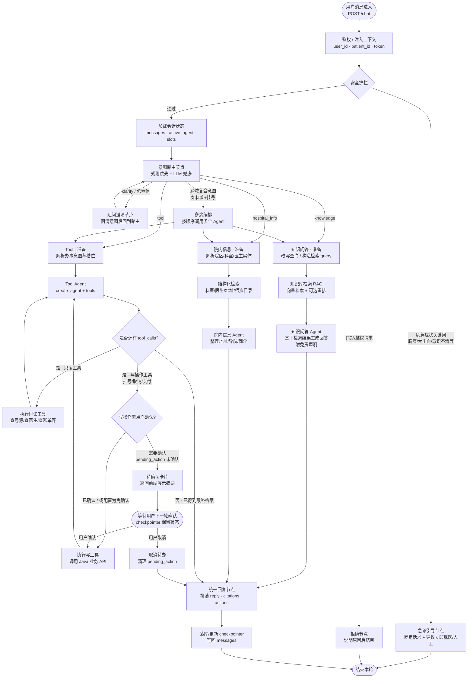

# 患者端多 Agent Graph 设计（TODO）

## 总览

三个专科 Agent：

| Agent | 意图标签 | 职责 |
|------|---------|------|
| 知识问答 | `knowledge` | 医疗知识 / 就诊须知 / 科普（RAG） |
| 院内信息 | `hospital_info` | 地址导航、科室位置、师资与医生介绍 |
| Tool | `tool` | 挂载业务工具（查号源、挂号等），写操作需确认 |

拓扑：`Router`（起步）→ 后续可加 Handoffs。

---

## 详细流程图



---

## 节点职责清单

### 1. `auth` — 鉴权与上下文注入
- [ ] 从 Header / Java 网关解析用户身份
- [ ] 注入 `user_id`、`patient_id`（无档案则后续 Tool 引导建档）
- [ ] 失败则直接 401，不进入 Graph

### 2. `guard` — 安全护栏
- [ ] 危急症状词表拦截 → `emergency`
- [ ] 越权/敏感操作拦截 → `reject`
- [ ] 医疗免责：知识问答路径强制 disclaimer

### 3. `router` — 意图路由
- [ ] 输出：`knowledge` | `hospital_info` | `tool` | `clarify`
- [ ] 规则优先（关键词），低置信再用 LLM 分类
- [ ] 复合意图可走 `multi`（第一版可降级为追问主意图）

### 4. `kb_*` — 知识问答 Agent
- [ ] 检索医疗知识库（Qdrant 等）
- [ ] 仅基于检索片段回答，拒绝对无依据的确诊表述
- [ ] 返回：`reply` + 可选 `citations`

### 5. `info_*` — 院内信息 Agent
- [ ] 查院区地址、楼层导航、科室简介、医生/师资介绍
- [ ] 数据源：结构化目录 API 或专用知识集合
- [ ] 不做挂号/缴费等写操作

### 6. `tool_*` — Tool Agent
- [ ] 使用 `create_agent(model, tools=[...])`
- [ ] 只读工具可直接执行
- [ ] 写操作进入 HITL：`pending_action` → 前端确认卡片 → 再执行
- [ ] 工具结果回灌 messages，直到无 tool_calls

### 7. `clarify` / `reply` / `persist`
- [ ] `clarify`：一次只问一个关键缺失信息，然后回到 `router`
- [ ] `reply`：统一对外结构 `{ reply, intent, actions?, citations? }`
- [ ] `persist`：会话与 `pending_action` 写入 checkpointer

---

## State 字段（对应 `agent/graph/states.py`）

```text
messages          # 对话历史
user_id           # 登录用户
patient_id        # 就诊人（可空）
intent            # knowledge | hospital_info | tool | clarify | emergency
active_agent      # 当前专科
slots             # 办事槽位：科室/日期/医生等
rag_docs          # 知识库命中
hospital_facts    # 院内信息命中
pending_action    # 待确认写操作 {tool, args, summary}
tool_results      # 最近工具返回
safe_flags        # 护栏命中标记
```

---

## 文件落地（对应现有目录）

```text
AI/app/agent/graph/
  states.py      # State 定义
  nodes.py       # auth / guard / router / kb / info / tool / hitl / reply
  workflow.py    # StateGraph 组装与条件边
AI/app/chain/qa.py   # 可先作为知识问答核心，再拆出 info / tool
AI/app/router/chat.py  # 入口改为调用 workflow.invoke / astream
```

---

## 实现顺序建议

1. [ ] 定义 `states.py` + 空壳 `workflow`（router 先写死规则）
2. [ ] 接通知识问答（现有 `qa.py` + RAG 可后补）
3. [ ] 接通院内信息检索（mock 数据亦可）
4. [ ] Tool Agent：先挂只读工具
5. [ ] HITL：写操作确认卡片
6. [ ] checkpointer 多轮会话
7. [ ] 危急护栏与免责声明打磨
```
