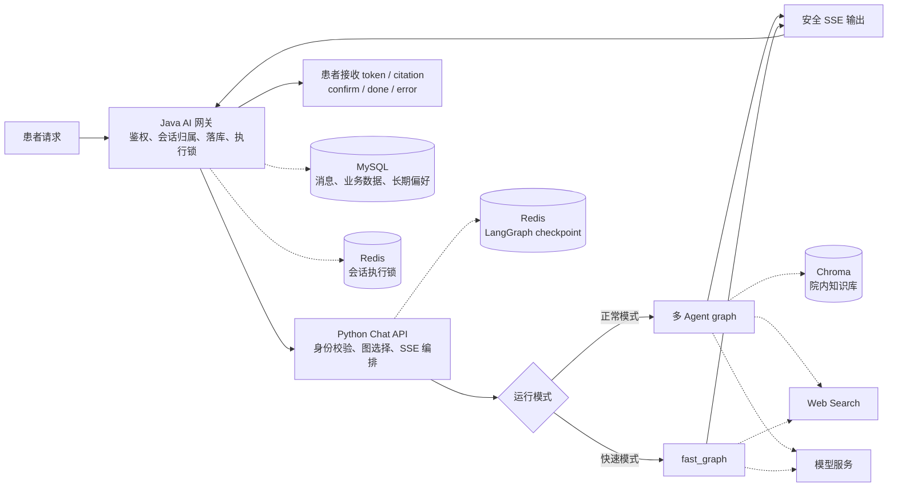
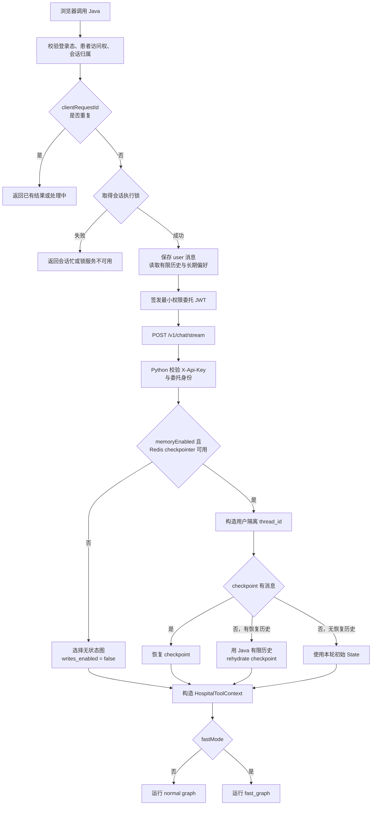
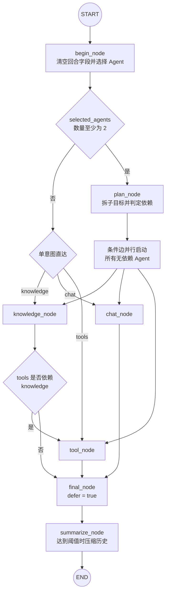
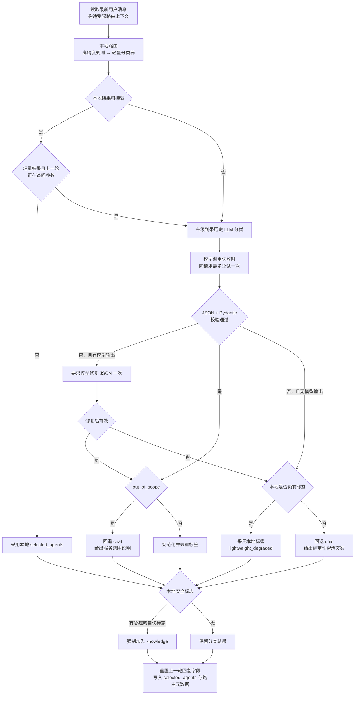
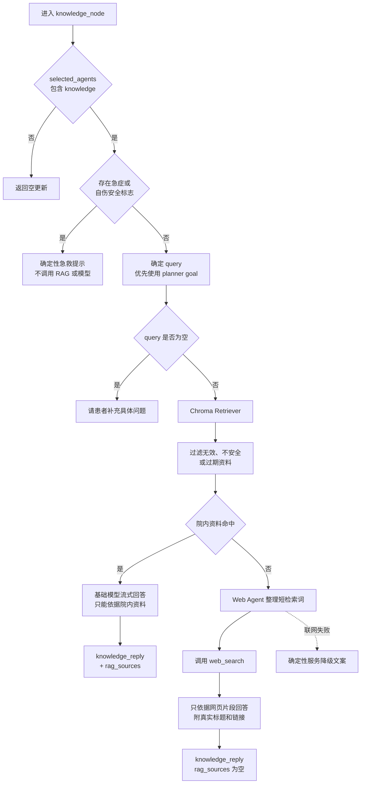
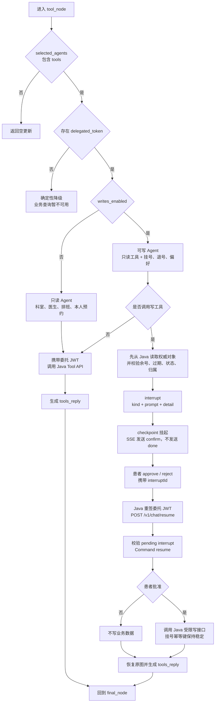
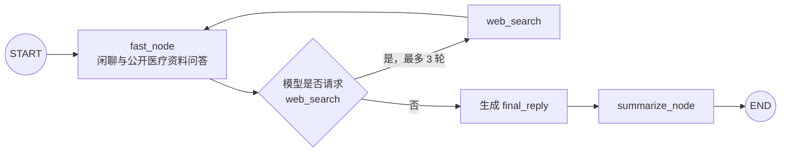
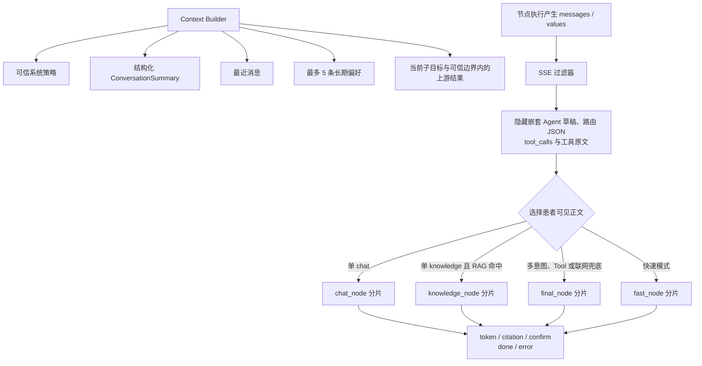

# 温润在线医院 AI 模块流程骨架

> 以当前仓库代码为准。流程按职责拆成多张图：总览只展示跨服务主链路，复杂节点在各自章节展开。

## 1. AI 模块总览

这张图只回答“请求经过哪些系统”，不展开 LangGraph 内部判断。

## 2. 请求入口与会话恢复

Java 负责可信业务边界，Python 只使用 Java 已验证的身份和有限恢复历史。委托令牌只进入本次 `HospitalToolContext`，不写入 LangGraph State 或 checkpoint。

## 3. 正常模式 graph

这张图对应 `graphs.py` 的真实拓扑，只展示节点之间的调度关系。`knowledge_node`、`tool_node` 等节点内部流程在后文展开。

调度要点：

- 单意图不经过 `plan_node`，直接进入对应 Agent。
- 多意图由 `plan_node` 为每个 Agent 生成独立 goal；规划失败时降级为全部并行。
- 当前依赖白名单只有 `tools → knowledge`，例如“判断该看哪科并挂对应科室”。
- `final_node` 使用 `defer=True`，等待并行分支和依赖链全部完成后只汇总一次。

## 4. begin_node 级联路由

`begin_node` 只分类，不直接回答患者。它优先使用确定性本地能力，仅在低置信、追问接续或本地无法判断时调用带历史上下文的 LLM。

## 5. knowledge_node 知识路径

知识节点先走确定性安全判断，再查院内 RAG；只有院内资料未命中时才允许联网兜底。

## 6. tool_node 与人工确认

Tool Agent 只能通过 Java 受控接口访问实时业务。无 checkpointer 或快速模式会关闭写工具，因此不会产生无法恢复的 `interrupt`。

## 7. 快速模式、上下文与输出

快速模式是一张独立小图，不经过意图路由、规划、院内 RAG 或 Java 业务工具。

正常图和快速图共用上下文压缩与 SSE 安全输出规则：

## 核心边界

- 浏览器只调用 Java，Java 再将 AI 请求转发给 Python。
- Python 负责模型调用、意图路由、RAG 和 Tool 编排，不直接读写挂号业务表。
- Python 调用业务工具时必须携带 Java 签发的委托 JWT。
- 用户身份和委托令牌只存在于 `HospitalToolContext`，不会进入 State 或 checkpoint。
- 挂号、退号和长期偏好写入必须经过 `interrupt → confirm → resume`。
- 快速模式只有 `web_search`，没有院内 RAG 和 Java 业务 Tool。

## 关键代码位置

| 模块 | 文件 |
| --- | --- |
| LangGraph 正常图与快速图 | `ai-python/app/graphs/hospital/graphs.py` |
| 级联意图路由 | `ai-python/app/graphs/hospital/nodes/begin.py`、`ai-python/app/intent/` |
| 多意图规划与依赖 | `ai-python/app/graphs/hospital/nodes/plan.py` |
| RAG 与网页兜底 | `ai-python/app/graphs/hospital/nodes/knowledge.py` |
| 业务 Tool Agent | `ai-python/app/graphs/hospital/nodes/tool.py` |
| 写操作确认 | `ai-python/app/graphs/hospital/tools/registration_write.py`、`memory.py` |
| 上下文与摘要 | `ai-python/app/graphs/hospital/context_builder.py`、`nodes/summarize.py` |
| SSE、checkpoint 恢复与 resume | `ai-python/app/api/routes/chat.py` |
| Java AI 网关 | `backend-java/src/main/java/com/wenrun/ai/controller/aiController.java` |
| Java 内部 Tool API | `backend-java/src/main/java/com/wenrun/ai/controller/AiToolController.java` |
