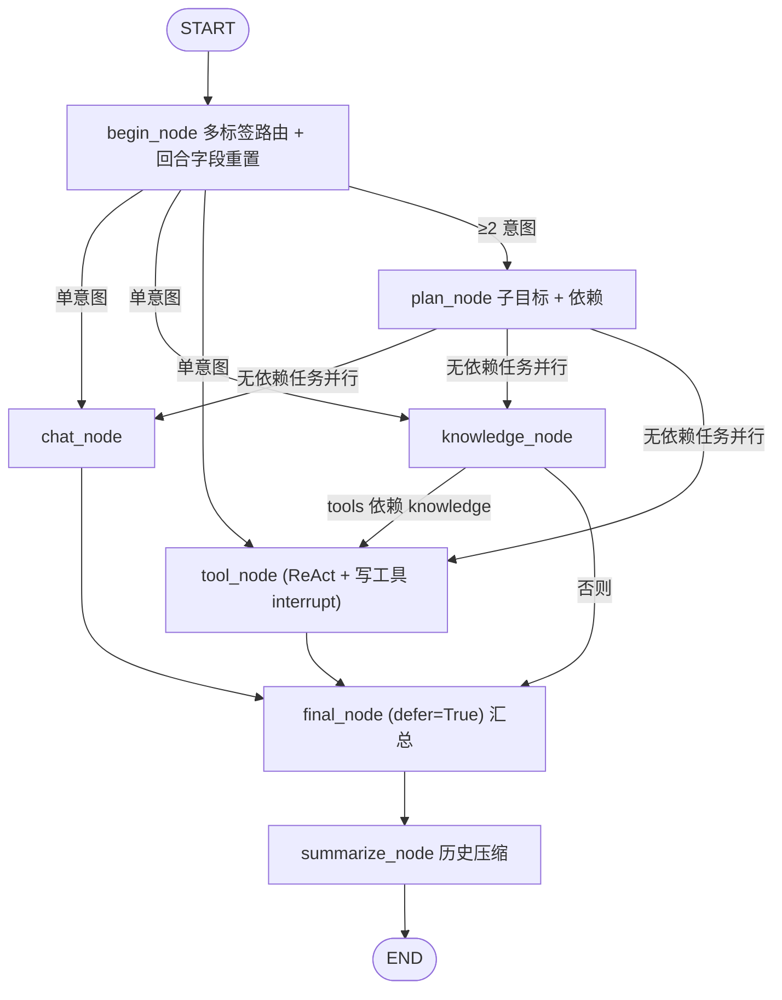

# 医疗 Agent 工作流节点设计与编排

## 1. 项目目标

构建一个面向医院患者端的智能 Agent，通过自然语言交互，为患者提供：

1. **普通聊天能力**

   * 日常咨询
   * 非业务性交流
   * 通用问题回答

2. **医院知识库问答能力（RAG）**

   * 医院介绍
   * 科室信息
   * 医生介绍
   * 就诊流程
   * 地理位置
   * 检查注意事项等

3. **医院业务操作能力（Function Calling）**

   * 挂号
   * 退号
   * 改号
   * 查询号源
   * 查询预约记录等

整体采用 **LangGraph 作为 Agent Workflow 编排框架**，通过节点化设计实现任务理解、任务拆解、流程控制以及工具调用。

---

# 2. 整体工作流架构

设计目标是"复杂任务能按序完成，简单聊天不多付一分钱"：

```text
                         用户输入
                            ↓
                 Conversation Manager（checkpoint 恢复 + 回合字段重置）
                            ↓
                 Intent Router（多标签：chat / knowledge / tools 任意组合）
                            ↓
              ┌─────────────┴─────────────┐
        只选中 1 个标签                  选中 ≥ 2 个标签
              ↓                             ↓
        直达对应节点                   Planner（拆子目标、判依赖）
     （无规划、零额外开销）                     ↓
              │              ┌──────────────┼──────────────┐
              │              ↓              ↓              ↓
              │          Chat Node    Knowledge Node    Tool Node ←─┐
              │            闲聊        RAG → 联网兜底     ReAct 业务    │
              │                             │                        │
              │                             └── tools 依赖 knowledge ─┘
              │                                 （先给科室，再查号源）
              │                                        ↓
              │                            写工具 interrupt → 人工确认卡片
              │                            （挂起期间仍可聊天 / 口头确认）
              └─────────────┬─────────────┘
                            ↓
                 Result Aggregator（final_node, defer=True，只汇总一次）
                            ↓
                 Summarize（历史压缩）→ Streaming 返回用户
```

分层原则不变：Router 负责"选谁"，Planner 负责"先后"，各节点负责"怎么做"，写操作必须过人工确认。

---

# 3. 核心节点设计

## 3.1 Conversation Manager（会话管理节点）

### 职责

负责维护用户上下文和会话状态。

主要管理：

* 用户身份信息
* 历史聊天记录
* 当前任务状态
* 已完成任务结果

### State 定义（与 `ai-python/app/graphs/hospital/state.py` 一致）

```python
class State(MessagesState):            # messages 自带 add_messages reducer，支持并行分支写入
    conversation_id: str               # 前端会话 ID；checkpointer key 还会拼入已验证 user ID
    patient_id: int | None
    selected_agents: list[AgentName]   # begin_node 写入，可多选：knowledge / chat / tools
    intent_route: dict | None          # 级联层、分数、命中规则、升级原因
    task_plan: dict | None             # 多意图时 plan_node 写入：{"tasks":[{"agent","goal","depends_on"}]}
    router_fallback: bool
    router_response: str | None
    knowledge_reply: str | None        # 各回复节点各写各的字段，互不冲突
    rag_sources: list[dict] | None
    chat_reply: str | None
    tools_reply: str | None
    final_reply: str | None
    summary: ConversationSummary | dict | str | None
    long_term_memories: list[dict]
```

要点：

* 身份与委托令牌**不进 State**，只放在每次请求的 `HospitalToolContext` 里，工具以当前登录患者身份调用 Java。
* `task_plan` 与各 `*_reply` 是回合级字段，`begin_node` 开头统一清空，避免 checkpoint 恢复后串轮。

---

# 4. Intent Router（意图路由节点）

## 职责

判断用户请求属于哪一种服务类型。

输入：

```
用户：
医院几点上班？
```

输出：

```json
{
    "intent":"knowledge"
}
```

输入：

```
用户：
帮我挂明天李医生的号
```

输出：

```json
{
    "intent":"business"
}
```

## 路由结果

路由是**多标签**的：一句话里有几件事就选几个标签，而不是三选一。

| 标签        | 节点             | 说明                          |
| --------- | -------------- | --------------------------- |
| chat      | chat_node      | 寒暄、情绪、当前时间、楼层/营业时间等非医疗院务     |
| knowledge | knowledge_node | 医疗知识：院内 RAG 优先，未命中再联网        |
| tools     | tool_node      | 本院实时业务：科室/号源/排班/我的预约、挂号、退号   |

实现为规则 → 轻量模型 → LLM 的级联（`begin_node`）：

* 高精度规则命中直接采用，零模型开销；
* 轻量模型只看最新一句。**若上一轮业务/知识助手正在追问参数**（回复以问号结尾），例如患者回"明天下午"，则跳过轻量模型结果，交给带历史的 LLM 路由，避免把补充回答误判成闲聊；
* LLM 输出 JSON，一次修复重试；全部失败时用轻量模型标签兜底，或给出确定性澄清。

---

# 5. Chat Workflow（普通聊天流程）

## 使用场景

例如：

```
最近压力有点大怎么办？
```

流程：

```text
用户输入

 ↓

Chat Node

 ↓

LLM

 ↓

回复用户
```

特点：

* 无知识库查询
* 无业务接口调用
* 快速响应

---

# 6. RAG Workflow（知识问答流程）

## 使用场景

例如：

```
医院停车场在哪里？

张医生擅长什么？

周末可以做核磁吗？
```

流程：

```text
用户问题

 ↓

Query Rewrite

 ↓

Retriever

 ↓

Vector Search

 ↓

Reranker

 ↓

Context Builder

 ↓

LLM

 ↓

生成回答
```

## RAG 节点职责

### Query Rewrite

优化用户问题：

例如：

用户：

```
停车方便吗？
```

转换：

```
医院停车场位置以及收费规则
```

---

### Retriever

负责召回知识：

数据来源：

* 医院文档
* 医生资料
* 科室介绍
* 就诊指南

---

### Reranker

重新排序：

提升：

* 相关性
* 准确率

---

### Context Builder

构造最终 Prompt：

```text
系统指令

+

检索知识

+

用户问题
```

---

# 7. Agent Workflow（复杂任务流程）

## 使用场景

例如：

用户：

> 今天星期几？帮我查一下明天有没有李雷医生的号，如果有帮我挂一下，然后告诉我感冒应该注意什么。

该请求包含多个任务：

```text
任务1：
查询日期


任务2：
查询医生号源


任务3：
执行挂号


任务4：
医疗知识咨询
```

因此进入 Planner。

---

# 8. Planner Node（任务规划节点，按需触发）

实现：`ai-python/app/graphs/hospital/nodes/plan.py`

## 触发条件

**只有 `selected_agents` ≥ 2 时才进入 plan_node**；单意图（纯闲聊、纯知识、纯业务）直达对应节点，不多花一次模型调用。

## 职责

* 为每个已选 Agent 写出它本轮的子目标 `goal`（患者原话改写，不补充患者没说的内容）；
* 判断 `tools` 是否必须等 `knowledge` 的结论才能开始。

Planner 只负责规划，不负责执行；输出不会发给患者。

输入：

```
感冒了该看哪科，帮我挂明天那个科的号，另外今天星期几？
```

输出（写入 `State.task_plan`）：

```json
{
  "tasks": [
    {"agent": "knowledge", "goal": "感冒该看哪科", "depends_on": []},
    {"agent": "chat", "goal": "今天星期几", "depends_on": []},
    {"agent": "tools", "goal": "挂明天对应科室的号", "depends_on": ["knowledge"]}
  ]
}
```

## 约束（避免"LLM 自由发挥"）

* `agent` 必须是已选 Agent；模型漏掉的 Agent 自动补空 goal，多出来的忽略。
* 依赖只允许白名单 `tools → knowledge`；其余依赖静默丢弃，图里不可能出现环或未知路径。
* JSON 不合法时同一模型修正一次；仍失败或模型不可用时降级为"全部并行、无子目标"，等价于旧行为。

固定的业务链（查号源 → 确认 → 挂号）不交给 Planner，而是硬编码在 tool_node 的 ReAct 流程与写工具里（见第 10、11 节）。

---

# 9. 调度：条件边而非独立 Dispatcher

不再单独设 Dispatcher 节点，调度由 `graphs.py` 里的三个条件边完成：

| 条件边               | 规则                                                                 |
| ----------------- | ------------------------------------------------------------------ |
| `_after_begin`    | 单意图 → 直达 chat_node / knowledge_node / tool_node；≥2 意图 → plan_node    |
| `_dispatch_ready` | 计划中 `depends_on` 为空的 Agent **并行**启动；计划为空则全部并行                       |
| `_after_knowledge` | 若 `tools` 依赖 `knowledge` → 接力到 tool_node，否则 → final_node            |

`final_node` 以 `defer=True` 注册：chat 分支和 knowledge→tool 接力链会落在不同 superstep，deferred 节点保证等所有分支都结束后**只汇总一次**。

## 子目标与上游结果如何传给各节点

`build_context(state, purpose, task_goal=..., upstream_results=...)` 会在对话上下文末尾追加两条**不可信数据**消息（与 RAG、长期记忆同等级别，不进 system prompt）：

* `current_subtask`：本节点只需处理的子目标；
* `upstream_result`：仅当 tool_node 依赖 knowledge 时，附带 `knowledge_reply`（如"建议看呼吸内科"），业务助手据此直接查号源，不再追问科室。

knowledge_node 命中 RAG 时还会用 `goal` 代替整句原话做向量检索，检索词更准。

---

# 10. Hospital Tool Workflow（医院业务流程）

## 使用场景

包括：

* 挂号
* 退号
* 改号
* 查询预约

流程：

```text
用户请求

 ↓

参数抽取

 ↓

Slot Filling

 ↓

参数校验

 ↓

查询医院API

 ↓

Human Approval

 ↓

执行接口

 ↓

返回结果
```

---

## Slot Filling

收集必要参数：

```json
{
    "department":"呼吸科",
    "doctor":"李雷",
    "date":"2026-09-18",
    "time":"下午"
}
```

如果缺少：

```
用户：
我要挂李医生
```

Agent：

```
请问您想预约哪一天？
```

---

# 11. Human Approval Node（人工确认节点）

## 目的

防止 Agent 自动执行高风险操作。

例如：

查询：

```
李雷医生
明天下午
剩余3个号
```

Agent：

```
是否确认预约？
```

用户确认：

```
确认
```

才执行：

```
register()
```

## 实现：LangGraph interrupt 与恢复

* **只有写工具触发确认**：`create_registration` / `cancel_registration` 内部调用 `interrupt()`，查号源、查预约等只读工具不会打断。
* 卡片上的业务信息（科室、医生、日期、费用）全部来自 Java 回查，不采用模型复述，保证"确认的"和"提交的"是同一张号。
* `interrupt()` 依赖 checkpointer 与 `thread_id`（= 已验证 user ID + conversation_id）。没有 checkpointer 的会话（快速模式、无记忆）**关闭写能力**，只查不办。
* 前端点击卡片 → `POST /v1/chat/resume` → `Command(resume={interrupt_id: "approve"|"reject"})` 续跑同一 thread；多张卡片时必须带 `interruptId`，否则返回 `AI_RESUME_CONFLICT`。
* 提交时带幂等键 `conversation_id:tool_call_id`，恢复后节点整段重放也不会重复挂号。

## 卡片挂起期间患者仍可继续对话

确认卡片挂起时再收到新消息（`POST /v1/chat/stream`）分三种情况：

| 患者输入                | 处理                                                          |
| ------------------- | ----------------------------------------------------------- |
| 极短肯定："确认""好的""可以"    | 规则判定为 approve，直接按 resume 续跑，无需点卡片                            |
| 极短否定："不用了""算了""取消"   | 规则判定为 reject，取消本次办理                                          |
| 其他（提问、闲聊、带条件的句子）    | **旁路回答**：用无 checkpointer 的图 + checkpoint 里的历史回答，然后重新发出同一张卡片 |

规则只收 ≤12 字、词表内、不混用肯定/否定的句子；"确认一下李医生是男的吗"这类一律走旁路回答，绝不误提交。
旁路回答禁用写工具（不会出现第二张卡片），也不写回被挂起的 thread（interrupt 中的 superstep 尚未提交，`update_state` 不安全），这几条消息以 Java 侧持久化的会话记录为准。

---

# 12. Result Aggregator（结果汇总节点）

负责合并多个任务结果。

例如：

```json
{
    "date":
    "今天星期四",

    "registration":
    "预约成功",

    "medical":
    "感冒注意事项..."
}
```

统一交给 LLM 生成最终回复。

---

# 13. Response Generator（回复生成节点）

职责：

* 整理语言
* 格式化输出
* 添加引用
* Streaming 返回前端

最终：

```
今天是星期四。

李雷医生明天下午还有号，
已经帮您预约成功。

关于感冒：
建议注意休息、多饮水，
如果出现持续高热等情况建议及时就医。
```

---

# 14. LangGraph 节点关系（`ai-python/app/graphs/hospital/graphs.py`）



对应关系：

| 文档概念               | 实现                                               |
| ------------------ | ------------------------------------------------ |
| Conversation Manager | checkpointer（Redis）+ `begin_node` 的回合字段重置 + `summarize_node` |
| Intent Router      | `begin_node`（规则 → 轻量模型 → LLM 级联，多标签）             |
| Planner            | `plan_node`（仅多意图触发）                               |
| Task Dispatcher    | `_after_begin` / `_dispatch_ready` / `_after_knowledge` 条件边 |
| Hospital Tool Workflow | `tool_node` 内的 ReAct Agent + `list_*` / `create_registration` / `cancel_registration` |
| Human Approval     | 写工具内部 `interrupt()`；`/resume` 与挂起期间的自然语言确认        |
| Result Aggregator + Response Generator | `final_node`：单节点直接透传，多节点由 LLM 合并且不得改动事实 |

另有 `fast_graph`（快速模式）：`fast_node → summarize_node`，无路由、无规划、无写工具。

---

# 15. 架构设计原则

## 1. LLM负责理解，不负责业务执行

LLM：

* 意图理解
* 参数抽取
* 任务规划

业务系统：

* 挂号
* 退号
* 改号

---

## 2. Workflow保证稳定性

固定流程使用 Workflow：

例如：

```
查询号源
 ↓
确认
 ↓
挂号
```

不要完全交给 LLM 自由发挥。

---

## 3. 高风险操作必须 Human-in-the-loop

涉及：

* 挂号
* 取消预约
* 修改患者信息

必须人工确认。

---

## 4. 多能力 Agent 使用 Router + Workflow 编排

而不是：

```
一个超级 Prompt 解决所有问题
```

企业级设计：

```
Router
 +
Workflow
 +
Tool
 +
RAG
 +
Human Approval
```

最终形成可维护、可扩展的医疗 Agent 系统。
