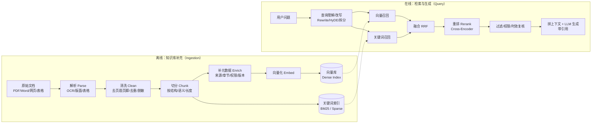
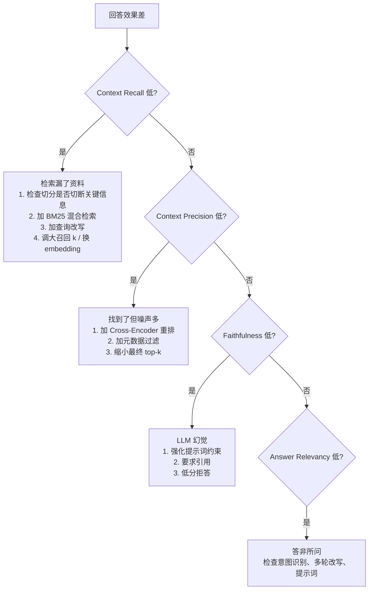

# 企业级 RAG：知识库构建、检索链路与评估指标

> 调研日期：2026-09-30。资料来源见文末「参考资料」。
> 本文先讲业界通用做法，最后一节对照本项目 `ai-python/app/rag/` 的现状给出差距与建议。

---

## 0. 先建立整体印象

RAG（Retrieval-Augmented Generation，检索增强生成）= **先从知识库里找资料，再让 LLM 基于找到的资料回答**。企业级 RAG 一般拆成两条独立的链路：



两条链路对应你说的「知识库补充」和「LLM 检索」。另外还有第三条贯穿全程的线：**评估**（召回率、准确率等），没有它就无法判断任何一处改动是变好还是变坏。

---

## 1. 离线链路：知识库是怎么补充的

### 1.1 文档接入（Connector / Upload）

企业里文档来源很多：手动上传、Confluence/飞书/钉钉文档、共享盘、业务数据库、工单系统等。关键设计点：

| 设计点 | 通用做法 |
| --- | --- |
| 上传方式 | 管理后台上传（单个/批量）、定时同步（轮询 `last_modified`）、Webhook 推送增量 |
| 变更检测 | 对原始文件算 **SHA-256 内容哈希**，和上次入库的哈希比对：相同则跳过，不同则整篇重新解析、切分、向量化 |
| 删除同步 | 源文件删除后，按 `document_id` 删掉它的全部向量（又称 tombstone 清理），防止「幽灵文档」被检索到 |
| 幂等 | 文档 ID、片段 ID 用「来源 + 版本」确定性生成，重复上传不会产生重复片段 |
| 审核发布 | 入库 ≠ 上线。常见状态机：`草稿 → 待审核 → 已发布 → 已下线/已过期`，检索只查已发布 |

### 1.2 解析（Parse）：把文件变成「带类型的元素」

好的解析输出的不是一大坨纯文本，而是**一串带类型的元素**：标题、正文段落、列表、表格、图片说明，每个元素带页码、章节路径、坐标等。

| 文件类型 | 解析方式 | 注意点 |
| --- | --- | --- |
| 原生 PDF（能选中文字） | 直接抽取文本层 | 多栏排版的阅读顺序、页眉页脚重复 |
| 扫描件 / 图片 PDF | OCR（如 Tesseract、PaddleOCR） | OCR 质量决定上限；复杂版面需版面分析模型 |
| 混合 PDF | 版面检测 + OCR（Unstructured 的 `hi_res` 策略） | 慢，但能正确识别标题/表格/图 |
| Word / HTML / Markdown | 按标签或样式直接得到层级结构 | 结构最友好，优先利用标题层级 |
| Excel / 表格 | 行级或表级转文本（常转成 Markdown 表格或「字段: 值」） | 表头必须和数据行一起保留，否则数值失去含义 |

常用工具：Unstructured、LlamaParse、Apache Tika（Java 服务化）、Docling、MinerU（中文 PDF 表现好）。

### 1.3 清洗（Clean）

- 去掉页眉、页脚、页码、水印、目录页等噪声；
- 规范空白、全半角、乱码；
- **去重**：完全重复用哈希，近似重复用 MinHash/SimHash；
- **脱敏**：身份证、手机号、病历号等敏感信息按需打码（医疗场景很重要）；
- **质量门禁**：解析出的文字过少、乱码率过高的文档直接拒收或转人工，避免垃圾进库。

### 1.4 切分（Chunking）：拆成什么、怎么拆、拆多大

这是入库链路里对效果影响最大的一步。

#### 为什么必须切分

1. 向量模型有输入长度上限；
2. 一段文字只能压成一个向量，**内容越杂，向量越"模糊"**，检索越不准；
3. LLM 上下文有限，只应把最相关的几段交给它。

#### 拆成什么：Chunk（片段）

每个 chunk 是一个**能独立回答问题的最小语义单元**，结构通常是：

```json
{
  "chunk_id": "doc_123_v2_0007",
  "text": "【门诊挂号 > 预约规则】患者可提前 7 天通过小程序预约……",
  "metadata": {
    "document_id": "doc_123",
    "version": 2,
    "title": "门诊就诊指南",
    "section_path": ["门诊挂号", "预约规则"],
    "page_numbers": [3],
    "doc_type": "hospital_guide",
    "audience": "public",
    "status": "active",
    "effective_from": "2026-09-01",
    "expires_at": null,
    "checksum": "sha256:...",
    "chunk_index": 7
  }
}
```

元数据不是可有可无的：**过滤（权限、时效、科室）、引用溯源、版本替换、删除**全靠它。

#### 主流切分策略

| 策略 | 做法 | 适用 | 优缺点 |
| --- | --- | --- | --- |
| 固定长度 + 重叠 | 每 N 个 token 切一刀，相邻片段重叠 10%–20% | 聊天记录、无结构文本；作为对比基线 | 简单；但会把句子、表格、步骤拦腰切断 |
| 递归字符切分 | 按分隔符优先级递归切：标题 → 段落 → 句子 → 字符，直到不超长（LangChain `RecursiveCharacterTextSplitter`） | 大多数通用文本 | 性价比最高的默认方案 |
| **结构感知切分** | 按 Markdown 标题、HTML section、Word 标题样式、法规"条/款"切 | 制度、手册、技术文档、合同 | 对结构化文档召回可提升 2–3 倍；企业首选 |
| 语义切分 | 相邻句子向量余弦距离超过阈值就断开 | 长篇无结构文章、论文 | 边界更自然；入库多一次向量计算，成本高 |
| **父子切分（Parent-Child）** | 小片段（子）用来检索，命中后把它所在的大章节（父）交给 LLM | 精确匹配 + 需要完整上下文的场景 | "检索要准、回答要全"两头兼顾；被认为是精度场景的最佳实践 |
| 按业务单元切 | FAQ 一问一答为一段；代码按函数；工单按消息；表格按行或整表 | 特定数据类型 | 最贴合业务，需要先做文档分类 |
| 上下文增强切分（Contextual Retrieval） | 入库时让 LLM 给每个 chunk 前面加一句"它出自哪份文档哪一节、讲什么"再向量化 | 片段脱离上下文就看不懂的文档 | Anthropic 报告检索失败率明显下降；入库成本增加 |

#### 拆多大：经验值（最终以评估集结果为准）

| 文档类型 | 建议长度 | 重叠 | 策略 |
| --- | --- | --- | --- |
| 制度、合同、法规 | 600–900 tokens | ~20% | 按条款/章节 |
| 技术文档、操作手册 | 400–600 tokens | ~15% | 按标题层级 |
| FAQ | 200–400 tokens | ~10% | 一问一答一段 |
| 邮件、聊天记录 | 300–500 tokens | ~15% | 固定长度 + 滑动窗口 |
| 论文、长报告 | 500–800 tokens | ~20% | 语义切分 |
| 代码 | 整个函数 | 0 | 按语法树（Tree-sitter） |

通用规律：

- **太小（<100 tokens）**：上下文丢失，拿到半句话；
- **太大（>1500 tokens）**：向量语义被稀释，还浪费 LLM 上下文；
- 常用区间 **300–600 tokens，重叠 10%–20%**；
- 重叠只是补救手段，**不能替代正确的边界**。重叠太多会让索引膨胀、出现大量近似重复命中；
- 后处理两步很实用：**超长片段再切一次**、**过短碎片与相邻片段合并**；
- **一个语料库里有多种切分策略是正常的**：先给文档分类，再按类型路由到不同切分器。用一种 500-token 规则通吃所有文档，被列为让准确率卡在 70% 左右的常见原因之一。

### 1.5 向量化与写入索引（Embed & Index）

- **Embedding 模型**：把 chunk 文本转成向量（如 OpenAI text-embedding-3、BGE-M3、GTE、通义 text-embedding-v3）。**入库和查询必须用同一个模型**；换模型就要全量重建索引。
- **批量调用**：注意接口单批上限和限流（如 DashScope 单次最多 20 条）。
- **双索引**：同一批 chunk 同时写入
  - 向量索引（Chroma / Milvus / Qdrant / pgvector / Elasticsearch dense_vector）；
  - 关键词索引（BM25，常见于 Elasticsearch/OpenSearch，或 BGE-M3 的 sparse 向量）。
- **版本替换**：新版本写入成功后，再把旧版本标记下线或删除，保证不会出现"一半新一半旧"的空窗期。

---

## 2. 在线链路：检索是怎么做的

### 2.1 查询理解与改写（Query Rewriting）

用户的原话往往不适合直接检索（口语化、指代不清、一句话问多件事）。常见手段：

| 手段 | 做法 | 适用 |
| --- | --- | --- |
| 多轮补全 | 结合对话历史把"那它几点下班？"改写成"心内科门诊几点下班？" | 多轮对话必做 |
| 多查询扩展（Multi-Query） | 让 LLM 生成 3–5 个不同说法分别检索再合并 | 用户用词和文档用词差异大 |
| HyDE | 先让 LLM 写一个"假设答案"，用假设答案去做向量检索 | 词汇鸿沟大；**不适合**精确查编号 |
| 问题拆分（Decomposition） | 复合问题拆成多个子问题分别检索 | 多跳问题 |
| Step-back | 先抽象成更一般的问题检索背景，再回到具体问题 | 需要背景知识的问题 |
| 意图路由 | 先判断该查哪个知识库、要不要检索 | 多知识库、闲聊与业务混合 |

改写通常能让召回提升 5–15 个百分点，但代价是多一次 LLM 调用和"改写偏离原意"的风险。企业做法是**只在置信度低或问题复杂时才改写**。

### 2.2 召回（Retrieval / Recall 阶段）

"召回"指**从全量知识库中粗筛出一批候选片段**（比如 top 50）。目标是**宁可多拿，不要漏掉**。

- **稠密检索（Dense / 向量检索）**：按语义相似度找。擅长同义改写、口语化提问；**弱点是精确字符串**，比如药品编码、ICD-10 编码 `M54.5`、科室编号，向量会返回"语义相近但事实错误"的片段。
- **稀疏检索（Sparse / BM25 关键词检索）**：按词频统计匹配。擅长编号、专有名词、罕见词；弱点是不懂同义词。
- **混合检索（Hybrid）**：两路并行，结果融合。2026 年的行业默认做法。公开实测中，领域语料上 recall@5 从纯向量的约 0.72 提升到混合 + 重排后的约 0.91。
- **元数据预过滤**：在向量库查询时就带上 `status=active`、生效时间、权限范围、科室等条件。

### 2.3 融合（Fusion）：RRF

BM25 分数（无上界正数）和余弦相似度（-1~1）量纲完全不同，直接加权平均很不稳定。标准做法是 **RRF（Reciprocal Rank Fusion，倒数排名融合）**，只看排名、不看分数：

\[
\text{RRF}(d) = \sum_{r \in \text{各路检索}} \frac{1}{k + \text{rank}_r(d)}, \quad k \text{ 通常取 } 60
\]

一个片段在两路里都排得靠前，融合后就会排在最前面。OpenSearch 2.19 起已把 RRF 作为混合检索的默认融合方式。

### 2.4 重排（Rerank / 精排阶段）

召回阶段用的是**双塔模型（Bi-Encoder）**：问题和文档各自独立编码成向量再比相似度，速度快但粗糙。

重排用**交叉编码器（Cross-Encoder）**：把「问题 + 候选片段」拼在一起送进模型，直接输出相关性分数，精度高得多，但每个候选都要单独算一次，所以**只能用于少量候选**。

典型参数：

```
混合召回 top 50~100  →  RRF 融合  →  Cross-Encoder 重排  →  取 top 3~8 给 LLM
```

- 常用重排模型：`bge-reranker-v2-m3`（中文友好，可本地部署）、Cohere Rerank、Jina Reranker、通义 gte-rerank；
- 额外延迟一般 30–200ms；
- 公开资料普遍报告重排能带来 10%–25% 的回答质量提升；
- 重排分数还能用作**拒答阈值**：最高分都很低时，直接回答"知识库中没有相关信息"，而不是让 LLM 瞎编。

### 2.5 后处理与生成

1. **二次安全复核**：权限（患者只能看公开资料）、时效、发布状态再校验一次，防止旧索引混入；
2. **去重与父块扩展**：合并近似重复片段；父子切分场景下换成父章节；
3. **上下文拼装**：控制总 token 预算，最相关的片段放在前面（LLM 对开头和结尾更敏感）；
4. **生成约束**：提示词要求"只依据提供的资料回答、资料不足就说不知道、给出引用来源编号"；
5. **引用溯源**：返回文档标题、章节、页码，前端可点击查看原文。

### 2.6 Agentic RAG：检索交给 Agent 自己决定

传统 RAG 是固定流水线：问一次 → 检索一次 → 回答。**Agentic RAG** 把检索变成 Agent 可以调用的工具（如 `keyword_search`、`semantic_search`、`read_chunk`），由 LLM 在循环里自己决定：

- 要不要检索、检索哪个库；
- 检索结果够不够，不够就改写问题再查（Corrective RAG / Self-RAG 思路）；
- 复杂问题拆成多步，逐步收集证据。

代价是延迟和 token 成本上升。企业实践一般是：**简单问题走固定管线，复杂或低置信度问题才进入 Agent 循环**。

---

## 3. 评估：召回率、准确率这些指标到底是什么

评估分两层：**检索层**（找得准不准）和**生成层**（答得对不对）。

### 3.1 前提：评估集（Golden Dataset）

所有指标都依赖一份**人工标注的评估集**，每条包含：

```json
{
  "question": "门诊可以提前几天预约？",
  "relevant_chunk_ids": ["doc_123_v2_0007"],
  "reference_answer": "可提前 7 天通过小程序预约。"
}
```

- 来源：真实用户问题（最有价值）+ LLM 生成后人工审核的问题；
- 规模：起步 100–300 条即可，覆盖各类文档和典型难题（编号查询、多跳、无答案问题）；
- 用途：**每次改切分参数、换模型、调 top-k，都跑一遍对比**。没有评估集就做 RAG，被列为头号反模式。

### 3.2 检索层指标

设某问题的相关片段集合为 \(R\)，系统返回前 \(k\) 个结果为 \(T_k\)。

| 指标 | 公式 | 回答的问题 | 什么时候看 |
| --- | --- | --- | --- |
| **召回率 Recall@k** | \(\dfrac{\lvert R \cap T_k \rvert}{\lvert R \rvert}\) | 所有该找到的片段，前 k 个里找到了多少？ | **最核心**。漏掉关键资料，LLM 再强也答不对 |
| **精确率 Precision@k**（常被叫作"准确率"） | \(\dfrac{\lvert R \cap T_k \rvert}{k}\) | 前 k 个里有多少是真正相关的？ | 上下文预算紧，噪声会干扰回答时 |
| **命中率 Hit Rate@k** | 前 k 个里至少有 1 个相关片段的问题占比 | 有没有找到至少一条有用的？ | 最粗但最稳定，适合放在 CI 冒烟测试 |
| **MRR**（平均倒数排名） | \(\dfrac{1}{N}\sum_{i=1}^{N}\dfrac{1}{\text{rank}_i}\)，rank 是第一个相关结果的位置 | 第一个有用的结果排得多靠前？ | LLM 主要依赖前一两条结果时 |
| **nDCG@k** | \(\text{DCG@k}=\sum_{i=1}^{k}\dfrac{rel_i}{\log_2(i+1)}\)，\(\text{nDCG}=\dfrac{\text{DCG}}{\text{IDCG}}\) | 越相关的是否排得越靠前？（支持"非常相关/部分相关"分级） | 评估重排效果时 |

**举例**：某问题有 3 个相关片段，系统返回 top 5，其中第 2、4 位是相关的：

- Recall@5 = 2/3 ≈ 0.67
- Precision@5 = 2/5 = 0.40
- Hit@5 = 1
- MRR = 1/2 = 0.5

**召回率和精确率的矛盾**：k 越大，召回越高、精确越低。这正是"**先宽召回、再重排提精度**"两阶段架构的由来：召回阶段看 Recall@50，重排后看 Precision@5 / nDCG@5。

行业默认组合：**Recall@k + MRR**；上下文预算紧时加 Precision@k；评估重排时用 nDCG。

> 注意"准确率"一词在中文语境里常混用。在信息检索中，"Accuracy（准确率）"很少用，大家说的"准确率"一般指 **Precision（精确率）**；而衡量"最终回答对不对"时，才会说"回答准确率 / Answer Correctness"。

### 3.3 生成层指标（RAGAS 框架）

RAGAS 是目前最常用的 RAG 评估框架，用 LLM 当裁判（LLM-as-judge）打分，取值 0–1：

| 指标 | 评估对象 | 计算方式 | 分数低说明 |
| --- | --- | --- | --- |
| **Faithfulness（忠实度）** | 生成器 | 把回答拆成若干条陈述，统计能被检索上下文支持的比例 | **幻觉**：LLM 编了资料里没有的东西 |
| **Answer Relevancy（答案相关性）** | 生成器 | 根据回答反推若干问题，与原问题算向量相似度均值 | 答非所问、啰嗦跑题 |
| **Context Precision（上下文精确率）** | 检索器 | 相关片段是否排在前面（带位置权重的 Precision 均值） | 噪声多、相关片段排在后面 → 加重排 |
| **Context Recall（上下文召回率）** | 检索器 | 把标准答案拆成陈述，统计能在检索上下文中找到依据的比例 | 漏召回 → 查切分边界、换 embedding、调大 top-k、加 BM25 |
| Answer Correctness（回答正确性） | 端到端 | 回答与标准答案的事实一致性 + 语义相似度 | 整体效果差 |

Faithfulness 示例：回答"爱因斯坦 1879 年 3 月 20 日生于德国"，拆成 2 条陈述，只有"生于德国"被资料支持，所以 Faithfulness = 1/2 = 0.5。

### 3.4 如何根据指标定位问题



### 3.5 线上监控

离线评估之外，生产环境还要持续观察：

- 无结果率 / 拒答率；
- 用户点踩率、追问率；
- 检索和重排延迟 P95；
- 被引用最多/从未被召回的文档（后者可能是解析或切分有问题）；
- 抽样人工复核 + 定期把线上坏例补进评估集。

---

## 4. 企业级 RAG 常见反模式

1. **没有评估集就上线**，调参全凭感觉；
2. **一种切分规则通吃所有文档**；
3. **只用向量检索**，编号、药名、专有名词查不准；
4. **不做权限过滤**，或只在提示词里"要求"模型别泄露（必须在检索层过滤）；
5. **没有版本与时效管理**，过期制度仍被检索到；
6. **只评估最终回答**，出了问题分不清是检索的锅还是生成的锅；
7. **盲目堆高级技巧**（GraphRAG、Agentic 循环），而基础的解析和切分还没做好。

---

## 5. 对照本项目现状

以下基于 `ai-python/app/rag/` 当前代码。

### 5.1 已经做到的（与业界做法一致）

| 环节 | 本项目实现 | 位置 |
| --- | --- | --- |
| 文档分类 + 按类型路由切分 | FAQ、流程、制度、目录、就诊指南、医学论文、通用共 7 类，各自有切分策略 | `rag/ingestion/classifier.py`、`rag/ingestion/chunking.py` 中的 `ChunkingRouter` |
| 结构感知切分 | 按标题章节切，保留 `section_path`、页码、元素 ID | `chunking.py` 中的 `_section_units` |
| FAQ 问答成对 | 一问一答尽量放同一片段 | `FAQChunkingStrategy` |
| 表格独立成段 | 目录类文档表格单独切 | `DirectoryChunkingStrategy` |
| 长度控制 + 重叠 | 按 token 计长：`max_tokens=512`，`overlap_tokens=64`（约 12.5%），过短尾段合并 | `rag/ingestion/config.py` |
| 清洗与质量门禁 | 已有清洗器和质量检查模块 | `rag/ingestion/cleaner.py`、`rag/ingestion/quality.py` |
| 版本、状态、时效 | 元数据含 `document_id`、`version`、`checksum`、`status`、生效/过期时间；检索时预过滤只查有效版本 | `rag/chroma.py` 中的 `active_document_filter` |
| 取回后二次复核 | public/staff 范围和发布登记在取回后再校验 | `rag/safety.py` |
| 生命周期管理 | 发布、下线、按版本删除向量 | `rag/lifecycle*.py`、`api/routes/knowledge.py` |

入库这条链路已经比较完整，达到了企业级的基本要求。

### 5.2 主要差距（集中在检索和评估）

当前检索器配置：

```python
# ai-python/app/rag/chroma.py
def get_hospital_retriever():
    client = get_chroma_client()
    embeddings = get_embeddings()
    ensure_collection(client, hospital_collection)
    store = get_store(client, hospital_collection, embeddings)
    return store.as_retriever(
        search_type="similarity_score_threshold",
        search_kwargs={
            "k": 5,
            "score_threshold": 0.8,
            "filter": active_document_filter(),
        },
    )
```

也就是**纯向量检索、一次取 5 条、相似度阈值 0.8，没有 BM25、没有重排**。对照业界做法：

| 差距 | 影响 | 建议（按优先级） |
| --- | --- | --- |
| **没有评估集和评估脚本** | 无法量化任何改动的效果，阈值 0.8 是否合理也无从判断 | **P0**：整理 100–200 条真实患者问题，标注相关 chunk ID，写脚本输出 Recall@5/10、MRR、Hit@5；再用 RAGAS 评估 Faithfulness |
| 纯向量检索 | 药品名、科室编号、ICD 编码、医生姓名等精确词容易查偏 | **P1**：加 BM25（可用 `rank_bm25` 或 `jieba` 分词 + 内存索引，数据量大时换 Elasticsearch），与向量结果做 RRF 融合 |
| 召回和最终数量都是 5，没有重排 | 召回阶段就只取 5 条，漏召回概率高；且 0.8 的硬阈值可能把相关但措辞不同的片段挡掉 | **P1**：召回阶段放宽到 20–50 条，接 `bge-reranker-v2-m3` 或通义 `gte-rerank` 重排后取 top 3–5；用重排分数做拒答阈值 |
| 查询改写 | 多轮对话中"那它呢？"类指代直接检索效果差 | **P2**：检索前结合历史改写问题（项目已有意图识别，可在其后加一步） |
| 父子切分 / 上下文增强 | 512 token 的章节片段脱离文档标题后可能语义不完整 | **P2**：向量化前在片段文本前拼接「文档标题 > 章节路径」（低成本版 Contextual Retrieval）；需要时再引入父子切分 |
| 线上反馈闭环 | 坏例无法沉淀 | **P3**：记录每次检索的 query、命中 chunk、分数和用户反馈，定期补进评估集 |

建议的落地顺序：**先建评估集拿到基线分数 → 加 BM25 + RRF → 加重排 → 用评估集调 k、阈值和切分参数**。每一步都用同一份评估集对比，确认有提升再合入。

---

## 6. 名词速查

| 名词 | 解释 |
| --- | --- |
| Chunk | 切分后的文档片段，检索的最小单位 |
| Token | 模型计算文本长度的单位，中文约 1 字 ≈ 1–1.5 token（依分词器而定） |
| Overlap | 相邻片段重复保留的文字，防止关键信息被切断 |
| Embedding | 把文本转成向量，用于语义相似度计算 |
| Dense / Sparse 检索 | 向量语义检索 / 关键词检索（BM25） |
| Hybrid Search | 稠密 + 稀疏两路检索融合 |
| RRF | 倒数排名融合，只按排名合并多路结果 |
| Bi-Encoder / Cross-Encoder | 双塔（分别编码，快，用于召回）/ 交叉编码（联合编码，准，用于重排） |
| Rerank | 对召回结果重新打分排序 |
| 召回（Recall 阶段） | 从全库粗筛候选，追求不漏 |
| 精排（Rerank 阶段） | 对候选精细排序，追求准确 |
| Recall@k | 相关片段中被前 k 条找到的比例 |
| Precision@k | 前 k 条中相关片段的比例 |
| MRR | 第一个相关结果排名倒数的平均值 |
| nDCG | 考虑位置和相关程度分级的排序质量 |
| Faithfulness | 回答是否忠于检索资料（反映幻觉） |
| HyDE | 用 LLM 生成的假设答案去检索 |
| Golden Dataset | 人工标注的评估集 |
| Agentic RAG | 由 Agent 自主决定何时、如何检索的 RAG |

---

## 参考资料

切分与入库：

- [Adaptive Chunking: Optimizing Chunking-Method Selection for RAG（LREC 2026）](https://aclanthology.org/2026.lrec-1.903.pdf)
- [Enterprise RAG Knowledge Base Architecture (2026) - DevStudio AI](https://getdevstudio.com/blog/enterprise-rag-knowledge-base-architecture/)
- [Enterprise RAG Architecture: Vector DB, Chunking and Evaluation Guide - eCloud Tech](https://www.e-cloud.web.tr/en/blog/kurumsal-rag-mimarisi-vector-db-chunking-eval/)
- [RAG Chunking Strategies for Enterprise RAG - Stermole](https://stermole.at/en/blog/rag-chunking-strategies)
- [Semantic Chunking: Methods, Evaluation, and RAG Performance - n8n Blog](https://blog.n8n.io/semantic-chunking/)
- [RAG Ingestion Pipelines and Connectors - LLM Book Section 35.5](http://llmbook.icsgen-ai.org/part-7-retrieval-information-extraction-with-llms/module-35-advanced-rag/section-35.5.html)
- [Ingesting Unstructured Data at Scale - Unstructured](https://unstructured.io/insights/unstructured-data-ingestion-at-scale-enterprise-best-practices)
- [What is Enterprise RAG Document Ingestion? - LlamaIndex](https://www.llamaindex.ai/glossary/enterprise-rag-document-ingestion)
- [Build a RAG Pipeline for an Enterprise Knowledge Base - scalablesystem.dev](https://scalablesystem.dev/system-design/build-a-rag-pipeline-for-an-enterprise-knowledge-base)
- [Real-time Data Pipeline from Enterprise SaaS to a Vector DB - Truto](https://truto.one/blog/how-to-build-a-real-time-data-pipeline-from-enterprise-saas-to-a-vector-db/)

检索、融合与重排：

- [Hybrid Search RAG in Production: BM25 + Dense Vectors + RRF - TopReviewed.ai](https://topreviewed.ai/blog/hybrid-search-rag-in-production-bm25-dense-vectors-rrf-with-measured-results)
- [Hybrid Retrieval: BM25, RRF, and Cross-Encoder Reranking - codexpedite](https://codexpedite.dev/articles/hybrid-retrieval-pipeline-rrf-reranking)
- [The Production Retrieval Stack - tianpan.co](https://tianpan.co/blog/2026/04/09/production-retrieval-stack-hybrid-search-reranking)
- [Hybrid Search: BM25, Vector & Reranking Reference 2026 - Digital Applied](https://www.digitalapplied.com/blog/hybrid-search-bm25-vector-reranking-reference-2026)
- [Hybrid Search for RAG (2026 Guide) - Denser.ai](https://denser.ai/blog/hybrid-search-for-rag/)

查询改写与 Agentic RAG：

- [RAG Architecture in 2026: Patterns + Eval - FutureAGI](https://futureagi.com/blog/rag-architecture-llm-2025/)
- [Agentic RAG: Retrieval When the Agent Is Driving - Towards AI](https://pub.towardsai.net/agentic-rag-retrieval-when-the-agent-is-driving-257ee4593f6e)
- [SoK: Agentic RAG - Taxonomy, Architectures, Evaluation（arXiv 2603.07379）](https://arxiv.org/pdf/2603.07379)
- [A-RAG: Hierarchical Retrieval Interfaces for Agentic RAG（arXiv 2602.03442）](https://arxiv.org/pdf/2602.03442)

评估指标：

- [RAGAS - Faithfulness](https://docs.ragas.io/en/stable/concepts/metrics/available_metrics/faithfulness/)
- [RAGAS - Context Precision](https://docs.ragas.io/en/stable/concepts/metrics/available_metrics/context_precision/)
- [Evaluating RAG Pipelines with RAGAS - AnyLearn](https://anylearn.cc/lessons/rag-evaluation-ragas)
- [RAG Evaluation: Computational Metrics in Ragas - Beatrust](https://tech.beatrust.com/entry/2024/05/02/RAG_Evaluation_%3A_Computational_Metrics_in_RAG_and_Calculation_Methods_in_Ragas)
- [RAG retrieval metrics: which to use and when - AI Evals](https://www.aievals.co/learn/rag-evals/retrieval-metrics)
- [Understanding Metrics - unrag](https://unrag.dev/docs/eval/metrics)
- [DCG@k and NDCG@k - Towards Data Science](https://towardsdatascience.com/how-to-evaluate-retrieval-quality-in-rag-pipelines-part-3-dcgk-and-ndcgk/)
- [systematic-rag GLOSSARY - GitHub](https://github.com/hanasobi/systematic-rag/blob/73c72e72450f3eaf66ba4273fa1c3abd24c3f8cc/docs/GLOSSARY.md)
