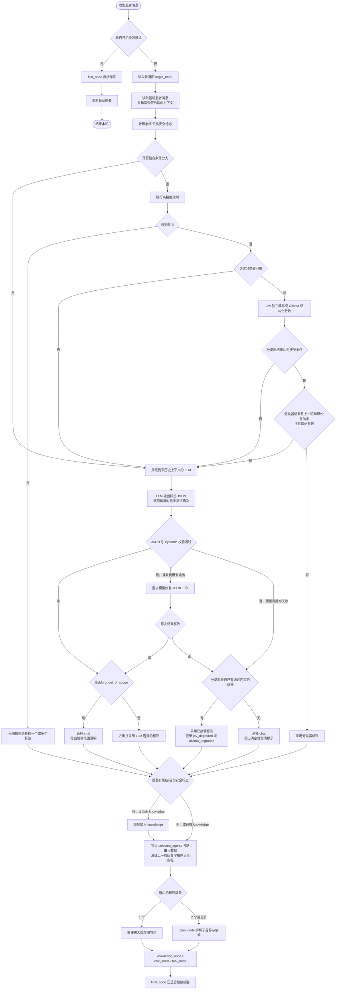
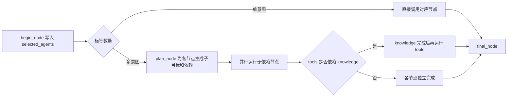

# 意图识别流程图

本文按当前代码整理正常对话模式下的意图识别与分发流程。意图识别由 Python `begin_node` 完成；它只选择内部处理节点，不直接回答患者。

## 意图标签

| 标签 | 处理内容 | 图节点 |
| --- | --- | --- |
| `knowledge` | 症状、疾病、用药、护理等医疗知识；急症安全提示 | `knowledge_node` |
| `chat` | 寒暄、闲聊、情绪交流，以及楼层、营业时间、就诊须知等静态院务 | `chat_node` |
| `tools` | 本院科室目录、号源、排班、本人预约、挂号/退号和明确的偏好记忆操作 | `tool_node` |

标签可以多选。例如“感冒了该看哪科”会同时需要 `knowledge` 与 `tools`；只问“儿科在几楼”属于 `chat`。

## 总体流程



快速模式使用独立的 `fast_graph`，直接运行 `fast_node`，跳过意图路由和规划。

## 级联判定

### 高精度规则

规则先处理能确定分类的表达，覆盖紧急安全信号、明确医疗问题、院内业务操作、科室目录/推荐、身份自述、寒暄、当前时间问题和部分静态院务。匹配成功就直接接受规则标签，不再调用 Jev 或 Ollama；安全信号会让规则结果包含 `knowledge`。

### Jev / Ollama 多标签分类器

没有规则命中时，读取 `INTENT_BACKEND`，只允许 `jev`（默认）和 `ollama`。条件分支在规则前直接升级到带上下文的 LLM。sklearn 分类器、TF-IDF 训练逻辑和 Ollama 的旧模型校验器已经移除；`app/intent/data/training.jsonl` 仅作为后续校准可用的标注样本保留，运行时不加载。

Jev 调用 `POST https://tokendance.space/gateway/typesafe/v1/systemone`，模型 ID 为 `bocha-jev-v1`。请求包含 `model`、`state.patient_message` 和五个独立的 `noul` 问题：三个意图标签，以及 `out_of_scope`、`uncertain`。响应从 `answers.<问题名>.noul` 读取概率；不使用 Chat Completions。协议见 [TokenDance Jev 协议文档](https://tokendance.space/docs/protocol-typesafe-systemone) 和 [实时模型目录](https://tokendance.space/gateway/v1/models)。

- 三个标签按 `p >= 0.5` 独立选择，允许同时命中。
- 域外或不确定概率达到 0.5，或者无标签选中时，升级 LLM。
- 每个问题的二元决策置信度 `max(p, 1-p)` 都必须达到 `INTENT_JEV_ACCEPTANCE_THRESHOLD`（默认 0.70）。例如一个标签 0.95、另一个 0.49，仍要升级，避免遗漏第二个意图。
- 不比较 Jev 的标签排名差值；两个标签同时高概率可以是合理的多意图。
- key 留空（含纯空白）时不发 Jev 请求，先回退到 Ollama；Ollama 不可用或结果不确定时再升级 LLM。已配置 key 的 Jev 请求遇到超时、401/402/429/5xx、无效 JSON、缺失答案或非法概率时仍升级原有 LLM，不自动重试。
- 阈值是初始配置，尚需实际样本校准；模拟测试验证协议与分支，不证明线上分类准确率。

Ollama 的本地模型、OpenAI 兼容接口和结构化输出校验保留。标签选择阈值仍为 0.5；最高分接受阈值默认 0.70，单标签歧义间隔默认 0.15。其自评分是启发式，不能视为校准概率。

两个分类器都只读取最新一句。若上一轮 `knowledge` 或 `tools` 回复以问号结尾，分类器结果会升级给能读取上下文的 LLM。规则已经明确命中的结果不受这个追问判断影响。分类器给出的域外判断只触发升级，最终拒绝由 LLM 判定。

### 配置与切换

在 `ai-python/.env` 中填写并重启服务：

```dotenv
INTENT_BACKEND=jev
TOKENDANCE_API_KEY=
INTENT_JEV_BASE_URL=https://tokendance.space/gateway/typesafe/v1
INTENT_JEV_MODEL=bocha-jev-v1
INTENT_JEV_TIMEOUT_SECONDS=10
INTENT_JEV_ACCEPTANCE_THRESHOLD=0.70
```

需要使用本地模型时，只需把 `INTENT_BACKEND` 改为 `ollama`，保留现有 `INTENT_OLLAMA_*` 配置并确保服务可达。旧的 `INTENT_LOCAL_BACKEND`、`INTENT_LIGHTWEIGHT_ENABLED`、`INTENT_OLLAMA_SKLEARN_GUARD` 及 sklearn 阈值不再使用。Jev key 留空时自动回退到 Ollama；已配置 key 后的 Jev 调用失败仍遵循既有 LLM 升级路径。

路由阶段包含 `rules`、`jev_model`、`ollama_model`、`llm` 及降级阶段。指标 `localCoverage` 仅统计规则与 Ollama；新增 `cascadeCoverage` 统计规则、Jev 与 Ollama 的直接接受比例，以免把 Jev 云端调用算成本地推理。

## LLM 与降级处理

LLM 读取受限的路由上下文，按患者最新消息输出 `selected_agents` 和 `out_of_scope`。历史消息仅用于补全省略和指代，不把旧意图重复计入本轮。

- 模型调用遇到异常时，原请求最多调用两次。
- 返回内容无法通过 JSON/Pydantic 校验时，尝试修复一次；修复后仍无效则降级。
- LLM 不可用或输出无效时，仅可复用分类器已经通过门槛、因追问而升级的标签，记为 `jev_degraded` 或 `ollama_degraded`。未通过质量门槛的标签不用于兜底。
- 没有本地候选标签时，选择 `chat` 并返回固定澄清文案。
- 有效结果若标记 `out_of_scope=true`，则选择 `chat` 并返回服务范围说明。
- 最终安全覆盖会检查急症/自伤标志；若标签中没有 `knowledge`，就强制补入该标签。

## 多意图分发



当前图只声明了 `tools → knowledge` 依赖；多意图规划失败时，已选节点会退回并行处理。最终分发后进入 `final_node` 汇总结果。

## 实现位置

- 规则与安全信号：[`ai-python/app/intent/rules.py`](../ai-python/app/intent/rules.py)
- 级联路由：[`ai-python/app/intent/cascade.py`](../ai-python/app/intent/cascade.py)
- Jev / Ollama 分类器及阈值：[`jev_classifier.py`](../ai-python/app/intent/jev_classifier.py)、[`ollama_classifier.py`](../ai-python/app/intent/ollama_classifier.py)、[`ai-python/app/core/config.py`](../ai-python/app/core/config.py)
- LLM 路由、追问升级、降级和回合状态：[`ai-python/app/graphs/hospital/nodes/begin.py`](../ai-python/app/graphs/hospital/nodes/begin.py)
- 图分发与多意图规划：[`ai-python/app/graphs/hospital/graphs.py`](../ai-python/app/graphs/hospital/graphs.py)、[`ai-python/app/graphs/hospital/nodes/plan.py`](../ai-python/app/graphs/hospital/nodes/plan.py)
