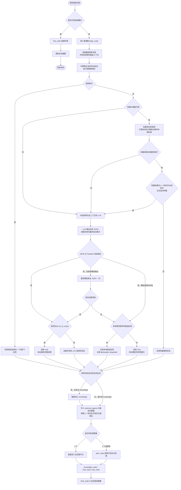
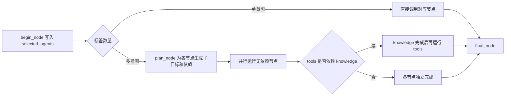

# 意图识别流程图

本文按当前代码整理正常对话模式下的意图识别与分发流程。意图识别由 Python `begin_node` 完成；它只选择内部处理节点，不直接回答患者。

## 意图标签

| 标签 | 处理内容 | 图节点 |
| --- | --- | --- |
| `knowledge` | 症状、疾病、用药、护理等医疗知识；急症安全提示 | `knowledge_node` |
| `chat` | 寒暄、闲聊、情绪交流，以及楼层、营业时间、就诊须知等静态院务 | `chat_node` |
| `tools` | 本院科室目录、号源、排班、本人预约、挂号/退号和明确的偏好记忆操作 | `tool_node` |

标签可以多选。例如“感冒了该看哪科”会同时需要 `knowledge` 与 `tools`；只问“儿科在几楼”属于 `chat`。

## 总体流程

快速模式使用独立的 `fast_graph`，直接运行 `fast_node`，跳过意图路由和规划。

## 本地级联判定

### 高精度规则

规则先处理能确定分类的表达，覆盖紧急安全信号、明确医疗问题、院内业务操作、科室目录/推荐、身份自述、寒暄、当前时间问题和部分静态院务。匹配成功就直接接受规则标签，不再调用轻量模型；安全信号会让规则结果包含 `knowledge`。

### 轻量多标签分类器

没有规则命中时，系统尝试字符 n-gram TF-IDF + One-vs-Rest Logistic Regression。分类器不可用时直接升级到 LLM。默认接受阈值来自 `ai-python/.env.example`，运行时可通过环境变量调整：

| 判断 | 默认值 | 未满足时 |
| --- | ---: | --- |
| 标签分数阈值 `INTENT_LABEL_THRESHOLD` | 0.50 | 未选中任何标签时升级 |
| Top-1 接受阈值 `INTENT_ACCEPTANCE_THRESHOLD` | 0.60 | Top-1 分数过低时升级 |
| 单标签歧义间隔 `INTENT_AMBIGUITY_MARGIN` | 0.12 | 只选出一个标签且 Top-1/Top-2 差距过小时升级 |
| 域外相似度阈值 `INTENT_OOD_SIMILARITY_THRESHOLD` | 0.08 | 与训练样本过于不同则升级 |

轻量层的“域外”判断只会触发升级，不会直接拒绝用户请求；最终 `out_of_scope` 由 LLM 路由结果判定。多标签预测选中两个或更多标签时，不使用“单标签歧义间隔”这一升级条件。

轻量模型只看最新一句。如果上一轮选中 `knowledge` 或 `tools`，且相应回复以问号结尾，表示助手可能在追问参数；此时轻量结果会升级给能读取短期上下文的 LLM。高精度规则已经明确命中的结果不经过这个追问升级判断。

## LLM 与降级处理

LLM 读取受限的路由上下文，按患者最新消息输出 `selected_agents` 和 `out_of_scope`。历史消息仅用于补全省略和指代，不把旧意图重复计入本轮。

- 模型调用遇到异常时，原请求最多调用两次。
- 返回内容无法通过 JSON/Pydantic 校验时，尝试修复一次；修复后仍无效则降级。
- LLM 不可用或输出无效时，如果本地层有候选标签，就采用本地候选结果，并记为 `lightweight_degraded`。
- 没有本地候选标签时，选择 `chat` 并返回固定澄清文案。
- 有效结果若标记 `out_of_scope=true`，则选择 `chat` 并返回服务范围说明。
- 最终安全覆盖会检查急症/自伤标志；若标签中没有 `knowledge`，就强制补入该标签。

## 多意图分发

当前图只声明了 `tools → knowledge` 依赖；多意图规划失败时，已选节点会退回并行处理。最终分发后进入 `final_node` 汇总结果。

## 实现位置

- 规则与安全信号：[`ai-python/app/intent/rules.py`](../ai-python/app/intent/rules.py)
- 本地级联：[`ai-python/app/intent/cascade.py`](../ai-python/app/intent/cascade.py)
- 轻量分类器及阈值：[`ai-python/app/intent/classifier.py`](../ai-python/app/intent/classifier.py)、[`ai-python/app/core/config.py`](../ai-python/app/core/config.py)
- LLM 路由、追问升级、降级和回合状态：[`ai-python/app/graphs/hospital/nodes/begin.py`](../ai-python/app/graphs/hospital/nodes/begin.py)
- 图分发与多意图规划：[`ai-python/app/graphs/hospital/graphs.py`](../ai-python/app/graphs/hospital/graphs.py)、[`ai-python/app/graphs/hospital/nodes/plan.py`](../ai-python/app/graphs/hospital/nodes/plan.py)
