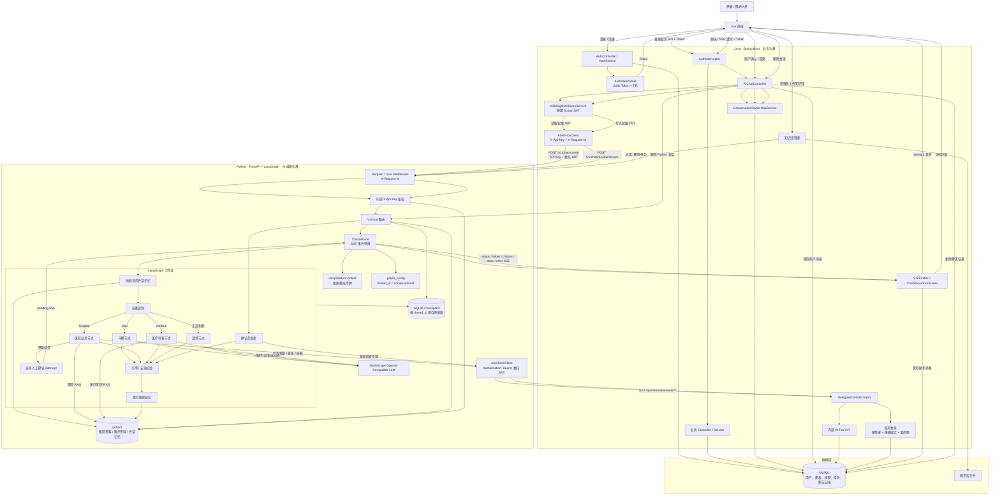

# 在线医院 AI 项目：求职评估与流程图

> 项目定位：个人求职作品，不宣称为生产级医院系统。

## 1. 项目定位与面试表达

推荐表述：

> 这是一个面向医院患者端的 AI 辅助服务原型。Java 保留业务和权限边界，Python
> 负责受控 AI 编排；项目重点是会话归属、最小权限、人工确认、RAG 引用，以及
> Java 与 Python 的跨服务联调与可观测性。

不要表述为“可直接用于真实医院生产环境”。本项目未实现生产所需的多实例登录态、
限流、审计、灾备、监控告警和合规流程。

## 2. 当前项目是否适合实习求职

结论：**适合用作有一定技术深度的实习求职项目**。

它不只是“前端调用大模型 API”，而是包含以下可以在面试中展开的设计：

- Vue、Spring Boot、FastAPI、MySQL、Qdrant、LangGraph 的完整链路。
- Java 管理登录、用户身份、会话归属和核心业务写操作。
- Python 仅承担 AI 工作流、RAG 和 SSE，不直接绕过 Java 操作业务数据库。
- Java 签发短期、限权的委托 JWT；Python 调 Java 内部 Tool API 时只能使用这些权限。
- 挂号采用人工确认 interrupt，并通过幂等键、患者绑定和排班锁避免重复创建。
- 对话使用 `conversationId` 作为 LangGraph `thread_id`，支持 checkpoint 和恢复。
- 跨服务 `X-Request-Id` 追踪、敏感请求头脱敏、Java/Python 自动化测试。

## 3. 已具备的工程亮点

### Java 侧

- DTO、VO、Controller、Service、Repository/Mapper 分层明确。
- 统一认证拦截器、全局异常处理、输入校验。
- 用户会话归属校验，避免跨用户访问 AI 会话。
- Java 负责签发委托令牌；Tool API 校验 audience、过期时间、scope 和患者绑定。
- Java 负责 SSE 向浏览器转发，并保存用户和助手消息。

### Python 侧

- FastAPI 使用 `lifespan` 创建和关闭应用级 `ChatService`。
- 路由通过依赖注入取得服务，不使用模块级聊天服务单例。
- LangGraph 使用明确的 `StateGraph`，适合挂号这种固定步骤加人工确认的流程。
- `State`、`Config`、`Runtime Context` 分开：
  - `State`：消息、意图、引用等可保存的会话数据。
  - `Config`：只有 `thread_id`，也就是 `conversationId`。
  - `Runtime Context`：短期委托令牌，只用于当前调用，不进入 checkpoint。
- 医院信息、医疗科普、会话记忆使用隔离的向量集合。

## 4. 当前缺点与改进优先级

### P1：应在继续完善时优先处理

1. **登录态仍是单机内存 Token。**

   Token 虽已具备 TTL，但重启后失效，且无法支持多实例部署。求职项目可以保留，
   但应在 README 或面试中明确这是单机演示取舍。后续可迁移到 Redis Session 或 JWT。

2. **Java 与 Python 的接口契约是手写维护的。**

   Java DTO 与 Python Pydantic Model 字段变更时，可能“各自编译通过、联调失败”。
   后续可补 OpenAPI 契约校验、Schema 测试或接口文档生成。

3. **Python 的引用校验不是事实验证。**

   当前规则可以降低无引用和错误引用风险，但不能证明模型回答一定正确。不要在面试中
   把它描述为“医疗级事实核验”。正确说法是“基于规则的引用一致性校验与保守降级”。

### P2：实习项目可作为下一阶段完善方向

1. **`AiChatController` 职责偏重。**

   它同时处理会话归属、消息落库、令牌签发、SSE 转发和异常。后续可拆出
   `ConversationService`、`AiStreamService` 和 `AiGatewayService`。

2. **SSE 使用公共线程池。**

   `CompletableFuture.runAsync()` 对演示足够，但没有独立线程池、任务取消、背压和
   并发保护。后续可引入命名线程池与超时策略。

3. **checkpoint 保护层有 LangGraph 内部耦合。**

   当前通过包装 saver 避免令牌被持久化，安全目标正确；但升级 LangGraph 时，应优先
   回归 checkpoint、interrupt 和恢复流程。

4. **缺少完整 Docker E2E 自动化测试。**

   当前已有 Java 和 Python 单元/集成测试，但尚未验证真实容器中的 MySQL、Qdrant、
   Java 和 Python 一起启动后的全链路。

5. **缺少限流和模型成本保护。**

   应增加聊天输入大小限制、单用户频率限制、最大并发数与单次流式时长限制。

6. **依赖未锁定版本。**

   `pyproject.toml` 目前未配套 lock 文件。后续可以使用 `uv.lock` 或固定依赖版本，
   以确保演示环境可复现。

## 5. 不建议在面试中夸大的能力

- 不要说“这是生产级医院系统”。
- 不要说“AI 能诊断疾病”或“AI 结论一定正确”。
- 不要说“RAG 已经完全解决幻觉”。
- 不要说“系统支持高并发”，除非补充压测结果。
- 不要说“系统已经满足医疗合规要求”。

## 6. 完整业务流程图

## 7. 当前验证状态

- Java 自动化测试：61 项通过。
- Python 自动化测试：83 项通过。
- Python 的 `langgraph.json` 已通过 JSON 校验，并能构建 `CompiledStateGraph`。
