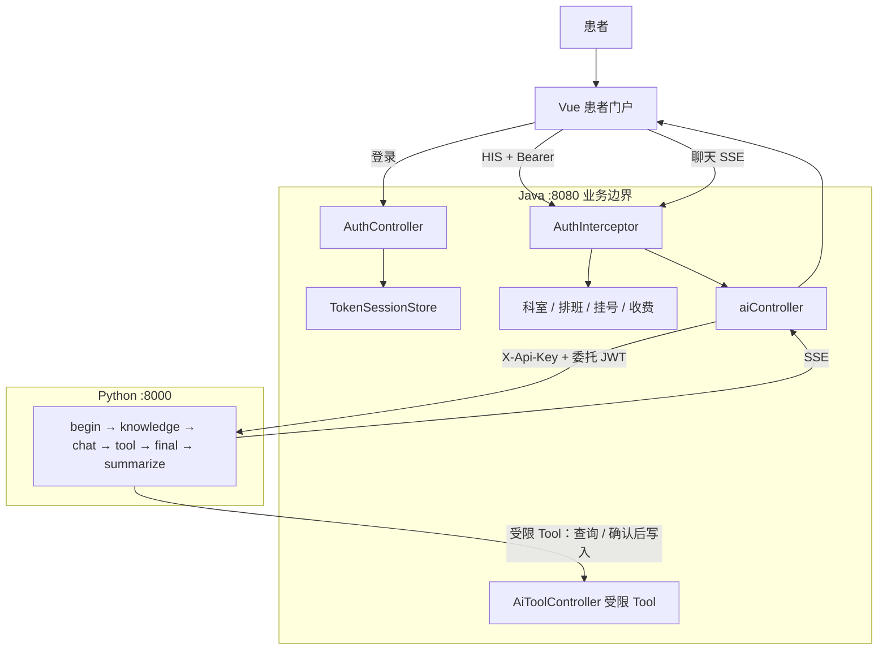

# 在线医院 AI 项目：求职评估与流程图

> 项目定位：个人求职作品，不宣称为生产级医院系统。

## 1. 项目定位与面试表达

推荐表述：

> 这是一个面向医院患者端的 AI 辅助服务原型。Java 保留业务和权限边界，Python
> 负责受控 AI 编排；项目重点是会话归属、最小权限、人工确认、RAG 引用，以及
> Java 与 Python 的跨服务联调与可观测性。

不要表述为“可直接用于真实医院生产环境”。本项目仍缺生产级限流、集中告警、完整审计、
灾备演练、真实多实例 E2E/压测和医疗合规流程。

## 2. 当前项目是否适合实习求职

结论：**适合用作有一定技术深度的实习求职项目**。

它不只是“前端调用大模型 API”，而是包含以下可以在面试中展开的设计：

- Vue、Spring Boot、FastAPI、MySQL、Qdrant、LangGraph 的完整链路。
- Java 管理登录、用户身份、会话归属和核心业务写操作。
- Python 仅承担 AI 工作流、RAG 和 SSE，不直接绕过 Java 操作业务数据库。
- Java 签发短期、限权的委托 JWT；Python 调 Java 内部 Tool API 时只能使用这些权限。
- Tool 支持受限的科室、医生、排班与本人挂号查询；挂号、退号写操作必须经过患者确认、委托权限和既有业务校验，不能由模型直接提交。
- 对话使用 `user:{verifiedUserId}:conversation:{conversationId}` 作为 LangGraph `thread_id`，支持 checkpoint、跨用户隔离和 MySQL 历史恢复。
- 跨服务 `X-Request-Id` 追踪、敏感请求头脱敏、Java/Python 自动化测试。

## 3. 可直接写入简历的 AI 模块亮点

以下内容以当前代码实现为准，可按篇幅选择其中 3～5 条；应保留“患者端 AI 辅助服务/原型”的项目定位，不把它描述成诊断或生产医疗系统。

**项目描述（简历一行版）**：设计并实现在线医院患者端 AI 助手，基于 LangGraph 编排 RAG、联网检索和受限业务工具；通过 Java 网关、短期委托 JWT、人工确认与 SSE 幂等机制，支持可追踪、可恢复的流式多轮对话。

- **多意图智能编排：** 使用 LangGraph 将一次提问路由为医疗知识、院内业务和闲聊等意图；互不依赖的节点并行执行，再由汇总节点合并答案。对模型路由结果使用 Pydantic JSON 校验、一次修复和保守降级，降低结构化输出异常对主流程的影响。
- **分层 RAG 与可追溯回答：** 以 MySQL 管理文档版本、checksum、有效期和同步状态，以 Qdrant 作为可重建索引；支持幂等发布、重建、停用、删除、双层有效期过滤和提示注入扫描，引用携带 document/version/page/chunk/update 信息，未命中再受控降级到网页检索。
- **可恢复的对话记忆：** 以已验证用户 ID 与 `conversationId` 组合成隔离 thread key，接入 Redis checkpointer 保存跨轮状态；Context Builder 按 token 预算组装结构化摘要、最近消息和相关长期偏好，checkpoint miss 时从 MySQL 有限历史恢复。
- **安全的 AI 工具调用：** 采用 Java 管理身份和业务边界、Python 只负责 AI 编排的双服务架构；Java 为每轮请求签发含用户、患者、scope、过期时间的短期委托 JWT，Python 调用内部 Tool API 时由 Java 二次校验权限和患者归属，避免模型直接访问数据库或任意执行查询。
- **人机协同的业务写操作：** 将挂号、退号封装为受限工具，写操作先通过 LangGraph `interrupt` 暂停并向前端发送确认卡片；患者确认后由 `/resume` 恢复同一会话，并复用后端号源校验、患者归属、事务与幂等逻辑，防止模型直接提交高风险操作。
- **可靠的流式交互：** 实现 Vue → Spring Boot → FastAPI 的 SSE 流式链路，前端将运行态按用户隔离并支持跨页面保持、主动停止和确认恢复；后端用 `clientRequestId` 加数据库唯一约束保证消息幂等，网络重试可复用已完成回复，避免重复落库和重复生成。
- **性能与可观测性设计：** 提供快速模式，将常规的“意图路由 + RAG/工具 + 汇总”图替换为单 Agent 的有限轮工具循环；Java/Python 贯通 `X-Request-Id`，上下文 trace 记录哈希 thread、来源 token、召回/工具、首 token、总耗时和版本且不记录患者原文，并提供 60 条确定性 context eval 与 CI 安全阻断。

**面试展开重点：** 优先讲“为什么不能让大模型直连数据库”“为什么写操作需要人工确认和幂等”“RAG 命中与未命中的降级策略”“SSE 断连/重试如何避免重复消息”四个问题；这些比泛泛介绍调用模型 API 更能体现工程能力。

## 4. 已具备的工程亮点

### Java 侧

- DTO、VO、Controller、Service、Repository/Mapper 分层明确。
- 统一认证拦截器、全局异常处理、输入校验。
- 用户会话归属校验，避免跨用户访问 AI 会话。
- Java 负责签发委托令牌；Tool API 校验 audience、过期时间、scope 和患者绑定。
- Java 负责 SSE 向浏览器转发，并保存用户和助手消息。

### Python 侧

- FastAPI 使用 `lifespan` 创建和关闭应用级 `ChatService`。
- 路由通过依赖注入取得服务，不使用模块级聊天服务单例。
- LangGraph 使用明确的 `StateGraph`，适合挂号这种固定步骤加人工确认的流程。
- `State`、`Config`、`Runtime Context` 分开：
  - `State`：消息、意图、引用等可保存的会话数据。
  - `Config`：包含用户作用域后的 `thread_id`，不是裸 `conversationId`。
  - `Runtime Context`：短期委托令牌，只用于当前调用，不进入 checkpoint。
- RAG 文档元数据由 MySQL 管理，Qdrant 只保存可重建的医院资料向量；患者偏好长期记忆不进入 Qdrant。

## 5. 当前缺点与改进优先级

### P1：应在继续完善时优先处理

1. **Redis Session 尚缺真实多实例验证。**

   Java 已可将登录 Session 放入 Redis db1，并保留内存降级实现；但尚无多实例 E2E、
   Redis 故障切换与会话迁移演练，不能直接宣称已验证水平扩展。

2. **Java 与 Python 的接口契约是手写维护的。**

   Java DTO 与 Python Pydantic Model 字段变更时，可能“各自编译通过、联调失败”。
   后续可补 OpenAPI 契约校验、Schema 测试或接口文档生成。

3. **Python 的引用校验不是事实验证。**

   当前规则可以降低无引用和错误引用风险，但不能证明模型回答一定正确。不要在面试中
   把它描述为“医疗级事实核验”。正确说法是“基于规则的引用一致性校验与保守降级”。

### P2：实习项目可作为下一阶段完善方向

1. **`AiChatController` 职责偏重。**

   它同时处理会话归属、消息落库、令牌签发、SSE 转发和异常。后续可拆出
   `ConversationService`、`AiStreamService` 和 `AiGatewayService`。

2. **SSE 使用公共线程池。**

   `CompletableFuture.runAsync()` 对演示足够，但没有独立线程池、任务取消、背压和
   并发保护。后续可引入命名线程池与超时策略。

3. **checkpoint 与恢复路径依赖 LangGraph/Redis 版本。**

   委托令牌通过 Runtime Context 隔离而不写入 State；但升级 LangGraph 或 Redis saver 时，
   仍应优先回归 checkpoint、并发锁、interrupt、checkpoint miss 重建和恢复流程。

4. **缺少完整 Docker E2E 自动化测试。**

   当前已有 Java 和 Python 单元/集成测试，但尚未验证真实容器中的 MySQL、Qdrant、
   Java 和 Python 一起启动后的全链路。

5. **缺少限流和模型成本保护。**

   应增加聊天输入大小限制、单用户频率限制、最大并发数与单次流式时长限制。

6. **依赖未锁定版本。**

   `pyproject.toml` 目前未配套 lock 文件。后续可以使用 `uv.lock` 或固定依赖版本，
   以确保演示环境可复现。

## 6. 不建议在面试中夸大的能力

- 不要说“这是生产级医院系统”。
- 不要说“AI 能诊断疾病”或“AI 结论一定正确”。
- 不要说“RAG 已经完全解决幻觉”。
- 不要说“系统支持高并发”，除非补充压测结果。
- 不要说“系统已经满足医疗合规要求”。

## 7. 完整业务流程图

当前实现骨架见 [`项目流程骨架.md`](项目流程骨架.md)。下文只保留与代码一致的总图；旧版 `hospital / medical / clarify` 命名已废弃，当前写操作通过 `interrupt` 等待患者确认后再恢复执行。

## 8. 当前验证状态

- Java 自动化测试：61 项通过。
- Python 自动化测试：83 项通过。
- Python 的 `langgraph.json` 已通过 JSON 校验，并能构建 `CompiledStateGraph`。
