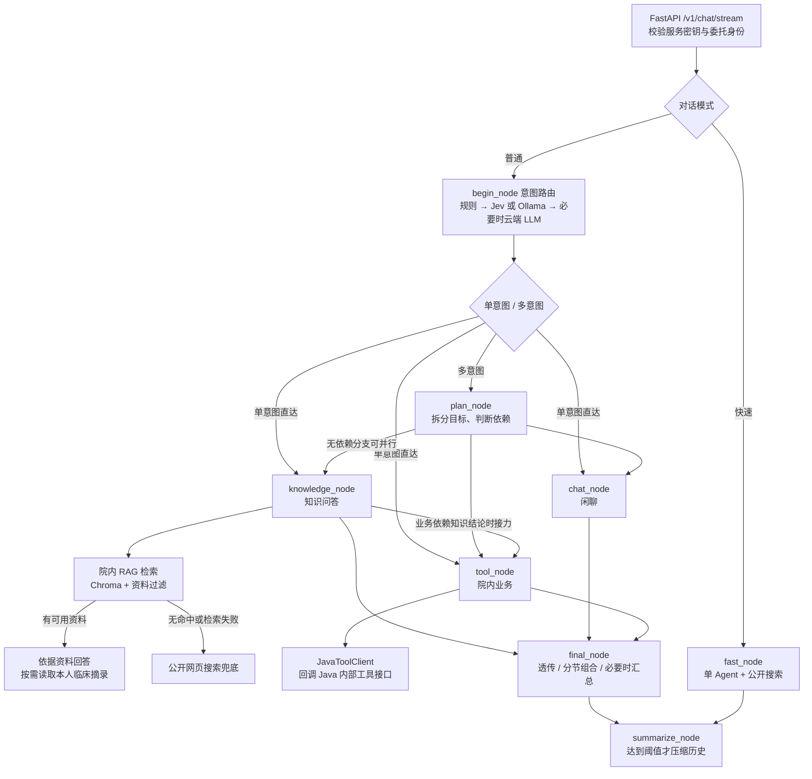
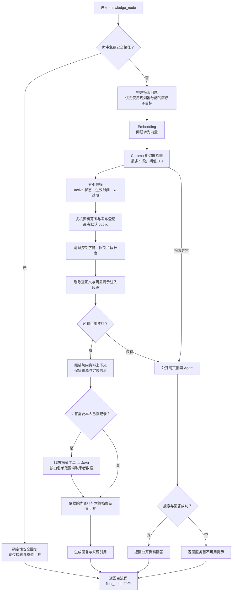
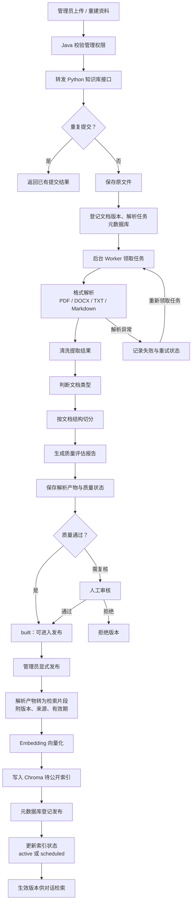
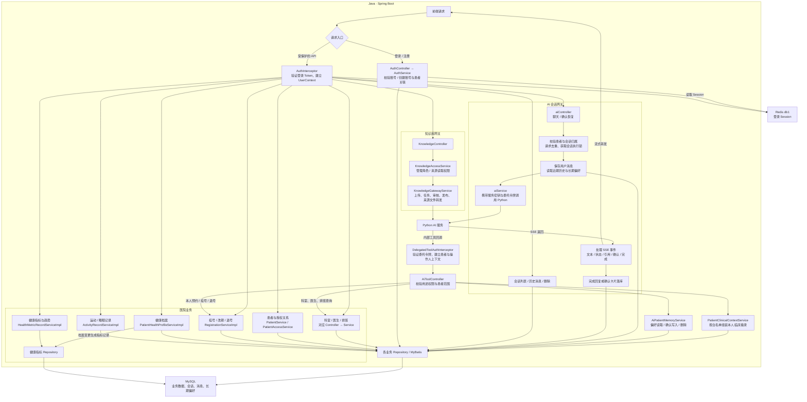
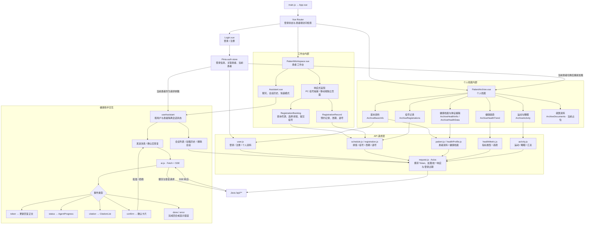
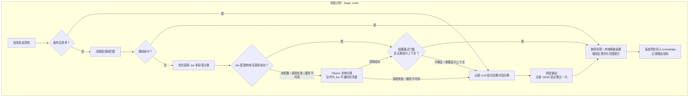

# 项目流程图

## 1. AI 模块总览

```mermaid
flowchart TB
  Entry["FastAPI /v1/chat/stream<br/>校验服务密钥与委托身份"]
  Mode{"对话模式"}
  Entry --> Mode

  Mode -->|"普通"| Begin["begin_node 意图路由<br/>规则 → Jev 或 Ollama → 必要时云端 LLM"]
  Begin --> Dispatch{"单意图 / 多意图"}
  Dispatch -->|"多意图"| Plan["plan_node<br/>拆分目标、判断依赖"]
  Dispatch -->|"单意图直达"| K["knowledge_node<br/>知识问答"]
  Dispatch -->|"单意图直达"| C["chat_node<br/>闲聊"]
  Dispatch -->|"单意图直达"| T["tool_node<br/>院内业务"]

  Plan -->|"无依赖分支可并行"| K
  Plan --> C
  Plan --> T
  K -->|"业务依赖知识结论时接力"| T

  K --> RAG["院内 RAG 检索<br/>Chroma + 资料过滤"]
  RAG -->|"有可用资料"| Answer["依据资料回答<br/>按需读取本人临床摘录"]
  RAG -->|"无命中或检索失败"| Web["公开网页搜索兜底"]

  T --> Callback["JavaToolClient<br/>回调 Java 内部工具接口"]
  K --> Final["final_node<br/>透传 / 分节组合 / 必要时汇总"]
  C --> Final
  T --> Final
  Final --> Summary["summarize_node<br/>达到阈值才压缩历史"]

  Mode -->|"快速"| Fast["fast_node<br/>单 Agent + 公开搜索"]
  Fast --> Summary
```

## 2. RAG 系统：检索与回答

```mermaid
flowchart TB
  K["进入 knowledge_node"]
  K --> Urgent{"命中急症安全路径？"}
  Urgent -->|"是"| Fixed["确定性安全回复<br/>跳过检索与模型回答"]
  Urgent -->|"否"| Query["构建检索问题<br/>优先使用规划器分配的医疗子目标"]
  Query --> Embedding["Embedding<br/>问题转为向量"]
  Embedding --> Search["Chroma 相似度检索<br/>最多 5 段，阈值 0.8"]

  Search --> PreFilter["索引预筛<br/>active 状态、生效时间、未过期"]
  PreFilter --> Authority["复核资料范围与发布登记<br/>患者默认 public"]
  Authority --> Clean["清理控制字符、限制片段长度"]
  Clean --> Injection["剔除空正文与明显提示注入片段"]
  Injection --> Available{"还有可用资料？"}

  Available -->|"有"| Context["组装院内资料上下文<br/>保留来源与定位信息"]
  Context --> Clinical{"回答需要本人已存记录？"}
  Clinical -->|"是"| Java["临床摘录工具 → Java<br/>按白名单范围读取患者数据"]
  Java --> Answer["依据院内资料与本轮档案结果回答"]
  Clinical -->|"否"| Answer
  Answer --> Sources["生成回复与来源引用"]

  Search -->|"检索异常"| Web["公开网页搜索 Agent"]
  Available -->|"没有"| Web
  Web --> WebOK{"搜索与回答成功？"}
  WebOK -->|"是"| WebReply["返回公开资料回答"]
  WebOK -->|"否"| Unavailable["返回服务暂不可用提示"]

  Fixed --> Output["返回主流程<br/>final_node 汇合"]
  Sources --> Output
  WebReply --> Output
  Unavailable --> Output
```

## 3. RAG 系统：知识库补充

```mermaid
flowchart TB
  Upload["管理员上传 / 重建资料"]
  Upload --> JavaAuth["Java 校验管理权限"]
  JavaAuth --> Python["转发 Python 知识库接口"]
  Python --> Dedup{"重复提交？"}
  Dedup -->|"是"| Existing["返回已有提交结果"]
  Dedup -->|"否"| Store["保存原文件"]
  Store --> Register["登记文档版本、解析任务<br/>元数据库"]
  Register --> Worker["后台 Worker 领取任务"]
  Worker --> Parse["格式解析<br/>PDF / DOCX / TXT / Markdown"]
  Parse --> Clean["清洗提取结果"]
  Clean --> Classify["判断文档类型"]
  Classify --> Chunk["按文档结构切分"]
  Chunk --> Quality["生成质量评估报告"]
  Quality --> Artifact["保存解析产物与质量状态"]

  Artifact --> Pass{"质量通过？"}
  Pass -->|"是"| Ready["built：可进入发布"]
  Pass -->|"需复核"| Review["人工审核"]
  Review -->|"通过"| Ready
  Review -->|"拒绝"| Rejected["拒绝版本"]

  Ready --> Publish["管理员显式发布"]
  Publish --> Documents["解析产物转为检索片段<br/>附版本、来源、有效期"]
  Documents --> Embed["Embedding 向量化"]
  Embed --> Index["写入 Chroma 待公开索引"]
  Index --> Commit["元数据库登记发布"]
  Commit --> Visible["更新索引状态<br/>active 或 scheduled"]
  Visible --> Retrieval["生效版本供对话检索"]

  Parse -->|"解析异常"| Failure["记录失败与重试状态"]
  Failure -->|"重新领取任务"| Worker
```

## 4. Java 业务流程

```mermaid
flowchart TB
  Browser["前端请求"]
  Python["Python AI 服务"]

  subgraph Java["Java · Spring Boot"]
    Routes{"请求入口"}

    Browser --> Routes
    Routes -->|"登录 / 注册"| Auth["AuthController → AuthService<br/>校验账号 / 创建账号与患者关联"]
    Routes -->|"受保护的 API"| LoginCheck["AuthInterceptor<br/>验证登录 Token，建立 UserContext"]

    Python -->|"内部工具回调"| Delegate["DelegatedToolAuthInterceptor<br/>验证委托令牌，建立患者与操作人上下文"]
    Delegate --> Tools["AiToolController<br/>校验用途权限与患者范围"]

    subgraph Business["医院业务"]
      Catalog["科室 / 医生 / 排班<br/>对应 Controller → Service"]
      Patient["患者与授权关系<br/>PatientService / PatientAccessService"]
      Registration["挂号 / 改期 / 退号<br/>RegistrationServiceImpl"]
      Profile["健康档案<br/>PatientHealthProfileServiceImpl"]
      Metrics["健康指标与趋势<br/>HealthMetricRecordServiceImpl"]
      Activity["运动 / 睡眠记录<br/>ActivityRecordServiceImpl"]

      Profile -->|"档案变更生成指标记录"| MetricRepo["健康指标 Repository"]
    end

    LoginCheck --> Catalog
    LoginCheck --> Patient
    LoginCheck --> Registration
    LoginCheck --> Profile
    LoginCheck --> Metrics
    LoginCheck --> Activity

    subgraph AI["AI 会话网关"]
      Chat["aiController<br/>聊天 / 确认恢复"]
      Prepare["校验患者与会话归属<br/>请求去重、获取会话执行锁"]
      Context["保存用户消息<br/>读取近期历史与长期偏好"]
      Forward["aiService<br/>携带服务密钥与委托令牌调用 Python"]
      Events["处理 SSE 事件<br/>文本 / 状态 / 引用 / 确认 / 完成"]
      Persist["完成回复或确认卡片落库"]
      History["会话列表 / 历史消息 / 删除"]

      Chat --> Prepare --> Context --> Forward
      Events --> Persist
    end

    LoginCheck --> Chat
    LoginCheck --> History
    Forward --> Python
    Python -->|"SSE 返回"| Events
    Events -->|"流式转发"| Browser

    Tools -->|"科室、医生、排班查询"| Catalog
    Tools -->|"本人预约 / 挂号 / 退号"| Registration
    Tools --> Clinical["PatientClinicalContextService<br/>按白名单组装本人临床摘录"]
    Tools --> Memory["AiPatientMemoryService<br/>偏好读取 / 确认写入 / 删除"]

    subgraph Knowledge["知识库网关"]
      KnowledgeAPI["KnowledgeController"]
      KnowledgeAccess["KnowledgeAccessService<br/>管理角色 / 来源读取权限"]
      KnowledgeForward["KnowledgeGatewayService<br/>上传、任务、审核、发布、来源文件转发"]
      KnowledgeAPI --> KnowledgeAccess --> KnowledgeForward
    end

    LoginCheck --> KnowledgeAPI
    KnowledgeForward --> Python

    Repo["各业务 Repository / MyBatis"]
    Catalog --> Repo
    Patient --> Repo
    Registration --> Repo
    Profile --> Repo
    Metrics --> MetricRepo
    Activity --> Repo
    Clinical --> Repo
    Memory --> Repo
    Context --> Repo
    Persist --> Repo
    History --> Repo
  end

  Auth --> Session["Redis db1<br/>登录 Session"]
  LoginCheck -->|"读取 Session"| Session
  Auth --> Repo
  Repo --> DB["MySQL<br/>业务数据、会话、消息、长期偏好"]
  MetricRepo --> DB
```

## 5. 前端模块流程

```mermaid
flowchart TB
  Entry["main.js → App.vue"]
  Entry --> Router["Vue Router<br/>登录状态与患者端访问检查"]

  Router --> Login["Login.vue<br/>登录 / 注册"]
  Router --> Workspace["PatientWorkspace.vue<br/>患者工作台"]
  Router --> Archive["PatientArchive.vue<br/>个人档案"]

  subgraph Work["工作台内部"]
    Assistant["Assistant.vue<br/>聊天、会话历史、快速模式"]
    Booking["RegistrationBooking<br/>查询号源、选择排班、提交挂号"]
    Record["RegistrationRecord<br/>预约记录、改期、退号"]
    Layout["响应式呈现<br/>PC 挂号抽屉 / 移动端独立页面"]

    Workspace --> Assistant
    Workspace --> Layout
    Layout --> Booking
    Layout --> Record
  end

  subgraph AssistantFlow["健康助手交互"]
    Runtime["useAssistant<br/>按用户与患者隔离会话状态"]
    Send["发送消息 / 确认后恢复"]
    Stream["ai.js · Fetch + SSE"]
    Events{"事件类型"}
    Text["token → 更新回复正文"]
    Progress["status → AgentProgress"]
    Citation["citation → CitationList"]
    Confirm["confirm → 确认卡片"]
    Done["done / error<br/>完成回合或显示错误"]

    Assistant --> Runtime --> Send --> Stream
    Stream --> Events
    Events --> Text
    Events --> Progress
    Events --> Citation
    Events --> Confirm
    Events --> Done
    Confirm -->|"批准 / 拒绝"| Send
    Runtime --> History["会话列表 / 加载历史 / 删除会话"]
  end

  subgraph ArchiveFlow["个人档案内部"]
    Basic["基本资料<br/>ArchiveBasicInfo"]
    Health["健康档案与体征编辑<br/>ArchiveHealthInfo / ArchiveHealthData"]
    Trend["健康趋势<br/>ArchiveHealthTrend"]
    Activity["运动与睡眠<br/>ArchiveActivity"]
    Registrations["挂号记录<br/>ArchiveRegistrations"]
    Documents["就医资料<br/>ArchiveDocuments · 当前占位"]

    Archive --> Basic
    Archive --> Health
    Archive --> Trend
    Archive --> Activity
    Archive --> Registrations
    Archive --> Documents
  end

  Login --> Auth["Pinia auth store<br/>登录信息、关联患者、当前患者"]
  Auth -->|"当前患者作为请求参数"| Runtime
  Auth -->|"当前患者切换后重新加载"| Archive

  subgraph Requests["API 请求层"]
    UserAPI["user.js<br/>登录 / 注册 / 个人资料"]
    BookingAPI["schedule.js / registration.js<br/>排班 / 挂号 / 改期 / 退号"]
    PatientAPI["patient.js / healthProfile.js<br/>患者资料 / 健康档案"]
    MetricAPI["healthMetric.js<br/>指标类型 / 趋势"]
    ActivityAPI["activity.js<br/>运动 / 睡眠 / 汇总"]
    Axios["request.js · Axios<br/>携带 Token、处理统一响应与登录过期"]
  end

  Auth --> UserAPI
  Basic --> UserAPI
  Basic --> PatientAPI
  Health --> PatientAPI
  Booking --> BookingAPI
  Record --> BookingAPI
  Registrations --> BookingAPI
  Trend --> MetricAPI
  Activity --> ActivityAPI
  History --> Axios

  UserAPI --> Axios
  BookingAPI --> Axios
  PatientAPI --> Axios
  MetricAPI --> Axios
  ActivityAPI --> Axios

  Axios --> Java["Java /api/**"]
  Stream -->|"聊天与恢复请求"| Java
  Java -->|"SSE 响应"| Stream
```

## 6. 意图识别流程

```mermaid
flowchart TB
  subgraph Intent["意图识别 · begin_node"]
    Safety["检测急症风险"]
    Conditional{"条件式请求？"}
    Rules["高精度规则匹配"]
    RuleHit{"规则命中？"}
    Jev["优先调用 Jev 多标签分类"]
    JevAvailable{"Jev 配置有效且调用成功？"}
    Ollama["Ollama 本地分类<br/>仅作为 Jev 不通时的兜底"]
    Accept{"结果通过门槛<br/>且无需追问上下文？"}
    Cloud["云端 LLM 结合近期对话分类"]
    Validate["校验输出<br/>无效 JSON 尝试修正一次"]
    Result["取得标签 / 本地降级结果<br/>或固定澄清与范围提示"]
    Guard["急症风险补入 knowledge<br/>记录路由指标"]

    Safety --> Conditional
    Conditional -->|"是"| Cloud
    Conditional -->|"否"| Rules
    Rules --> RuleHit
    RuleHit -->|"是"| Result
    RuleHit -->|"否"| Jev

    Jev --> JevAvailable
    JevAvailable -->|"是"| Accept
    JevAvailable -->|"未配置 / 调用失败 / 服务不可用"| Ollama
    Ollama -->|"调用成功"| Accept
    Ollama -->|"调用失败 / 服务不可用"| Cloud

    Accept -->|"是"| Result
    Accept -->|"不确定 / 需要追问上下文"| Cloud
    Cloud --> Validate --> Result
    Result --> Guard
  end
```

## 7. 待补充流程

- [ ] Tool 工具调用流程图。
- [ ] 上下文管理与记忆功能（Context）流程图。
