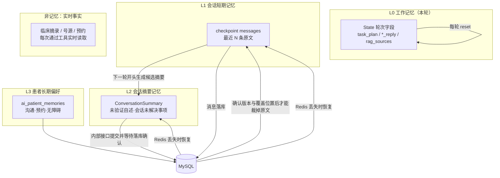
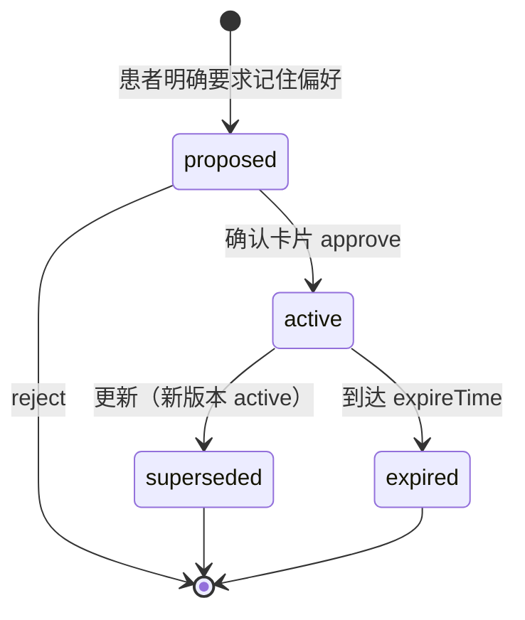

# 记忆功能、患者档案与上下文工程整合方案（已确认版）

> 基准：2026-10-03 工作区代码。
> 决策依据：2026-10-03 grilling 访谈，用户已确认最终清单并授权更新本计划。
> 范围：`ai-python/app/graphs/hospital/`（context_builder、memory、summarize、rehydration、state、tools/memory、knowledge）、`app/api/routes/chat.py`、`app/observability/context_metrics.py`，Java 会话与摘要持久化、`AiPatientMemoryService`、`PatientClinicalContextService` / `aiService`，前端助手与个人档案偏好入口。
> 原则：不新增基础设施（不引入向量记忆、不新增存储组件），在现有 MySQL + Redis + Context Builder 上收敛、修正、补测量。
> 本文件是实施计划；本次修订不代表相关代码、迁移或测试已完成。

---

## 1. 目标与非目标

### 目标

1. **正确性优先**：患者隔离；摘要失败不误删原文；已保存内容可恢复；每次模型调用受估算输入上限约束。先实现这些，再优化延迟和偏好界面。
2. 明确记忆各层与患者档案的权威来源、写入权限、作用域、失效方式和用途投影。
3. Redis 丢失后，以 MySQL 摘要及其覆盖位置恢复，**分批补齐全部未覆盖消息**，不局限于最近 24 条。
4. 普通医疗流程在确需个性化回答时自动读取必要的现有患者档案，结合可靠资料解释相关因素和信息缺口；身高、体重等继续由档案提供，不复制到长期偏好。
5. 患者可查看、编辑已保存的长期偏好，独立选择是否使用这些偏好；本期暂不新增或扩展忘记功能。
6. 用确定性测试验证工程正确性，用真实模型样本评测摘要提取质量；不将模型语义质量宣称为零遗漏保证。

### 非目标

- 不做语义检索式的"长期对话记忆"（向量化历史）。
- 不将临床工具返回的档案摘录复制到 L2，不将病情、身高、体重等医疗数据写入 L3。**L2 可以保留患者自述，但必须带来源且始终为 `unverified`**。
- 不实现个人剂量计算工具，不让模型仅凭体格自行调整剂量；经验证的剂量规则或工具另立范围。
- 不扩充现有档案字段，不新增聊天写入临床档案工具；患者在聊天中说出的身体数据仅用于当前会话，引导患者到个人档案页更新。
- 快速模式不接入档案个性化能力。
- 不建立独立任务台账，不根据会话摘要自动执行业务操作。
- 不新增摘要查看或编辑界面。
- 不接入供应商精确 tokenizer。
- 不承诺真实 token 硬上限；验收口径为**估算输入上限**，模型拒绝超限时按第 6.3 节裁剪并重试。
- 不改变信任分层、用途投影、HITL 确认的总体设计。

---

## 2. 现状诊断（摘要）

| # | 问题 | 位置 | 影响 |
| --- | --- | --- | --- |
| D1 | `count_tokens_approximately` 默认按 4 字符≈1 token，中文可能明显低估 | 全部预算计算 | 裁剪与摘要触发偏晚，仍不能保证真实 token 数 |
| D2 | `summarize_node` 在 `final_node` 之后同步调用模型，`done` 要等它结束 | `graphs.py`、`chat.py` | 触发摘要那轮 Java 落库与释放会话锁被拖慢 |
| D3 | `split_for_summary` 借用 `build_context` 并按 `id()` 反推要删除的消息；最新消息被截断时会产生副本，导致 checkpoint 可能被清空；同时把摘要记成一次 chat 指标 | `memory.py` | 正确性缺陷 + 指标污染 |
| D4 | 结构化摘要只存在 Redis checkpoint；Redis 丢失后只能用 Java 的最近消息恢复，摘要永久丢失 | `chat.py`、`rehydration.py` | 长会话恢复质量差 |
| D5 | 系统提示、RAG、子任务、上游结论在 `build_context` 之外追加；工具定义未计入，工具循环追加结果后未重新预算 | `knowledge.py`、`tool.py`、`fast.py` 等 | 实际模型调用绕过预算 |
| D6 | 冗余：`recent_messages()` 无调用方；`SUMMARY_TRIGGER_MESSAGES` 未用；`extra_untrusted` 无调用方；摘要 `preferences` 字段不投影给任何用途且与长期偏好重复 | `memory.py`、`context_builder.py`、`state.py` | 维护成本、语义混乱 |
| D7 | chat/fast 用途完全看不到摘要中的会话未解决事项 | `_project_summary` | 对话连续性不足 |
| D8 | 恢复只提供最近 24 条消息，且受 `MAX_RECOVERY_TOKENS=4000` 截断 | Java 恢复查询、`rehydration.py` | 摘要覆盖位置与恢复窗口之间可能有缺口；恢复读取与模型输入预算混用 |
| D9 | 长期偏好只能"新建"或"删除"，没有"更新"工具；同类偏好会重复堆积 | `tools/memory.py` | 记忆质量 |
| D10 | Java 已有 `pending` 状态、`confirm`、`update`（乐观锁）、`expireTime`，Python 与前端未使用；前端无偏好管理界面 | Java / 前端 | 能力闲置，患者不可见 |
| D11 | 指标对多次调用取最大值，看不出各用途用量；CI 引用不存在的 `test_context_eval.py`、`scripts/evaluate_context.py` | `context_metrics.py`、`.github/workflows/context-safety.yml` | 不可度量、门禁失效 |
| D12 | `memoryEnabled=false` 同时关闭 checkpoint、历史恢复和偏好注入，并使 HITL 写工具不可用 | Java 控制器、Python `chat.py` | 不能直接用作仅控制 L3 的开关 |
| D13 | `verified_business_facts` 是模型生成的 `list[str]`，Pydantic 不核验工具来源；摘要输入也缺少工具证据链 | `state.py`、`summarize.py`、`tool.py` | 自述或助手文字可能被错误标为已验证事实，须移除该字段 |
| D14 | 数据库消息 ID 在恢复输入中存在，但 Python 重建消息时丢弃；普通消息缺少跨系统关联 | `rehydration.py`、`chat.py`、Java 消息落库 | 不能直接用 checkpoint 消息 ID 充当摘要数据库覆盖位置 |
| D15 | 摘要只随 `done` 回传不能覆盖确认中断、断流和失败；Java 现有流程先转发 `done` 再保存助手消息 | Python / Java SSE | 不能把收到完成事件等同于摘要和消息已持久化 |
| D16 | `pending_tasks` 按冒号前缀合并并截为最后 20 条；`task_plan` 是每轮清空的执行计划 | `summarize.py`、`state.py`、`memory.py` | 不同事项可能误覆盖；摘要未解决事项不能视为事务台账 |
| D17 | 档案已提供身高、体重等及部分来源/测量时间，但读取由模型决定；快速模式没有临床工具 | `PatientClinicalContextService`、`knowledge.py`、`fast.py` | 普通医疗流程需明确何时读取、如何解释缺失和冲突 |
| D18 | 现有异常重试不裁剪输入；整 Agent 重试可能重做写工具，流式输出也可能重复 | 各节点、模型调用、SSE | 超限重试必须限定为失败的单次模型调用 |

---

## 3. 记忆分层设计



| 层 | 内容 | 权威存储 | 作用域 | 写入者 | 失效方式 | 进入模型的方式 |
| --- | --- | --- | --- | --- | --- | --- |
| L0 工作记忆 | 本轮计划、各分支回复、来源 | State（随 checkpoint） | 单轮 | 图节点 | `reset_turn_fields()` 每轮清空 | 汇总节点直接读取 |
| L1 短期记忆 | 对话原文及持久化消息关联 | MySQL `chat_messages`（权威）+ Redis checkpoint（缓存） | 会话 | Java 落库 / 图追加 | 摘要落库确认后才移出 checkpoint；数据库原文按会话现有生命周期保留 | `recent` 预算内的最近消息 |
| L2 摘要记忆 | 患者自述（未验证）、会话未解决事项、已失效项 | **新增**：MySQL `ai_conversations.summary_json`（权威）+ checkpoint（缓存） | 会话 | 摘要模型生成候选，校验后由 Java 条件持久化 | 版本递增；沿现有会话删除路径清除摘要，不依赖软删自动级联 | 按用途投影，包装为不可信数据；仅内部使用 |
| L3 长期偏好 | 沟通偏好、预约偏好、无障碍需求 | MySQL `ai_patient_memories` | 患者（跨会话） | 患者确认后由 Java 写入 | 删除、到期、被新版本替代 | 按用途和相关性选择，最多 2/5 条 |
| 非记忆：患者档案与业务事实 | 身高、体重、临床记录、号源、预约等 | 现有档案/业务表 | 患者或业务实体 | 现有业务入口 | 按原业务规则更新 | 实时工具读取；临床摘录不复制到 L2/L3，摘要线索不替代当前业务状态 |

### 3.1 关键规则

1. **事实源唯一**：L1/L2 的权威在 MySQL，Redis 只是加速缓存，可丢失。
2. **患者自述永远 `unverified`**：允许保存到 L2，不得升级成已验证事实或进入 L3；本轮新自述与档案冲突时先确认，不自动覆盖档案。
3. **L3 只存偏好，不存医疗数据**：Python 预检 + Java 校验，两层拒绝。身高体重的事实源是现有档案，不是偏好表。
4. **L3 写入须明确确认**：患者明确要求记住偏好后直接出一次 interrupt 卡片；前端编辑明确提交。普通偏好表达不主动保存，也不先问一次再出卡片。
5. **所有记忆进入模型时都是不可信数据**，不提升为系统消息。
6. **跨患者隔离**：L1/L2 绑定 `(user_id, conversation_id)`，会话已绑定患者；L3 按 `patient_id` 查询，患者 ID 来自委托 JWT。
7. **L3 按患者共享**：有该患者访问权的操作者使用同一组患者偏好；确认卡片展示目标患者。开关的本地选择按 `用户:患者` 保存，不改变偏好数据的患者作用域。
8. **工程保证与模型质量分开**：保证已保存内容可恢复；会话未解决事项提取用评测减少遗漏，不承诺零遗漏，不驱动自动业务操作。

---

## 4. 长期偏好（L3）功能设计

### 4.1 生命周期



- 不引入 AI 静默抽取偏好；普通偏好表达不主动保存。患者明确要求“记住”时直接展示一次确认卡片，取消前置口头确认。
- 卡片展示目标患者、类型、内容、有效期；更新展示“旧 → 新”。批准前不产生 active 写入。
- 本期不新增或扩展忘记工具、删除管理入口或相关交互；已有后端删除能力不作为本期新增交付。
- Java 的 `pending` 状态保留给"前端批量待确认"场景，本期不使用，避免两套确认路径。

### 4.2 工具调整

| 工具 | 现状 | 调整 |
| --- | --- | --- |
| `remember_preference` | 只会新建 | 写入前先查同类型有效偏好；若语义上是同一事项（同类型 + 归一化关键词命中）则转为更新流程，卡片显示"旧 → 新" |
| `update_preference` | 无 | **新增**：参数 `memory_id`、`content`；生成卡片前读取原文和版本，批准后以该版本作为 `expectedVersion`，禁止批准后重新取新版本静默覆盖 |
| `forget_preference` | 已有 | 本期不新增或扩展忘记功能，不列为本期实现任务 |
| 到期 | Java 支持 `expireTime`，工具未暴露 | `remember_preference` 增加可选 `valid_days`（1–365），默认无到期；如“接下来 7 天优先下午号”→ 7 天；“这周”等日历表达不得机械换算成 7 天，卡片展示具体到期时间 |

### 4.3 选择与注入（与 Context Builder 整合）

- Java 继续提供最多 20 条有效候选（已过滤 `deleted` / 过期）。
- Context Builder 按用途选择（保持现有规则）：

| 用途 | 允许类型 | 上限 |
| --- | --- | --- |
| route / plan | 无 | 0 |
| chat | 沟通、相关无障碍 | 2 |
| knowledge | 沟通 | 2 |
| tools | 沟通、相关预约、相关无障碍 | 5 |
| fast | 沟通 | 2 |

- 同类型多条时按 `updateTime` 新者优先（现排序只按规则得分，补充时间作为次序）。
- 注入格式不变：`long_term_preferences`，`trust=preference_not_medical_fact`。
- 记录每用途实际注入条数（见第 7 节）。

### 4.4 前端偏好管理

- 在“个人档案”中新增“助手记住的偏好”卡片：列表（类型、内容、来源会话时间、到期时间）、编辑（带 `expectedVersion`，409 提示刷新并重新确认）。本期不新增删除入口。
- 列表、编辑复用现有 `GET/PUT /api/ai/memories`。
- 助手页提供“**使用已保存偏好**”开关，默认开启，按 `用户:患者` 保存。
- 新增独立请求字段 `preferencesEnabled`，只控制 Java 候选偏好下发与 Python L3 注入。关闭后仍允许患者明确要求的偏好写入并走确认；不关闭 L1/L2、档案读取、会话恢复或 HITL 写工具。
- 不直接重用 `memoryEnabled` 的现有语义。旧字段继续按既有会话状态策略兼容，前端偏好开关只改变 `preferencesEnabled`；测试新旧字段组合，避免 Redis 故障降级与关闭偏好混淆。

---

## 5. 会话摘要（L2）设计调整

### 5.1 结构

```json
{
  "schema_version": 2,
  "patient_self_reports": [
    {"text": "...", "reported_at": "...", "source_message_id": 123, "source": "user_statement", "verification": "unverified"}
  ],
  "pending_tasks": [],
  "superseded_items": [],
  "version": 2,
  "last_message_id": 123
}
```

- **删除 `preferences` 和 `verified_business_facts` 字段**。摘要模型不生成已验证事实；当前业务状态通过实时工具读取。
- `schema_version` 表示结构版本，`version` 表示本会话成功持久化的摘要版本，两者不混用。
- `last_message_id` 表示摘要输入已处理的**连续数据库消息前缀**终点，不是“见过的最大 ID”，也不承诺摘要保留该前缀的每个语义细节。新提交必须带有效位置，无摘要时从会话起点恢复。
- 新自述保留 `source=user_statement`、`verification=unverified` 及来源消息；测量时间与发言时间分开，不能把发言时间冒充测量时间。
- 旧数据先经 `coerce_summary` 定向迁移，再做严格 schema 校验：丢弃上述已移除字段，保留可用的未验证自述和会话未解决事项。旧版本缺失来源/覆盖位置时不得伪造；必要时从数据库原文重建，不能用旧摘要跳过未经证明已覆盖的消息。
- L2 仅供内部恢复与上下文投影，不将摘要正文转发浏览器，不新增摘要管理界面。

### 5.2 “会话未解决事项”的语义

- 技术字段暂保留 `pending_tasks` 以便兼容，文档与提示词统一称**会话未解决事项**。例如“等待患者补充药品名称”，用于后续追问和理解此前进行到哪里。
- 它与 `plan_node.task_plan` 不同：后者只安排本轮 Agent 执行，每轮清空；摘要事项跨轮保留，但不是业务事务状态或独立任务台账。
- 不根据摘要事项自动挂号、退号、写偏好或续执行操作；待确认卡片与业务执行状态仍由既有 HITL/checkpoint/业务系统管理。
- 已保存摘要及其事项必须能从 MySQL 恢复；模型提取遗漏通过真实样本评测减少，**不承诺零遗漏**。
- 修复按冒号前缀误覆盖、`result[-20:]` 静默丢项。已有事项不因相同前缀或输出条数限制自动消失；无法校验或容纳候选摘要时保留旧摘要和原文，记录失败。
- 摘要存储约束与用途投影预算分开：本次模型没注入某事项，不等于从权威摘要删除。完成、取消或失效的提取也需质量评测，不宣称确定性业务完成判断。

### 5.3 触发、切分与方案 A

- 初始触发值：消息数 > `AI_SUMMARY_MESSAGE_LIMIT`（12）或估算 token > `AI_SUMMARY_TRIGGER_TOKENS`（3000，新估算口径）。这是待样本校准的配置起点，不是真实 token 阈值。
- 切分：按位置选择已结束轮次的旧消息，保留最近 `AI_SUMMARY_KEEP_MESSAGES`（6）条及本轮最新消息；不借用 `build_context`，不通过 Python `id()` 反推。超长历史分批处理，摘要的每次模型调用同样受估算预算约束。
- **已确定采用 A：下一轮开头压缩**。移除普通图 `final → summarize`、快速图 `fast → summarize` 尾部边，在回答/路由节点前执行 `compact_node`。快速模式的会话压缩不代表接入临床档案个性化。
- 先生成候选摘要并提交 Java；收到持久化确认后，才返回新摘要及对应 `RemoveMessage` 更新 checkpoint。
- 模型失败、校验失败、持久化失败或提交结果不确定：保留原文，不发布未经确认的摘要，不裁剪 checkpoint；本轮模型输入仍由 Context Builder 独立限制。
- 接受触发轮首字变慢。正确表述为“回复生成后不再等待摘要”，**不是**“摘要移出整个请求关键路径”或“端到端 done 耗时不包含摘要”。记录压缩、提交与首字耗时。
- 本期不实施 done 后后台压缩。

### 5.4 消息关联与连续覆盖位置

- Java 在用户消息落库后下发其数据库 ID；恢复消息重建时保留数据库 ID 和稳定消息关联，不能只保留正文。
- 助手消息在 Python 生成时还没有数据库 ID：协议必须携带稳定消息键，Java 落库后在后续内部请求中提供消息键到数据库 ID 的映射。禁止按正文相等猜测，也禁止把 LangGraph 自动生成 ID 当作数据库 ID。
- 持久化关联需要检查现有消息存储是否可复用；若缺少稳定消息键，迁移补充关联字段及会话内唯一约束，并纳入实施量。不能在缺少映射时提前启用位置裁剪。
- 只有来源可关联到 MySQL、按数据库 ID 顺序连续处理的已结束轮次，才能推进 `last_message_id`。预算暂未处理的消息不能跳过后抬高覆盖位置。
- 为一次恢复固定数据库消息上界；按 `(conversation_id, id)` 顺序分页读取，避免新增消息改变本次恢复范围。本轮新消息用 ID/稳定键去重后只加入一次。

### 5.5 持久化提交协议

- MySQL 增加 `ai_conversations.summary_json`、`summary_version`，覆盖位置随 JSON 原子更新；迁移文件使用实际实施日期命名。
- 新增受委托 JWT 保护的内部 `commit_conversation_summary` 调用（Python → Java），核验用户、患者和会话归属、schema、期望版本及覆盖位置。浏览器不能提供或修改摘要/恢复数据。
- 提交包含候选摘要、期望持久化版本、覆盖位置与可验证的提交标识。Java 用条件版本更新，在事务提交成功后返回确认版本和位置。
- 相同提交重复到达时返回同一确认；同版本不同内容、旧执行者覆盖新版本或位置倒退均拒绝。用已持久化版本判断是否待提交，不能只检查“本轮版本是否变化”。
- 不依赖 `done` 承载提交，因压缩位于路由和工具前，确认中断、断流、后续回答失败都不能阻断已执行的提交。
- Java 已提交而响应丢失时，原文继续保留；下一次请求核对持久化版本/提交标识后再同步 checkpoint。Java 已提交但 checkpoint 更新失败，也必须能从 MySQL 对齐恢复。
- 会话锁续租失败或执行权丢失时停止后续写入/裁剪；摘要条件版本更新防止旧提交覆盖新版本。不能把“会话锁天然保护”作为唯一正确性依据。
- 审查 Java 完成事件与助手消息落库顺序：成功完成不能掩盖保存失败，失败需有可观察结果；消息关联不得因先转发 `done` 而丢失。
- 沿现有会话删除流程同步清除新增摘要列；现有会话软删不会自动触发数据库级联删除。本期不新增会话删除或忘记入口。

### 5.6 完整恢复与降级

1. Java 从权威数据库读取 `recoverySummary`、持久化版本、覆盖位置和本次恢复上界，作为内部数据组装；请求 DTO 拒绝浏览器伪造，向 Python 的内部 payload 显式下发。
2. checkpoint 缺失、旧结构不可用或与权威版本/位置不一致时，按 MySQL 摘要重新对齐；Redis 不是权威来源。
3. 从覆盖位置之后分页补齐至固定上界的**全部**消息，不先取最近 24 条再过滤。没有可靠摘要覆盖位置时，从会话起点读取。
4. 对长尾按连续顺序分批重建/压缩，每批遵守提交后裁剪原则，再处理下一批；最终模型输入另按第 6 节组装。恢复读取量不绑定 `context_recent_tokens`。
5. 为恢复批次、耗时和失败设可配置的操作上限；失败或超限时明确标记未完整恢复并提示重试，不静默跳过缺口，也不以不完整状态执行依赖历史的业务写操作。
6. Redis/checkpointer 故障下的 stateless 图仍执行摘要与消息恢复，但无法可靠恢复 HITL 时继续关闭业务写工具。此降级与 `preferencesEnabled=false` 完全分开。

上述“完整恢复”保证已保存摘要和未覆盖原文没有读取缺口，不代表模型压缩能无损保留所有语义细节。

---

## 6. 上下文工程整合

### 6.1 统一 token 估算

新建 `app/graphs/hospital/tokens.py`：

```python
def estimate_tokens(messages_or_text, *, tools=None) -> int:
    """估算消息、格式开销和工具定义；中日韩约 1 字/token，其余约 4 字/token。"""
```

全模块替换 `count_tokens_approximately`。测试包含中文、英文、混合文本、JSON、工具定义及多条消息；1000 字中文落在 700–1300 只验证估算口径，不证明与供应商真实计数一致。

- `AI_CONTEXT_TOTAL_TOKENS` 是应用侧**估算输入上限**；记录估算用量，不称真实 token 硬上限。
- 配置同时为预期输出和协议误差留出余量；不把全部模型窗口用于输入。余量随实际模型配置校准，不宣称精确计数。

### 6.2 统一组装入口

新增 `assemble_messages()` 及模型调用前统一适配层。覆盖 route/plan/chat/knowledge/tools/fast/summary、最终汇总、JSON 修复调用，以及 Agent 内部和工具循环的**每一次实际模型调用**，不能只在节点入口组装一次：

```text
受保护输入：
system       系统规则：超限明确失败，不静默截断
latest_user  最新患者消息：完整保留，超长在入口要求缩短或分段
tool_schema  本次暴露的工具定义：纳入估算
tool_pairs   本次工具调用及对应结果：保留 ID 对应关系与必要结果

其余分段按优先级分配预算：
focus        本轮子任务/上游结论：来自本轮，限制长度
external     RAG、临床摘录与其他外部资料：按相关性及完整证据块选择
memory       L2 用途投影 + L3 偏好
history      L1 最近消息（除最新）

全部消息 + 工具定义 + 格式开销的估算总和 <= AI_CONTEXT_TOTAL_TOKENS
先裁剪低优先级历史、记忆投影和无关外部资料；必要输入无法容纳则明确失败
```

- `build_context` 保留为"取 memory + history"的内部函数；`task_focus_messages`、`bounded_external_context`、`bounded_system_message` 统一并入 `assemble_messages` 的分段。
- 历史 `ToolMessage` 不作为普通跨轮历史复用；**本次工具循环**的调用与结果必须保留对应关系，不能用过滤全部 `ToolMessage` 的旧裁剪函数处理。
- 过长工具结果先做确定性的字段/完整证据块选择，并标记已省略部分；不能切断结构或将不足的用药证据包装为完整依据。无法安全保留必要结果时明确失败，不重做工具。
- 前后端定义并统一患者消息长度限制，后端在进入模型流程前校验。超长消息明确要求缩短或分段，不保留首尾后静默回答，不因拒绝该消息误删历史。

### 6.3 超限裁剪与单次调用重试

1. 只识别供应商明确的上下文超限错误；它与网络、限流、格式修复等错误分开记录。
2. 只重试失败的**单次模型调用**，每次缩减可裁剪分段后重新估算，最多重试两次。不得重跑整个图、节点 Agent 或已经完成的工具。
3. 重试保留已执行工具的结果和调用 ID；业务写入后回答超限不能再次挂号、更新档案或新建偏好。
4. 以该次失败调用是否已向用户输出正文为边界：尚未输出正文才允许自动重试；已有正文则不自动重试，明确提示回答未完成。不能以“本轮还未 done”作为安全重试依据。
5. 受保护输入无法容纳、两次重试仍超限或缺失必要证据时明确失败，不能默默拼接缺证据的医疗结论。
6. Agent 内部接入需在模型调用边界实现，不能用包围 `selected.invoke()` 的重跑机制代替；SDK 自带重试不等同于本策略。

### 6.4 用途投影（更新后）

| 用途 | L2 摘要投影 | L3 偏好 | 外部资料 |
| --- | --- | --- | --- |
| route / plan | 会话未解决事项（只作上下文线索） | 无 | 无 |
| chat | 会话未解决事项 | 沟通、相关无障碍 ≤2 | 无 |
| knowledge | 相关 `patient_self_reports`（unverified）、会话未解决事项 | 沟通 ≤2 | 可靠药物/医学资料、按需实时临床摘录 |
| tools | 会话未解决事项；不注入患者临床自述 | 沟通、相关预约、相关无障碍 ≤5 | 本次实时工具结果，摘要不证明业务当前状态 |
| fast | 会话未解决事项 | 沟通 ≤2 | 搜索结果；不接入临床档案个性化 |
| summary | 完整旧摘要 | 无 | 无 |

### 6.5 清理项

- 删除 `memory.recent_messages()`、`SUMMARY_TRIGGER_MESSAGES`、`build_context(extra_untrusted=...)`。
- 移除 `rehydration.MAX_RECOVERY_TOKENS` 对恢复完整性的截断，不改为 `context_recent_tokens`；数据库恢复分页及操作上限与模型输入预算分别管理。
- `purpose_labels` 与 `ContextPurpose` 对齐（补 `fast`、`summary`）。

### 6.6 普通医疗流程的档案个性化

**现有事实源**：`get_my_clinical_context` 已支持 `anthropometrics`；Java 可返回身高、体重、腰围、BMI 等。体重优先取按测量时间排序的最新指标记录，无记录时回退健康档案。档案身高和回退体重可能没有独立测量日期，工具的读取时间不是测量时间。

**读取与解释规则**：

- 普通医疗流程明确识别需要本人数据的个人用药、剂量或指标问题；结合资料确定必要因素后按 scope 读取现有档案。不能只留下“模型自行决定是否读”的模糊规则，也不把所有档案无差别注入每个问题。
- 只有本次工具实际返回的数据才能作为档案数值引用；从 L2 取出的数字仍是患者自述，不可冒充本次档案查询结果。
- 不固定套用“由于您的体格，所以……”文案。只有可靠资料明确支持某数据与本问题有关时才个性化解释，否则提供一般说明或追问。
- 正式药品说明书、经审核院内资料、适用的权威专业指南才可支撑个性化用药解释。保留资料出处、可获得的版本/日期及适用范围；搜索摘要只用于找资料，未取得明确证据时退回一般说明。
- 普通 RAG 命中与联网回退路径使用一致的用药回答边界：不编造药名、剂量、疗效，不自主开处方或调整个人剂量。相关测试必须覆盖两条路径。
- **缺失**：本期保留现有档案范围。当前用药、孕哺状态、肝肾功能等现有工具不提供的必需信息，在对话中有针对性地追问。未补齐时明确无法得出的个性化结论；“档案未记录”不等于“患者没有”。
- **冲突**：患者新自述与档案不同，标为待确认的当前值，说明差异，不自动覆盖档案。将来若使用依赖体重的经验证剂量工具，计算前须确认当前数值；本期不新增该工具。
- **时间与来源**：回答说明来自档案还是本次自述；有测量日期时展示，没有日期不称“最新测量”。不采用全字段通用有效期冒充医学判断。
- **聊天写入**：患者说“记住我的身高/体重”不进入 L3，仅作为本会话未验证自述，并引导患者到现有个人档案页更新。
- **模式与开关**：快速模式保持现有能力边界，不接入该个性化流程；关闭“使用已保存偏好”只影响 L3，不阻断普通医疗流程按需读取档案。
- 临床摘录按本次用途最小化注入、包装为不可信数据；不复制进摘要，不利用摘要未解决事项驱动医疗或预约写操作。

---

## 7. 可观测与评测

### 7.1 指标（按用途分别记录）

`record_context(purpose, segments={system, latest, tool_schema, tool_pairs, focus, external, memory, history}, truncated_segments, memory_ids_count, summary_version)`

每次实际模型调用独立记录；同一轮同用途多次调用不取最大值代替明细。计数统一为估算值。

`/v1/metrics/context` 输出：

| 指标 | 说明 |
| --- | --- |
| `estimatedTokensByPurposeSegment` | 各用途各分段估算 token 的平均/95 分位，含工具定义与本次调用结果 |
| `truncationCount` | 各分段被裁剪次数 |
| `estimatedBudgetHitRate` | 触及估算输入上限的比例，不表示真实模型窗口占用 |
| `memoryInjectedByPurpose` | 每用途平均注入偏好条数 |
| `summaryRuns` / `summaryFailures` / `summaryLatencyMs` | 摘要运行情况 |
| `summaryCommitCount` / `summaryCommitFailures` / `summaryCommitLatencyMs` | 摘要提交、失败、落库确认耗时；区分生成失败与提交失败 |
| `recoveryCount{source=checkpoint/mysql_messages/mysql_summary}` | 恢复来源分布 |
| `recoveryBatches` / `recoveryLatencyMs` / `incompleteRecoveryCount` | 完整分页恢复规模、耗时及未完整恢复情况 |
| `contextOverflowCount` / `contextRetryCount` / `contextRetryFailures` | 模型超限、单次调用裁剪重试、最终失败情况 |
| `oversizedUserMessageCount` | 超长患者消息在入口被明确拒绝的次数 |
| `memoryWrites{action=create/update, result=approved/rejected/blocked/conflict}` | 本期偏好写入结果，含医疗数据拒绝与版本冲突；不新增 delete 交付 |
| `clinicalContextReadCount` / `clinicalDataGapCount` | 普通医疗流程档案读取及信息缺口；不记录具体健康数值 |

所有指标不含患者原文、健康数值、药物自述或敏感身份信息；不将用户/患者/会话/记忆 ID 作为聚合指标标签。错误按稳定类别记录，不直接暴露可能包含原文的供应商错误正文。

### 7.2 确定性工程评测

新建 `ai-python/tests/fixtures/context_cases.jsonl`（初始至少 30 条，再按故障组合扩展）与 `ai-python/scripts/evaluate_context.py`。用假模型、模拟数据库/网络错误和真实组装逻辑断言工程行为；假模型不证明摘要语义质量：

| 类别 | 示例断言 |
| --- | --- |
| 轮次隔离 | 上轮 `tools_reply` 不出现在本轮汇总输入 |
| 患者隔离 | 患者 A 的摘要、偏好、档案不出现在 B 的上下文；越权提交/恢复拒绝 |
| 用途投影 | route/plan 无 L3；tools 不注入患者临床自述；fast 无临床个性化能力 |
| 自述不升级 | 自述始终 `unverified`；新 schema/模型输出不接收已移除的已验证事实字段；旧结构按明确迁移丢弃 |
| 医疗数据拒绝 | “记住我的体重/过敏”不写 L3；仅作本会话自述并引导档案更新 |
| 每次调用预算 | 超长 RAG + 历史 + 工具定义 + 多轮工具结果，每次请求估算值均 ≤ 配置上限 |
| 最新消息超长 | 明确要求缩短或分段，不默默截首尾、不误删历史 |
| 工具配对 | 当前 AI tool-call 与 ToolMessage ID 保持对应，工具结果省略有明确标记 |
| 超限重试 | 只重试失败调用、最多两次；已输出正文不自动重试；成功写工具不重复执行 |
| 摘要失败 | 模型、校验或落库失败均保留原文；摘要不污染 chat 指标 |
| 提交成功后裁剪 | 无落库确认时不返回 RemoveMessage；确认位置与实际删除前缀一致 |
| 提交故障窗口 | 提交成功但响应丢失、checkpoint 更新失败、后续 confirm/断流/error 均可对齐恢复 |
| 完整恢复 | 摘要后超出 24 条、消息量超近期输入预算仍逐页补齐；中间消息不遗漏，本轮消息不重复 |
| 关联与顺序 | 用户/助手稳定消息键映射可追溯到数据库 ID，预算未处理消息不推进覆盖位置 |
| 竞争与旧提交 | 重复提交幂等；旧版本、位置倒退、失去执行权的提交/裁剪不覆盖新状态 |
| 未完整恢复 | 批次/耗时超限或读取失败明确标记，不静默跨越缺口或继续依赖历史执行写操作 |
| 会话未解决事项 | 已保存事项恢复可见；不同事项相同前缀不误覆盖；超过旧 20 条限制不静默丢项；不会触发业务工具 |
| 开关独立 | `preferencesEnabled=false` 仅停 L3 读取注入，L1/L2、普通档案读取、恢复和可用 HITL 不受影响；显式偏好写入仍需确认 |
| 更新 | 同类型偏好二次"记住" → 走更新卡片，版本 +1 |
| 确认与冲突 | 明确“记住”只出一次卡片，普通偏好不保存；卡片批准后版本已变则冲突，不静默覆盖 |
| 到期 | `valid_days=7` 的偏好在第 8 天不被注入 |
| 档案个性化 | 普通流程按需调用相关 scope；关闭 L3 不阻止；档案无日期不称最新测量 |
| 临床缺口/冲突 | 缺失不等于没有；新自述待确认，不自动覆盖；资料不支持时不个性化解释 |
| 证据与摘要隔离 | 搜索摘要不能独立支撑个性化用药结论；临床工具摘录不复制到 L2 |
| 生命周期 | 既有会话删除路径同步清除摘要；不新增摘要管理或忘记入口 |

修复 `.github/workflows/context-safety.yml`，只引用真实存在且实际执行的测试/脚本。脚本创建前可改为运行现有测试，但必须标明门禁覆盖尚不完整，不能把删除失效引用当作完整评测交付。

### 7.3 真实模型质量评测

- 使用合成或脱敏样本，覆盖未解决事项初次提取、跨轮保留、完成/取消、相似前缀、超长会话、自述来源、冲突及临床摘录不复制等场景。
- 另评普通医疗流程的必要档案读取、缺失信息追问、数据来源/日期说明、证据引用与无依据时的回退；覆盖 RAG 命中与联网回退。
- 记录模型版本、提示词版本、配置和样本版本；报告提取召回率、误提取率、错误关闭率及人工审阅结果，建立发布基线。
- 该评测显式触发，可在发布前运行；固定假模型 CI 不替代真实模型质量检查。测试不上传真实患者原文，不声称零遗漏。
- 工程故障测试与语义质量报告分别交付；患者隔离、禁止事实升级、禁止重复业务写入等工程约束仍是阻断项。

---

## 8. 实施计划

### 第一期：基础修正与验收骨架

| 任务 | 文件 | 验收 |
| --- | --- | --- |
| 1.1 `tokens.py` + 统一估算口径 | `tokens.py`、各预算调用方 | 中文/混合/工具定义用例通过，不宣称真实硬上限 |
| 1.2 配置与最新消息入口限制 | `core/config.py`、`.env.example`、请求校验、前端发送 | 超长患者消息要求分段，规则不静默截断 |
| 1.3 禁用未确认裁剪，重写切分与摘要结构迁移 | `memory.py`、`state.py`、`summarize.py` | 现有尾部摘要也先停止无落库确认的 RemoveMessage；位置切分不依赖对象身份；移除两个废弃字段；未解决事项不按前缀误覆盖或静默截尾 |
| 1.4 清理冗余，启动故障评测和指标 | Context Builder、测试、`context_metrics.py` | 摘要不污染 chat 指标；关键失败用例可重复执行 |
| 1.5 修复 CI 指向有效测试 | `context-safety.yml` | 实际运行有效检查，完整评测覆盖有明确进度 |

本期先停止现有流程未经持久化确认的原文移除，再准备新 schema 和切分逻辑；新裁剪在第三期门禁通过后恢复启用。准备 schema 不代表已建立权威恢复协议。

### 第二期：摘要持久化协议与完整恢复

| 任务 | 文件 | 验收 |
| --- | --- | --- |
| 2.1 数据库迁移与 schema 同步 | `docs/SQL/migrations/`、`schema.sql`、实体/仓储 | 摘要 JSON/版本原子持久化；消息关联缺字段时补迁移；旧数据可重建 |
| 2.2 稳定消息键与数据库 ID 映射 | Java 消息落库、内部请求、Python 消息构建 | 正常轮、恢复轮、助手消息都可关联；不按正文猜测 |
| 2.3 内部摘要提交与确认 | Java 内部控制器/服务/仓储、`java_tool_client.py` | JWT/会话归属、条件版本、幂等、确认丢失/旧提交用例通过 |
| 2.4 权威摘要下发及按位置分页读取 | Java 内部请求/消息仓储、`chat.py`、`rehydration.py` | 摘要后全部消息按固定上界补齐；恢复量与输入预算分离 |
| 2.5 checkpoint 对齐、stateless 降级与生命周期 | `chat.py`、`rehydration.py`、现有会话删除路径 | 缓存缺失/不一致可恢复；无可靠 HITL 时写工具关闭；摘要清理不依赖软删级联 |
| 2.6 完成事件与持久化失败处理 | Java SSE/消息落库、Python SSE | 保存失败不被成功完成掩盖；确认中断不影响摘要提交 |

### 第三期：逐次调用预算、重试与方案 A 启用

| 任务 | 文件 | 验收 |
| --- | --- | --- |
| 3.1 `assemble_messages()` + 模型调用适配 | Context Builder、所有节点、Agent 模型调用边界 | 每次实际调用估算输入 ≤ 上限，含修复/循环/汇总 |
| 3.2 工具定义、当前调用配对与结果选择 | Agent/knowledge/fast 循环 | schema 纳入估算，调用结果配对不破坏 |
| 3.3 超限裁剪与单次调用重试 | 统一模型调用层、SSE | 最多两次；不重复正文或工具写入；必要输入装不下明确失败 |
| 3.4 会话未解决事项用途投影 | `_project_summary` | chat/fast/knowledge 可延续话题，tools 不注入临床自述，不自动执行业务 |
| 3.5 开启 `compact_node`（A） | `graphs.py`、`nodes/summarize.py` | 回答前候选生成→提交确认→裁剪；失败保留；回复生成后不再等摘要 |

**启用门禁**：第二期协议/消息映射/完整恢复测试和第三期预算/失败测试通过后，才能开启方案 A 的原文移除。各期可分开合并代码，不代表可绕过依赖独立启用功能。

### 第四期：普通医疗流程的档案个性化

| 任务 | 文件 | 验收 |
| --- | --- | --- |
| 4.1 明确相关问题读取必要 scope 的流程 | `nodes/knowledge.py`、`tools/clinical_context.py` | 普通个人医疗场景按需读本人档案，纯知识场景不过度注入 |
| 4.2 可靠资料准入、正文证据读取与引用、统一回答边界 | knowledge 的 RAG/联网路径、检索工具/资料元数据 | 搜索摘要只找资料；需取得可核验正文与来源元数据，不只改提示词；无明确依据不输出个性化结论 |
| 4.3 缺口、冲突、来源与日期展示 | knowledge 提示/结果处理、现有引用展示 | 缺失不视为无；新自述待确认；无日期不称最新测量 |
| 4.4 聊天数据与模式边界 | 助手回复、现有档案跳转 | 身体数据不写 L3/不自动覆盖；引导现有档案更新；fast 不接入 |
| 4.5 真实模型个性化样本评测 | `tests/fixtures/`、评测脚本 | 分别报告必要读取、证据支撑与缺口回退质量 |

### 第五期：长期偏好增强与管理界面

| 任务 | 文件 | 验收 |
| --- | --- | --- |
| 5.1 `update_preference` + Java 客户端更新 | `tools/memory.py`、`java_tool_client.py`、Java 接口 | 旧→新、批准时 expectedVersion、409 重新确认 |
| 5.2 同类检测转更新、有效期、两层医疗数据拒绝 | Python/Java 偏好校验 | 同类不静默覆盖；1–365 天/无到期；身体数据不入 L3 |
| 5.3 偏好排序与患者作用域 | Context Builder、Java 偏好查询 | 新者优先，按患者共享，权限核验 |
| 5.4 独立 `preferencesEnabled` 开关 | 请求模型、Java payload、`api/modules/ai.js`、`useAssistant.js` | 只停 L3 注入；现有状态/恢复/HITL/普通档案读取不受影响 |
| 5.5 个人档案偏好列表、编辑及一次确认卡片 | 档案组件、助手确认卡片 | 展示患者、内容、有效期与旧→新；手动验收；本期无新增删除入口 |

### 第六期：发布验收与文档同步

| 任务 | 文件 | 验收 |
| --- | --- | --- |
| 6.1 补全分调用/用途/分段及失败指标 | `context_metrics.py`、提交/恢复/重试入口 | 第 7.1 节指标可观测，无患者原文/数值 |
| 6.2 工程评测接入 CI + 故障回归 | fixtures、`evaluate_context.py`、workflow | 第 7.2 节失败路径真实执行并通过 |
| 6.3 真实模型质量基线与人工审阅 | 评测脚本、样本与报告 | 摘要提取和个性化质量有独立报告，不用假模型结果替代 |
| 6.4 同步实现后的架构文档 | 现有 README、`book/08-上下文与记忆.md`、`docs/流程图.md` | 协议、开关、预算口径与代码一致 |

指标与测试从第一期持续建设，不能全部推迟到第六期。原“约 12 个工作日”未覆盖提交确认、消息映射、完整分页恢复与新增档案个性化验收，不再作为工期承诺；实施时在协议与文件变更范围确认后重新估算。

---

## 9. 风险与回滚

| 风险 | 缓解 | 回滚 |
| --- | --- | --- |
| 估算与真实计数有偏差，模型仍拒绝输入 | 余量、逐次预算、单次调用裁剪重试；记录超限 | 调整预算/余量；保留失败提示，不回退为静默截患者消息 |
| `compact_node` 增加触发轮首字延迟 | 正确性优先，记录生成/提交/首字耗时后校准阈值 | 关闭新压缩与裁剪，保留原文；任何回退也不得先删后落库 |
| 摘要提交结果不确定或 checkpoint 更新失败 | 幂等提交标识、持久化版本对齐、未确认不裁剪 | 暂停新裁剪，依权威摘要和原文恢复 |
| 恢复量大或中途读取失败 | 固定上界、分页、分批压缩、操作上限及明确未完整恢复 | 保留数据库内容并提示重试，禁用依赖历史的写操作，不退回最近 24 条假装完整 |
| 摘要保存患者健康自述 | 仍是健康信息；最小化、访问校验、敏感内容清理、沿会话生命周期清除；不复制临床摘录 | 暂停新摘要持久化及依赖它的裁剪，不用“仅未验证”声称没有健康数据 |
| 模型遗漏或错误处理会话未解决事项 | 修复机械覆盖/截尾，真实模型召回/错误关闭评测，数据库原文可追溯 | 保留旧摘要和原文，修订提示/合并策略；不升级为业务任务台账 |
| 过时、冲突或缺失档案被过度解释 | 来源/测量时间、差异确认、最小追问、证据准入 | 停止个性化结论，保留有出处的一般说明及信息缺口 |
| 超限重试重复业务写入或正文 | 失败单次调用边界、结果保留、已输出正文不自动重试 | 停止自动重试并明确提示，禁止重跑整个 Agent |
| 偏好开关误伤会话功能 | 独立 `preferencesEnabled`、新旧字段组合测试 | 回退偏好开关界面/新字段接入，保留原会话状态策略 |
| 偏好更新误判"同一事项" | 卡片始终展示旧 → 新，由患者决定 | 关闭同类检测，退回只新建 |
| 旧 checkpoint 缺少来源/覆盖位置 | 定向 schema 迁移，按数据库重建，不伪造位置 | 以原文重建；不能重新启用无来源的已验证事实字段 |

---

## 10. 已确认决策与发布门禁

产品边界已确认，不再保留方案 A/B、偏好入口或摘要可见性的待决分支。

| 事项 | 已确认结论 |
| --- | --- |
| 优先级 | 工程正确性先于速度和偏好界面 |
| 身高体重 | 现有患者档案实时提供，不存入 L3 |
| 个性化程度 | 有明确资料支撑的解释与缺口说明；个人剂量工具另立范围 |
| 资料来源 | 正式说明书、经审核院内资料、适用权威指南；搜索摘要只找资料 |
| 自述与档案 | 自述始终未验证；冲突先确认，不自动覆盖；聊天身体数据仅用于当前会话 |
| 档案范围与模式 | 本期不扩充字段，只追问必要缺口；快速模式不接入个性化 |
| L3 作用域 | 按患者共享，确认卡片展示患者 |
| 偏好开关 | “使用已保存偏好”，仅影响 L3 读取/注入；显式写入仍确认 |
| 确认交互 | 明确要求记住后直接一次卡片；普通表达不主动保存 |
| 偏好入口与有效期 | 个人档案列表/编辑；可选 1–365 天，默认无到期 |
| 忘记功能 | 本期不新增或扩展 |
| 摘要内容 | 未验证自述、会话未解决事项、失效项；移除偏好与已验证事实字段 |
| 未解决事项 | 对话连续性线索；保证已保存内容可恢复，评测减少遗漏，不承诺零遗漏；不自动业务执行、不建任务台账 |
| 摘要可见性 | 内部恢复，不新增查看/编辑界面；回答说明所引用患者数据的来源及已有测量日期 |
| 压缩 | A：下一轮开头；先持久化确认后裁原文；接受触发轮更慢 |
| 恢复 | 按数据库覆盖位置分批补齐全部未覆盖消息，读取量与模型输入预算分离 |
| 预算与消息 | 估算输入上限；患者最新消息过长要求缩短/分段，不静默截首尾 |
| 超限重试 | 失败单次模型调用最多两次，不重跑工具；本次调用已输出正文不自动重试 |
| 基础设施与评测 | 现有 MySQL/Redis；确定性工程评测与真实模型质量评测分别交付 |

**发布门禁**：隔离、持久化确认、消息映射、无缺口恢复、每次调用预算和禁止重复业务写入的确定性测试必须通过；真实模型质量报告、偏好交互手动验收和迁移/回滚检查必须完成。没有持久化确认协议时，不得启用原文移除。
