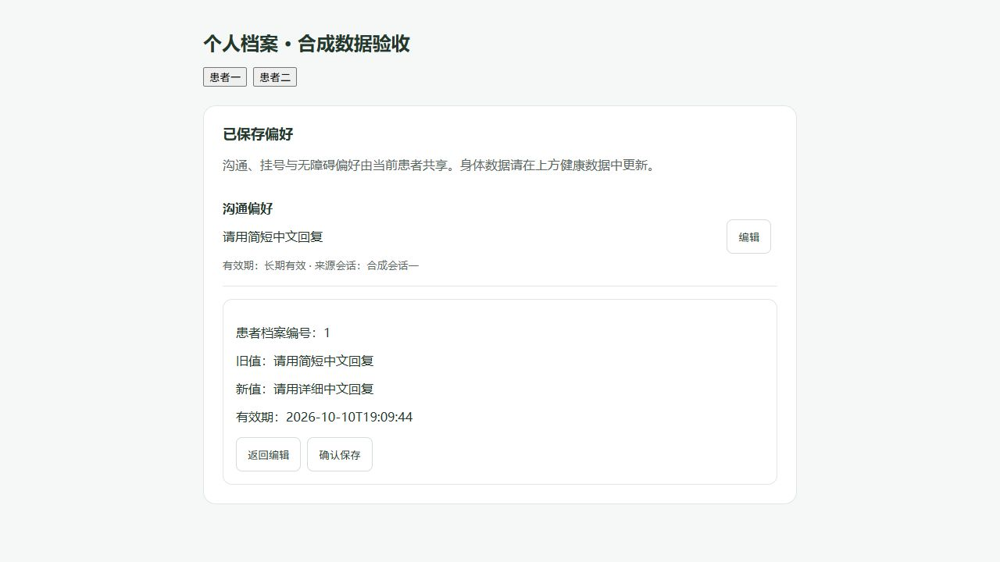
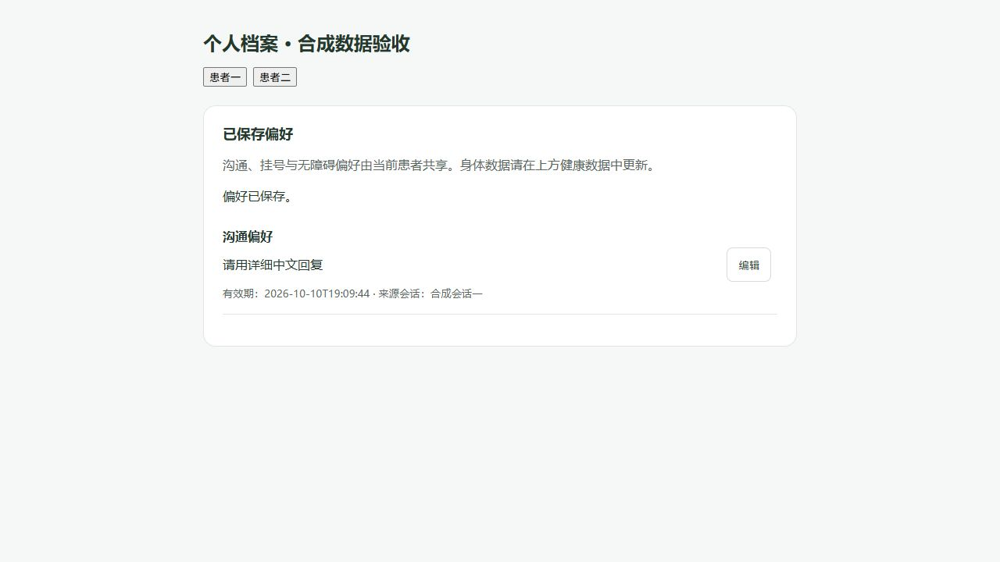
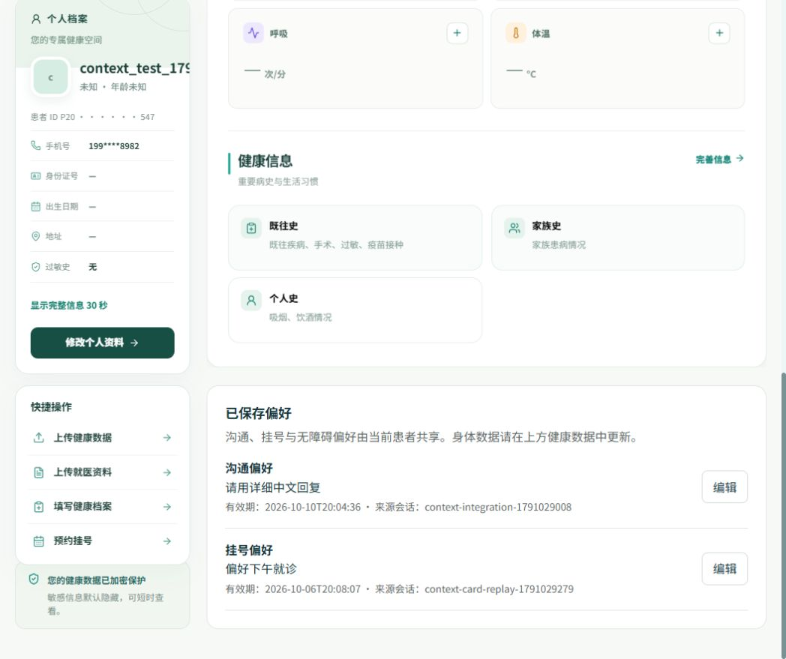

# 记忆与上下文工程：实现与验收记录

日期：2026-10-03。依据 [已确认计划](记忆与上下文工程-plan.md) 和用户确认的边界实现。本记录区分已完成的代码验证与尚未执行的部署联调。

## 实现结果

- **患者隔离**：以用户、患者、会话限定恢复和偏好访问；旧检查点缺少患者关联时重新恢复，旧确认卡片要求重新发起。确认恢复再次验证患者关联。偏好编辑切换患者时清空草稿，并丢弃旧患者请求的迟到响应。
- **L2 内部恢复**：摘要采用 schema 2，只含有来源且未验证的患者自述、会话未解决事项及其明确替代项。移除模型生成的已验证事实和偏好字段。助手及工具的临床正文不进入摘要生成提示。未解决事项只用于对话连续性，不创建任务台账或自动执行业务。
- **可靠压缩**：下一轮开头判断上一轮历史是否达到阈值，分批压缩数据库消息连续前缀；Java 校验执行权、患者、来源、覆盖位置和版本。只有收到 MySQL 提交确认后才移除检查点里的对应原文。数据库原消息保留。超时、格式失败、提交失败不移除原文；409 冲突标记下一轮重新恢复。相同候选的提交支持确认丢失后的幂等回执。
- **完整恢复**：按摘要数据库水位、固定消息上界，每页最多 200 条读取全部未覆盖消息。恢复量与模型预算独立，默认 20,000 条/60 秒操作上限；未完整恢复明确失败。检查点丢失、摘要版本不符、消息 ID 不稳定及数据库消息缺口均重新恢复。Redis 读取失败时降为只读运行，不启用确认写工具。
- **最终输入预算**：所有模型用途共用最终调用包装器，计入系统规则、当前消息、工具 schema、完整工具调用结果对、当前子任务、外部资料、摘要/偏好及历史。默认估算输入上限 8,000 tokens；保留必要完整片段，裁剪可选历史。模型拒绝超限时只重试该次调用，最多两次；已输出内容后不重试，不重放图或业务工具。新消息超过 2,000 字符要求缩短或分段。
- **L3 患者偏好**：独立“使用已保存偏好”开关只控制读取和注入。普通偏好表达不自动保存；明确“记住”直接显示一次确认卡片，展示患者、内容、有效期和更新旧/新值。确认快照在中断重放时保持一致，写入校验版本；同主题并发创建冲突后重新确认。身体数据不得写入 L3。个人档案新增偏好列表和编辑确认，本期无新增忘记入口。
- **身体数据与药物解释**：普通模式按当前问题读取现有必要档案范围，快速模式不新增临床个性化。档案与本次自述区分来源和日期，不自动覆盖；当前自述可直接在会话确认，更新档案仅是建议。缺失不等于没有。搜索摘要只用于发现资料，个性化药物解释要求可靠正文；无依据退回结论限制。正式资料正文按完整块纳入预算，不能截掉医学限定条件。本期无个体剂量计算工具。
- **观测与 CI**：补充每次模型调用分用途/分段估算、截断、重试、摘要生成/提交和恢复时延、失败类别等汇总指标，不记录患者原文和数值。CI 增加确定性评测和 Java 持久化/权限/冲突门禁。

## 已执行验证

| 检查 | 结果 | 范围 |
| --- | --- | --- |
| Python `python -m pytest tests -q` | 349 通过 | 包括患者隔离、恢复缺口、确认恢复、摘要失败/冲突、模型预算、禁止业务重放及真实联调发现问题的回归 |
| Java `mvn -q test` | 172 通过 | 包括摘要连续前缀/来源/执行权/幂等回执及偏好冲突、重复创建、旧版本确认 |
| 前端 `npm run build` | 通过 | Vue 生产构建；存在既有大 chunk 提示 |
| 前端 `npm test` / `npm run lint` | 83 通过 / 通过 | 现有前端回归与 lint |
| 修改/新增 Python 文件 Ruff 检查及格式检查 | 通过 | 未修复无关历史文件 |
| 确定性评测 | 33 样本通过；29 项故障测试通过 | [工程评测 JSON](context-engineering-evaluation.json) |
| 配置中的真实模型评测 | 9 个合成样本完成 | [真实模型质量 JSON](context-real-model-evaluation.json) |
| 偏好界面手动验证 | 通过 | 实际组件 + 合成 API 适配器；确认旧/新值和有效期、确认后保存、切换患者、390px 无横向溢出 |

真实模型样本包括 6 个摘要提取/保留/撤销场景及 3 个临床边界场景。本次 6 个样本的关键词召回均为 1.0；3 个临床样本均未出现检测规则所识别的个体剂量。已人工查看输出中的来源、日期、冲突、缺失不等于不存在以及会话确认边界。关键词检测和小样本人工检查不能证明零遗漏或临床安全性，也不构成剂量工具验证。样本答案仍有篇幅较长等质量改进空间。





## 部署与回滚

1. 备份目标数据库，并先在隔离的 MySQL 8 数据库执行 [迁移脚本](SQL/migrations/2026-10-03-ai-conversation-summary.sql)。脚本按 `DATABASE()` 对应数据库检测字段后新增 `summary_json` 和 `summary_version`，可重复执行。已有原文不迁移、不删除；没有权威摘要的会话由原文重建。
2. 先完成表结构迁移，再同步部署 Java 与 Python，最后部署前端。Java/Python 内部委托权限和恢复/提交字段为配套契约，应作为同一版本发布。新建数据库使用更新后的 [schema](SQL/schema.sql)。
3. Redis 检查点沿用已有 Redis 8+ / RedisJSON / RediSearch 配置。检查 `ai-python/.env.example` 中输入估算预算、摘要触发、保留消息、恢复条数和时限配置。缩小预算可能使必要片段超过上限，届时明确失败；不会静默裁剪安全规则。
4. 上线前在隔离环境联调：已有长会话多页恢复、摘要提交超时与确认丢失、Redis 中断、确认卡片跨重启、不同患者切换、同主题偏好并发更新及模型拒绝超限。确认后台错误与前端状态一致。
5. 回滚先停止接收新会话执行并等待/取消在途调用，再整体回退 Java/Python/前端版本。保留新增数据库字段和全部原始消息，不通过删除摘要或原文回滚；必要时清理对应部署的检查点缓存，使旧版本从原文恢复。旧版本如果只读取固定条数历史，会恢复其原有局限，不能继续声称完整恢复。

**本地部署状态已更新**：下方记录了用户授权后的真实数据库迁移与核心链路联调。仍未进行完整故障注入、数据库回滚演练、长会话多页实时联调及正式药物来源网络流程；这些场景的确定性测试不等于真实环境故障演练。

## 2026-10-03 本地迁移及真实联调

用户授权使用本地 MySQL，并使用已启动的前端、Java、Python、Redis 服务联调。

- 迁移目标为 `localhost:3306/wenrun`，MySQL 8.0.46。迁移连续执行两次均成功；`summary_json` 为可空 JSON，`summary_version` 为默认 0 的 BIGINT。迁移前后原有会话数量均为 27，无原文删除。迁移前表结构备份：[SQL](SQL/migration-backups/20261003-200159-ai_conversations-schema.sql)。该文件是表结构备份，不是完整数据备份。
- 创建专用合成测试账号 `context_test_1791028982`（用户 12、患者 8），没有修改现有患者数据。测试账号及合成记录保留供复查；临时登录凭据在收尾时清理。
- 连续 9 轮真实聊天完成，MySQL 摘要版本为 1，包含“讨论如何写感谢信”；18 条原始消息全部保留。仅清除这个测试会话的 Redis 检查点后，下一轮成功从 MySQL 摘要及未覆盖消息恢复，并回答感谢信事项。
- 偏好卡片确认保存、读取关闭后仍允许显式写入、档案页旧值/新值编辑确认与版本递增均通过。过期版本更新返回 409，访问其他患者偏好返回 403，超长新消息返回 400。
- 合成档案体重 62kg，与当前自述 60kg 分开呈现，档案仍为 62kg；明确要求记住体重时未生成保存卡片，长期偏好仍只有两项。
- 发现并修正：浅层 Redis 检查点恢复时有效期重算；临床档案查询误分给挂号助手；偏好组件误放入档案页侧栏列。保存现在使用内部可信确认卡片快照中的版本和有效期；旧卡片缺少快照则要求重新确认。档案查询保留知识路径，偏好区移入主内容栏。
- 修正后 Python 全量 349 项、前端 83 项、构建和 lint 通过。Java 此轮未修改，沿用 172 项通过的结果。

[真实联调结果](context-live-integration.json) 与 [本地汇总指标](context-live-metrics.json) 记录合成数据和当前进程统计。早先 9 个真实模型质量样本属于当时使用的模型；更新模型后只做连接检查，不将旧质量结果当作新模型质量认证。



## 重跑评测

在 `ai-python` 目录运行：

```powershell
python -m pytest tests -q
python scripts/evaluate_context.py --output ../docs/context-engineering-evaluation.json
python scripts/evaluate_context.py --real-model --output ../docs/context-real-model-evaluation.json
```

真实模型命令读取本地模型配置并调用供应商，仅发送仓库中的合成样本。报告保留合成候选和回答供语义审查；确定性报告与真实模型质量报告分别维护。
