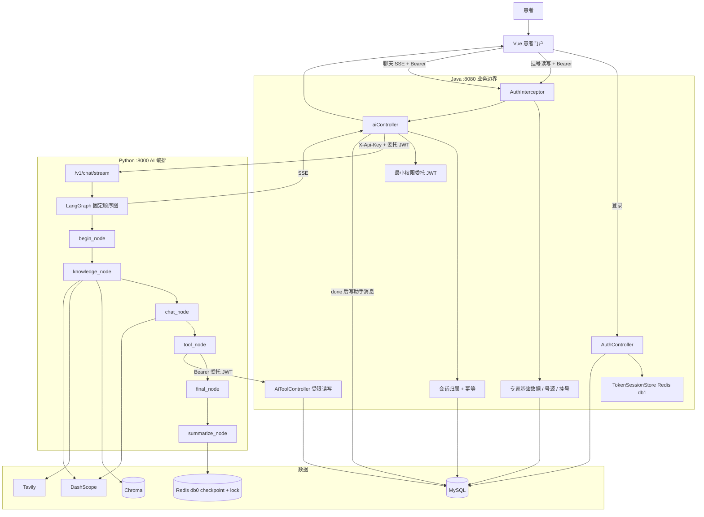

# 温润在线医院 · 项目流程骨架

以仓库当前代码为准。浏览器只访问 Java 的 `/api/**`，不直连 Python `:8000`。

## 1. 系统分层

```text
患者浏览器  Vue :5173
    │  Bearer Token（登录 Session）
    ▼
Java  Spring Boot :8080
    │  业务写路径 → MySQL
    │  登录 Session → Redis db1（可降级内存）
    │  AI 转发 → X-Api-Key + X-Delegated-Token + X-Request-Id
    ▼
Python  FastAPI + LangGraph :8000
    │  知识元数据 → MySQL；知识检索 → Chroma
    │  会话 checkpoint + 分布式会话锁 → Redis db0
    │  模型 / Embedding → DashScope
    └─ 受限业务 Tool → Java /api/internal/ai-tools/** → MySQL
```

职责切分：

| 层 | 负责 | 不负责 |
| --- | --- | --- |
| Vue | 患者门户、SSE 展示、跨页保活 | 不持有服务间密钥，不直连 Python |
| Java | 登录、会话归属、在线挂号、AI 网关、委托 JWT | 不跑模型、不查 Chroma |
| Python | 意图路由、RAG、HITL Tool 编排、SSE、知识文档元数据登记 | 不绕过 Java 读取或写入挂号业务表 |

## 2. 通用请求骨架

除登录、注册、健康检查外，业务请求都走同一条鉴权链：

```text
请求
  → AuthInterceptor（Authorization: Bearer 或 X-Token）
  → TokenSessionStore 取 userId / accountType
  → UserContext
  → Controller → Service → MySQL
  → 清除 UserContext
```

三把钥匙互不混用：

1. **登录 Token**：浏览器 → Java，证明「这个人已登录」。
2. **X-Api-Key**：Java → Python，证明「这是内部 AI 服务调用」。
3. **委托 JWT**：Python → Java `/api/internal/ai-tools`，证明「这次只能用令牌列出的读/写 scope，且患者身份钉死在令牌里」。写 scope 仍不能跳过患者确认和 Java 业务校验。

## 3. 患者门户骨架

当前 Vue 路由只覆盖患者端：

```text
/login
  → 登录 / 注册  POST /api/auth/login | /register
  → 首页 /home
       ├─ 预约挂号     /registration  →  /registration/:id
       ├─ AI 知识问答  /assistant
       └─ 我的档案     /user
```

未登录访问业务页会回到 `/login`；已登录访问 `/login` 会进首页。

## 4. 在线挂号主链路（写操作在 Java）

患者端保留的传统业务只有在线挂号：

```text
查询可预约号源
  GET /api/schedules
        │
        ▼
挂号（锁号源）
  POST /api/registrations
        │
        ├─ 改约  PUT  /api/registrations/{id}/schedule
        └─ 取消  POST /api/registrations/{id}/cancel
```

说明：

- 科室与医生数据只作为号源筛选和 Agent 查询的基础维度，不再提供独立患者端页面。
- 门诊缴费、接诊、处方、发药、检查、药品、库存和仪表盘模块已经移除。
- 挂号、改约、取消均由 Java 在事务中处理号源；Agent 仍保留经 `interrupt` 确认后的挂号和取消能力。

## 5. AI 对话骨架

### 5.1 进出站

```text
前端 useAssistant
  POST /api/ai/chat/stream
    { message, conversationId, clientRequestId, memoryEnabled, fastMode }
        │
        ▼
Java aiController
  1. 登录态 + 会话归属
  2. 幂等（同一 clientRequestId）
  3. 先写用户消息到 MySQL
  4. 签发最小权限委托 JWT
  5. 转发 Python /v1/chat/stream
        │
        ▼
Python LangGraph astream
  SSE：status → token → citation → done | error
        │
        ▼
Java 收到 done 后写助手消息
前端以 done.reply 为最终正文
```

删除会话：

```text
DELETE /api/ai/conversations/{conversationId}
  → 校验归属
  → 删 MySQL chat_messages
  → DELETE /v1/chat/memory/{conversationId} 清 Redis checkpoint
```

实际 LangGraph key 为 `user:{verifiedUserId}:conversation:{conversationId}`。`conversationId` 只在已验证用户作用域内有意义；同一个字符串由不同账号使用时，对应完全不同的 checkpoint 和锁。

### 5.2 图内顺序（固定边，节点内跳过）

```text
START
  → begin_node          意图多选 knowledge / chat / tools，清空上一轮回复字段
  → knowledge_node      院内 Chroma；未命中再 Tavily
  → chat_node           闲聊 / 院务引导
  → tool_node           受限业务查询；写操作需 interrupt 确认（需委托 JWT）
  → final_node          单回复原样输出，多回复才合并
  → summarize_node      超过消息数或 token 阈值才写结构化摘要
  → END
```

`fastMode=true` 时不走上面这张图，改用快速模式图：

```text
START
  → fast_node           单个全能 Agent，自带工具循环：仅 Tavily 联网
  → summarize_node      超过消息数或 token 阈值才写结构化摘要
  → END
```

快速模式只挂 `web_search`，没有院内 RAG，也没有业务 Tool。症状、用药、护理可以联网；本院楼层、就诊须知、号源、排班、我的预约应引导患者关闭快速模式。工具循环在 `fast_node` 内部完成，中间的 tool_calls 与 ToolMessage 不写回 State，因此两张图的 checkpoint 结构一致，共用用户作用域后的 thread key，记忆在两种模式之间连续。

未写入 `selected_agents` 的节点直接返回空 dict。

SSE token 只取根图节点的模型分片，子图命名空间（`ns` 非空）的嵌套 Agent 分片一律丢弃，避免泄漏路由 JSON 和工具原文。单意图且该节点在根图直接产出正文时，token 就来自它本身：纯闲聊来自 `chat_node`，纯知识来自 `knowledge_node`（仅 RAG 命中分支）。多意图时 `final_node` 会重写正文，只流出 `final_node`。`tool_node` 与知识的 Tavily 兜底由嵌套 Agent 生成，不流式，等 `final_node` 透传后一次性下发。快速模式下 token 只来自 `fast_node`。

### 5.3 记忆开关

```text
启动
  AI_REDIS_URL 可用？
    是 → AsyncShallowRedisSaver + 带 checkpointer 的图
    否 → 不保存 checkpoint；当前请求仍可使用 Java 从 MySQL 提供的有限历史
请求
  memoryEnabled=false 或 memory_graph 为空 → 当前轮 + 有限恢复历史
  否则 thread_id = user:{verifiedUserId}:conversation:{conversationId}
  Context Builder → 结构化摘要 + 相关长期偏好 + 最近消息，分别受 token 预算约束
```

委托令牌只活在 `HospitalToolContext`，不进 State，因此不会写入 checkpoint。
同一 thread 由 Redis 锁串行化；checkpoint miss 时从 MySQL 消息恢复，长期偏好通过 Java 受限接口读取，不把 Redis 当作历史事实源。

## 6. 总图



## 7. 和旧文档的差异

当前图是 `begin → knowledge → chat → tool → final → summarize`；挂号与取消既可由患者页面调用 Java，也可由 Agent 在确认后通过受限工具调用。旧文档里的 `hospital / medical / clarify / 知识库管理代理` 不是当前实现。
