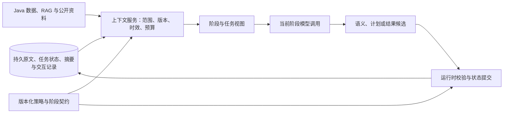

# 在线医院 Agent 上下文工程设计计划

日期：2026-10-05。业务时间基准：`Asia/Shanghai`。

状态：目标设计，尚未实施或验收。本文不评价当前代码，也不要求保留当前实现。

设计输入：[plan.md](<D:/刘畅/WebAI/Online hospitals/plan.md>) 中的目标架构，以及 OpenAI、Anthropic、LangGraph 的官方上下文管理资料。本文补充 `plan.md` 的上下文契约、数据生命周期和验收要求；不重新定义其意图目录、Router 准入规则或 Planner 权限。

## 1. 设计目标与核心决策

项目需要支持医疗信息咨询、科室方向咨询、院务查询、医生与号源查询、本人挂号记录查询，以及需要确认的挂号和退号。用户可能连续补充信息、改变参数、切换问题，再回来继续先前的目标。

上下文工程要解决的是：**每次理解、规划和执行时，系统能取得当前目标所需的信息，知道信息从哪里来、是否仍有效，并在中断后准确恢复工作。**

采用“分层记忆 + 持久会话与任务状态 + 按阶段构建上下文 + 按需读取证据 + 可追溯摘要”的设计。模型看到的上下文，是持久数据的一次受限投影，不等于整个会话数据库。记忆层规定保存与召回，上下文层规定本次调用实际看到什么；具体记忆模式见第 4.3—4.9 节。

首版确定以下决策：

1. 按 `goal_ref` 和稳定 `task_id` 管理信息。同一 Agent 可以接收多个任务，每个任务有独立上下文。
2. 对话原文、结构化任务状态、业务事实、摘要和运行时权限分别管理，明确各自写入者。
3. 当前用户原文不可被摘要替代；识别需要的历史原文保留引用和时间锚点。
4. Router 使用结构化数据和确定性规则；Planner 只接收 Router 准入范围内的目标、能力和约束。
5. Agent 按任务读取资料，默认只获得必要证据和工具子集。上下文服务执行范围、版本、时效和预算检查。
6. 摘要帮助理解和定位历史，不产生患者身份、业务主键、操作授权、确认凭据或执行成功状态。
7. 完成状态由可信执行回执更新。模型建议、用户愿望、确认和事务成功是不同信息。
8. 压缩模型上下文不删除持久原文；恢复依靠持久状态和业务核实，不依靠模型重新猜测。
9. 首版启用同会话记忆与受控业务记录读取；跨会话经历按明确请求召回。自动学习患者偏好的个性化记忆默认关闭，但其扩展契约纳入设计。患者档案仍由业务系统提供。
10. 先建立可验证的上下文闭环，再依据评测增加复杂检索、缓存或模型自主记忆机制。

## 2. 官方理念与项目采用方式

下表左侧是官方资料中的机制或理念，右侧是本项目的设计选择。官方资料不直接规定本项目的数据表、预算、确认规则或验收数字。

| 官方依据 | 本项目采用方式 |
|---|---|
| OpenAI 的会话管理示例讨论历史裁剪、摘要及完整轮次边界。[Session Memory](https://developers.openai.com/cookbook/examples/agents_sdk/session_memory) | 保留近期原文与正在进行的工具交互；较早内容生成可追溯摘要。业务状态单独持久化 |
| OpenAI Responses 支持服务端及独立 compaction；压缩项是不透明的模型续接数据。[Compaction](https://developers.openai.com/api/docs/guides/compaction) | 供应商压缩作为适配层能力；本地任务状态、审计来源和恢复契约独立存在 |
| Anthropic 强调有限注意力、按需加载、渐进披露、压缩和结构化笔记。[Effective Context Engineering](https://www.anthropic.com/engineering/effective-context-engineering-for-ai-agents) | 先提供目标与资料引用，再加载必要正文；任务结束后移除无关证据，保留结果及来源 |
| Anthropic Managed Agents 将持久 session log 与模型窗口、执行环境分离。[Managed Agents](https://www.anthropic.com/engineering/managed-agents) | 会话事件与状态保存在执行进程之外；原文可按引用回读，运行进程可替换 |
| Claude memory tool 的存储与操作由应用控制。[Memory Tool](https://platform.claude.com/docs/en/agents-and-tools/tool-use/memory-tool) | 记忆读写受应用契约约束；首版不开放任意患者记忆写入工具 |
| LangGraph 区分 thread 范围的短期状态与跨 thread 的长期 store。[Memory Overview](https://docs.langchain.com/oss/python/concepts/memory) | 恢复同一会话与跨会话个人记忆分开设计；短期状态也可以持久化 |
| OpenAI 提醒不要将不可信输入放进 developer 消息。[Agent Safety](https://developers.openai.com/api/docs/guides/agent-builder-safety) | 原文、摘要、检索正文和工具说明性文本进入资料通道；授权与策略由运行时检查 |

这些理念在本项目中的共同落点是：**外部保存足够恢复的信息，模型每一步只接收足够完成当前任务的信息。**

## 3. 与 plan.md 的衔接

### 3.1 模块边界

沿用 `plan.md` 的顺序：

```text
用户消息持久化
  → 构建 RecognitionContext
  → 意图识别与公共校验
  → 提交 IntentResult 和目标变化
  → 确定性 Router
  → 直接处理 / 固定流程 / 组合 / 受约束 Planner
  → 按任务构建 TaskContext 并执行
  → 提交 TaskResult 与等待交互状态
  → 构建 ResponseContext
  → 输出并记录本轮结果
```

上下文服务不是新的自由决策 Agent。它负责按契约选取资料、检查引用、管理预算和构建视图；语义理解仍由识别器负责，执行图仍由固定流程或 Planner 负责。

持久数据与模型窗口的关系如下。图中的模型节点代表不同阶段的一次调用，各自使用对应视图；Router 的确定性判断不需要模型调用。



| plan.md 中的概念 | 本文补充的上下文职责 |
|---|---|
| `RecognitionContext` | 明确历史选择、原文证据、候选引用、时间锚点与预算 |
| `IntentResult` | 保留槽位来源和对话动作；校验后才能影响持久目标状态 |
| `RouteDecision` | 使用版本有效的结果和目录；不重新读取全文猜测意图 |
| `PlanningRequest` | 只投影已准入目标、类型化绑定、合法能力与有效上游结果 |
| `ExecutionPlan` | 每个任务声明输入依赖和证据需求，用于构建独立 `TaskContext` |
| `active_goals / task_results` | 成为续接、修改、部分完成与恢复的结构化依据 |
| `pending_interactions` | 将待补充、待选择、待确认分别保存，绑定版本和展示内容 |
| `Policy / Fallback` | 在资料读取、上下文构建、状态提交和执行前调用，不靠提示词替代 |
| `release_bundle_id` | 同时锁定上下文契约、提示、投影规则和供应商适配版本 |

### 3.2 本文不扩展的范围

不增加未注册的医疗或支付能力，不允许模型写 SQL 或任意执行表达式，不改变 Java 的身份、归属、权限与事务边界。对诊断、用药或急症的具体业务政策，引用经业务审核的版本化策略；本文只规定相关资料如何被选择、标记和使用。

## 4. 上下文分类、可信来源与记忆模式

### 4.1 六类信息分别管理

| 类别 | 主要内容 | 谁可以写入 | 模型如何获得 |
|---|---|---|---|
| `PolicyContext` | 角色、支持范围、阶段规则、输出契约、工具子集 | 可信发布流程 | 稳定系统/开发者指令和工具定义 |
| `RuntimeContext` | 当前身份、患者归属、委托凭据、执行许可、锁与截止时间 | 认证网关、运行时 | 只投影必要的不透明引用和限制；凭据不进入模型 |
| `TaskState` | 目标、逐目标槽位、版本、依赖、任务状态、待交互、回执引用 | 经过校验的状态提交服务 | 当前阶段相关的结构化视图 |
| `ConversationHistory` | 用户与助手原文、交互展示记录、必要工具事件 | 会话服务、可信事件生产者 | 近期完整轮次或带来源的历史片段 |
| `ConversationSummary` | 较早表达、自述、话题连续性与原文索引 | 摘要候选经校验后提交 | 与本轮目标相关的摘要部分 |
| `EvidenceContext` | 患者记录摘录、RAG、公开搜索、业务查询结果 | 对应数据源；适配器附来源 | 根据任务需要即时读取或刷新 |

`TaskState` 可以引用其他类别，但不复制所有正文。`RuntimeContext` 不整体序列化进模型请求，也不进入通用 checkpoint。确需持久化的确认记录、业务操作关联等，应转为具有专门权限和生命周期的服务端记录。

### 4.2 “来源可信”与“内容可作为指令”分开

用户原文可以证明“用户说过什么”，不能单独证明其医疗陈述正确。患者记录可以证明“业务系统记录了什么”，不能自动变成医生已核实的临床结论。模型摘要和医疗建议均属于派生解释。

| 信息 | 可以支持的判断 | 不能直接支持的判断 |
|---|---|---|
| 用户说“我对青霉素过敏” | 存在该用户自述，并有原文来源 | 已经完成临床核实或更新正式档案 |
| 档案记录某项过敏史 | 档案在某时记录了该项信息 | 当前陈述与历史记录冲突已经消解 |
| 模型建议咨询某科室 | 存在该建议及其依据 | 用户已经选择科室或授权挂号 |
| Java 返回医生/号源候选 | 查询时的候选实体及相关字段 | 号源在稍后提交时仍有库存 |
| 有效的服务端确认记录 | 对绑定操作的确认通过核验 | 任意后续操作均获批准 |
| Java 事务回执 | 对应操作已取得明确业务结果 | 其他目标也已完成 |

所有资料正文均不具有修改系统策略的权限。业务字段是否可用于执行，取决于适配器契约、归属、版本和运行时检查，不能只看一个文本中的 `trusted=true`。

### 4.3 记忆模型：工作记忆、短期记忆与长期记忆

本项目采用三层记忆模型。这里的长短期主要按使用范围区分，不按“放在内存还是数据库”区分。短期会话状态也需要持久化；保存数月的同一会话记录，仍不因此自动成为可跨会话使用的个人画像。

| 层次 | 保存或持有的内容 | 范围 | 对应前文实体 | 默认使用方式 |
|---|---|---|---|---|
| 工作记忆 `WorkingMemory` | 当前任务参数、当前依赖输出、刚读取的证据、当前工具循环 | 单次阶段调用或任务执行 | `TaskContext`、当前 `EvidenceContext` 与工具交互 | 每步重新构建，任务结束后释放正文；有效结果按契约提交 |
| 短期记忆 `SessionMemory` | 同一会话的开放目标、槽位、等待事项、任务结果、近期原文和较早摘要 | 同一 `conversation_ref` | `TaskState + ConversationHistory + ConversationSummary` | 每轮读取必要状态、每次有效状态变化提交；重启后可恢复 |
| 长期记忆 `LongTermMemory` | 获准跨会话使用的事实、历史经历引用、组织知识与流程规则 | 明确授权的患者/用户或组织范围 | 业务档案、历史经历索引、可选记忆条目、RAG 与版本化规则 | 按来源和任务召回；不全部预装进每次模型请求 |

工作记忆中的“目标快照”来自持久短期状态，不能因为释放工作窗口就丢失未完成目标。外部档案和知识库提供长期信息，但继续保留自己的业务来源与管理方式，不要求复制进一个新的 Agent 记忆库。

LangGraph 官方区分 thread 范围的短期记忆与 namespace 范围的长期记忆，也讨论语义、经历和程序性记忆。本项目的三层组织及以下运行模式是对该理念的具体应用。[Memory Overview](https://docs.langchain.com/oss/python/concepts/memory)

### 4.4 长期记忆保存什么

“长期记忆”不是“长期患者偏好”的同义词。按信息性质进一步划分：

| 类型 | 本项目内容 | 存储与权威来源 | 使用边界 |
|---|---|---|---|
| 语义记忆 `SemanticMemory` | 有来源的事实：档案字段、组织知识；未来可选的用户明确偏好 | 档案由 Java 管理，知识由版本化知识库管理，可选偏好使用独立 Schema | 保留来源、时间与核实性质；模型不能把聊天自述自动写成正式病史 |
| 经历记忆 `EpisodicMemory` | 某次会话谈过的问题、自述引用、办理目标、结果和未解决事项 | 历史会话与事务回执为来源，索引/摘要是派生表示 | 用于“上次谈到什么”等回顾；既往症状不自动表示本次仍存在，旧操作结果不作为新授权 |
| 程序性记忆 `ProceduralMemory` | 应如何处理任务：支持范围、流程、策略、提示、能力使用规则 | 可信维护者发布的配置、流程与提示版本 | 模型执行时只读；反馈可形成改进候选，经过离线评测和发布后生效 |

医疗知识库是组织共享知识，不是患者个人记忆。业务档案是受控事实来源，不是聊天模型自行维护的画像。语义记忆也不要求使用向量搜索；存什么与怎么检索是两个问题。

患者自述和已核实业务结果采用不同类型：自述即使跨会话保留，仍标为 `user_reported`；旧事务结果仍绑定原操作，不能参与新的确认判断。

### 4.5 三种运行模式与默认选择

运行模式由服务端配置、当前请求与访问策略共同决定。模型可提出资料需求，不能自己开启更宽的记忆范围。

| 模式 | 默认范围 | 跨会话读取 | 跨会话写入 | 适用场景 |
|---|---|---|---|---|
| `session`：会话连续模式 | 当前会话短期记忆、当前任务工作记忆 | 仅按任务读取获准业务档案与组织知识；不自动读其他聊天 | 不从聊天自动生成个人画像；会话原文/状态正常持久化 | 默认问答、医生查询、挂号与退号 |
| `history_recall`：历史回顾模式 | `session` 范围，加本次明确需要的历史经历 | 在身份、患者归属、任务目的和访问策略通过后，召回指定时间/话题的历史 | 可维护有来源的经历索引；不把旧陈述升级为当前事实 | “上次我说的那个问题是什么？”、“回顾一下上次咨询” |
| `personalized`：受控个性化模式 | 前两种模式允许的资料，加已生效个人记忆 | 按任务读取相关个人记忆 | 只写允许字段、来源明确且通过准入的条目，支持查看、更正、撤销 | 未来明确需要跨会话偏好的产品功能 |

**推荐首版：默认 `session`，按明确历史请求进入 `history_recall`，`personalized` 默认关闭。** 这是目标设计的范围选择，不以当前代码是否已有相应能力为依据。

历史回顾能力需要在相关能力/资料目录中登记并完成访问与质量验收；未交付前不能对用户宣称已经支持。它不会把上一会话的全部开放目标、候选或确认复制到新会话。

关闭个性化记忆不影响同会话连续性、历史记录保存、已授权档案读取或明确请求的历史回顾。临时表达“这次下午方便”仅作为当前目标约束；“以后都优先下午”若个性化模式未启用，也不能被悄悄写成永久偏好。

新会话的 `goal_ref`、日期和确认重新建立。历史目标可以作为回顾对象；确需接续业务时，通过显式业务续接契约核实原任务与操作，不通过记忆文本恢复批准。

### 4.6 记忆组织与 MemoryRecord

个人事实、经历和规则分别组织。患者事实不采用一个由模型反复整体重写的巨大自由文本画像；需要新增派生条目时使用有边界的条目集合，必要的 Profile 只是条目或业务字段的可重建投影。

| 记忆空间 | 逻辑 namespace 示例 | 规则 |
|---|---|---|
| 会话状态 | `conversation / scope_ref / conversation_ref` | 当前会话独立，版本化提交 |
| 患者经历 | `patient / patient_scope_ref / episodes` | 核验当前用户对患者的访问范围；筛选目的、时间和话题 |
| 可选个人偏好 | `user / user_scope_ref / preferences` | 仅在模式启用与字段准入后读写，不与正式临床档案混合 |
| 组织知识 | `organization / organization_scope_ref / knowledge` | 按适用范围、读取权限与文档版本共享 |
| 程序规则 | `organization / organization_scope_ref / procedures / release_bundle_id` | 运行时只读，可信发布流程更新 |

这些是逻辑命名空间，不是模型可以提交的任意路径。实际 namespace 由服务端根据已验证身份构造；组织范围如适用时必须隔离。

新增的派生记忆条目使用以下契约；已有原文、任务状态、档案与回执继续使用自己的契约，通过受控引用接入，不必全部转存。

```text
memory_ref / memory_type / schema_version / revision
namespace_ref / subject_ref / purpose_scopes
content 或 source_content_ref
source_refs / source_versions / epistemic_status
occurred_at / recorded_at / valid_from / expires_at
access_basis_ref / writer_kind
status / supersedes_ref / conflict_refs
```

`status` 区分 `proposed / active / superseded / revoked / expired`。模型仅能产生候选内容，不能设置主体归属、访问依据或 `active`。`access_basis_ref` 引用应用已验证的访问依据，不是模型自报的同意；确认挂号也不等于授权保存任意长期画像。

### 4.7 记忆读取：过滤、召回、回源、投影

读取顺序如下：

```text
确定本轮记忆模式与访问范围
  → 读取当前会话的结构化状态
  → 判断是否需要档案或历史回顾
  → 在允许的 namespace 内按主体、目的、状态与时间过滤
  → 优先按精确引用/日期/实体读取，必要时做关键词或语义召回
  → 对候选记忆回读原文或核对业务来源
  → 排除被替代、撤销、过期或不相关内容
  → 将有效记忆转换为带来源的 ContextItem
  → 按阶段预算加入工作上下文并记录 manifest
```

权限范围在检索前限制，检索后再次检查；不先全库搜索患者数据再只靠最后过滤。相似度分数仅用于召回排序，不证明事实正确、时间有效或主体归属。

当前目标状态、用户本轮明确修正与实时业务结果不能被旧摘要或历史记忆覆盖。存在不同来源冲突时按来源契约处理，而不是对所有资料简单“最新一条覆盖”。

首版可从最多 5 条可选历史经历候选、最多一次有界回源开始校准；这只是额外历史资料的初始限制，不裁掉当前任务必需状态。记忆资料计入第 10 节的输入预算，模型参与补取时也计入实际调用账本。

### 4.8 记忆写入、归并与遗忘

采用“关键状态同步写入、派生摘要/索引异步归并”的方式。此处的后台归并是应用内部作业，不要求创建额外自主 Agent。

| 时机 | 写入内容 | 约束 |
|---|---|---|
| 接收消息与理解提交 | 原文、校验后的目标/槽位变化 | 同步持久化；不能等待摘要才更新本轮事实 |
| 任务完成或挂起 | 类型化结果、等待交互、操作关联与回执引用 | 按目标/任务版本提交；失败与未知结果不写成成功经历 |
| 已完成轮次边界 | 摘要、话题索引与经历索引候选 | 异步生成，检查来源和版本；未生成时可以回读原文 |
| 明确更正或撤销 | 被替代关系、失效事件与读取屏蔽 | 先同步停止使用旧内容，后台再重建派生摘要/索引 |
| 可选个性化功能写入 | 准入字段的个人记忆候选 | 模式启用、来源和访问依据有效后才激活；不自动更新临床档案 |
| 组织规则改进 | 提示/流程改进候选 | 离线验证并通过可信发布生效，运行模型不能直接修改规则 |

派生记忆准入至少检查：是否存在允许字段、信息主体是否明确、来源是否可核对、用途是否需要跨会话、是否含推测或指令、是否与现有条目冲突，以及访问范围与有效期。

不准入的内容包括凭据、隐含授权、模型诊断推测、被纠正陈述、当前号源库存的长期断言，以及仅适用于单次任务的临时偏好。已有历史原文可以依法依策略保存，但“保存原文”不等于“激活该内容为长期个人事实”。

归并按事实键、来源与版本去重，不按文本相似度直接合并不同主体、不同时间的陈述。明确更正保存 `supersedes_ref`；不能确定的冲突保留 `conflict_refs` 并请求必要核实。

遗忘区分三件事：从当前模型窗口移除、停止召回某条记忆、删除底层数据。三者分别记录；关闭个性化记忆应停止其召回与新写入，数据删除由明确的数据管理请求和保留政策处理。来源失效沿第 15 节的规则传播至摘要、索引、缓存和供应商续接窗口。

### 4.9 与执行链路的接入

记忆管理作为上下文服务内部的受控模块，向 Recognition/Planning/Task/Response 视图提供资料。它不替代识别器、Router 或 Planner，也不获得全部业务写工具。

- 识别前先读同会话短期状态；发现“上次”等历史需求时，在登记的范围内有界补取，不能无限读取所有历史。
- Router 只使用已校验结果和记忆模式/权限元数据，不用历史文字重新猜授权。
- Planner 只获得获准目标的必要记忆引用或类型化字段，不获得整份个人记忆库。
- 任务执行按需读档案、知识或经历；旧自述明确标注历史时间及是否仍适用于本轮。
- 回答后提交任务状态，再归并摘要与经历索引；是否生成可选个人记忆由准入规则决定。

例如，新会话中用户问“上次我说胸闷是什么时候？”：可以在 `history_recall` 模式下查找获准会话、回读原文并回答其陈述时间。随后用户说“那帮我挂个号”，应识别新目标、核对本次参数并重新确认；过去的症状、医生选择与确认不自动复制过来。

## 5. 持久数据与恢复基础

### 5.1 逻辑存储设计

建议使用关系数据库保存会话与任务的权威持久状态，Redis 保存可替换的运行 checkpoint、锁和短期缓存，向量索引用于可重建的知识检索。以下是逻辑实体，可以合并实现，不要求首版逐项建表。

| 逻辑实体 | 保存内容 | 生命周期与恢复要求 |
|---|---|---|
| `conversation_events` | 消息接收、目标变化、交互创建/失效、任务与操作结果等事件 | 会话内单调 `event_seq`；历史更新以追加更正事件表达 |
| `conversation_state` | 当前目标、任务、依赖和交互引用的版本化快照 | 带 `state_revision` 和已应用事件位置 |
| `conversation_messages` | 原文、角色、接收时间、内容版本、轮次边界 | 通过引用回读；按数据保留与删除政策处理 |
| `conversation_summaries` | 结构化摘要、覆盖区间、来源和摘要版本 | 可重建；失败或失效时退回原文 |
| `candidate_sets` | 候选、查询条件、展示顺序、目标版本和有效期 | 选择时重新校验；过期后不能继续使用旧序号 |
| `pending_interactions` | 待补充/选择/确认的绑定、展示快照和状态 | 只能由可信服务创建、核验、消费或撤销 |
| `task_results` | 类型化结果、证据引用、依赖版本与错误分类 | 按稳定任务 ID 保存，保留已完成结果 |
| `operation_receipts` | 稳定操作关联、幂等关联、请求状态与 Java 回执引用 | 写结果未知时可核实；不能随模型重试重新生成关联 |
| `evidence_registry` | 数据源、版本、权限域、时效和可回读位置 | 不默认复制完整患者档案或全部工具响应 |
| `episode_index` | 历史会话的话题、时间、主体和原文/结果引用 | 按明确历史回顾需求召回；派生、可重建，不独立证明当前事实 |
| `memory_records` | 第 4.6 节定义的获准派生条目；可选偏好由模式控制 | 带命名空间、来源、状态与版本；不复制权威档案或批准凭据 |

会话范围使用内部的用户、患者、会话关联。具体是否支持多个患者由身份与业务契约决定；任何患者切换都必须显式校验，不能靠自然语言或会话引用自动切换。

首版可以使用“关系数据库快照 + 关键事件”，不必引入完整事件溯源框架。状态变化和相应事件应尽量在同一事务提交；跨 Java/Python 的通知使用可重试交付与核对，不能假设它们天然属于同一个数据库事务。

### 5.2 状态写入规则

1. 模型只提交候选。运行时检查 Schema、原文证据、目标绑定和当前版本后，构造并提交正式结果。
2. 首版使用会话级版本条件更新：读取版本 `S`，按 `expected_revision=S` 提交，成功后得到 `S+1`。所有下游视图基于最新已提交版本构建。
3. 识别候选的输入版本与提交后的 `IntentResult.state_revision` 分开记录；不能把输入版本原样带到已经更新的 State 后继续执行。
4. 版本冲突时重新读取并构建受影响上下文。已完成的业务操作先核实，不通过重新运行整图解决冲突。
5. 用户修正目标时，目标版本变化、依赖失效和交互撤销应作为一个可核对的状态转换提交。
6. 为任务并行提交结果时，首版通过协调器串行合并；未来采用细粒度版本前，必须证明读集与依赖冲突判断正确。

锁用于协调执行，版本用于拒绝过期提交。两者不能互相替代。

## 6. 核心上下文契约

### 6.1 ContextEnvelope：构建一次上下文的内部请求

| 字段 | 含义与约束 |
|---|---|
| `schema_version / context_id / request_id` | 契约版本与可追踪的构建关联 |
| `purpose` | `recognition / planning / knowledge / business / support / response / summary` |
| `scope` | 服务端验证的用户、患者、会话范围；不是模型可修改参数 |
| `message_ref / received_at / timezone` | 当前消息及时间锚点 |
| `state_revision / goal_revisions / task_id` | 构建时的状态与依赖版本 |
| `release_bundle_id / versions` | 目录、策略、提示、投影、摘要与适配器版本 |
| `memory_mode / memory_policy_version` | 运行时选定的记忆范围和准入策略，不接受模型自行扩大 |
| `allowed_operations / allowed_evidence_scopes` | 当前阶段可调用能力、可读取资料范围 |
| `required_items / optional_items` | 当前决策必须保留的项目与可选资料 |
| `budget / deadline` | 本次输入、输出、调用次数和时间预算 |

该对象包含内部管理信息，不直接完整发给模型。供应商适配器只序列化经过投影的模型输入。

### 6.2 ContextItem：具有来源的资料单元

推荐字段如下，按类型使用封闭 Schema；不要求每一种资料都填全部时间字段。

```text
item_ref / kind / schema_version
content 或 content_ref
origin_kind / source_ref / source_version / evidence_refs
scope_ref / goal_refs / goal_revision / task_ref
epistemic_status
occurred_at / recorded_at / observed_at / expires_at
required_for / read_scopes / token_estimate
```

关键字段语义：

- `kind` 区分原文、任务状态、用户自述、临床记录、业务查询、知识片段和模型解释。
- `origin_kind` 表示原始生产者；摘要派生项保留原始引用，不能仅标成“summary”。
- `epistemic_status` 区分 `user_reported / system_recorded / retrieved / model_inferred / verified_transaction / unknown / not_applicable`。这些标记用于解释信息性质，不单独决定执行权限。
- `occurred_at` 是事件或测量发生时间，`recorded_at` 是记录时间，`observed_at` 是本次获取时间。缺失时间保留为空，不用摘要生成时间补成患者事件时间。
- `expires_at` 是复用上限，不是“到期之前绝对正确”的保证。动态业务数据还需执行时核对。
- `required_for` 指定依赖该项的决策或任务。必需证据不能被通用裁剪器静默移除。
- `content_ref` 是有权限校验的内部引用，不是允许模型任意访问的文件路径或 URL。

用户原文证据沿用 `plan.md`：以 Unicode code point 计算左闭右开区间，满足 `text[start:end] == quote`，同时绑定不可变消息版本。

### 6.3 ContextManifest：记录为什么选择这些资料

每次实际模型调用记录一个内容最小化的 manifest，包含：阶段、记忆模式与策略版本、所用版本、入选引用、记忆召回/回源范围、排除原因、必需项检查、估算 token、供应商实际 usage、调用序号和耗时。

常用排除原因：`NOT_RELEVANT / OUT_OF_SCOPE / STALE / SUPERSEDED / UNAUTHORIZED / DUPLICATE / OPTIONAL_BUDGET_LIMIT`。必需项缺失使用 `REQUIRED_CONTEXT_MISSING`，不能记成普通可选裁剪。

普通日志不记录完整患者原文、正文、凭据或自由文本模型输出。确需失败回放时，通过受权限控制的引用恢复资料，而不是把敏感数据复制到观测平台。

## 7. 各阶段看到什么

### 7.1 阶段视图

| 阶段 | 默认需要的上下文 | 默认不加载的内容 |
|---|---|---|
| 意图识别 | 当前原文、时间基准、相关历史片段、开放目标及槽位、待交互、有效候选描述、意图契约 | 完整档案、完整 RAG、原始全工具日志、身份凭据 |
| Router | 已校验 `IntentResult`、当前任务状态、流程与能力目录、确定性路由规则 | 为重新猜意图而加载全文；任意医疗资料正文 |
| Planner | 准入目标组、关系、类型化槽位/绑定、有效上游结果引用、允许能力子集与预算 | 全会话历史、全部工具目录、与准入目标无关的任务 |
| 医疗知识任务 | 明确问题、相关自述与原文依据、必要档案摘录、版本有效的知识证据 | 无关挂号详情、全量临床文件、其他目标的工具循环 |
| 院务/医生/号源任务 | 当前目标参数、有效解析结果、查询条件、允许的业务能力 | 无关病史和既往知识问答正文 |
| 挂号/退号任务 | 当前目标版本、类型化参数、合法候选/记录引用、交互状态与执行核验结果 | 摘要中的“用户已经同意”等自由文本授权 |
| 社交/支持任务 | 当前表达、相关近期交流、经审核的支持与风险策略 | 默认读取完整患者档案或引入业务写工具 |
| 响应聚合 | 本轮逐目标状态、任务结果、可展示证据、未完成事项和待交互内容 | 所有内部推理、所有中间工具正文 |
| 摘要 | 待覆盖原文、已有摘要、可核对的状态引用 | 无关档案正文、秘密、将模型推理改写为患者事实 |

支持和风险相关任务是否需要额外证据，由业务策略决定。上表是默认投影，不是禁止依法授权且任务必需的数据读取。

### 7.2 RecognitionContext 的选择规则

沿用 `plan.md` 的字段，再明确以下构建顺序：

1. 加入当前不可变用户原文和该消息的接收时间。
2. 加入相关的开放目标、逐目标槽位与待交互；若无法确定相关目标，加入有界的开放目标索引供识别，而不是提前猜定目标。
3. 有选择或确认指代时，加入有效交互的类型、目标和展示引用；有多个可能对象时保留竞争对象。
4. 加入近期轮次，并按目标引用补充较早的必要原文；摘要提供定位线索。
5. 检查总目标数量和资料预算。超过边界时报告限制，不截断后宣称整句识别完整。

首次识别缺少指代依据时，可以请求运行时补取特定会话原文片段，再在剩余调用预算内升级识别。证据仍由运行时检查；识别器不能无限搜索或自行跨会话读取。

### 7.3 PlanningContext 的构建规则

只加入合法的 `PlanningRequest` 内容。能力目录按获准目标投影，并提供输入输出类型、允许绑定、数据范围、确认要求和失败语义。必须保留“不能做什么”的相关约束，不能只投影工具名称。

上游模型建议只能作为建议型输出进入规划。若下游需要真实科室、医生或号源，必须通过登记的解析/查询能力得到业务实体；不能把建议文本直接转换为业务主键。

### 7.4 TaskContext 与 ResponseContext

任务上下文以 `task_id` 为中心，仅包含当前操作、所属目标、必要依赖输出、用户约束、证据和工具子集。一个 Agent 再次被调用执行另一任务时重新构建视图，不继承上一任务的全部资料。

响应聚合按目标列出已完成、等待、失败、阻塞及结果未知。最终表达不能把“查到号源”“已经确认”“正在提交”改写成“挂号成功”。结果来源与引用在输出中保持一致。

## 8. 多轮目标、指代与修正

### 8.1 槽位属于目标

每个目标保存意图、目标状态、`goal_revision`、逐槽位原始值/归一化值/来源，以及相关任务和交互。不能用全会话共享的医生、日期、科室槽位覆盖不同目标。

| 用户表达 | 上下文处理 |
|---|---|
| “明天下午” | 只有唯一有效待补充目标，或有明确目标引用时才接续 |
| “第一个” | 绑定唯一有效候选集与实际展示顺序；检查索引范围和候选版本 |
| “不是内科，是儿科” | 更新对应目标槽位、增加版本、失效相关依赖结果与旧交互 |
| “再查李医生” | 按语义区分新增目标与修改目标，不按 Agent 名称合并 |
| “先不挂了” | 撤销未提交草稿；已提交操作需要核实，不把它当作未发生 |
| “接着刚才那个” | 从开放目标及历史引用定位；多个可能对象时澄清 |

近期话题是判断线索，不能单独覆盖对象歧义。暂停挂号后回答医疗知识问题，应保留挂号目标的等待状态；普通问答不会消费确认。

### 8.2 修正沿依赖传播

目标参数变化后，按字段依赖找到受影响任务，标记其结果不再适用于当前版本，并使下游候选、选择和确认失效。未受影响且仍有效的结果可以复用。

已经完成的事务回执不可被“失效”抹除。用户改变已完成挂号的日期，应形成新的、目录支持的业务目标；不回写历史成功记录，也不把旧事务当作仍可编辑草稿。

写任务正在执行或处于 `outcome_unknown` 时，不因收到新参数就提交另一个写请求。先核实既有操作，再决定新目标或补偿流程。

### 8.3 时间锚点

相对时间基于该条消息的 `received_at` 与业务时区解析。2026-10-05 收到的“明天”绑定 2026-10-06；到 2026-10-06 恢复历史时，不自动变成 2026-10-07。

保留原始表述、解析结果与解析时间依据。新的日期修正使用新消息的锚点；执行前检查号源是否仍有效。患者自述的事件时间与消息接收时间分别保存。

## 9. 证据按需加载与时效

### 9.1 引用先行，正文按需读取

结构化状态先保存资料描述和引用。任务需要正文时，通过受控检索或数据读取能力获得所需部分，并检查：归属与读取权限、来源版本、任务相关性、有效期和预算。

首版采用混合方式：由确定性规则预取常见必需资料，再允许 Agent 在登记范围内请求补充。资料请求可以由模型提出，最终范围与读取决定由运行时约束。

### 9.2 不同数据源的处理

| 来源 | 加载与复用规则 |
|---|---|
| 用户原文 | 按不可变消息引用读取，包含必要前后文；引用撤销/删除后不得继续当作可用证据 |
| 用户自述 | 选择与任务相关且未被替代的陈述；保留否定、主体、时间、来源和不确定性 |
| 患者档案 | 通过 Java 校验身份和字段范围后读取；标明记录/测量时间及缺项，不默认加载全档案 |
| 医疗文件 | 先提供必要目录；选定且获准后读取目标文件或范围，按独立预算处理 |
| RAG | 过滤适用范围、版本与有效状态，再选取覆盖问题的片段；保留文档/构建/片段引用 |
| 公开搜索 | 查询内容最小化，不携带患者身份、原始病历或无关个人信息；正文始终作为外部资料 |
| 医生/科室查询 | 使用业务适配器的类型化实体；名称解析与唯一实体确认分开 |
| 号源/挂号记录 | 动态数据；候选可短期展示，写操作前必须由业务服务再次核验 |

公开来源不能替代院内当前号源、患者记录或操作状态。院内信息与公开内容冲突时，按对应业务的来源政策处理，并保留冲突说明。

### 9.3 有效期与冲突

不统一规定一个“所有上下文缓存 30 分钟”的时效。能力或资料目录分别配置 `max_age`、刷新触发条件、版本变化事件和可否降级。

新旧患者陈述冲突时，保存两条来源和关系；只有明确更正才将相关旧自述标为被替代。与正式档案冲突时不得自动覆盖档案。需要更多信息时返回具体缺口，避免以模型推测消解冲突。

对于医疗证据，必须保留影响结论的适用条件、限制和重要相反证据。缩小资料范围后仍不足以回答，应报告不足，不能将剩余片段当成完整依据。

## 10. 上下文组装与预算

### 10.1 构建流程

```text
校验范围与版本
  → 读取当前阶段必要状态
  → 选择相关原文和摘要索引
  → 按需取得证据
  → 检查来源、冲突与时效
  → 去重并标记必需/可选项目
  → 分配输入与输出预算
  → 投影、序列化并检查工具协议
  → 生成 manifest
  → 调用模型
  → 校验结果及输入版本，提交或丢弃迟到候选
```

### 10.2 必须保留的内容

- 当前阶段的有效策略、任务契约和必要工具定义。
- 识别阶段的完整当前用户原文；其他阶段保留与任务相关的带引用原文和明确约束，避免将多目标整句复制给每个任务。摘要阶段只读取其声明覆盖的旧原文。
- 当前目标、关键槽位来源、用户条件、否定与纠正。
- 当前决策依赖的证据及其有效性标记。
- 正在进行的工具调用与对应结果，以及供应商协议要求保留的关联项。
- 多轮选择/确认所需的当前绑定和展示信息；完整凭据留在服务端。

必需项超预算时，先缩小合法任务范围、分页读取或将任务拆成可验证步骤。仍无法满足时返回 `REQUIRED_CONTEXT_TOO_LARGE` 或具体资料缺口，不删除证据继续作完整结论。

若当前原文本身超出识别处理边界，明确报告限制；可以请求用户缩小范围，不能静默截取后声称全部理解。

### 10.3 可选内容的减少顺序

先删除重复资料与无关目标，再移除过期/被替代的候选与旧结果，随后减少低相关历史、已完成任务的说明文字和重复证据。较早历史可由已校验摘要替代，原文仍可回读。

按完整 API 交互单元处理历史，避免遗留没有对应结果的工具调用。需要精确原文证据时，可以构建带引用的资料片段；不能把这种片段伪装成完整历史工具协议。

不按任意字符长度截断医疗证据、JSON、确认卡或业务回执。结果过大时，让数据适配器按契约分页、聚合或返回字段子集，并明确覆盖范围。

### 10.4 初始预算建议

以下是待校准的输入软预算，不是当前系统成绩，也不是供应商上下文上限。所有序列化内容和工具 Schema 都计入输入。

| 模型阶段 | 输入软上限建议 | 输出预算建议 | 主要控制对象 |
|---|---:|---:|---|
| 意图识别 | 6,000 tokens | 2,000 tokens | 原文、开放目标、必要指代证据与契约 |
| Planner | 8,000 tokens | 3,000 tokens | 准入目标、允许能力、依赖与类型化计划 |
| 医疗知识 | 12,000 tokens | 2,500 tokens | 问题、相关自述、必要档案与知识证据 |
| 业务任务 | 6,000 tokens | 1,500 tokens | 参数、依赖输出、候选和结果状态 |
| 社交/支持 | 4,000 tokens | 1,500 tokens | 当前表达、相关交流与支持策略 |
| 响应聚合 | 6,000 tokens | 2,000 tokens | 逐目标结果、证据与待交互 |
| 摘要生成 | 8,000 tokens | 1,500 tokens | 有界旧原文片段和已有结构化摘要 |

预算按目的和任务需求动态分配，不把各分段固定配额相加后强行裁剪。输入软预算在策略内可以调整，但不能自动突破模型硬限制、整轮预算或截止时间。

实际允许输入同时受模型总窗口、输入限制、输出/推理预留与安全余量约束。供应商适配器采用可用的计数方法，并通过真实 usage 校准；字符估算不能当作真实 token 或账单。

近期历史首版可从最近 3 个完整轮次起步，另补必须引用的较早片段；3 轮是可选历史起点，不是完整任务记忆边界。

### 10.5 与 plan.md 调用预算统一

识别和规划的补取、修复、升级、上下文溢出重试、供应商隐含调用，全部进入统一账本。沿用 `plan.md` 的识别最多 3 次、Planner 最多 2 次等初始限制，不能由上下文层另开无限预算。

摘要尽量在已完成轮次边界异步执行，不占用前台语义调用名额，但其调用数、成本和截止时间独立受限，并计入整体成本报告。必要时等待压缩的延迟也计入用户整轮耗时。

## 11. 摘要与压缩

### 11.1 摘要是可重建的理解索引

推荐结构化摘要包含：

```text
summary_ref / schema_version / summary_version
covered_event_range / source_message_refs / source_digest
generated_at / summarizer_version
topics[]
patient_statements[]
conversation_constraints[]
open_goal_refs[]
historical_outcomes[]
```

`patient_statements` 保存陈述引用、原文或忠实摘录、主体、否定/不确定性、时间、来源及 `supersedes` 关系。`conversation_constraints` 只描述用户表达且适用于相应目标的约束，不自动提升为跨会话偏好。

助手历史回复可以帮助定位谈过的话题，但不能被摘要转成用户自述或已核实医疗事实。摘要中的解释性描述与有原文证据的陈述分字段保存。

`open_goal_refs` 和 `historical_outcomes` 是索引或有来源的历史描述；使用时读取当前 `TaskState` 或回执，不能从摘要恢复批准或覆盖当前状态。

首版保留一份会话级结构化摘要，构建上下文时按主题/目标投影。目标状态已经结构化保存，不为每个 Agent 再维护一份各自更新的业务事实摘要。

### 11.2 压缩时机

结合近期原文 token、历史长度和预期下一阶段预算触发，不仅按消息条数。优先选择已结束的完整轮次前缀，保留近期轮次和未完成工具循环。

可从“近期原文预算使用约 70% 时准备压缩”起步，压缩完成后保留最近 3 轮及必要原文引用。触发比例与轮数均需评测；不能等待超过供应商硬窗口后才调用压缩。

### 11.3 摘要提交协议

1. 在版本 `S` 上选择有界、确定的旧原文范围，记录来源摘要和消息版本。
2. 生成摘要候选，校验引用、主体、时间、否定、约束、被替代关系与敏感字段。
3. 对关键语义采用评测与必要审核；Schema 合法不能证明摘要没有含义偏差。
4. 按预期摘要版本提交，持久化成功后才从模型工作集移除该范围。
5. 并发摘要不得覆盖较新结果；用户更正后的当前状态优先，旧摘要不能重新激活已撤销目标。
6. 摘要失败或 ACK 丢失时保留可回读原文，并按稳定摘要关联查询是否已提交。

### 11.4 供应商 compaction 的接入边界

OpenAI 和 Claude 的压缩协议不同，不能通过一个通用“删掉旧消息”操作处理所有供应商。

| 方式 | 本项目适配要求 |
|---|---|
| 本地结构化摘要 | 可检查、可回读、可迁移；作为项目默认的语义连续性机制 |
| OpenAI Responses compaction | 保留供应商规定的压缩输出与关联；不把不透明项转换成业务事实。独立 `/responses/compact` 的返回窗口按官方要求整体续接。[官方说明](https://developers.openai.com/api/docs/guides/compaction) |
| Claude compaction | 按所选模型与部署平台支持的协议接入；当前按需/阈值压缩处于 beta，适配前验证兼容性和保留轮次要求。[官方说明](https://platform.claude.com/docs/en/build-with-claude/compaction) |
| Claude context editing | 作为服务端清理旧工具结果等内容的可选优化；本地保留原始会话，遵守 thinking block 等协议约束。[官方说明](https://platform.claude.com/docs/en/build-with-claude/context-editing) |

首版优先本地契约，供应商 compaction 按评测单独准入。同一历史范围避免未经验证的双重压缩。供应商状态不兼容或切换模型时，由本地状态、摘要和原文重建，不能将其私有压缩项跨供应商传递。

## 12. Agent 与任务之间的交接

上游传递类型化 `TaskResult`，正文说明只是其中一部分。

```text
task_id / goal_refs / goal_revisions / operation
status / data_schema_version / data
source_refs / evidence_refs / observed_at / expires_at
unresolved_items / error_code / retryable
validated_input_refs / dependency_versions
```

继承 `plan.md` 的 `status / data / error_code / retryable / source_ref / observed_at`，补充依赖版本、时效和证据。`data` 必须匹配能力目录的 Schema。

交接规则：

1. 下游只读取依赖允许的字段，验证类型、基数和版本，不从自然语言回复中猜医生主键。
2. `succeeded`、成功但结果为空、失败、阻塞和 `outcome_unknown` 分开表示。
3. 查询失败产生的条件值为 `unknown`，不会自动进入“否则”分支。
4. 交接时保留用户明确条件、尚未解决的问题和证据限制。
5. 模型解释与业务事实分字段表达。业务 Agent 不把知识 Agent 的建议当成选择或确认。
6. Agent 结束任务后不向其他任务传播全部历史、档案或检索正文。

不保存内部思维链作为共享记忆。需要解释时记录可验证的输入、规则决定、证据引用和简短结果说明。

## 13. 选择、确认与业务写入

### 13.1 交互绑定

待交互至少包含 `interaction_ref / type / goal_ref / task_id / goal_revision / expires_at / status`。选择另外绑定 `candidate_set_ref / display_snapshot_ref`；确认绑定操作、参数摘要的服务端摘要值、展示快照和稳定操作关联。

确认卡由可信业务结果构建，模型不能生成批准凭据。模型上下文只获得当前等待状态和必要展示字段；真正的确认校验与事务提交在服务端执行。

“有号就挂”仍按照 `plan.md` 的确认机制处理；“确认一下医生在哪”属于查询。纯文本明确确认只有满足严格且唯一的有效确认绑定时才能走可信续跑入口，否则澄清。

### 13.2 消费规则

选择/确认到达时重新检查当前身份、目标与任务版本、候选/展示绑定、有效期、操作参数及业务前置条件。已消费交互的重放返回既有状态或结果，不启动新的事务。

目标修改、候选变化、确认过期或重新规划后，旧交互失效。重新确认需要刷新并重新展示具体操作，不能仅延长过期时间恢复旧批准。

目标关键参数与已确认操作参数绑定后，执行使用固定参数集。并发修正不能在确认与提交之间替换该参数集。

### 13.3 恢复不等于恢复批准

checkpoint 丢失后，可以从持久状态恢复目标、参数、有效结果与等待事项。只有专门持久化的可信交互记录在重新校验全部绑定后，才可能继续有效交互。

交互记录丢失、不可核验或不兼容时，重新查询并请求确认；聊天原文、摘要、模型输出和曾经展示过的卡片都不能补造批准。

写操作超时后保持 `outcome_unknown`，使用稳定操作关联向 Java 核实。挂号与退号都需要相应状态核实契约；无法核实的操作停止自动重试，不以“换一个请求 ID”规避未知结果。

## 14. 中断、恢复与降级

### 14.1 恢复流程

```text
校验用户和患者归属
  → 加载当前发布版本与持久状态
  → 校对已应用事件位置，处理重复或缺失交付
  → 核实 running / outcome_unknown 的操作
  → 校验开放目标、依赖结果、候选与待交互
  → 读取有效摘要及其后的原文
  → 必要时回读更早原文
  → 构建新阶段上下文
  → 继续有效任务或报告具体缺口
```

事件重放只重建状态，不直接再次发起业务写操作。已成功的任务结果保留，受其依赖的下游按当前有效性继续。

### 14.2 故障与降级契约

| 故障 | 处理结果 |
|---|---|
| 摘要生成失败 | 保留旧摘要和原文，缩小可选历史；必需信息不足则停止相关任务 |
| 历史引用缺失 | 从持久消息回读；不可取得时返回缺口，不让模型补故事 |
| checkpoint 丢失 | 从持久状态恢复；无法核验的交互重新建立 |
| 状态/目标版本冲突 | 丢弃过期候选，重新构建相关视图；已发起写操作先核实 |
| 证据版本过期 | 刷新或重新查询；无法刷新时按资料政策降级 |
| 权限撤销或患者归属变化 | 停止相关资料读取与业务执行，失效相关上下文 |
| 持久状态服务不可用 | 暂停依赖状态的续接和写操作；独立公开信息问答仅在策略允许时提供 |
| 供应商续接状态不可用 | 由本地状态、原文和摘要重建；仍计入调用与时间预算 |
| 写回执未知 | 保持 `outcome_unknown`，核实或等待人工处理，不宣称失败后再盲写 |
| 目录/投影契约版本不兼容 | 迁移到有明确规则的新视图或关闭受影响路径，不自由补全 |

跨发布版本恢复采用版本化迁移。无法安全迁移的待执行计划与确认不在旧逻辑中自动续跑；已有业务结果仍需保留并可核实。

## 15. 缓存、提示与供应商适配

### 15.1 缓存与记忆分开

Prompt caching 复用匹配前缀的计算结果；它不能提供业务事实持久性、确认或患者隔离。缓存行为受模型、设置和有效匹配边界影响，不能仅因指令相同就假设命中。[OpenAI Prompt Caching](https://developers.openai.com/api/docs/guides/prompt-caching)

稳定规则、Schema 和工具定义尽量版本化并保持序列化稳定；动态目标和证据进入明确的动态区域。具体缓存断点与协议由适配器处理，以实际 cached tokens 和总成本验收。

资料缓存至少按权限域、用户/患者范围、来源版本、查询条件和投影版本分隔。公开知识可按适用范围共享；患者资料和业务结果不能通过未隔离的缓存键共享。

来源删除、权限撤销或内容禁用后，沿来源引用失效相关摘要、资料缓存与检索索引；依赖该来源的任务重新检查证据完整性。供应商续接窗口可能仍包含旧资料时，停止复用该窗口并由允许的数据重建，不假设删除本地原文就能清理远端状态。

### 15.2 提示组织

提示按阶段定义：任务职责、支持范围、资料使用边界、输出契约和缺口处理。用户原文、历史、摘要、RAG 和网页正文以明确的数据块或适当消息类型传入，不拼进具有高优先级的指令正文。

资料标签帮助模型理解来源，但不能单独防止注入。真正的约束来自工具范围、封闭输出、引用校验、权限检查和执行前核验。

### 15.3 ProviderAdapter

适配器负责模型能力清单、Schema 投影、工具协议、token 计数、usage、缓存、compaction 与续接项。项目的 `ContextEnvelope / TaskState / TaskResult` 不使用供应商私有对象作为权威业务状态。

更换模型或供应商时重新验证上下文质量和协议，不能只检查接口返回成功。首版不承诺某个模型、beta 功能或上下文容量始终可用。

## 16. 完整场景示例

以下使用虚构引用，不表示实际患者数据或已执行业务。

### 16.1 修改挂号目标并穿插问答

接收时间为 2026-10-05，用户说：“查一下心内科明天上午的号，合适就帮我挂。”

| 步骤 | 状态与上下文变化 |
|---|---|
| 识别 | 原文保留；挂号目标 `g1`，日期归一化为 2026-10-06，时段上午；“合适”如无法唯一解释则先澄清，不由模型代选 |
| 查询/选择 | 受控流程取得候选 `c1`，绑定 `g1@revision1`、查询条件、展示顺序和有效期 |
| 用户明确选择 | 服务端核验选择，生成当前操作确认卡 `i1`；目标处于 `awaiting_confirmation` |
| 用户问“这个科室主要看什么？” | 创建知识目标 `g2`，只读相关科室信息；`i1` 保持等待，不被普通问答消费 |
| 用户说“还是改成下午” | 识别器绑定并提出修正；运行时将 `g1` 更新到 revision2，上午相关结果、`c1` 和 `i1` 失效 |
| 再次查询/选择 | 构建下午查询任务上下文，取得新候选 `c2`，生成新确认卡 `i2` |
| 用户确认 | 检查 `g1@revision2`、`i2`、固定参数及当前业务条件；Java 提交并返回回执 |
| 最终回复 | 依据回执报告业务结果；知识回答、选号与挂号分别保留状态 |

如果用户明确且对象唯一地说“上午改下午”，可以修正；多个开放挂号目标都可能对应时，应澄清目标。若只能收到旧 `i1` 的确认，不能提交下午或上午的新操作。

### 16.2 自述更正与档案冲突

用户先说“我对青霉素过敏”，之后说“刚才说错了，是家里人过敏”。新陈述保存更正来源和主体，旧自述标为被替代。知识任务不继续把旧自述当作当前患者事实。

若档案仍记录患者存在该过敏史，保留档案来源与冲突，不自动修改档案。需要据此作个体相关回答时，按业务策略明确不确定性或要求补充核实。

### 16.3 查询失败与条件分支

“如果明天有号就选明天，没有就查后天。”计划中的条件读取类型化号源查询结果。成功查询且无号可以进入后天分支；超时、无效响应或证据缺失产生 `unknown`，保留目标并报告查询故障。

### 16.4 写入超时与恢复

用户有效确认后 Java 写接口超时。任务记为 `outcome_unknown`，保存稳定操作关联。进程重启后先核实：若已成功，补记回执并回复；若确认未执行且具备有效幂等恢复契约，按规则继续；无法确认时保持未知并停止自动重试。

## 17. 实施阶段与交付

本节描述后续实施顺序，不表示本次交付会修改代码，也不是日历工期承诺。

| 阶段 | 交付内容 | 完成条件 | 与 plan.md 的关系 |
|---|---|---|---|
| C0 契约与来源 | 上下文与记忆类别、MemoryRecord、模式/命名空间、读写矩阵、版本与预算配置 | 权威字段与模型候选分离，引用/时间语义一致 | 配合 P0 |
| C1 持久状态与多轮 | 短期记忆、目标/任务状态、事件/快照提交、原文回读、候选与待交互 | 修正、暂停、指代、重复与并发提交有确定结果 | 配合 P1/P2 |
| C2 阶段投影与证据 | 阶段视图、受控长期来源/经历召回、按需读取、类型化交接 | 各阶段必需资料齐全，记忆模式、工具和数据范围受限 | 配合 P2/P3/P4 |
| C3 摘要与恢复 | 有来源摘要、压缩提交、checkpoint 丢失恢复、操作核实 | 不丢关键约束，不恢复隐含批准，不重做成功写入 | 在写操作灰度前完成关键部分 |
| C4 质量与发布 | 冻结场景集、模型评测、真实业务集成、故障与成本报告 | 下述门槛通过，影子/灰度/回滚可用 | 配合 P5 |
| C5 可选扩展与优化 | 个性化记忆准入、供应商 compaction、缓存调优、检索加速 | 可选功能通过独立读写验收，质量不退化且收益有实测依据 | 核心闭环后按需推进 |

首版最小可交付范围：三层记忆契约、默认会话连续与按请求历史回顾模式、版本化任务状态、七种模型阶段视图、受控证据引用、近期原文与结构化摘要、确认绑定、数据库恢复、统一调用账本及 manifest。个性化记忆模式保持关闭，启用前独立验收。Router 使用结构化视图，不新增模型调用。

不将向量化全部聊天、自动长期患者记忆、任意文件记忆工具或额外上下文决策 Agent 作为首版前置条件。

## 18. 评测与验收

### 18.1 对照方式

在相同模型、工具、业务策略和数据集上比较：

1. 预算内的完整历史；超窗口样本单独报告，不悄悄截断后仍称完整历史。
2. 仅近期滑动窗口。
3. 结构化摘要加近期窗口。
4. 本方案：任务状态、阶段投影、摘要/原文回读和按需证据。

分别报告结构化状态连续性、回答质量、任务成功、拒绝/澄清覆盖、延迟和总成本。摘要生成、补取、修复、供应商压缩和缓存费用全部计入。

### 18.2 必须覆盖的场景

| 编号 | 场景 | 必须验证 |
|---|---|---|
| C01 | 长会话后继续未完成目标 | 目标、关键参数与来源仍正确 |
| C02 | 同一 Agent 处理两个相同意图 | 两个目标和上下文独立，不按 Agent 去重 |
| C03 | 多轮指代“他/那个/第一个” | 有效唯一绑定或明确澄清 |
| C04 | 两组候选、过期候选、展示排序变化 | 不采用错误序号或旧实体 |
| C05 | 科室/日期修正 | 版本变化、依赖与旧确认正确失效 |
| C06 | 确认期间插入问答 | 不消费确认，不遗忘等待目标 |
| C07 | 跨日恢复“明天” | 保留原消息时间锚点，执行检查当前有效性 |
| C08 | 自述否定、主体更正、时间不明 | 摘要保留含义，不升级成临床核实事实 |
| C09 | 自述与档案、两个来源冲突 | 保留来源和冲突，不自动覆盖 |
| C10 | 必需证据过大或缺失 | 显式缺口，不能以裁剪后证据作完整结论 |
| C11 | 无号、接口失败、响应截断 | 条件 `false` 与 `unknown` 区分 |
| C12 | 摘要失败、并发更新、ACK 丢失 | 原文可恢复，较新状态不被覆盖 |
| C13 | checkpoint 丢失、供应商状态丢失 | 本地重建，不猜批准，不重做成功任务 |
| C14 | 重复确认、旧卡确认、写入超时 | 无错误写入；未知操作先核实 |
| C15 | 资料中的提示注入或伪造权限字段 | 不扩大工具/数据范围，不写权威状态 |
| C16 | 跨用户/患者引用、权限撤销 | 在加载资料和执行前拒绝 |
| C17 | 并发修正、迟到模型输出 | 过期结果不提交、不替换已确认参数 |
| C18 | 工具循环裁剪、模型/供应商切换 | 协议完整，受支持的续接方式有效 |
| C19 | 删除/撤销来源与缓存 | 不从摘要、索引或缓存重新引入已禁用资料 |
| C20 | 最终回复与内部结果不一致 | 不把待确认或结果未知描述成成功 |
| C21 | 新会话未请求历史，但历史话题相似 | 默认模式不自动召回旧聊天或继承旧目标 |
| C22 | 明确请求回顾某次历史咨询 | 范围内召回、原文回源、来源时间正确，主体不混淆 |
| C23 | 旧症状/临时偏好跨会话复用 | 不自动视为当前症状或永久偏好，不恢复旧确认 |
| C24 | 个性化模式关闭或运行中关闭 | 停止个人记忆召回/新写入；同会话状态和获准业务来源仍可用 |
| C25 | 派生记忆被更正、冲突或撤销 | 立即停止使用旧项，版本与索引一致，后台作业不能重新激活 |
| C26 | 模型请求跨 namespace 或改流程规则 | 由服务端拒绝，模型不能扩大范围或发布程序性记忆 |

测试集按会话、场景模板和来源分组切分，防止近重复泄漏。关键临床语义样本采用适当业务审核；生成样本用于补充，不能单独证明真实效果。

### 18.3 初始发布门槛

以下是建议目标，需校准并冻结后验收；不是已达到的结果。

| 指标 | 初始门槛与报告方式 |
|---|---|
| 目标/指代绑定准确率 | ≥97%，分新请求、续接、修正、选择分别报告，并符合 plan.md 的对应门槛 |
| 关键参数与用户约束保留 | ≥98%，长会话、压缩前后、恢复前后分别报告 |
| 关键摘要语义保真 | ≥98%，单独评估否定、主体、日期与来源；严重失真样本单独列出 |
| 必需证据覆盖 | 确定性场景中100%保留或显式报缺；真实问题另评估证据是否足以支持结论 |
| 状态/交互不变量 | 契约与集成套件中100%满足版本、归属、确认、依赖和幂等要求 |
| 禁止动作 | 场景套件内越权、旧确认写入、重复写入、错误主体写入为0 |
| 回答来源一致性 | 评估引用是否真实支持陈述；不可仅统计有无引用标记 |
| 记忆召回质量 | 分别评估主体/时间正确性、相关条目召回率、无关历史召回率与回源覆盖；初始相关召回率目标≥95%，同时报告精确率 |
| 记忆写入与模式边界 | 契约套件中非法激活、越界 namespace 写入、关闭模式后新写入和未经发布的规则修改为0 |
| 可观测性 | 每次模型调用可关联 manifest、版本、调用账本及最终状态 |
| 性能与成本 | 满足 plan.md 的阶段截止时间；报告前台P50/P95/P99及每成功目标总成本 |

发布不以“少了多少 token”作为唯一成功标准。优化首先满足业务正确性与质量门槛，再比较总成本和延迟；不能用拒绝更多请求制造更低成本。

模型指标报告样本量、置信区间与分项结果。样本套件内零禁止动作不表示线上绝无风险，必须配合实际业务核验和运行监测。

## 19. 发布、回滚与待验证项

发布包至少包含上下文 Schema、投影规则、提示、摘要契约、来源策略、能力/流程目录、预算与供应商适配版本。运行时记录实际使用版本，支持复现与回滚。

先离线评测，再只读影子运行，再灰度只读路径，最后按 `plan.md` 对受控写流程灰度。影子执行不得调用真实写接口。

回滚恢复受支持的旧发布契约；新版本持久状态需要明确迁移规则。无法迁移的待执行计划和交互重新建立，已完成业务回执保留。关闭优化功能不能同时关闭权限、来源与确认检查。

实施时验证以下项目，结果写入独立评测记录：

- 支持的模型与部署平台是否满足结构化输出、token 计数、工具协议和所选压缩能力。
- 关系数据库状态提交、Java 操作核实、挂号与退号幂等接口是否覆盖恢复要求。
- 各数据源的权限域、来源字段、更新时间、有效期与删除规则是否可执行。
- 三层记忆与三种运行模式是否遵守命名空间、读取准入、同步更正、后台归并和来源回读契约。
- 各阶段软预算、保留轮次和摘要触发比例是否满足质量与延迟目标。
- 原文回读、摘要、缓存与知识索引在权限撤销和删除后是否一致失效。

本次文档交付完成的是目标设计。后续实施以“正确理解当前目标、取得有效证据、执行正确操作、可核实地恢复工作”为验收结果，实际完成后再记录运行证据。
