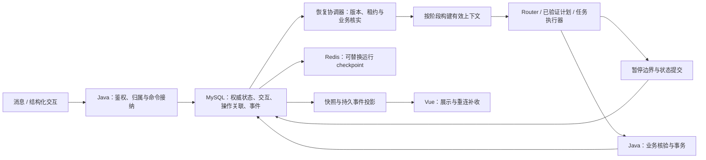

# 在线医院 Agent 断点、人工介入与重连机制设计计划

日期：2026-10-05。业务时间基准：`Asia/Shanghai`。

状态：目标设计与实施计划，尚未接入业务代码，尚未完成运行验收。

设计输入：[plan.md](<D:/刘畅/WebAI/Online hospitals/plan.md>)、[plan-context工程.md](<D:/刘畅/WebAI/Online hospitals/plan-context工程.md>)，以及前期检索并在本次重新核对的 OpenAI、Anthropic/Claude、Google ADK、Microsoft Agent Framework 和 LangGraph 官方资料。本文补充暂停、交互、运行恢复、业务结果核实与前端事件重连契约，沿用已有意图目录、Router 准入、Planner 权限和上下文分类。

本文中的状态、接口、目录和验收数字是拟实施设计。项目技术栈依据现有 README 与计划文档；本文不重新审计当前业务代码，也不把既有 Redis checkpoint 或 `/resume` 入口视为已经满足全部恢复要求。

## 1. 目标、范围与首版决策

目标是让系统在等待用户、网络断开、进程重启和业务接口结果未知时，能够说明当前进度，保留有效结果，并从经过校验的执行边界继续工作。

首版采用以下决策：

1. HITL 定义人工参与方式；Interrupt 定义暂停边界和等待条件；Checkpoint 保存恢复所需运行信息。三者与持久任务状态、执行器和上下文工程共同构成恢复闭环。
2. 区分前端连接恢复、任务执行恢复和业务事务核实。重新订阅事件不执行任务、不批准操作，也不重新发送用户消息。
3. 沿用 MySQL 权威会话/任务状态、Redis 可替换运行 checkpoint 和协调缓存的分工。Redis 丢失后仍能读取持久进度；恢复执行必须通过本文规定的核验。
4. 首版 HITL 包括补充信息、候选选择和业务确认。人工接管保留扩展契约，只有交付了真实审核角色、入口和权限后才启用。
5. 业务写入前保存固定操作参数、可信确认关联与稳定操作标识。确认接纳、开始提交和事务成功分别记录。
6. 在目标/任务边界保存进度。模型生成中断后，依据有效输入和预算重新调用；不承诺恢复模型内部推理或任意代码行。
7. 事件、状态和待交互先持久提交，随后向前端发布。用户关闭页面不影响已经持久接纳的命令；工作由受限执行器处理。
8. 首版每个会话只有一个状态协调写入者，使用版本条件更新及有期限的执行租约。独立读取可以按 plan.md 有限并行，结果由协调器串行合并；写操作串行。
9. 已成功事务不因恢复重做。已发出但结果无法确定的写操作进入 `outcome_unknown`，先向 Java 核实；写操作自动重试默认关闭。
10. 参数修改增加目标版本，失效受影响的结果适用性、候选与确认。历史事务回执保留；修改已完成业务需要形成受支持的新目标。
11. 等待人时不保留长时间数据库事务、工作线程或执行租约。等待交互过期后刷新资料并重新展示，不自动批准或简单延长旧确认。
12. 发布包锁定状态、恢复规则、图、能力目录、上下文投影和供应商适配版本；不兼容状态停止自动续跑，保留已完成结果。

首版交付范围为受控业务流程中的暂停/恢复、持久交互、进度读取、事件补收、结果未知核实、并发与故障验收。不新增诊断、处方、支付、改约或替他人办理等未注册能力。

## 2. 官方设计依据与项目采用方式

下表中的接口行为来自官方公开资料；右侧的数据模型、所有权和恢复规则是本项目的工程选择。托管服务、SDK 和框架的能力分别评估，不视为可以相互替代。

| 官方依据 | 本项目采用方式 |
|---|---|
| OpenAI Agents SDK 在需审批工具执行前返回 `interruptions` 和可恢复状态，允许序列化状态后恢复同一次运行。[Guardrails and human review](https://developers.openai.com/api/docs/guides/agents/guardrails-approvals) | 敏感工具前设置运行时门禁；持久保存待处理动作与状态，恢复同一业务目标和操作关联 |
| OpenAI Responses MCP 用 `mcp_approval_request` 与对应 `approval_request_id` 的响应关联审批。[MCP servers](https://developers.openai.com/api/docs/guides/tools-connectors-mcp) | 每个交互具有稳定引用，决定绑定具体请求、参数和展示版本；自由文本不能替代确认记录 |
| Claude Agent SDK 的 `canUseTool` 可以允许、拒绝及更新工具输入，也可以处理用户问题。[Handle approvals and user input](https://code.claude.com/docs/en/agent-sdk/user-input) | 区分确认、修改和补充；修改先更新目标及依赖，再建立与最终参数一致的新交互 |
| Claude Managed Agents 的 beta 事件协议通过 `requires_action`、阻塞事件 ID 与 `user.tool_confirmation` 表达等待和恢复。[Session event stream](https://platform.claude.com/docs/en/managed-agents/events-and-streaming) | 从持久待交互重建界面；会话中允许存在多个等待事项，不能将“继续”默认绑定到最后一张卡片 |
| Google ADK 通过 Tool Confirmation 返回布尔决定或结构化数据；启用 Resume 时需要原 `invocation_id`。该确认功能当前标为 Experimental，并有存储服务限制。[Action confirmations](https://adk.dev/tools-custom/confirmation/) | 所有输入绑定原执行实例；供应商确认/恢复能力需按锁定版本验证，不承担本地业务权威状态 |
| Microsoft 工作流在 checkpoint 中保存未完成请求，恢复时重新发出 `RequestInfoEvent`。[Human-in-the-loop](https://learn.microsoft.com/en-us/agent-framework/workflows/human-in-the-loop) | 恢复后重新展示仍有效的请求；重新展示不会创建另一次批准或事务 |
| LangGraph 的动态 `interrupt()` 配合 checkpointer 和原 `thread_id` 续接；恢复会从所在节点开头执行。静态断点用于调试。[Interrupts](https://docs.langchain.com/oss/python/langgraph/interrupts) | 交互节点保持可重入，副作用放在独立受控任务中；禁止通过重放节点再次办理业务 |
| LangGraph 区分线程状态的 checkpointer 和跨线程 store。[Persistence](https://docs.langchain.com/oss/python/langgraph/persistence) | 运行 checkpoint、持久业务状态与长期记忆分开；上下文摘要不成为业务状态或批准依据 |
| SSE 规范定义事件 `id` 与重连时的 `Last-Event-ID`。[HTML Standard](https://html.spec.whatwg.org/multipage/server-sent-events.html#the-last-event-id-header) | 设计服务端持久事件游标、重放和前端去重；应用自行负责鉴权、事件保留及断线补收 |

首版继续沿用项目的 LangGraph 编排及 Java 业务边界，不要求引入多家 Agent SDK。官方机制用于确定职责与契约，供应商私有状态由适配器管理。

## 3. 与意图识别、上下文工程和业务执行的衔接

### 3.1 三类入口

| 入口 | 处理路径 | 是否可能执行业务 |
|---|---|---|
| 新消息或自然语言修正 | 持久化原文 → RecognitionContext → IntentResult → 确定性 Router → 计划/任务处理 | 只有经注册执行路径及确认核验后可能执行 |
| 补充/选择/确认按钮 | 鉴权 → 持久交互绑定检查 → 类型化响应校验 → 状态条件提交 → 恢复调度 | 合法确认只能释放其绑定的操作 |
| 状态读取或事件重连 | 鉴权 → 权威快照/已提交事件 → 前端投影 | 不启动执行、不消费交互 |

结构化交互不需要 LLM 再判断按钮含义。它提供的信息仍需核验主体、归属、类型、版本与时效。自由文本由已有识别链理解；识别结果属于候选，批准由可信交互入口产生。

### 3.2 模块分工

| 模块 | 责任 |
|---|---|
| Java 认证与业务服务 | 当前身份、患者归属、业务权限、操作核实、幂等与事务回执 |
| 状态/交互服务 | 单一权威提交边界、版本、待交互、命令去重、租约、事件与恢复调度记录 |
| Python 意图识别与 Router | 识别自然语言目标及修正，确定合法处理路径；不从模型输出生成批准 |
| Python Planner/执行器 | 在准入范围内生成并校验计划，按任务依赖执行，在注册边界暂停 |
| 上下文服务 | 从最新状态、原文与有效证据构建阶段视图；恢复时刷新 RuntimeContext 并记录 manifest |
| Checkpoint/ProviderAdapter | 保存和加载兼容的运行续接项，核对版本；不写业务成功或确认权威状态 |
| Vue 状态与事件层 | 展示已提交进度、交互和结果，重连补收，按引用更新界面 |

首版推荐由 Java 内部服务统一管理 MySQL 权威状态，通过类型化读取/条件提交接口供 Python 使用。可在现有服务内实现，不要求新增微服务。最终目录可调整，但同一会话版本链不能由 Java/Python 各自直接覆盖。



图中的箭头表示契约调用与数据关联，不表示跨服务属于同一个数据库事务。重连入口只读取 View。

## 4. 标识、状态与不变量

### 4.1 稳定标识与重试标识

| 标识 | 生命周期与语义 |
|---|---|
| `conversation_ref` | 归属于已验证用户/患者范围的逻辑会话；前端引用不提供访问权限 |
| `goal_ref / goal_revision` | 用户目标及其参数版本；修正相关参数时版本增加 |
| `plan_id / plan_revision` | 经校验执行计划及版本；固定流程也登记对应实例版本 |
| `run_id` | 一个持久执行实例，关联目标组和计划版本；暂停/重启恢复保持不变 |
| `attempt_id` | 一次工作进程执行尝试；恢复可以增加，不改变业务操作身份 |
| `task_id` | 稳定任务身份；合法计划重建时通过映射保留已完成任务和依赖 |
| `interaction_ref` | 一次待补充、选择或确认；重新展示保持原引用，重新建立则生成新引用 |
| `operation_ref / idempotency_key` | 一次固定参数业务操作的稳定关联；网络重试不生成新关联 |
| `request_id` | 一次逻辑入口命令的去重关联；传输重试使用同一值 |
| `event_seq` | 会话内已提交事件的单调游标；不等同于 token 序号或状态版本 |
| `state_revision` | 权威状态条件提交版本；任意合法状态变化可使其增加 |
| `runtime_thread_ref / checkpoint_ref` | 引擎实例与续接位置；由服务端映射，可以在受控重建后改变 |
| `lease_epoch` | 会话执行租约的单调 fencing 版本；旧持有者不能提交新进度 |

`goal_revision`、`plan_revision` 与 `state_revision` 分别检查。插入一个独立问答使 State 版本增加，不自动让未变化目标的确认失效；确认是否仍有效由具体绑定、依赖、策略与时效决定。

重新规划增加 plan_revision，由协调器条件提交新的 run 绑定并保存旧任务映射。只有语义和输入依赖仍一致的结果可复用；受影响的未执行步骤重新登记，旧交互按绑定规则失效。已成功或结果未知操作的 task_id、operation_ref 及回执引用保持不变，不能通过改计划丢失它们。

### 4.2 状态分层

沿用 plan.md 的目标状态和任务状态，不使用一个 `paused` 布尔字段覆盖它们。

| 维度 | 状态与补充规则 |
|---|---|
| 目标 | `draft / awaiting_input / resolving / ready / executing / awaiting_choice / awaiting_confirmation / completed / failed / cancelled` |
| 任务 | `pending / running / waiting / succeeded / failed / skipped / blocked / outcome_unknown`；等待原因另存，成功结果的适用性与事务历史分别管理 |
| 运行实例 | 拟增加 `queued / running / waiting / recovering / reconciling / completed / failed / cancelled`；还有可执行独立任务时可保持 running |
| 待交互 | `pending / consumed / rejected / invalidated / expired`；记录 `response_ref`、接纳的决定和原因，消费不代表业务成功 |
| 业务操作 | 拟增加 `prepared / dispatch_pending / dispatched / succeeded / failed_not_executed / outcome_unknown / cancelled_before_dispatch` |
| 前端连接 | `connecting / connected / reconnecting / offline`；仅为界面连接状态，不决定目标或业务状态 |

业务操作的 `failed_not_executed` 只用于 Java 明确证明未发生副作用的拒绝/失败。网络异常、普通 5xx 或“暂时查不到记录”都不足以证明未执行。`dispatched` 只表示已开始发送，不证明 Java 已接纳。

运行进入 waiting 表示当前没有可继续的合法步骤。部分目标等待时，允许 plan.md 已验证的独立目标继续；不能为推进下游移除阻塞依赖。

### 4.3 必须保持的不变量

1. 一个交互最多接纳一次有效响应；重放返回已有接纳状态或结果。
2. 每次业务提交使用与确认绑定一致的固定参数，执行前重新核验当前权限及业务前置条件。
3. 同一稳定操作的重复派送由 Java 的幂等契约约束；不能只靠前端禁用按钮或 Redis 锁。
4. `succeeded` 的事务回执不能被新目标参数覆盖。历史事件重放只重建状态，不调用写工具。
5. `running` 不证明操作正在有效执行；恢复必须检查租约、派送记录及业务状态。
6. 无法核验的确认重新建立；聊天、摘要、供应商上下文和卡片截图不能补造批准。
7. 前端接收到的提交回执或 202 只说明命令接纳，不说明挂号/退号成功。
8. 原消息日期锚点保持不变；跨日恢复另外检查当前业务有效性。
9. 稳定状态与已提交事件是恢复依据；Redis、模型窗口、浏览器状态和通知都可重建。

## 5. 持久存储与提交一致性

### 5.1 逻辑实体与所有权

沿用上下文计划的 `conversation_state / conversation_events / pending_interactions / candidate_sets / task_results / operation_receipts`，补充以下逻辑实体。可以合并实现，不要求逐项独立建表。

| 实体 | 保存内容 |
|---|---|
| `execution_runs` | 目标/计划版本、运行阶段、等待原因、当前任务前沿、运行发布版本、引擎映射 |
| `execution_attempts` | attempt、租约版本、工作进程关联、开始/结束与故障原因、调用账本引用 |
| `command_receipts` | 请求去重范围、规范化命令摘要、接纳结果、处理阶段和关联交互/运行/操作；接纳与执行完成分别记录 |
| `interaction_responses` | 当前审核主体引用、输入来源、决定/类型化数据、接纳时间与绑定校验结果 |
| `execution_leases` | 当前执行持有者、期限与单调 lease_epoch；长期等待时无活跃执行租约 |
| `dispatch_outbox` | 待派送的受限恢复/执行命令或 checkpoint 更新通知，稳定消息引用与交付状态 |
| `checkpoint_metadata` | 引擎/序列化版本、对应持久 state_revision、已应用事件位置、兼容发布版本 |

`operation_receipts` 扩展记录发送前的操作关联与状态核实记录。Java 事务账本和实际业务记录仍是最终业务结果的权威来源，Python 的说明文本不是回执。

首版采用数据库快照加关键事件，不要求完整事件溯源。所有可恢复边界必须有足够的结构化快照，不能依赖无限重放历史消息。

### 5.2 一次状态变化的事务边界

同一状态服务的 MySQL 事务内提交：

```text
校验 expected_revision 与执行租约
→ 更新目标/任务/运行状态
→ 创建、消费或失效对应交互
→ 登记命令接纳或固定操作关联
→ 增加 state_revision，追加 conversation_events
→ 写入必要的 outbox 派送项
→ 提交
```

提交成功后才发布可见事件和响应接纳回执。重复接纳由唯一约束及命令回执处理。Redis 写失败、通知丢失或 SSE 断开不回滚已经接纳的状态。

Java 业务事务与编排状态提交不假设是同一事务。派送采用可重复交付、稳定操作关联、Java 幂等及事后核实；业务成功但编排记录失败时，恢复先查业务结果再补记状态。

### 5.3 Checkpoint 的保存范围

可保存：状态/计划引用与版本、任务前沿、有效结果引用、等待交互引用、调用账本位置、引擎续接关联和必要的协议项。正文按上下文计划的范围与保留政策处理，不把全部历史或档案复制进每份 checkpoint。

不保存：密码、委托令牌、Session 密钥、完整 RuntimeContext、模型内部思维链、可执行的任意代码或模型自报权限。恢复时重新构建当前 RuntimeContext。

引擎内部自动生成的 checkpoint 可能早于或晚于业务状态提交。适配器只将有对应已提交状态且版本一致的续接位置标为可恢复；未提交、超前、损坏或不兼容的 blob 不能覆盖 MySQL 状态。

恢复优先使用兼容且经核对的运行 checkpoint；不能使用时，从持久计划、任务结果和等待记录在注册任务边界重建。新的 `runtime_thread_ref` 仍绑定原逻辑运行及业务操作。

现有 README 的生产启动要求 Redis 可用。允许 Redis 丢失后重建执行，需要在后续实施中验证并调整启动/就绪策略；本文不视为已实现。首版在重建能力验收前保留写路径关闭，仍可按权限读取 MySQL 中的进度。

## 6. 暂停、交互和恢复契约

### 6.1 PauseRecord

暂停由运行时在注册边界创建，模型只能提出缺口或动作候选。

```text
pause_ref / schema_version / conversation_ref / run_id / task_id
goal_refs / goal_revisions / plan_id / plan_revision
reason / waiting_for / interaction_refs / blocked_task_ids
state_revision / event_seq / release_bundle_id
created_at / expires_at / next_check_at
```

`reason` 首版区分 `NEEDS_INPUT / NEEDS_CHOICE / NEEDS_CONFIRMATION / TRANSIENT_FAILURE / OUTCOME_UNKNOWN / MANUAL_HOLD / VERSION_INCOMPATIBLE`。`expires_at` 用于人等待的交互期限，`next_check_at` 用于受限系统核实；二者不能互换。

PauseRecord 是任务/运行等待状态的关联记录，不另建可自由更新的平行状态机。

### 6.2 PendingInteraction

在上下文计划的契约上增加必要执行与展示关联：

```text
interaction_ref / type / schema_version / status
conversation_ref / run_id / task_id / goal_ref / goal_revision
plan_id / plan_revision / release_bundle_id
required_actor_scope / response_schema_version
candidate_set_ref / candidate_revision / display_snapshot_ref
operation_ref / operation_payload_digest / semantic_dependency_versions
created_at / expires_at / response_ref / invalidation_reason
```

`type` 首版为 `input / choice / confirmation`。候选和操作字段按类型使用。`required_actor_scope` 来自身份/业务契约，不接受用户或模型自行声明审核角色。

展示快照包含实际呈现的操作类型、对象、医生/科室、绝对日期与时段等必要字段。参数摘要由服务端对版本化规范格式计算，覆盖影响业务含义的全部字段；参数摘要值不提供授权。

### 6.3 InteractionResponse

以下是拟定的业务确认命令，引用均为虚构示例：

```json
{
  "schema_version": "1.0",
  "request_id": "req-confirm-example-01",
  "interaction_ref": "i-register-02",
  "expected_goal_revision": 2,
  "display_snapshot_ref": "display-register-02",
  "decision": "approve"
}
```

客户端不提交患者身份、最终业务主键、确认完成标志、幂等键或任意工具名。服务端从有效交互绑定读取固定参数，重新核验后构造操作命令。

选择响应携带交互绑定内的候选引用，不携带可任意替换的业务对象。补充和修改携带符合 `response_schema_version` 的字段；修改不与批准共用同一个 `approve=true` 标志。

### 6.4 ResumeRequest / ResumeDecision

显式续跑入口接收 `request_id / conversation_ref / run_id` 和可选的当前交互引用。具体目标、待执行任务、恢复模式和允许操作由服务端计算，不接纳客户端指定的任意 checkpoint 或恢复节点。

恢复协调器输出内部 ResumeDecision：

```text
run_id / attempt_id / state_revision / lease_epoch
mode: native_resume | rebuild_at_task_boundary | reconcile_only | wait | reject
reason_code / valid_task_ids / blocked_task_ids / interaction_refs
checkpoint_ref / release_bundle_id / refreshed_context_requirements
```

`native_resume` 只用于引擎协议及版本兼容的续接；`rebuild_at_task_boundary` 从本地状态重建；`reconcile_only` 只核实已有操作；`wait` 返回仍需等待的条件。`reject` 保留具体原因及可显示进度。

所有契约采用封闭 Schema。供应商对象、历史消息文本及客户端参数不直接反序列化为可执行对象。

## 7. 暂停协议与 LangGraph 接入

### 7.1 正常人工等待

1. 执行器发现用户必填信息缺失、候选不唯一或操作需要确认，形成类型化等待需求。
2. 读取当前状态，核验目标、任务、计划、上游结果和 Policy。
3. 持久提交等待状态、交互展示快照及事件；已有相同逻辑等待记录时复用，不重复创建卡片。
4. 将已提交交互引用传给引擎的暂停适配器，并登记兼容 checkpoint 元数据。
5. 返回本轮已完成结果和待交互，释放执行租约与模型工作窗口。
6. 前端从持久事件或快照展示卡片。长时间等待由持久记录维持，不保持一个等待输入的工作协程。

MySQL 已保存等待但引擎尚未写入 checkpoint 时进程崩溃，可以从持久边界重建等待。引擎先写入的内部位置只有在对应状态提交确认后才能用于恢复。

### 7.2 可重入的交互节点

LangGraph 恢复可能从节点开头重新运行。交互节点只读取状态、查找已创建交互、构造必要输入和调用动态 `interrupt()`，不在 `interrupt()` 前后夹带未经控制的业务写入。

创建交互采用稳定逻辑去重键，例如 `(run_id, task_id, goal_revision, wait_kind, dependency_digest)`。相同等待重新进入时，读取既有有效记录；展示内容或绑定变化时，旧记录失效并显式建立新交互。

`Command(resume=...)` 只能由适配器根据已持久接纳的响应构造。传入交互/响应引用，节点读取并校验对应正式数据，不能把模型文本或未校验客户端 JSON 直接送入执行。

多交互恢复使用锁定版本支持的明确 interrupt 关联。首版避免在一个节点中依靠可变调用顺序放置多个 `interrupt()`；多项等待分成稳定任务。静态 `interrupt_before / interrupt_after` 仅用于开发调试。

正常暂停异常不得被通用异常处理器吞掉并改写为模型/工具失败。恢复输入未通过交互 Schema 校验时保留等待，不进入业务执行；适配器按锁定版本的暂停协议向上层报告。

### 7.3 暂停期间仍可处理的工作

相关目标等待时，独立且符合权限、依赖、并行预算的只读目标可以继续。普通问答不消费挂号确认。挂号/退号互有对象冲突时按能力目录串行，不能通过另一个 Agent 绕开等待。

## 8. 人工输入、意图识别与上下文工程

### 8.1 输入处理规则

| 输入 | 处理 |
|---|---|
| 点击批准 | 按 interaction_ref 直接核验绑定；不经 LLM 重新判断是否同意 |
| 点击拒绝 | 持久拒绝该交互及相关未提交动作；不自动重新规划同一写操作来重复索取确认 |
| 点击候选 | 核验候选集、版本、展示关联和归属，再解析为可信业务实体 |
| 表单补充字段 | 校验字段、目标绑定与时间锚点，提交后构建新的阶段视图 |
| “确认挂号” | 仅在严格控制规则、唯一有效确认和明确完整表达同时满足时接入可信确认入口；否则澄清 |
| “可以，但改成明天下午” | 识别为目标修正，更新参数与版本，失效旧确认；对最终操作重新展示确认 |
| “继续”“就那个” | 从有效开放目标/交互定位；有多个可能对象时澄清，不默认最近一项 |
| “先不挂了” | 未提交时撤回草稿；已有在途/未知操作时先核实，不认定业务已撤销 |
| 等待期间的新问题 | 识别为独立目标，保留原等待状态与交互 |

沿用 `IntentResult.turn.action` 的 `new_request / continue_goal / revise_goal / cancel_draft / unclear`。交互的批准/拒绝记录放在独立 InteractionResponse 中，不通过新增语义标签让模型产生批准事实。

### 8.2 恢复所需上下文

恢复前由上下文服务读取最新状态，再按原计划构建 RecognitionContext、PlanningContext、TaskContext 或 ResponseContext：

- 当前原文/人工输入及不可变证据引用、消息时间锚点。
- 当前目标、槽位来源、目标版本、计划依赖和未完成事项。
- 有效已完成结果、仍待处理的交互和实际展示内容。
- 当前调用所需的资料与工具子集，以及经过核对的供应商协议关联。
- 运行时核验结果的必要投影；完整令牌与确认凭据留在服务端。

不把整个 checkpoint 原样发给模型。摘要用于定位历史，当前目标、交互和回执从权威记录读取；资料刷新、调用及补取继续计入统一预算和 manifest。

参数修正沿依赖图传播。已成功读取结果保留历史记录，同时标记是否仍适用于当前目标；已成功写回执始终保留，不能通过状态重建抹除。

## 9. 执行恢复与系统重启协议

### 9.1 恢复入口与启动扫描

触发来源为已接纳人工响应、显式续跑命令、工作进程重启、过期执行租约扫描或受限操作核实。事件重连和页面打开不属于执行触发来源。

启动扫描只处理本服务获准范围内的 queued、租约过期的 running、需核实的 outcome_unknown 和待派送项。等待用户的交互重建展示，不因重启自动批准或重新调用模型。

### 9.2 恢复算法

```text
鉴权并验证用户/患者/会话/运行归属
→ 查询命令回执，处理同一 request_id 重放
→ 读取 MySQL 最新快照、关键事件及运行发布版本
→ 核验状态完整性和版本兼容，取得新执行租约
→ 先核实在途或结果未知的写操作
→ 校验目标、依赖、候选、交互与已接纳响应
→ 刷新动态业务数据和当前 RuntimeContext
→ 选择兼容 checkpoint 或注册任务边界重建
→ 按阶段构建上下文，使用剩余预算执行有效任务
→ 条件提交结果及事件，失败则保留具体等待/终态
```

恢复伪代码表达处理顺序，不对应已存在接口：

```python
def resume_entry(validated_command):
    scope = authenticate_and_authorize(validated_command)
    receipt = accept_once_with_outbox(scope, validated_command)
    return authorized_current_view(receipt)


def recover(work_ref):
    work = load_registered_work(work_ref)
    scope = refresh_current_runtime_scope(work)
    state = load_authoritative_state(scope)
    validate_release_and_state(state)
    state, lease = claim_registered_work_and_lease(work, state)
    try:
        state = reconcile_dispatched_operations(state, lease)
        decision = decide_resume_from_current_bindings(state, work)
        if decision.mode in {"wait", "reject", "reconcile_only"}:
            return commit_or_read_progress(decision, state, lease)
        context = build_current_stage_context(state, decision)
        return execute_registered_tasks(decision, context, lease)
    finally:
        release_execution_lease_if_owned(lease)
```

HTTP 接纳去重与后台工作认领分别实现：已有命令回执只说明已接纳，未完成的持久工作仍可被受控恢复。已完成工作、有效租约内工作及同一工作项的重复交付由认领协议返回相应状态，不能仅凭“回执已存在”跳过全部恢复。

实际实现使用唯一约束、条件提交和持久调度，不能通过“先查不存在，再直接执行”规避并发命令接纳。系统扫描创建的恢复工作也须登记受限类型、原运行及操作关联；服务身份不自动取得用户的业务批准。

### 9.3 按任务状态恢复

| 持久情况 | 处理 |
|---|---|
| succeeded 写任务 | 读取回执，补记缺失的关联状态；不再发起写请求 |
| succeeded 读任务 | 检查目标/来源/时效；有效则复用，过期则创建受控刷新步骤 |
| waiting，交互仍有效 | 展示既有交互，或应用已接纳响应后继续 |
| waiting，交互过期/失效 | 刷新候选/条件，建立新的交互；不恢复旧批准 |
| running，当前租约有效 | 返回执行中，不另启动第二个执行者 |
| running，租约已过期 | 读任务按预算恢复；写任务先查派送记录和 Java 状态 |
| outcome_unknown | 进入 reconciling，保持原 operation_ref，阻塞冲突写任务 |
| failed/blocked | 仅按已注册恢复规则重试或等待；保留原因及独立结果 |
| checkpoint 缺失但持久状态完整 | 在已登记任务边界重建；仍有效的专门确认记录经完整核验后可使用 |
| 状态/确认无法核验 | 保留可核实结果，停止受影响续跑并建立必要的新交互 |

核实 running/outcome_unknown 先于重新规划。不能重新生成整个计划，再通过新的 task_id 或 operation_ref 绕开未确定操作。

## 10. 业务写入、未知结果与幂等

### 10.1 固定参数与提交链路

业务写入采用受控操作包：操作类型、患者范围引用、实际业务对象、最终参数、目标/任务/计划版本、可信确认引用、参数摘要和稳定 operation_ref。实际身份由当前 Java 认证/委托核验提供。

链路为：

```text
准备固定操作并展示
→ 接纳有效确认
→ 同一状态事务登记确认消费、dispatch_pending 与 outbox
→ 执行者认领派送，检查租约及当前执行许可
→ Java 再核验权限、参数、确认依据与业务前置条件
→ Java 事务提交并保存可查询回执
→ 编排层核对回执并提交任务结果
```

确认状态和操作派送关联可以原子提交；用户等待与 Java 业务事务不放在同一个长事务中。供应商工具审批仍须映射到本项目可信确认机制。

### 10.2 三种去重分别实现

| 机制 | 去重对象 | 约束 |
|---|---|---|
| 命令去重 | 重复消息、确认或续跑 HTTP 请求 | 同范围同 request_id、同规范化内容返回既有回执；内容不同返回冲突 |
| 交互消费 | 同一交互来自多个标签页/不同 request_id 的响应 | 唯一有效响应，重复返回已有状态；互相冲突的决定不覆盖 |
| 业务幂等 | 同一固定操作的多次发送 | Java 按稳定 key 处理；同 key 不同参数拒绝，成功结果可查询 |

首版写自动重试保持关闭。未来只有能力目录明确登记并验证幂等、参数绑定、状态核实和前置检查后，才允许同一操作受控再派送。

### 10.3 不确定结果的核实

Java 拟提供类型化操作状态核实契约，表达 `succeeded / rejected_not_executed / processing / not_found / unknown`，携带 operation_ref、结果版本和必要回执引用。实际能否提供以集成验收为准。

- `succeeded`：补齐本地回执及成功状态，不重复办理。
- `rejected_not_executed`：记录明确失败；需要新选择/参数时按新版本处理。
- `processing`：等待并受限核实，阻塞冲突写入。
- `not_found`：只表示查询未发现。可能存在迟到请求或事务可见性延迟，不能直接认定未执行。
- `unknown` 或核实不可用：保持 outcome_unknown，返回进度，必要时转获准人工处理。

只有 Java 幂等账本、派送防重及执行边界共同证明可安全再派送时才开放恢复写入。首次发送后连接取消、Python 崩溃或本地 lease 失效，不证明 Java 事务已经停止。

挂号与退号分别验收。沿用 plan.md 对挂号既有幂等基础的描述；退号不假设已有等价能力。核实接口或幂等契约缺失时关闭相应自动写恢复，不用新 key 重试。

### 10.4 修改、撤回与已发出操作

未派送操作被修改时，失效原确认并撤销原 prepared/dispatch_pending 项，确定未发出后才建立新固定操作。已派送或未知操作先核实；新参数只形成待处理修正，不并行提交第二次写入。

用户撤回草稿通过条件提交撤销未派送项。用户要求停止时设置 `cancel_requested`，取消尚未派送任务；在途操作继续核实并说明结果。已成功挂号的退号是新的受控业务目标，不由 checkpoint 回滚实现。

## 11. 前端重连、快照与事件补收

### 11.1 重连协议

前端打开或刷新会话时，读取一个包含 `state_revision`、`snapshot_event_seq`、消息结果、运行进度及待交互的权威快照，再从 `snapshot_event_seq` 之后订阅事件。

快照状态与游标通过一致性读取获得，表示该快照已覆盖的同一提交位置。事件服务持续从持久日志读取，不把 Redis Pub/Sub 或进程内通知当作唯一来源。先回补再持续读取，避免“回补完成到建立订阅之间”的丢事件窗口。

已有页面断线时用最后成功应用的事件游标重连，先去重并应用完整事件，再推进游标。跨页面重新打开默认加载快照，不能只凭浏览器保存的旧游标恢复界面。

原生 EventSource 在重连时使用 `Last-Event-ID`；若现有前端是 fetch POST 流，则由封装器显式保存并提交游标，不假设浏览器自动处理。兼容协议通过独立订阅入口或版本协商接入。

初次订阅的显式 cursor 用作起点；存在有效 Last-Event-ID 时按该重连游标读取，避免固定订阅 URL 中的旧起点覆盖浏览器新游标。事件处理异常时关闭流并按应用最后成功游标或新快照重建，不能仅依赖浏览器已经接收的事件 ID 证明界面已应用该事件。

### 11.2 持久事件与实时文本分别管理

可重放的持久事件至少包括 `state.changed / run.waiting / interaction.created / interaction.invalidated / command.accepted / operation.outcome_unknown / task.result / response.committed / run.finished`。事件名称为拟定版本化契约。

事件在提交后形成，展示内容经过输出规则校验。普通日志只记录引用、版本和原因，事件接口则按当前权限投影必要用户内容；二者不共用未过滤的内部 payload。

以下为拟定 SSE 帧，引用均为虚构：

```text
id: evt-c7-104
event: interaction.created
data: {"schema_version":"1.0","event_seq":104,"state_revision":18,"run_id":"run-7","interaction_ref":"i-register-02","type":"confirmation","display_snapshot_ref":"display-register-02"}

```

事件 ID 是绑定会话的游标，不是授权凭据。客户端不能凭它读取其他会话。内部事件经过权限投影后可能出现序号跳跃，不能仅因不连续判断消息丢失。

模型文本 delta 首版为实时预览，使用 `message_ref / generation_id / chunk_seq`，不承诺逐 token 持久重放。预览不推进持久事件游标，预览事件不携带会覆盖 Last-Event-ID 的新 `id`。断线后由已提交正文替换预览；若生成中断，则标记未完成，后续新 generation 替换同一消息展示槽位，避免重复拼接。

`response.committed` 包含正文版本/引用，通过权威消息接口读取完整结果。最终业务成功仅根据可信 TaskResult/回执展示。

### 11.3 游标失效与前端收敛

| 情况 | 前端/服务端处理 |
|---|---|
| 重复事件 | 按 event_id/seq 去重，交互/消息按稳定引用更新，不追加重复卡片 |
| 连接中断 | 保留已应用游标，重订阅事件；不重发原聊天或确认 POST |
| 游标早于保留下界 | 返回 `EVENT_CURSOR_EXPIRED`，重新读取快照；不重跑业务 |
| 游标超前或不属于会话 | 返回游标错误并重新同步；先做身份和归属检查 |
| 确认请求 ACK 丢失 | 用原 request_id 查询或重试同一命令；消费约束与 operation_ref 保持不变 |
| 多标签页确认/修改冲突 | 返回最新交互状态，移除失效控制项并同步快照 |
| 认证过期或权限撤销 | 停止订阅并重新认证；认证不等于批准待办操作 |
| 持久事件读取不可用 | 标记进度暂不可同步，保留已有结果；不启用业务自动重试 |

重连按钮与继续办理按钮分开表达。前端显示“等待确认”“正在核实结果”“已完成”等业务状态；网络连接失败不将任务改成失败，也不将连接成功展示为业务成功。

## 12. 增量 API 与兼容方案

以下是逻辑 API 草案，最终映射到现有 Java `/api/**` 网关和内部 Python 路由。路径示例不表示当前已存在这些接口。

| 逻辑接口 | 示例 | 语义 |
|---|---|---|
| 读取会话快照 | `GET /api/ai/conversations/{ref}/state` | 读取已提交进度与待交互，不启动工作 |
| 订阅/补收事件 | `GET /api/ai/conversations/{ref}/events` | 接收 Last-Event-ID 或显式 cursor，鉴权后回补 |
| 提交交互响应 | `POST /api/ai/interactions/{ref}/responses` | 接纳补充、选择、修改或确认；按稳定 request_id 去重 |
| 显式任务续跑 | `POST /api/ai/runs/{ref}/resume` | 服务端确定恢复模式；当前仍需输入时返回等待 |
| 查询命令接纳结果 | `GET /api/ai/commands/{request_id}` | 解决 ACK 丢失；核验请求归属和当前展示权限 |
| 撤回未完成目标 | `POST /api/ai/goals/{ref}/cancel` | 条件撤回未派送步骤，在途操作先核实 |

既有 `/resume` 可成为新交互入口的兼容适配器，但必须保留可信确认核验并对齐新引用/版本。旧客户端缺少必要绑定时通过服务端可验证映射处理；映射有歧义或不可核验时要求刷新，不猜测目标。

响应状态建议：成功读取/命令重放为 200；新命令持久接纳为 202；认证失败 401；归属或权限拒绝 403/不泄露存在性的 404；版本/重复内容冲突 409；交互或游标过期 410；无效字段 422；关键状态/核实服务不可用 503。错误包含稳定 reason_code 和获准的刷新建议。

request_id 按已验证主体、会话和命令类型隔离，服务端校验格式并计算规范化命令摘要。相同键改变内容返回 409；刷新后需要修改命令时使用新 request_id，但仍绑定原交互/操作，不能生成第二次业务动作。

先鉴权，再查询去重回执；有效命令重放优先返回已有状态，不因原卡片后来过期而把已经接纳的操作误报成未发生。返回内容仍执行当前访问权限检查。

保留现有 Vue/Java/Python 请求结构的兼容映射，事件协议通过明确版本协商或独立 v2 入口发布。新旧客户端都不得使用“自动重发 POST 原请求”实现断线重连。凭据不放在重连 URL 或事件游标里。

## 13. 并发、版本与执行租约

### 13.1 租约和 fencing

状态协调器在 MySQL 条件更新中认领执行租约并增加 lease_epoch。Redis 锁作为快速协调辅助；不能只凭它的存在或丢失决定操作执行权。

每次提交任务结果和认领派送项检查 `state_revision`、lease_epoch 与租约期限。心跳续租失败后停止新的模型/工具调用，丢弃过期候选；已经发出的外部操作进入核实。

fencing 保护本地提交与派送认领。Python 租约不能撤销已发往 Java 的请求；重复/迟到外部请求还需 Java 幂等与固定参数核验。服务支持时将操作派送版本纳入 Java 校验契约。

等待人工时释放租约；收到新命令后重新认领。模型调用及读取在声明预算内执行，提交前再次核验输入版本。

### 13.2 竞态处理

| 竞态 | 规则 |
|---|---|
| 两个批准同时到达 | 唯一消费一个交互；其余返回已有接纳结果，不新建操作 |
| 批准和修改同时到达 | 在同一状态版本条件提交链上确定先后；未派送时修正撤销待派送项，已派送时核实后处理修正 |
| 旧模型输出晚于新修正 | 目标/依赖版本不匹配则丢弃，不覆盖新状态 |
| worker A 租约过期，B 恢复 | A 的旧 epoch 不能提交或认领新派送；已发出的请求按原 operation_ref 核实 |
| 普通问答增加 State 版本 | 协调器重新读取后检查确认的具体依赖，不一律作废所有卡片 |
| 重新规划与旧确认到达 | plan_revision/目标绑定不兼容则拒绝旧确认，已完成事务保持历史 |
| 系统核实与人工核实同时完成 | 同一 operation_ref 条件更新；结果一致合并，矛盾回执停止推进并审查 |

版本冲突时重新读取，有限重新计算确定性提交；不能为解决冲突重跑整个 Agent 图或重新调用写工具。独立并行读取结果由单一协调器合并。

## 14. 故障、版本、生命周期与预算

### 14.1 故障处理矩阵

| 故障 | 处理 |
|---|---|
| MySQL 状态服务不可用 | 不接纳依赖状态的确认/续跑，不发起新写；明确状态暂不可读取 |
| Redis/checkpoint 丢失 | 读取 MySQL 并核实已有操作；重建路径未验收前关闭受影响执行，进度读取可保留 |
| 暂停提交成功、checkpoint 未保存 | 恢复持久等待边界，不再创建重复交互 |
| 确认消费成功、worker 未收到命令 | outbox 重交付同一命令，保持原操作关联 |
| Java 成功、本地回执未落库 | 按稳定关联核实并补记，不重复办理 |
| SSE 输出中断 | 仅补收状态/正文，预览可替换；不消费交互 |
| 模型中途失败 | 丢弃未提交候选，从有效阶段输入按剩余预算恢复；不把片段当完整计划 |
| 权限撤销或患者范围变化 | 停止相关读取与新执行；在途事务依据业务状态核实并按当前权限展示 |
| 供应商 session/私有续接项丢失 | 本地重建模型视图，保持目标/操作身份，不恢复隐含批准 |
| 数据来源撤销或被删除 | 失效相关上下文/缓存，必要证据无法取得时停止对应任务 |
| 发布版本不兼容 | 采用经过验收的迁移；否则阻塞未执行步骤，保留回执并重建必要交互 |

### 14.2 生命周期与初始配置

以下是待压测起点；业务确认时效、数据保留期和权限规则由对应策略制定，不套用同一个 TTL。

| 配置 | 建议起点或规则 |
|---|---|
| 前端重连退避 | 约 1/2/4/8 秒递增，上限 15 秒并加入抖动；认证/游标错误走专门恢复 |
| SSE 心跳 | 约 15 秒，代理空闲超时留足余量；上线前验证 Nginx/OpenResty 缓冲与超时 |
| 执行租约 | 可从 30 秒、10 秒续租起步；按调用时长、调度延迟与故障检测压测 |
| 自动故障恢复 | 同一故障事件最多 2 次受限尝试，另受已有调用预算及截止时间限制 |
| 操作核实 | 指数退避，设置最大次数和总窗口；无法确定时保持未知并停止自动循环 |
| checkpoint 保留 | 配置化缓存期限；到期不删除权威任务、交互或事务回执 |
| 交互有效期 | 按候选/操作类型及业务政策；执行前仍核验实时条件，不自动续期 |
| 事件重放保留期 | 遵循会话数据政策；超出可重放窗口使用快照，不为永久补收复制全部原文 |
| 调用预算 | 沿用 plan.md：识别最多 3 次、Planner 最多 2 次、读重试最多 1 次、写自动重试默认关闭 |

同一逻辑命令的多个 attempt 共享调用账本；自动故障恢复、SSE 重连不重置预算。新的有效人工输入或显式续跑命令可以获得新处理窗口，沿用稳定目标、任务和操作关联，且不重做已成功步骤。

等待用户不占用活动调用时长，但交互期限继续流逝。系统恢复不得通过无限自动生成新 request_id 获取新预算。状态核实使用独立受限预算，并纳入整体成本与延迟报告。

普通事件保留、确认审计与操作幂等账本分别制定生命周期。未核实操作及仍可能发生的迟到派送必须保留关联或防重信息；删除/脱敏方案不能使同一 key 再次办理，也不能从旧 checkpoint 重新导入已删除敏感内容。

### 14.3 版本迁移

运行记录固定原 `release_bundle_id`。新部署加载允许恢复的旧发布契约，或使用显式状态/任务/交互迁移映射。注册兼容规则需要覆盖任务 ID、参数含义、确认展示、能力及图边界。

迁移事务不执行业务，不改变已有成功回执。无法证明兼容的待执行步骤进入版本阻塞；原确认失效后重新展示最终操作。切换供应商只更换模型协议适配，不增加业务权限。

## 15. 完整场景示例

以下使用虚构引用，示例只说明目标行为。

### 15.1 挂号确认前刷新页面

2026-10-05 收到“查儿科明天上午的号”。目标日期绑定 2026-10-06；查询、选择后建立 `g1@2 / i2 / op2`。

页面关闭前没有提交确认。再次打开时读取快照，发现 i2 仍在等待；服务端核验时效后展示原卡。读取快照和订阅事件不会提交 op2。卡已过期时刷新数据并建立新交互；历史“明天”仍对应 2026-10-06。

### 15.2 确认 ACK 丢失，随后 Java 成功

用户提交 request_id=q2，服务端持久消费 i2 并登记 op2，响应在网络中丢失。前端查询/重试 q2 获得既有接纳回执，不创建 op3。

Java 成功后 Python 崩溃，状态暂为 dispatched/outcome_unknown。恢复者核实 op2，取得真实回执后补记成功并发出 task.result/response.committed。重复 i2 确认仍返回同一操作进度。

### 15.3 确认与“改成下午”并发

修改先接纳时，g1 增加版本，i2 与未派送 op2 撤销；旧确认返回已失效，查询下午候选并生成新确认。

确认先接纳但未派送时，修改可以在同一协调链上撤销待派送项；若 op2 已开始派送，则先核实，暂停冲突修改。已成功挂号不会被改写成下午挂号；后续只能采用目录支持的新业务流程。

### 15.4 Redis 丢失，但 MySQL 等待状态完整

恢复者从 execution_runs、pending_interactions、task_results 与 operation_receipts 重建当前任务边界。重新认证并核验 i2 的固定参数、目标/计划版本、期限与当前业务条件后，仍有效的专门交互记录可以继续；不存在或不可核验的批准要求重新建立。

若重建适配尚未交付，返回进度和恢复受限原因，不将历史对话发送给全工具 Agent 代办。

### 15.5 两个目标分别等待，中间插入问答

g1 等待医生选择，g2 等待挂号确认。用户询问科室介绍时创建独立只读目标，不消费两个交互。随后说“继续”时存在多个可能对象，识别层输出澄清；点击 g2 的明确确认按钮只处理其绑定操作。

### 15.6 写结果一直无法核实

退号请求发出后超时，Java 暂无足够核实/幂等能力。目标保留未确定状态，显示“正在核实/结果暂不能确认”，达到核实预算后停止自动查询；已交付正式人工处理入口时按权限提供转交，否则明确说明处理受限并保留可查询进度。不能报告退号失败后重新发起另一笔退号。

## 16. 实施位置、阶段与依赖

### 16.1 拟新增或调整的模块

以下路径为目标职责划分，可按现有工程调整，不表示文件已经存在。

```text
ai-python/app/recovery/
  contracts.py             PauseRecord、ResumeRequest/Decision、CheckpointMetadata
  coordinator.py           恢复分类、任务前沿与受限调度
  checkpoint_adapter.py    引擎版本、续接位置与任务边界重建
  interaction_adapter.py   可信响应到 interrupt/resume 的映射
  reconciliation.py        Java 操作状态核实与未知结果处理
  state_client.py          Java 状态/条件提交契约适配

ai-python/app/orchestration/executor.py
  注册任务执行、租约检查、交互门禁与状态提交
ai-python/app/graphs/hospital/confirmation.py
  既有确认入口的绑定、版本与重复响应兼容
ai-python/app/api/routes/chat.py
  消息/续跑接纳与独立事件订阅的内部适配

backend-java/.../ai/
  权威状态Repository、交互/命令服务、执行租约与Outbox
  快照/事件Controller、内部条件提交DTO、操作状态核实接口
  业务确认关联校验与挂号/退号幂等适配

frontend/src/features/assistant/
  interactionClient        类型化交互请求与命令回执查询
  eventStream              游标、退避、补收与预览/正文区分
  conversationState        快照合并、版本与失效卡片处理

ai-python/config/
  recovery_policy.v1.json   注册恢复模式、预算与版本兼容
docs/SQL/migrations/
  版本化状态、交互、命令、运行、租约与操作关联增量迁移
```

沿用现有 JSON 配置和类型化契约。恢复服务、上下文服务和 Policy/Fallback 为运行时组件，不新增自由决策 Agent。数据迁移通过既有发布方式实施，不在本次文档交付中执行。

### 16.2 阶段与完成条件

| 阶段 | 交付 | 完成条件与前置依赖 |
|---|---|---|
| B0 契约与恢复策略 | 状态/ID/错误码、恢复模式、交互Schema、版本兼容规则 | 与 P0、C0 对齐；批准/执行/成功分开 |
| B1 权威状态与命令接纳 | MySQL 快照/事件、交互、去重、租约、outbox | 配合 P1/P2、C1；提交/崩溃窗口有确定结果 |
| B2 动态交互与目标续接 | input/choice/confirmation、自然语言修正接入、引擎可重入节点 | 配合 P2/P3、C2；无错误绑定和旧确认消费 |
| B3 运行恢复与未知结果核实 | checkpoint兼容、边界重建、启动扫描、Java核实/幂等集成 | 配合 P4、C3；真实业务成功不可重复，未知不可盲写 |
| B4 前端重连闭环 | 快照+事件补收、预览替换、多标签页、ACK丢失处理、旧协议适配 | 暂停与断线后页面收敛，订阅不会触发执行 |
| B5 故障与发布验收 | 测试矩阵、真实Java故障注入、并发/压测、灰度和回滚 | 配合 P5、C4；关键不变量通过并留运行证据 |
| B6 可选扩展 | 正式人工审核/接管、供应商托管续接、更细粒度并行 | 独立角色/权限及恢复验收完成后开放 |

阶段不是日历工期承诺。B1—B4 中影响确认、重复写入、未知结果和页面恢复的能力必须在写灰度前完成；不能仅交付 Redis 中断演示后开放生产写入。

首版最小闭环为：持久任务/交互、唯一命令接纳、稳定操作关联、任务边界恢复、Java 状态核实、快照与事件补收、统一调用账本和并发故障证据。

## 17. 验收方案

### 17.1 必须覆盖的场景

每项补齐明确输入、持久状态、故障位置、期望转换、实际 Java 调用及数据库断言。下表为待执行验收要求。

| 编号 | 场景 | 必须验证 |
|---|---|---|
| B01 | 缺少用户信息暂停 | 仅相关任务waiting，原文/有效槽位保留，无业务写入 |
| B02 | 多医生候选选择 | 选择绑定实际展示候选，不默认首个匹配 |
| B03 | 业务操作需要确认 | 卡片绑定最终参数/目标版本，批准前无写调用 |
| B04 | 等待中插入独立问答 | 原交互保留，问答不消费确认 |
| B05 | 两个等待对象加“继续” | 澄清对象，不绑定最近卡片 |
| B06 | “可以，但改下午” | 修正版本并失效旧确认，最终参数重新展示 |
| B07 | 纯文本查询含“确认” | 不接纳为业务批准 |
| B08 | 目标/候选/计划过期 | 拒绝旧响应，刷新并建立新交互 |
| B09 | 暂停落库前崩溃 | 前端不展示未提交确认，恢复不造批准 |
| B10 | 暂停落库后、checkpoint前崩溃 | 重建同一等待记录，无重复卡片 |
| B11 | 确认消费后、派送前崩溃 | outbox重交付同一操作关联，无第二次接纳 |
| B12 | Java成功、本地落库前崩溃 | 核实并补记成功，无重复事务 |
| B13 | Java超时但已成功 | 结果未知转真实成功，不新key重试 |
| B14 | Java显示not_found、旧请求可能迟到 | 不认定未执行，不创建替代写操作 |
| B15 | 退号缺少核实/幂等契约 | 关闭自动写恢复，明确保持未知 |
| B16 | Redis完全丢失 | MySQL进度可读，恢复从验收过的任务边界进行 |
| B17 | 持久交互记录丢失但聊天仍在 | 不从文本/摘要恢复批准 |
| B18 | 同request_id重放/改变内容 | 同内容去重，不同内容冲突 |
| B19 | 不同request_id重复确认 | 交互唯一消费、同一业务操作 |
| B20 | 多标签页批准与拒绝并发 | 决定不互相覆盖，已有操作状态明确 |
| B21 | 批准与修改并发 | 遵循条件提交先后；在途操作先核实 |
| B22 | 旧worker租约过期后返回 | 旧epoch不能提交/派送，外部结果按稳定关联核实 |
| B23 | 新修正后迟到模型结果 | 旧目标/依赖版本结果丢弃 |
| B24 | 普通问答改变全局State版本 | 未变化交互可重新核验，不一律失效 |
| B25 | 跨日恢复“明天” | 2026-10-05原文仍绑定2026-10-06，实时检查可执行性 |
| B26 | 重连事件重复/乱序交付 | 去重更新，无重复卡/重复正文，无隐式执行 |
| B27 | 快照到订阅之间有新事件 | 持久回补完整，不丢状态变化 |
| B28 | 游标过期/超前/跨会话 | 正确拒绝或快照同步，不泄露其他会话 |
| B29 | 文本生成中断后重连 | 预览标记未完成，正文替换，不重复拼接 |
| B30 | 确认ACK丢失后刷新页面 | 命令回执/交互状态可核实，不多次办理 |
| B31 | 认证过期、权限撤销、患者切换 | 读取和执行重新核验，不能沿旧RuntimeContext写入 |
| B32 | 模型/工具正文伪造批准或operation_ref | 拒绝权威字段，不消费交互或扩大工具范围 |
| B33 | 有号条件的上游查询故障 | 条件unknown，不走“否则”或挂号分支 |
| B34 | 发布/供应商续接状态不兼容 | 注册迁移或明确阻塞，不重复成功步骤 |
| B35 | 自动重连/多attempt导致隐含调用 | 共享账本，无预算重置或隐藏无限重试 |
| B36 | 撤回发生在派送前/派送后 | 前者条件撤销，后者先核实，不谎报已取消事务 |
| B37 | 持久服务、通知或SSE分别故障 | 接纳事实与交付分离，恢复后状态收敛 |
| B38 | 来源删除、缓存/旧checkpoint仍存在 | 不重新导入被禁用资料或历史批准 |
| B39 | 一个目标成功、另一目标等待/失败 | 如实展示部分结果，依赖保留，成功写不重做 |
| B40 | 旧客户端/resume兼容 | 绑定可核验才接纳；断流重试不能绕过新契约 |
| B41 | 正常暂停被通用异常捕获/恢复字段无效 | 正确保留waiting，无故障重试或无效输入写入 |
| B42 | 命令已接纳但工作未完成 | 去重返回回执，后台仍能认领原工作；不会因回执存在永久漏执行 |

### 17.2 验证方式与发布门槛

1. 契约/确定性测试：状态转移、引用、版本、时间锚点、去重、游标、参数摘要与恢复分类。
2. 模型评测：沿用 plan.md/上下文计划的语义门槛，另分项报告等待对象绑定、自然语言修正和新任务识别；结构化按钮不计为模型识别成绩。
3. 真正的 Java 集成：验证归属、确认、幂等账本、事务成功与状态核实；Python mock 不能证明业务写恢复有效。
4. 故障注入：在暂停/确认/派送/事务提交/回执落库/事件发布之间逐点杀进程、断网和重启。
5. 并发重放：多worker、多标签页、旧租约、旧卡片、迟到请求和租约/版本竞争。
6. 前端与代理验证：刷新、离线重连、事件补收、fetch/EventSource封装差异、代理缓冲/超时、旧协议兼容。

| 指标 | 拟定发布门槛 |
|---|---|
| 关键不变量 | 固定契约与真实集成套件中100%满足；错误主体写入、旧确认写入、重复业务写入为0 |
| 可恢复状态 | 固定故障矩阵中完整状态正确恢复；无法核验项明确等待/阻塞，不错误宣称成功 |
| 事件/界面收敛 | 固定补收矩阵中最终状态与权威快照一致，重复卡片/正文为0 |
| 自然语言绑定/修正 | 沿用目标/指代≥97%、关键参数≥98%的初始目标，报告样本量、分项及置信区间 |
| 进度读取性能 | 建议指定资源/并发下快照P95≤1秒；单独报告数据库、网关及网络耗时 |
| 恢复性能 | 单独报告恢复决策、Java核实、模型生成及首个持久进度事件的P50/P95/P99；不能合成一个无环境说明的“秒级恢复”成绩 |
| 调用预算 | 自动重连不增加模型/写调用；所有attempt、核实、修复计入账本并遵守截止时间 |
| 可观测性 | 每个接纳、暂停、恢复、核实和终态可关联稳定引用、版本与reason_code |

上述门槛尚未执行。场景套件零错误不表示线上绝无错误；发布需要固定报告、真实业务证据和可执行回滚。文档、合法JSON、框架中断演示或SSE能重新连接均不能单独作为验收完成依据。

## 18. 观测、发布与待验证项

### 18.1 观测与审计

事件关联至少包括 request_id、conversation_ref、goal_ref/revision、run_id、attempt_id、task_id、interaction_ref、operation_ref、state_revision、lease_epoch、release_bundle_id、reason_code 与耗时。

统计暂停原因、等待时长、交互过期/失效率、命令去重、事件补收与游标失效、恢复成功/阻塞、checkpoint重建、结果未知数量/持续时间、核实次数和实际调用成本。高基数引用不作为公开指标标签。

默认日志不记录完整患者原文、正文、凭据或原始模型输出。确认展示与决定、事务回执和核实证据进入有访问控制的业务审计；模型调试通过受控引用回读。

### 18.2 发布与回滚

按 B0—B5 建立契约与集成证据，先离线故障验收，再只读影子与读取灰度，最后开放受控写灰度。影子不得消费真实交互或调用真实写接口。

开关至少区分 `durable_progress / event_replay / checkpoint_rebuild / operation_reconciliation / automatic_write_redispatch / manual_review`。首版 automatic_write_redispatch 与尚未交付的 manual_review 关闭；所有开关都不能关闭身份、版本、确认与参数核验。

回滚可以停止新计划和新写派送，继续获准进度读取与已有操作核实。已接纳命令、等待交互和未确定操作按照兼容发布契约处理；不以回滚数据库快照覆盖已经完成的 Java 事务。

### 18.3 实施前需验证的具体事项

- Java 对挂号/退号是否提供稳定关联的幂等账本、可判定操作状态及可查询事务回执。
- 权威 StateRepository、命令/交互消费与 outbox 是否能在一个明确MySQL事务边界内提交。
- 锁定 LangGraph/Redis checkpointer 版本的动态interrupt、多项恢复映射、序列化范围及任务边界重建行为。
- 现有Java/Python网关与Vue流封装能否增量接入独立事件订阅、命令回执、游标和正文替换。
- Redis不可用时的生产启动/就绪策略与只读进度、受控执行开关能否按本计划拆分。
- 业务确认TTL、当前执行许可、幂等防重保留期和敏感会话数据生命周期的实际规则。
- 状态/图/计划发布包的兼容迁移是否能保留稳定任务和操作关联，拒绝不兼容旧确认。

普通命名与目录调整可按现有工程推进。若真实业务缺少写恢复所必需契约，交付明确受限状态和具体接口缺口，再按阶段补齐，不能用模型推测替代业务核实。

本次交付完成的是目标设计。后续以“暂停可解释、人工输入准确绑定、持久进度可恢复、页面重连可收敛、业务结果可核实”为验收结果，实际实施后再记录运行证据。
