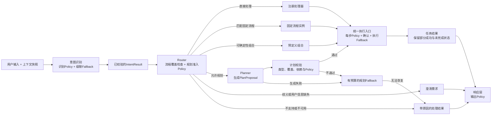
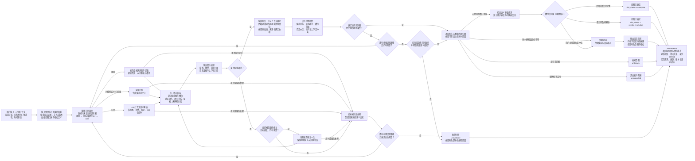

# 企业级意图识别、Router 与 Planner 实施计划

日期：2026-10-04，业务时间基准：Asia/Shanghai。

状态：设计与实施计划，尚未接入业务代码、尚未完成运行验收。本文中的目录、接口、配置和指标，除“现状”部分外，均为待实现的目标设计。

## 1. 目标、范围与已经确定的决策

目标是建立可独立评测的意图识别模块，再由确定性的 Router 选择处理路径，必要时调用受约束的 Planner。可以替换现有意图识别实现，不以保留旧分类方式为约束。

三者的边界如下：

| 模块 | 输入 | 负责的事情 | 输出 |
|---|---|---|---|
| 意图识别 | 用户原文、必要上下文快照、版本化识别契约 | 理解目标、参数、对话动作、先后与条件语义；报告不确定部分 | `IntentResult` |
| Router | 已校验的 `IntentResult`、当前 State、流程与能力目录、路由规则 | 按确定性规则匹配处理器、固定流程或允许的规划路径 | `RouteDecision` |
| Planner | Router 准入后的目标组、语义关系、可用能力与约束 | 选择执行步骤、建立参数绑定和依赖、提交计划候选 | `PlanProposal`；校验后成为 `ExecutionPlan` |

实施时遵循以下决策：

1. 普通请求的顺序是 `意图识别 → IntentResult → Router`，Planner 是 Router 的可选下游。
2. 识别业务意图，不能把 `knowledge/chat/tools` 三个 Agent 标签当作完整业务意图。
3. 一个意图可以包含多个执行步骤；多个意图也可能直接走已定义的组合规则。
4. 用户表达中的先后、条件和指代关系属于识别结果，执行任务图属于 Planner 或固定流程。
5. Router 不调用 LLM 再猜一次“复杂程度”，而是检查流程覆盖能力与规划准入条件。
6. 没有适用流程，且目标明确、能力受支持、组合允许规划时，可以选择 Planner。
7. 同一 Agent 可以执行多个不同任务，任务不能按 Agent 名称去重。
8. Policy 和 Fallback 作为各阶段调用的规则与处理机制，不增加两个自由决策的模型 Agent。
9. 识别成功、参数完整、计划有效、用户确认、业务执行成功是不同状态。
10. 本轮交付为本文件。后续代码重构、评测执行与发布按本计划分阶段实施。

范围包括三个核心模块的契约、识别流程、状态接口、路由规则、规划约束、Policy/Fallback、项目改造位置和验收方案。业务事务、患者权限和数据归属仍由 Java 服务负责；本文只规定与执行器、确认机制和响应层之间必须遵守的接口，不重写整个医院系统。

## 2. 当前项目基线与改造原因

以下现状根据本轮读取的工作区代码确认；工作区已经存在其他修改，实施时不得用重置仓库的方式清除它们。

| 现有位置 | 已有能力或当前限制 | 本计划的处理 |
|---|---|---|
| [begin.py](</D:/刘畅/WebAI/Online hospitals/ai-python/app/graphs/hospital/nodes/begin.py>) | 规则、Jev/Ollama、LLM 级联；最终主要输出 Agent 标签 | 将入口改为业务语义识别，输出 `IntentResult` |
| [prediction.py](</D:/刘畅/WebAI/Online hospitals/ai-python/app/intent/prediction.py>) | 分类契约为 `selected_agents`、分数、接纳标记等 | 新增业务意图候选契约，不把旧结果直接等同于新契约 |
| [jev_classifier.py](</D:/刘畅/WebAI/Online hospitals/ai-python/app/intent/jev_classifier.py>) | 当前使用命题评分；没有完整的逐目标槽位和证据输出 | 保留适配可能性，重新定义业务命题；不足以形成完整候选时升级 |
| [state.py](</D:/刘畅/WebAI/Online hospitals/ai-python/app/graphs/hospital/state.py>) | 主要保存选中 Agent、按 Agent 回复和旧 `task_plan` | 增加按目标和任务保存的结构化状态及版本 |
| [graphs.py](</D:/刘畅/WebAI/Online hospitals/ai-python/app/graphs/hospital/graphs.py>) | 根据选中 Agent 数量进入 Planner；部分失败路径退回全部并行 | 改为依据 `RouteDecision`；按任务依赖执行 |
| [plan.py](</D:/刘畅/WebAI/Online hospitals/ai-python/app/graphs/hospital/nodes/plan.py>) | 一名 Agent 一项任务；仅支持特定 Agent 依赖；无效计划会补空目标并并行 | 改为按目标覆盖、能力、类型和关系校验的计划；失败时保留依赖 |
| [context_builder.py](</D:/刘畅/WebAI/Online hospitals/ai-python/app/graphs/hospital/context_builder.py>) | 已有上下文预算与不可信资料边界 | 复用预算基础；另外建立带原文引用的识别上下文快照 |
| [staff.py](</D:/刘畅/WebAI/Online hospitals/ai-python/app/graphs/hospital/tools/staff.py>)、[departments.py](</D:/刘畅/WebAI/Online hospitals/ai-python/app/graphs/hospital/tools/departments.py>) | 当前部分名称解析采用首个匹配项 | 改成结构化候选解析；存在多个匹配时需要选择，不能直接取第一项 |
| [registration_write.py](</D:/刘畅/WebAI/Online hospitals/ai-python/app/graphs/hospital/tools/registration_write.py>)、[confirmation.py](</D:/刘畅/WebAI/Online hospitals/ai-python/app/graphs/hospital/confirmation.py>) | 已有 Java 权威数据核对、确认中断和过期确认检查；创建挂号已有幂等键 | 保留并对接目标/任务版本；完善写操作结果未知时的核实机制 |
| [AiToolController.java](</D:/刘畅/WebAI/Online hospitals/backend-java/src/main/java/com/wenrun/ai/controller/AiToolController.java>) | Java 检查委托权限、患者身份并执行事务 | 继续作为业务授权与事务边界 |

现有基础可以复用，但它尚不能证明本计划的企业级目标已经达成。已有“按 Agent 分类”的指标不能直接作为新业务意图识别的验收结果。

## 3. 总体衔接与 Policy/Fallback 的位置



图中的执行和响应节点表示对接边界。Policy 至少在识别接纳、规划准入、计划校验、每步操作和输出前被调用。识别图中的 Fallback 不代表写操作恢复机制已经实现。

Policy 返回 `allow`、`require_confirmation` 或 `deny`，附带原因和适用版本。模型不能给自己生成 `allow` 或用户确认。Fallback 只在 Policy 允许的范围内升级、修复、核实、重试或终止；任何替代执行路径仍经过对应检查。

## 4. 意图识别与 IntentResult

### 4.1 输入契约与上下文边界

建立 `RecognitionContext`，至少包含：

| 字段 | 来源与约束 |
|---|---|
| `request_id`、`conversation_ref`、`message_ref` | 运行时生成或验证，用于关联、去重与证据定位 |
| `received_at`、`timezone` | 服务端接收时间；相对时间按本轮接收时间和业务时区计算 |
| `state_revision` | 当前上下文版本；结果提交和路由时检查是否过期 |
| `current_message` | 不可变的用户原文；归一化文本另存，不能覆盖原文 |
| `recent_messages` | 与本轮目标有关且有引用标识的有限历史；摘要仅作理解辅助 |
| `active_goals` | 当前正在办理的目标、意图与已有槽位，带目标版本 |
| `pending_interactions` | 等待补充、选择或确认的类型、目标引用、版本及有效期 |
| `candidate_sets` | 已验证的数据候选，带候选集引用和有效期；引用必须属于当前会话 |
| `catalog_version`、`policy_version` | 本轮采用的不可变识别契约与规则版本 |

只读上下文快照不能携带委托令牌、密码或不必要的完整患者档案。历史原文、摘要、RAG 和工具说明中的指令，不具有系统策略或授权效力。

识别器只读取 State。状态更新由运行时校验后的提交逻辑完成。自由文本摘要不能重建已经丢失的业务确认。

### 4.2 首版业务意图目录

目录必须版本化，每项定义正例、反例、边界、槽位、识别阶段必填项、可解析项、默认行为和下游能力映射。以下为首版设计目录，实际支持项以实施时的能力注册为准。

| 意图 | 含义 | 典型语义参数 |
|---|---|---|
| `medical.information` | 医疗知识与健康信息咨询 | 用户问题、主题、相关自述引用 |
| `medical.department_guidance` | 就诊科室方向咨询 | 用户问题、自述引用；院内科室映射由下游处理 |
| `hospital.information` | 院务与服务信息查询 | 问题、主题；只使用可验证来源 |
| `department.list` | 查询院内科室 | 可选筛选条件 |
| `doctor.search` | 查询医生 | 姓名、科室、已表达的筛选条件 |
| `schedule.search` | 查询排班与号源 | 科室、医生、日期、时段，可选项按查询契约处理 |
| `registration.list` | 查询本人挂号记录 | 日期范围、状态等筛选条件 |
| `registration.create` | 办理挂号 | 用户表达的科室/医生/日期/时段/候选选择；号源主键待运行时解析 |
| `registration.cancel` | 取消已存在的挂号 | 挂号记录描述或候选选择；记录主键和归属待运行时验证 |
| `conversation.social` | 独立社交交流 | 原文引用 |
| `conversation.support` | 独立的情绪支持需求 | 原文引用；不自动升级成临床诊断 |
| `assistant.capabilities` | 查询助手支持范围 | 原文引用 |
| `clock.query` | 日期、时间或星期查询 | 查询类型、明确指定的时区 |

附着在业务提问前的“你好、请问”通常不增加独立社交目标。“我好害怕”若表达独立支持需求，可以形成单独目标。查询与创建、撤回草稿与取消已挂号记录必须区分。

改约、支付、替其他患者操作、任意新增业务等，只有登记了相应能力才算支持。识别到这些含义时返回 `unsupported`，不能把它们强行改成已有意图。

查询参数允许为空时采用目录规定的范围，不因缺少可选日期而强制追问。办理挂号可以先进入选号流程；未提供 `schedule_id` 不属于用户漏填。

### 4.3 识别流程

保留讨论确定的级联设计，补充规则异常出口，并约束所有返回边与调用预算。



运行规则：

- 级联游标只能向后移动；已尝试的识别器不能以“升级”为由重新调用。
- 规则和轻量层也经过公共校验，不能命中关键词就绕过否定、纠正、槽位归属和覆盖检查。
- 后续发现候选竞争或解释不完整时，有更强识别器且预算允许则升级。真正缺少用户信息时不能让模型补造。
- 小模型/Jev 可以只提供候选评分，但适配后的候选必须有可靠槽位与证据来源；能力不足时升级，不能用空槽位或整句伪证据掩盖缺失。
- Jev 当前项目实现是命题评分接口，不假设其具备自由生成槽位和关系的能力。不支持生成修复的适配器跳过修复分支。
- 多标签同时成立可以表示多个目标；不能用所有标签的最高两项分差判定多意图“有歧义”。互斥解释的竞争才需要相应分差检查。
- LLM 自报的置信度不作为准确概率。结构检查和语义规则不能证明含义必然正确，剩余误差通过独立评测与监测约束。
- 有效完成识别后才能给出 `unknown` 或 `unsupported`。服务故障、预算中断和上下文过期均不能伪装成语义拒识。
- 已确认部分可以保留；未达到接纳条件的候选只能作为诊断或澄清候选，不能进入业务执行。

### 4.4 模型候选与运行时结果分离

`SemanticProposal` 是模型或适配器提交的候选，包含本轮对话动作、局部目标引用、意图候选、原始槽位、证据、候选语义关系和未解释片段。候选结构采用封闭字段定义，额外字段拒绝。

模型不能产生以下权威字段：患者身份、患者权限、执行许可、确认完成标记、幂等键、执行状态或可信业务主键。用户输入中的数字 ID 可以作为未验证描述保存，不能直接作为已授权业务参数。

模型支持时采用原生结构化输出，否则采用工具形式的结构化返回；具体API按项目锁定版本验证。供应商可接受的Schema可能需要投影，但服务端完整Schema、证据和跨字段校验始终保留，不能因为供应商限制而取消约束。

`IntentResult` 由运行时在契约校验、归一化、上下文绑定和接纳评估后构造。模型输出中的“已验证”“已确认”等文本不会变成运行时事实。

| IntentResult 字段 | 定义 |
|---|---|
| `schema_version` | 输出契约版本 |
| `request_id`、`message_ref`、`state_revision` | 运行时请求、消息与上下文关联 |
| `understanding_status` | 整轮语义摘要：`complete / partial / blocked / unavailable` |
| `turn` | 对话动作和可验证的目标绑定 |
| `goals[]` | 每个目标的意图、候选、槽位、状态和证据引用 |
| `relations[]` | 目标之间的先后、结果使用、条件或互斥语义；不是执行图 |
| `unhandled[]` | 无可靠匹配、不支持或处理未完成的相关片段及原因 |
| `clarifications[]` | 需要用户补充或选择的内容、关联目标和具体原因 |
| `evidence[]` | 原文或允许的上下文证据引用 |
| `provenance` | 识别器、目录、规则和提示版本及接纳原因；运行时填写 |

逐目标状态必须分开：

| 状态维度 | 枚举 | 含义 |
|---|---|---|
| `intent_status` | `resolved` | 已确定支持的业务意图 |
| `intent_status` | `ambiguous` | 有具体竞争解释、指代不明或目标绑定冲突 |
| `intent_status` | `unknown` | 有效完成识别，但没有可靠匹配 |
| `intent_status` | `unsupported` | 已理解，但系统未支持该目标 |
| `intent_status` | `unavailable` | 相关部分处理因故障或预算中断 |
| `slot_status` | `complete` | 满足该意图当前识别阶段的信息要求 |
| `slot_status` | `needs_input` | 缺少用户必须提供的信息 |
| `slot_status` | `needs_resolution` | 可经候选解析、业务查询或上游结果取得参数 |
| `slot_status` | `conflict` | 存在无法按覆盖规则消解的参数冲突 |
| `slot_status` | `not_applicable` | 当前意图未确定，或无需该阶段槽位检查 |

多种槽位问题同时存在时，优先摘要为 `conflict → needs_input → needs_resolution → complete`，并保留所有具体问题，不能只留下一个布尔“完整”。

`understanding_status` 的规则：全部相关目标语义明确且没有未处理片段时为 `complete`，即使有参数待解析或待用户补充；有明确目标同时存在未确定部分时为 `partial`；没有可分派的明确目标、但能报告具体语义问题时为 `blocked`；因处理故障而没有可靠结论时为 `unavailable`。存在部分有效结果和服务故障时保留 `partial` 及具体故障。

因此，`complete` 不表示参数已满足执行要求，更不表示业务操作获批。Router 始终检查逐目标状态。

### 4.5 槽位、证据与对话动作

每个槽位保存名称、原始值、归一化值、来源、证据引用和可选的待解析绑定。来源包括本轮原文、可引用历史、当前目标、候选集和上游目标结果。槽位属于具体目标，不能使用全局 `slots` 覆盖所有意图。

证据区间按 Python Unicode code point 的左闭右开区间计数，满足 `原文[start:end] == quote`。前端如使用 UTF-16 偏移，必须在接口边界转换。预处理保留映射；被裁剪掉的原文不能仍声称有有效证据。证据存在与语义正确是两个不同校验。

对话动作采用 `new_request / continue_goal / revise_goal / cancel_draft / unclear`：

- 新请求不能自动继承另一个任务的日期或医生。
- “明天下午”只有绑定到唯一的有效待补充目标时才能接续。
- “第一个”需要有效且唯一的候选集，检查会话、目标、版本、有效期和索引范围。
- “不是内科，是儿科”替换对应槽位，增加目标版本，使相关查询结果、候选和旧确认失效。
- “先不挂了”撤回未提交目标；“退掉已经挂的号”属于 `registration.cancel`。
- `/resume` 或唯一有效确认上下文中的明确确认，继续使用可信确认入口。自由语义结果不能生成批准凭据。“确认一下医生在哪里”不属于业务批准。

相对日期以收到该条用户消息的时间归一化。历史日期不因跨日重放自动变化；目标修改或新的业务查询需要重新检查有效性。

语义关系采用封闭类型：`after` 表示用户要求的先后，`uses_result` 表示目标使用另一目标确定的实体或信息，`when` 表示目标受条件约束，`mutually_exclusive` 表示目标是互斥分支。关系引用必须属于本轮目标或显式开放的当前目标，不允许引用任意历史任务。

语义条件仅允许 `compare / all / any / not` 节点。比较操作为目录允许的 `eq / ne / gt / ge / lt / le`，并按字段类型进一步限制。操作数为 `goal_fact / context_fact / literal`，其中事实名称在目录中登记，例如成功号源查询的 `has_available_slot` 或运行时的 `local_weekday`。不得在条件中写自由自然语言脚本、隐含授权或任意路径。事实尚未取得或取得失败时为 `unknown`。

这些关系属于用户表达的语义候选，经运行时校验后进入IntentResult；Planner将它们绑定到实际步骤输出。关系成立不代表已经执行查询或可以办理业务。

### 4.6 IntentResult 示例

以下是运行时构造的设计示例。原文为“查一下张医生，再查他明天的号源。”，接收日期为 2026-10-04。示例中的引用不是实际生产数据。

```json
{
  "schema_version": "1.0",
  "request_id": "req-example-001",
  "message_ref": "m100",
  "state_revision": 7,
  "understanding_status": "complete",
  "turn": {
    "action": "new_request",
    "target_goal_ref": null
  },
  "goals": [
    {
      "goal_ref": "g1",
      "intent": "doctor.search",
      "intent_status": "resolved",
      "slot_status": "complete",
      "candidates": [],
      "slots": [
        {
          "name": "doctor_name",
          "raw_value": "张医生",
          "normalized_value": "张",
          "source": {"kind": "current_message", "ref": "m100"},
          "evidence_refs": ["e2"],
          "binding": null
        }
      ],
      "evidence_refs": ["e1"]
    },
    {
      "goal_ref": "g2",
      "intent": "schedule.search",
      "intent_status": "resolved",
      "slot_status": "needs_resolution",
      "candidates": [],
      "slots": [
        {
          "name": "doctor",
          "raw_value": "他",
          "normalized_value": null,
          "source": {"kind": "current_message", "ref": "m100"},
          "evidence_refs": ["e4"],
          "binding": {"kind": "goal_result", "goal_ref": "g1", "role": "doctor"}
        },
        {
          "name": "work_date",
          "raw_value": "明天",
          "normalized_value": "2026-10-05",
          "source": {"kind": "current_message", "ref": "m100"},
          "evidence_refs": ["e5"],
          "binding": null
        }
      ],
      "evidence_refs": ["e3"]
    }
  ],
  "relations": [
    {"kind": "after", "from_goal": "g1", "to_goal": "g2", "evidence_refs": ["e3"]},
    {"kind": "uses_result", "from_goal": "g1", "to_goal": "g2", "role": "doctor", "evidence_refs": ["e4"]}
  ],
  "unhandled": [],
  "clarifications": [],
  "evidence": [
    {"evidence_ref": "e1", "message_ref": "m100", "start": 0, "end": 6, "quote": "查一下张医生"},
    {"evidence_ref": "e2", "message_ref": "m100", "start": 3, "end": 6, "quote": "张医生"},
    {"evidence_ref": "e3", "message_ref": "m100", "start": 7, "end": 15, "quote": "再查他明天的号源"},
    {"evidence_ref": "e4", "message_ref": "m100", "start": 9, "end": 10, "quote": "他"},
    {"evidence_ref": "e5", "message_ref": "m100", "start": 10, "end": 12, "quote": "明天"}
  ],
  "provenance": {
    "recognizer": "llm",
    "catalog_version": "intent-v1",
    "policy_version": "recognition-v1",
    "acceptance_reason": "supported_goals_with_validated_references"
  }
}
```

姓名归一化只是查询值转换，不证明已经找到唯一医生。多个同名或相近候选必须由运行时解析或用户选择。该结果尚不携带医生主键，也不要求用户自己填写主键。

### 4.7 识别 Policy 与 Fallback

识别 Policy 定义每个识别器适用的输入范围、接纳与拒识条件、覆盖要求、槽位继承规则、证据要求和模型调用预算。参数经开发/校准数据确定后锁定，测试集不能再用于调整阈值。

首版保守启用规则与 LLM；小模型/Jev 保留可选位置，完成新业务契约适配和质量校准后启用。未启用是正常配置，已启用但调用失败属于服务故障。禁止将可选层不可用时产生的低质量候选作为最终兜底。

每个处理分支输出结构化原因，例如 `NO_RULE_MATCH`、`INSUFFICIENT_COVERAGE`、`CONTEXT_BINDING_AMBIGUOUS`、`INVALID_PROPOSAL`、`PROVIDER_TIMEOUT`、`RECOGNITION_BUDGET_EXHAUSTED`。缺少用户信息属于正常澄清，不记作服务故障。

## 5. Router

### 5.1 职责与目录

Router 只使用已校验的语义结果和配置，不接纳模型自报的 `needs_planner`。它检查“已有路径能否完整处理这些目标”，不计算一个任意的“问题复杂度”。

需要四类版本化配置：

| 配置 | 必须定义 |
|---|---|
| 意图目录 | 意图、槽位、支持边界和语义约束 |
| 能力目录 | 逻辑操作标识、输入输出类型、读写性质、前置条件、归属与确认要求、允许的绑定字段 |
| 流程目录 | 支持的目标模式、关系、条件、约束、参数解析步骤、流程版本和输出 |
| 路由/规划准入规则 | 匹配优先级、允许组合、并行限制、规划范围和拒绝原因 |

流程可以支持参数化、条件分支、选择和有限批量处理，不需要为每种自然语言句式登记一条流程。仅比较意图集合相同，不足以证明流程覆盖完整。

`workflows = {}` 表示已成功加载、但暂未配置固定模板，按规划准入规则继续判断。对话里“目录为 null”的假设在实现中按这种空目录表示。配置文件丢失、解析错误或版本不兼容则是配置故障，不能解释为空目录以扩大规划权限。

### 5.2 目标分组与判断顺序

根据显式关系和待解析绑定建立目标组，再检查目录中的数据依赖与操作冲突。没有识别到关系，不能单独作为“可并行”的证明。

对每个目标组依次执行：

1. 验证请求、目录版本和 State 版本，处理可信续跑、修改或撤回草稿。
2. 检查目标语义；存在相关歧义、用户必填缺失或冲突时，输出澄清需求。
3. 对未知、不支持、处理不可用的部分输出各自原因。
4. 未明确或不支持的上游使其依赖的下游等待；不能移除这条依赖后执行。
5. 尝试注册处理器、固定流程和预定义组合，必须覆盖全部目标、关系、条件、约束和参数解析需求。
6. 没有匹配路径时，若目标明确、能力存在、绑定可满足且组合在规划白名单中，选择 Planner。
7. 所需能力缺失或组合不允许时，返回限制；Planner 不能发明能力。

`needs_resolution` 可以进入包含解析步骤的流程或计划，不等于需要立即追问。若目录无法满足解析需求，则报告具体缺口；不能把内部 ID 的缺失转嫁给用户。

独立且明确的目标可以继续处理，与它存在依赖的目标不能绕过阻塞。多个分支写同一业务对象或存在读写冲突时，遵守能力目录定义的顺序；首版写操作默认串行。

### 5.3 RouteDecision 契约

| 字段 | 定义 |
|---|---|
| `schema_version`、`request_id`、`state_revision` | 版本与请求关联 |
| `registry_version`、`policy_version` | 路由实际使用的目录和规则 |
| `routes[]` | 逐目标组的模式、目标引用、路径标识和原因 |
| `clarifications[]`、`unhandled[]` | 等待用户或无法处理的部分，保留来源 |

每个 route 至少包含 `route_ref`、`goal_refs`、`mode`、`target_ref`、`reason_code`、`blocked_by`。模式为 `direct / workflow / compose / planner / clarify / unsupported / unavailable / resume / cancel_draft`。`target_ref` 是注册处理器、流程、规划配置或可信续跑目标引用，不能是模型生成的任意 URL、函数名或文件路径。

`resume` 用于运行时验证后的有效目标接续；业务确认续跑仍通过确认机制核验，不因路由模式为 `resume` 就自动批准。

例如，第4.6节结果在流程目录为空、能力支持且规划获准时，Router可以输出：

```json
{
  "schema_version": "1.0",
  "request_id": "req-example-001",
  "state_revision": 7,
  "registry_version": "registry-v1-empty-workflows",
  "policy_version": "routing-v1",
  "routes": [
    {
      "route_ref": "r1",
      "goal_refs": ["g1", "g2"],
      "mode": "planner",
      "target_ref": "planner.default",
      "reason_code": "NO_COVERING_PATH_PLANNING_ALLOWED",
      "blocked_by": []
    }
  ],
  "clarifications": [],
  "unhandled": []
}
```

### 5.4 确定性路由伪代码

以下表达规则，不是待原样复制的实现。各函数均读取已验证结果和版本化目录。

```python
def route_group(group, state, registries, policy):
    validate_request_and_state(group, state, registries)
    if group.is_trusted_continuation_or_draft_cancel():
        return route_active_goal(group, state)
    if group.has_user_fixable_ambiguity_or_missing_input():
        return clarification(group)
    if group.has_blocked_semantic_prerequisite():
        return blocked_result(group)
    if not group.has_supported_resolved_goals():
        return semantic_or_availability_result(group)

    match = find_covering_path(group, registries)
    if match is not None:
        return route_to_registered_path(match)

    if capabilities_cover(group, registries) and policy.allows_planning(group):
        return planner_route(group, reason="NO_COVERING_PATH_PLANNING_ALLOWED")
    return unsupported_combination(group)
```

能力覆盖检查包括输入可取得、输出类型可衔接和允许组合，不仅是几个意图名称出现在白名单里。伪代码中的语义前置阻塞指歧义、不支持或处理故障的相关上游，不包含能按合法路径解析的参数缺口。Router 输出的规划准入不能替代后续操作授权。

### 5.5 路由示例与默认配置

| 请求 | 目录情况 | 选择 |
|---|---|---|
| 查儿科明天号源 | 有查询处理路径 | `direct` 或查询 `workflow` |
| 查张医生，再查他明天号源 | 有医生解析与号源查询模板 | `workflow` |
| 同上 | 空流程目录；能力与关系允许规划 | `planner` |
| 查号源，再查本人挂号记录 | 有安全的独立读操作组合规则 | `compose` |
| 有号就挂，没有就查后天 | 有完整条件模板 | `workflow`；条件存在不自动触发 Planner |
| 同上 | 无模板，但所有步骤与条件属于允许的规划范围 | `planner` |
| 先查医生，再执行未支持的支付业务 | 支付能力缺失 | 明确且独立的查询可执行；支付及依赖部分 `unsupported` |
| 第一个 | 两个有效候选集无法确定指向 | `clarify` |

首版建议登记单目标读取处理器、挂号与退号的受控流程，以及独立读取组合规则。复合模板可以逐步添加，空模板目录不是强制阻塞项。规划白名单初期只允许目录中可验证的读取、选择和已注册的受控办理流程。

Router 失败时不得把整句用户输入交给拥有全部工具的通用 Agent。仅有完全覆盖且版本有效的替代路径才能重新路由，且不能重复已经完成的步骤。

## 6. Planner

### 6.1 准入与输入

Planner 仅接受 Router 产生的准入结果。请求包含明确目标组、槽位与待解析绑定、语义关系、有效已有结果、能力目录的允许子集、策略版本和剩余预算。

输入契约命名为 `PlanningRequest`，至少包括：

- `request_id`、`state_revision`、`release_bundle_id`、`route_refs`。
- `goals`、`relations`、用户已明确的约束和原文证据引用。
- 允许操作的输入输出 Schema、条件字段、读写性质和确认要求。
- 当前步骤结果的可信引用，以及必须保持的已执行状态。
- 最大步骤数、图深度、调用次数、输出大小和截止时间。

目标仍有歧义时回到澄清，不允许 Planner 选择自己喜欢的解释。缺少可通过查询或选择取得的业务参数可以由计划补齐；缺少用户必填事实不能编造。

多个独立目标组可以在一次规划请求中列出，保持组边界。首版每个用户请求最多一次计划生成和一次修复，不按目标组数量无限增加模型调用。

### 6.2 输出与参数绑定

模型返回封闭的 `PlanProposal`。运行时校验通过后生成含计划 ID、版本、校验结果和目录版本的 `ExecutionPlan`。模型不能设置计划“已批准”或任务“已完成”。

任务至少包含以下字段：

| 字段 | 定义 |
|---|---|
| `task_ref` | 提案内部唯一任务引用；运行时生成稳定执行 ID |
| `goal_refs` | 任务服务的用户目标，必须属于准入目标或允许的前置解析 |
| `operation` | 能力目录中的逻辑操作标识 |
| `inputs` | 类型化输入绑定 |
| `depends_on` | 上游任务引用及依赖类型 |
| `guard` | 可选的受限条件表达式，默认无条件 |

输入绑定只允许 `literal / goal_slot / task_output / trusted_context_ref`：

- 字面量必须符合操作 Schema，并可追溯到已识别槽位或注册默认值。
- `goal_slot` 引用本次目标的有效归一化参数。
- `task_output` 引用上游已验证输出的允许字段，校验类型和单值/列表基数。
- `trusted_context_ref` 只能引用运行时显式开放的既有结果，不包含令牌，也不能借此切换患者身份。

Planner 可以生成能力目录中的任务，不能生成任意 Python、SQL、URL、工具名称或动态执行表达式。执行 Agent 由能力目录决定；提案无权扩大工具集合。

### 6.3 依赖与条件的执行语义

依赖类型区分：

| 类型 | 执行要求 |
|---|---|
| `data` | 上游成功，所需输出存在、通过 Schema 校验且基数匹配 |
| `success` | 上游成功后才允许继续 |
| `completion` | 等待上游终态；失败后是否继续还必须符合显式恢复规则 |

仅表达先后的关系，由注册流程或验证器编译成明确的成功/终态依赖及失败行为。首版默认上游失败阻塞下游，不能仅因已经结束就继续写操作。

条件使用结构化 AST，限制 `and/or/not`、允许字段和比较算子；不使用 `eval` 或自由代码。条件值为 `true / false / unknown`，逻辑组合必须保留 `unknown`。

例如“有号就挂，否则查后天”：

- 成功查询且确有余号，满足有号分支。
- 成功查询且确认无余号，满足无号分支。
- 查询失败、响应截断或输出无效，条件为 `unknown`，两个业务分支均不能因此执行。

“无医生”“无号源”“用户拒绝选择”和“接口故障”是不同结果，不使用同一个空列表表示。有限批量查询可以采用注册的映射/汇总模板，不因任务数量变化就必须调用 Planner。

### 6.4 PlanProposal 示例

对应第 4.6 节目标，假设没有完整复合模板但允许规划。下列逻辑操作为拟注册能力，不表示项目当前已存在同名函数。

```json
{
  "schema_version": "1.0",
  "tasks": [
    {
      "task_ref": "p1",
      "goal_refs": ["g1"],
      "operation": "doctor.lookup",
      "inputs": {
        "name": {"kind": "goal_slot", "goal_ref": "g1", "slot": "doctor_name"}
      },
      "depends_on": [],
      "guard": null
    },
    {
      "task_ref": "p2",
      "goal_refs": ["g1", "g2"],
      "operation": "doctor.resolve_one",
      "inputs": {
        "candidates": {"kind": "task_output", "task_ref": "p1", "field": "doctors"}
      },
      "depends_on": [{"task_ref": "p1", "kind": "data"}],
      "guard": null
    },
    {
      "task_ref": "p3",
      "goal_refs": ["g2"],
      "operation": "schedule.lookup",
      "inputs": {
        "doctor_id": {"kind": "task_output", "task_ref": "p2", "field": "doctor.id"},
        "work_date": {"kind": "goal_slot", "goal_ref": "g2", "slot": "work_date"}
      },
      "depends_on": [{"task_ref": "p2", "kind": "data"}],
      "guard": null
    }
  ]
}
```

`doctor.resolve_one` 是确定性解析/选择能力：有唯一合法候选时返回；有多个候选时挂起并等待用户选择；零候选返回明确结果。不能默认采用第一个模糊匹配。它的可信输出包含医生主键，由 Java 数据和运行时选择共同确定。

这些任务可能都由当前 `tools` Agent 所属的业务执行层处理，但必须保存为三项任务，不能合并成一次“让 tools 处理整句话”。

### 6.5 计划校验与规划 Fallback

执行前同时校验：

1. Schema、唯一任务引用、合法目标引用、允许操作和输出大小。
2. 所有准入目标和明确约束是否被覆盖，是否增加了未请求业务动作。
3. 用户先后、条件和实体关联是否保留，是否把待解析槽位偷偷改成字面量。
4. 依赖存在且无环，绑定来源有效、类型匹配、基数正确。
5. 数据绑定与条件读取的任务输出，是否在依赖闭包中。
6. 条件字段、算子、AST 深度、分支覆盖以及 `unknown` 行为。
7. 操作组合、并行读写冲突、步骤数、图深度与预算。
8. 写操作是否只通过具备实时授权、有效确认和状态核实能力的受控办理流程。
9. 计划与当前 State、目录和策略版本是否匹配。

固定流程和预定义组合生成的执行计划也经过公共校验。合法 JSON 不代表合法计划。语义覆盖不能完全由格式校验证明，必须结合约束比较、人工标注评测和场景测试。

无效计划可在预算内修复一次，保持原目标与明确关系。仍无效时：仅在存在完全覆盖的注册替代流程时采用它；否则停止受影响目标并保留独立结果。不得静默删除依赖、补空目标、强行平行执行或扩大工具集合。

Planner 返回澄清建议时，运行时先检查是否确为用户缺失信息；内部可解析参数交给解析能力，不能以 Planner 的建议直接要求用户填写业务主键。

## 7. State、执行、确认与失败恢复接口

这一节规定三个模块接入既有系统时的必要约束，不把这些职责并入意图识别。

### 7.1 最小新增状态

State 增加 `intent_result`、`route_decision`、`execution_plan`、`active_goals`、`task_results`、`pending_interactions`、`state_revision`、`release_bundle_id`。任务结果按稳定任务 ID 保存，不能只保存在 `tools_reply/knowledge_reply/chat_reply` 中。

目标状态包括 `draft / awaiting_input / resolving / ready / executing / awaiting_choice / awaiting_confirmation / completed / failed / cancelled`。任务状态至少包括 `pending / running / waiting / succeeded / failed / skipped / blocked / outcome_unknown`。

意图状态、槽位状态、目标状态和任务状态分别保存。例如 `intent_status=resolved` 的挂号目标可以处于 `awaiting_confirmation`，此时尚未完成挂号。

使用服务端目标版本和 State 版本控制提交；会话执行锁不能替代版本校验。版本冲突时重新读取状态，不能继续提交旧结果。重复请求去重与业务写操作幂等是两种不同机制。

### 7.2 确认与续跑

每个选择或确认绑定 `goal_ref / task_id / goal_revision / interaction_ref / expires_at`，候选选择另外绑定 `candidate_set_ref`。选择和确认由可信接口或严格的当前上下文控制规则核验。

- 修改科室、医生、日期等关键参数，失效相关下游结果和旧确认。
- 确认等待期间的普通问答不能消耗或批准待确认操作。
- 过期、多候选上下文、跨用户目标或无法辨别的确认均拒绝续跑。
- checkpoint 丢失或版本不兼容时，历史聊天不能恢复批准状态。
- 重启续跑不得重新执行已成功的写操作；任务、操作参数与幂等关联必须稳定。
- 用户说“有号就挂”表达办理目标和条件，仍需通过本项目的业务确认机制。

### 7.3 结构化任务结果

业务适配器返回 `status / data / error_code / retryable / source_ref / observed_at`，以及必要的目标/任务关联。`data` 的类型由能力目录定义。自然语言说明供响应使用，不能作为依赖解析或权限核验的唯一数据源。

当前部分工具返回字符串，因此需要在 JavaToolClient DTO 与业务 Agent 之间建立类型化操作适配层。不得让 Planner 从工具回复文字中猜主键或判断接口是否成功。

执行器按已验证的依赖调度，并在每步调用前重新检查 Policy、当前身份、确认和参数有效性。默认独立只读步骤可以有限并行；写步骤串行，复杂并行只在目录有明确规则时开放。

### 7.4 Fallback 分类与安全终态

| 原因 | 允许的处理 | 不能采用的处理 |
|---|---|---|
| 识别未达到接纳条件 | 有预算时升级，否则按有效识别结论报告歧义或拒识 | 采用未接纳的标签作为业务兜底 |
| 输入缺失、指代不明 | 暂停相关目标并澄清，保留有效信息 | 补造用户事实 |
| 结构输出无效 | 按模型能力修复一次，或升级/终止 | 修改原文证据使无效结果看似有效 |
| 目录/版本故障 | 返回配置不可用，关闭受影响路径 | 当成空目录自动放开 Planner |
| 规划无效 | 有限修复或完全覆盖的已注册替代流程 | 丢弃依赖后执行全部 Agent |
| 读取临时故障 | 有限重试；使用已批准且满足时效的来源 | 把接口失败描述为无结果 |
| 写操作超时、结果未知 | 标记 `outcome_unknown`，按稳定操作关联核实 Java 状态 | 新建一个写请求盲目重试 |
| 用户/业务授权拒绝 | 返回原因或等待必要确认 | 换模型、换 Agent 绕过授权 |
| 某目标失败 | 阻塞依赖目标，继续已验证独立且获允许的目标 | 重做已经成功的业务动作 |

创建挂号可沿用并完善稳定幂等机制。退号目前不假设已有相同的幂等接口；若服务不能核实一次操作的状态，需要补足接口或保持结果未知并停止自动写重试。

依赖失败的 `unknown` 条件不能触发“否则”。过期缓存不能用于证明当前余号并直接提交挂号。输出经过 Policy 检查，流式输出在向用户发送前就执行相应检查。

## 8. 实施目录、迁移与阶段交付

### 8.1 拟新增或调整的模块

以下路径为拟实施位置，最终可按现有工程结构小幅调整，职责和接口不得混合。

```text
ai-python/app/intent/
  contracts.py         SemanticProposal、IntentResult、证据与语义关系
  context.py           RecognitionContext、原文引用与受限上下文
  normalization.py     时间、名称、槽位来源与继承规则
  validation.py        契约、证据、归属与跨字段校验
  acceptance.py        按识别器的接纳与拒识规则
  cascade.py           有游标、有总预算的级联调度
  rules.py             经评测的规则候选与提取
  jev_classifier.py    业务命题/候选适配，能力不足时升级
  ollama_classifier.py 可选模型适配
  metrics.py           新业务语义的计数与耗时

ai-python/app/orchestration/
  contracts.py         RouteDecision、PlanningRequest、PlanProposal、ExecutionPlan
  registry.py          意图、能力、流程与策略的版本化加载
  router.py            目标分组、路径覆盖与确定性分流
  planner.py           有限计划生成和修复
  plan_validator.py    覆盖、类型、绑定、依赖、条件和准入校验
  policy.py            各检查点共用的确定性规则与权威结果接口
  fallback.py          按原因与剩余预算选择恢复路径
  executor.py          最小按任务执行适配，衔接现有 Agent 和确认

ai-python/config/
  intent_catalog.v1.json
  capabilities.v1.json
  workflows.v1.json
  routing_policy.v1.json
  fallback_policy.v1.json
```

配置采用 JSON，首版不因文件格式引入额外解析依赖。启动时校验版本兼容、引用、流程图和能力 Schema；配置只能由可信发布流程提供，用户输入不能注册操作或改变策略。

`begin_node` 接入识别服务后只负责写入经过验证的结果；Router 使用独立节点；`plan_node` 作为新 Planner 的图适配入口；`graphs.py` 以路由结果和任务状态派发。现有知识、聊天和业务节点接收限定任务上下文及工具范围。

旧 `selected_agents` 可以短期作为 UI/日志兼容映射，但不能继续决定是否规划或去重任务。普通回复最终按任务/目标聚合，不依赖每个 Agent 只能有一个回复字段。

### 8.2 阶段与完成条件

| 阶段 | 交付 | 进入下一阶段的条件 |
|---|---|---|
| P0 契约与目录 | 三个核心模块的 Pydantic/JSON Schema、意图与能力目录、样例与标注规范 | 封闭字段、枚举、状态语义、证据与引用一致；无职责混淆 |
| P1 识别闭环 | 上下文快照、规则/LLM 级联、槽位与关系、显式待交互状态、澄清/拒识 | 单轮、多轮、否定、纠正、混合目标和故障用例通过 |
| P2 确定性 Router | 路由表、覆盖匹配、目标组、直接/固定/组合/规划准入 | 相同输入及版本得到相同路由；不存在漏掉约束或不支持目标的匹配 |
| P3 受约束 Planner | 类型化步骤、绑定、DAG/条件校验、有限修复 | 所有准入目标与关系被覆盖；无权威字段注入或盲目并行兜底 |
| P4 业务接入 | 按任务结果执行、结构化适配器、确认版本、写状态核实、UI兼容 | 真实 Java 集成证明归属、确认、幂等、部分失败与续跑有效 |
| P5 发布验收 | 固定测试集、统计评测、故障/并发测试、影子与灰度证据 | 发布门槛通过，观测和回滚可用 |
| P6 可选识别加速 | Jev/小模型校准或规则扩展 | 相同测试集证明质量不退化，且延迟或成本有可测收益 |

这些阶段是实施顺序，不是日历工期承诺。P1 就保留可选轻量层接口，P6 决定是否开启它；不需要等所有加速组件完成后才建立核心闭环。

本计划先沿用已存在的 Vue/Java/Python API 结构。若需要给确认卡增加任务版本或状态码，明确增量接口；不能以新识别架构为由移除既有业务确认或权限检查。

### 8.3 初始预算与开关

以下为待压测和校准的初始配置，不是已达到的性能：

| 配置 | 建议起点 |
|---|---|
| 单轮目标数 | 最多 8；超过时输出明确限制，不截断后假装完整 |
| 识别服务端截止时间 | 8 秒 |
| 识别模型实际调用总数 | 最多 3，包括可选层、主模型、修复、重试与备用调用 |
| 识别结构修复次数 | 全轮最多 1；单模型分类初调最多 1，修复可以再调用 1 次 |
| Planner 模型调用 | 全轮最多 2，包含 1 次生成和最多 1 次修复 |
| Planner 截止时间 | 8 秒，同时受本轮剩余总预算限制 |
| 识别加规划总截止时间 | 初始 16 秒，工具执行另有受限预算 |
| 单计划步骤数 / 图深度 | 最多 12 / 8 |
| 条件 AST 深度 | 最多 3 |
| 独立读取并发 | 最多 3；写操作首版串行 |
| 读取重试 | 最多 1 次，计入调用与时间预算 |
| 写操作自动重试 | 默认关闭；结果核实和已验证幂等机制另行准入 |

无意义的空匹配不是服务失败。规则不调用模型。所有 SDK 自动重试、上下文溢出重试和封装器内部调用必须计入实际调用账本，不能出现外层两次、内层三次却只记录一次的情况。

超过截止时间要停止新请求并丢弃迟到结果；不能等同步线程最终返回后才发现超时。已发起的业务写操作如果超时，转为结果未知并核实，不能因为取消等待而认定事务未执行。

等待用户选择或确认不消耗处理阶段的运行时长。下一次续跑获得新的调用时间窗口，但沿用目标、任务、确认和幂等关联；重新规划必须增加版本并使旧确认失效。

## 9. 验收方案

### 9.1 数据与标注

建立开发集、校准集和冻结测试集，按会话、来源及近重复表达分组切分，避免同一模板改写同时进入校准和测试。业务意图、槽位来源、对话动作、关系、澄清理由与状态均要标注。

初版独立语义测试集建议不少于 1,000 条，覆盖全部支持意图、多轮、否定纠正、多目标、未知和不支持目标；各类分布需记录。该数量是评测建设起点，不保证足以证明高风险精度。

关键业务与风险样本由两人独立标注并裁决分歧。医疗风险规则需要适当的业务/临床审核，不能仅按关键词命中作为权威判定。生成样本可以用于开发和补充攻击测试，不单独作为真实效果证据。

### 9.2 必须通过的场景

| 编号 | 场景 | 必须验证 |
|---|---|---|
| A01 | 你好，查儿科明天号源 | 不增加无关独立社交目标 |
| A02 | 只查号，先别挂 | 只读意图，不产生创建任务 |
| A03 | 两个相同业务意图，日期或医生不同 | 分开目标和槽位，不按 Agent 去重 |
| A04 | 明天下午接续日期追问 | 绑定唯一有效目标和来源 |
| A05 | 第一个，且候选集有效 | 依据当前候选映射，非模型猜主键 |
| A06 | 第一个，但存在两组候选 | 澄清，不默认最近一组 |
| A07 | 过期或跨会话候选选择 | 拒绝旧引用，无业务写入 |
| A08 | 不是内科，是儿科 | 更新槽位及目标版本，失效下游和旧确认 |
| A09 | 先不挂了 / 取消已经挂的号 | 撤回草稿与退号意图区分 |
| A10 | 确认一下医生在哪里 | 不消费业务批准 |
| A11 | 号源查询加域外任务 | 保留独立查询，单独标记不支持片段 |
| A12 | 支持目标依赖未确定或不支持目标 | 下游阻塞，不删除关系 |
| A13 | 规则已命中但后续发现覆盖不足 | 有预算时升级；没有则报告正确状态 |
| A14 | 可选模型未启用 / 已启用但故障 | 区分配置跳过与服务失败 |
| A15 | 模型输出错误两次 | 限额终止；不采用无效候选 |
| A16 | 超时、迟到结果、隐藏SDK重试 | 总预算有效，迟到结果不提交 |
| A17 | 用户或模型注入身份、批准或工具名 | 拒绝权威字段及未注册操作 |
| A18 | 原文证据错误、越界或属于他人消息 | 校验失败，不补造证据 |
| A19 | 日期跨日重放和业务时区不同 | 原始相对日期锚点稳定，新请求正确归一化 |
| A20 | 多个医生匹配 | 等待选择，不采用首个模糊匹配 |
| A21 | 槽位业务主键缺失但可解析 | 路由解析流程，不要求用户填写主键 |
| A22 | 相同意图集合，用户条件不同 | 模板不完整覆盖则不匹配 |
| A23 | 空流程目录，规划获准 | Router选择Planner并记录准入原因 |
| A24 | 流程目录加载失败 | 配置不可用，不当作空目录 |
| A25 | 有依赖和条件但已有模板 | 使用模板，不按“复杂”强制规划 |
| A26 | 独立目标但能力目录有写冲突 | 不错误并行 |
| A27 | 计划漏目标、添操作或丢条件 | 校验失败，不静默修剪成另一计划 |
| A28 | 计划引用未知任务、类型/基数不匹配或成环 | 拒绝执行 |
| A29 | 查询成功无号 / 查询故障 | 只有真实无号触发对应条件分支 |
| A30 | Planner失败 | 不退回全部Agent并行；保留独立结果 |
| A31 | 挂号或退号未经有效确认 | 无业务写入 |
| A32 | 确认后修改日期、旧卡重复确认 | 旧批准失效，不写入错误号源 |
| A33 | 重复请求、重复确认、重启续跑 | 请求去重与业务幂等分别有效，无重复提交 |
| A34 | 写接口超时但Java实际已成功 | 核实结果，不新建重复写请求 |
| A35 | 版本冲突、checkpoint丢失或旧图不兼容 | 不恢复隐含批准，不提交过期状态 |
| A36 | 一个目标失败，另一独立目标成功 | 如实返回部分结果；已完成步骤不重做 |
| A37 | 当前风险描述、引用、否定或历史风险 | 按证据区分，避免纯关键词误触发 |
| A38 | 输出或SSE含敏感原文/凭据 | 在发出前阻止或按规则处理 |

这些用例是验收要求，尚未执行。实现时须补齐明确输入、上下文、期望状态与实际工具调用断言；模型评测和确定性契约测试分开报告。

### 9.3 建议发布门槛

| 指标 | 初始目标与统计要求 |
|---|---|
| 完整意图集合准确率 | ≥95%，并报告逐意图宏平均 F1、各层接纳覆盖率和错误分布 |
| 已接纳的写意图精度 | 单侧95%置信下界≥99.5%；同时有效明确写请求的接纳率≥90% |
| 关键语义槽位准确率 | ≥98%，按医生/科室/日期/否定与引用分别报告 |
| 多轮对话动作与目标绑定准确率 | ≥97% |
| 先后、结果关联与条件语义准确率 | ≥97% |
| 未知与不支持目标处理 | 分别报告精确率、召回率，初始目标各≥95% |
| 确定性Router正确性 | 固定规则场景100%符合期望，完整覆盖与准入用例无绕过 |
| 计划安全性 | 必须拒绝的无效计划100%拒绝；有效计划接纳率和目标完成率另行报告 |
| 关键业务禁止动作 | 场景套件内错误写入、越权、旧确认写入、重复写入为0 |
| 识别性能 | 指定环境和并发下P95≤3秒、P99≤6秒；8秒截止时间有效 |
| 可观测性 | 每轮可关联版本、升级/路由原因、计划校验、调用次数和最终状态 |

写意图精度的样本量不能由少量成功示例代替。独立同分布且零错误时，单侧95%二项精度下界为 `0.05 ** (1/n)`，至少约598条已接纳写意图样本才可能达到99.5%的下界；有错误时需要重新计算并可能增加样本。独立性、样本来源和接纳覆盖范围必须记录，不能靠重复模板凑数。

上述数字是拟定门槛，不是当前项目成绩。“关键场景零错误”也不等于线上永无错误。性能报告注明模型、供应商、部署资源、网络、并发、冷热状态和样本分布；Router、规划、工具与整轮耗时分别报告。

### 9.4 验证方式

- 契约与规则测试：非法字段、引用、证据、状态组合、目录匹配、DAG、类型和条件均采用确定性断言。
- 模型评测：冻结数据集评估意图集合、槽位、对话动作、语义关系、拒识与接纳覆盖。
- Java 集成测试：真实核验患者权限、业务归属、确认、事务与状态查询，不能只用 Python mock 证明写安全。
- 故障注入：模型超时、网络中断、解析错误、业务结果未知、checkpoint恢复和配置故障。
- 并发与重放：同一会话并发修正/确认、重复请求、迟到输出、重启续跑和旧版本状态。
- 前端验证：选择与确认绑定正确，旧卡不可提交，部分成功和结果未知显示明确，已有SSE协议兼容。

完成要求包括有意义的测试结果、固定评测报告、版本化配置和运行证据。文档、流程图、Schema通过或模型能返回JSON，均不能单独宣称企业级验收完成。

## 10. 观测、发布与回滚

事件至少记录 `request_id`、阶段、目标/任务不透明引用、State/发布版本、识别层、接纳/拒识/升级原因、路由模式、计划校验原因、Policy决定、Fallback动作、耗时和实际调用数。默认不记录完整原文、患者档案、令牌、原始模型输出或可识别的业务详情。

真实业务审计与模型调试数据分开管理。需要带原文的误差分析时，采用受控、最小化和脱敏的数据集，不把原文自动复制到普通日志或公开指标标签。

发布包整体锁定 Schema、意图目录、能力目录、流程目录、路由/恢复规则、提示词和模型配置，不能单独修改其中一项却保留不兼容版本号。

发布顺序为离线验收 → 只读影子 → 读取灰度 → 完成真实确认与写恢复验收后逐步开放受控写操作。影子运行仅比较识别、路由和计划，不能调用真实写工具、修改生产State或消费确认。

回滚关闭新规划入口时，尚未执行目标可重新匹配；已经执行或等待确认的目标保持其原版本与执行记录。版本不兼容时停止受影响续跑并要求重新发起，不能在旧图里重放写操作或恢复批准。

确认状态、请求去重和业务幂等机制必须先于写灰度完成。生产目录或关键策略加载失败时关闭受影响路径，不能自动切换到全工具自由Agent。

## 11. 默认假设、待验证项与后续交付

不需要额外澄清即可按以下默认值推进契约与只读实现：

| 项目 | 当前默认 | 验证或决策时点 |
|---|---|---|
| 支持范围 | 首版业务意图目录；能力缺失明确返回不支持 | P0能力盘点、P4集成 |
| 小模型/Jev | 可选；未完成新契约和校准前关闭接纳路径 | P6评测后决定是否启用 |
| 空复合流程目录 | 合法；不跳过能力与规划准入 | P2路由配置 |
| 写操作 | 通过既有受控确认流程，首版串行 | P4真实集成验收 |
| 计划形式 | 有界DAG、类型化绑定、受限条件；不支持自由循环 | P3契约验收 |
| 超预算或配置故障 | 报告原因，保留有效部分，关闭受影响路径 | 故障测试 |
| 性能与质量数字 | 本文建议门槛，需真实数据测量 | P5发布验收 |

仍需在实现中验证 Jev/小模型对新业务标签的能力、真实模型的结构化输出支持、退号状态核实与幂等能力，以及现有checkpoint/执行锁是否满足新目标版本与续跑要求。遇到支持范围、业务确认要求或发布门槛需要改变时，提交具体差异和可评审方案请用户定夺；不因普通命名或实现细节反复暂停。

最终代码实施交付包括：版本化契约与配置、三个核心模块及业务适配、明确的Policy/Fallback分支、可复现的评测与关键场景结果、灰度与回滚记录。所有阶段在实际完成后记录证据，不提前标记通过。

## 12. 设计参考

- 固定工作流、路由和动态编排模式：[LangGraph Workflows and agents](https://docs.langchain.com/oss/python/langgraph/workflows-agents)。本文的确定性Router与流程覆盖规则是针对项目的设计选择。
- 结构化返回和Schema校验：[LangChain Structured output](https://docs.langchain.com/oss/python/langchain/structured-output)。供应商能力与版本需要在实现时验证，公共服务端校验始终保留。
- 输入、模型/工具调用和输出检查：[LangChain Guardrails](https://docs.langchain.com/oss/python/langchain/guardrails)。模型语义检查不能替代Java授权和可信确认。
- 区分临时错误、可修复错误、用户信息缺失和不可恢复错误：[LangGraph Thinking in LangGraph](https://docs.langchain.com/oss/python/langgraph/thinking-in-langgraph)。本文另外限制写操作恢复与所有重试的总预算。
